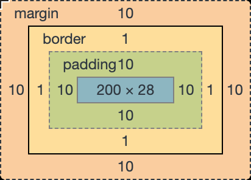
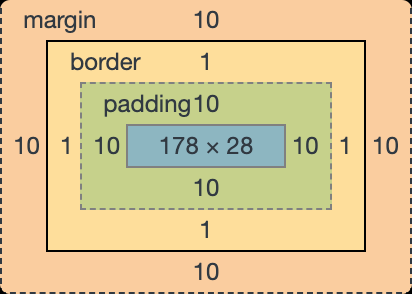
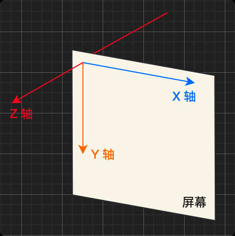
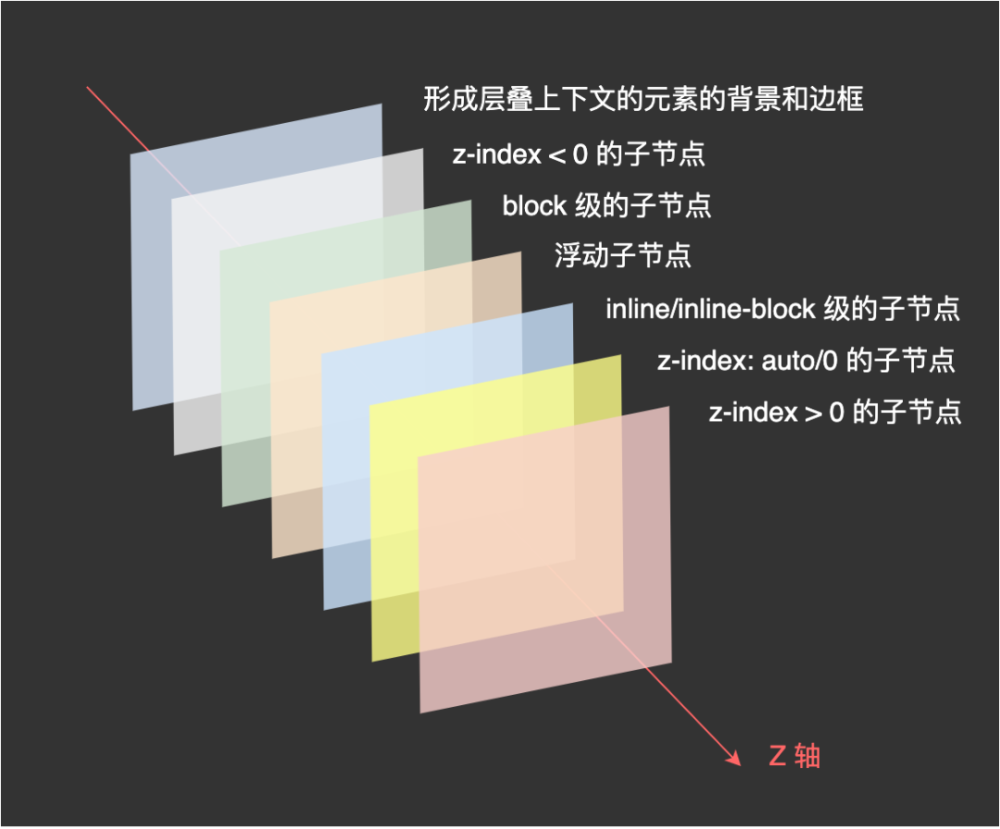
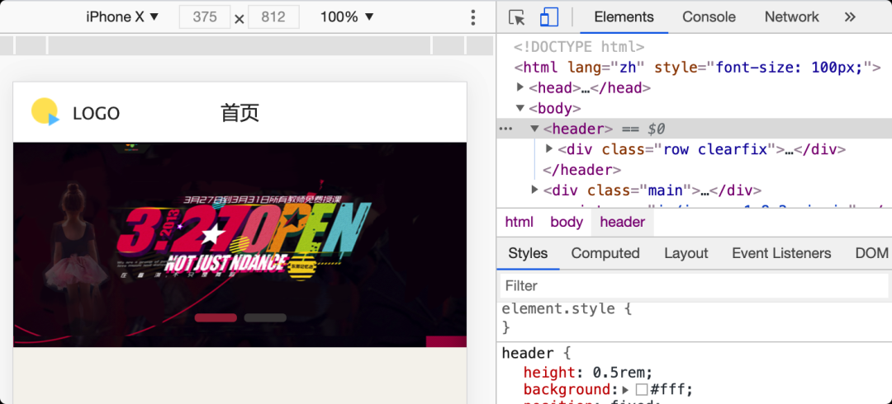
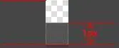
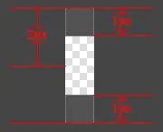

### @规则

#### @import 

@import 引入一个外部样式表
link 和 @import 的区别

+ link 是 HTML 标签，除了能导入 CSS 外，还能导入图片、脚本和字体等；@import 是 CSS 语法，只能用来导入 CSS；
+ link 导入的样式会在页面加载时同时加载；@import 导入的样式需要等页面加载完成后再加载；
+ link 没有兼容性问题；@import 不兼容 ie5 以下；
+ link 可以通过 js 操作 DOM 动态引入样式表改变样式；@import 不可以

### 选择器

#### 基础选择器

属性选择器

+ [attr]：指定属性的元素
+ [attr=val]：属性等于指定值的元素
+ [attr*=val]：属性包含指定值的元素
+ [attr^=val]：属性以指定值开头的元素
+ [attr$=val]：属性以指定值结尾的元素
+ [attr~=val]：属性包含指定值（完整单词）的元素（不推荐使用）
+ [attr|=val]：属性以指定值（完整单词）开头的元素（不推荐使用）

组合选择器

+ 相邻兄弟选择器：A + B
+ 普通兄弟选择：A ~ B
+ 子选择器：A > B
+ 后代选择器：A B

#### 伪类

条件伪类

+ :lang()：基于元素语言来匹配页面元素
+ :dir()：匹配特定文字书写方向的元素
+ :has()：匹配包含特定元素的元素
+ :is()：匹配指定选择器列表里的元素
+ :not()：用来匹配不符合一组选择器的元素

行为伪类

+ :active：鼠标激活的元素
+ :hover：鼠标悬浮的元素
+ ::selection：鼠标选中的元素

状态伪类

+ :target：当前锚点的元素
+ :link：未访问的链接元素
+ :visited：以访问的链接元素
+ :focus：输入聚焦的表单元素
+ :required：输入必填的表单元素
+ :valid：输入合法的表单元素
+ :invalid：输入非法的表单元素
+ :in-range：输入范围以内的表单元素
+ :out-of-range：输入范围以外的表单元素
+ :checked：选项选中的表单元素
+ :optional：选项可选的表单元素
+ :enabled：事件启用的表单元素
+ :disabled：事件禁用的表单元素
+ :read-only：只读的表单元素
+ :read-write：可读可写的表单元素
+ :blank：输入为空的表单元素
+ :current()：浏览中的元素
+ :past()：已浏览的元素
+ :future()：未浏览的元素

结构伪类

+ :root：文档的根元素；
+ :empty：无子元素的元素；
+ :first-letter：元素的首字母；
+ :first-line：元素的首行；
+ :nth-child(n)：元素中指定顺序索引的元素；
+ :nth-last-child(n)：元素中指定逆序索引的元素；；
+ :first-child：元素中为首的元素；
+ :last-child ：元素中为尾的元素；
+ :only-child：父元素仅有该元素的元素；
+ :nth-of-type(n)：标签中指定顺序索引的标签；
+ :nth-last-of-type(n)：标签中指定逆序索引的标签；
+ :first-of-type ：标签中为首的标签；
+ :last-of-type：标签中为尾标签；
+ :only-of-type：父元素仅有该标签的标签；

伪元素

+ ::before：在元素前插入内容；
+ ::after：在元素后插入内容

### 继承性

存在继承的行为是那些不会影响到页面布局的属性

+ 字体相关：font-family、font-style、font-size、font-weight等
+ 文本相关：text-align、text-indent、text-decoration、text-shadow、letter-spacing、word-spacing、white-space、line-height、color等
+ 列表相关：list-style、list-style-image、list-style-type、list-style-position等
+ 其他属性：visibility、cursor等

对于其他默认不继承的属性也可以通过以下几个属性值来控制继承行为：

+ inherit：继承父元素对应属性的计算值
+ initial：应用该属性的默认值，比如 color 的默认值是 #000
+ unset：如果属性的默认可以继承的，则取 inherit 的效果，否则同 initial 
+ revert：效果等同于 unset，兼容性差

### 文档流

在 CSS 的世界中，会把内容按照从左到右、从上到下的顺序进行排列显示。正常情况下会把页面分割成一行一行的显示，而每行又可能由多列组成，所以从视觉上看起来就是从上到下从左到右，而这就是 CSS 中的流式布局，又叫文档流。文档流就像水一样，能够自适应所在的容器，一般它有如下几个特性：

块级元素默认会占满整行，所以多个块级盒子之间是从上到下排列的；
内联元素默认会在一行里一列一列的排布，当一行放不下的时候，会自动切换到下一行继续按照列排布；

#### 如何脱离文档流呢？

脱离文档流指节点脱离正常文档流后，在正常文档流中的其他节点将忽略该节点并填补其原先空间。文档一旦脱流，计算其父节点高度时不会将其高度纳入，脱流节点不占据空间。有两种方式可以让元素脱离文档流：浮动和定位。

+ 使用浮动（float）会将元素脱离文档流，移动到容器左/右侧边界或者是另一个浮动元素旁边，该浮动元素之前占用的空间将被别的元素填补，另外浮动之后所占用的区域不会和别的元素之间发生重叠；
+ 使用绝对定位（position: absolute;）或者固定定位（position: fixed;）也会使得元素脱离文档流，且空出来的位置将自动被后续节点填补。

### 盒模型

在 CSS 中任何元素都可以看成是一个盒子，而一个盒子是由 4 部分组成的：内容（content）、内边距（padding）、边框（border）和外边距（margin）。

盒模型有 2 种：标准盒模型和 IE 盒模型，本别是由 W3C 和 IExplore 制定的标准

标准盒模型认为：盒子的实际尺寸 = 内容（设置的宽/高） + 内边距 + 边框

内容宽度为 200px，实际宽度为 width + padding-left + padding-right + border-left-width + border-right-width = 200 + 10 + 10 + 1 + 1 = 222px

IE 盒模型认为：盒子的实际尺寸 = 设置的宽/高 = 内容 + 内边距 + 边框

元素所占用的实际宽度为 200px，内容的真实宽度为 width - padding-left - padding-right - border-left-width - border-right-width = 200 - 10 - 10 - 1 - 1 = 178px

现在高版本的浏览器默认都是使用标准盒模型，IE6老古董才默认使用 IE 盒模型
使用 box-sizing 可以指定使用什么盒模型

+ content-box：标准盒模型
+ border-box：IE 盒模型

### 层叠上下文

在电脑显示屏幕上的显示的页面其实是一个三维的空间，水平方向是 X 轴，竖直方向是 Y 轴，而屏幕到眼睛的方向可以看成是 Z 轴。众 HTML 元素依据自己定义的属性的优先级在 Z 轴上按照一定的顺序排开，而这其实就是层叠上下文所要描述的东西。


+ z-index 能够在层叠上下文中对元素的堆叠顺序其作用是必须配合定位才可以；
+ 除了 z-index 之外，一个元素在 Z 轴上的显示顺序还受层叠等级和层叠顺序影响；

在看层叠等级和层叠顺序之前，我们先来看下如何产生一个层叠上下文，特定的 HTML 元素或者 CSS 属性产生层叠上下文，MDN 中给出了这么一个列表，符合以下任一条件的元素都会产生层叠上下文：

+ html 文档根元素
+ 声明 position: absolute/relative 且 z-index 值不为 auto 的元素；
+ 声明 position: fixed/sticky 的元素；
+ flex 容器的子元素，且 z-index 值不为 auto；
+ grid 容器的子元素，且 z-index 值不为 auto；
+ opacity 属性值小于 1 的元素；
+ mix-blend-mode 属性值不为 normal 的元素；
+ 以下任意属性值不为 none 的元素：
  + transform
  + filter
  + perspective
  + clip-path
  + mask / mask-image / mask-border
+ isolation 属性值为 isolate 的元素；
+ -webkit-overflow-scrolling 属性值为 touch 的元素；
+ will-change 值设定了任一属性而该属性在 non-initial 值时会创建层叠上下文的元素；
+ contain 属性值为 layout、paint 或包含它们其中之一的合成值（比如 contain: strict、contain: content）的元素。

**层叠等级**

层叠等级指节点在三维空间 Z 轴上的上下顺序。它分两种情况：

+ 在同一个层叠上下文中，它描述定义的是该层叠上下文中的层叠上下文元素在 Z 轴上的上下顺序；
+ 在其他普通元素中，它描述定义的是这些普通元素在 Z 轴上的上下顺序；
普通节点的层叠等级优先由其所在的层叠上下文决定，层叠等级的比较只有在当前层叠上下文中才有意义，脱离当前层叠上下文的比较就变得无意义了。

**层叠顺序**

在同一个层叠上下文中如果有多个元素，那么他们之间的层叠顺序是怎么样的呢？

以下这个列表越往下层叠优先级越高，视觉上的效果就是越容易被用户看到（不会被其他元素覆盖）：

+ 层叠上下文的 border 和 background
+ z-index < 0 的子节点
+ 标准流内块级非定位的子节点
+ 浮动非定位的子节点
+ 标准流内行内非定位的子节点
+ z-index: auto/0 的子节点
+ z-index > 0的子节点

**如何比较两个元素的层叠等级？**

+ 在同一个层叠上下文中，比较两个元素就是按照上图的介绍的层叠顺序进行比较。
+ 如果不在同一个层叠上下文中的时候，那就需要比较两个元素分别所处的层叠上下文的等级。
+ 如果两个元素都在同一个层叠上下文，且层叠顺序相同，则在 HTML 中定义越后面的层叠等级越高。

### 值和单位

#### px

而 px 表示的是 CSS 中的像素，在 CSS 中它是绝对的长度单位，也是最基础的单位，其他长度单位会自动被浏览器换算成 px。但是对于设备而言，它其实又是相对的长度单位，比如宽高都为 2px，在正常的屏幕下，其实就是 4 个像素点，而在设备像素比(devicePixelRatio) 为 2 的 Retina 屏幕下，它就有 16 个像素点。所以屏幕尺寸一致的情况下，屏幕分辨率越高，显示效果就越细腻。

**设备像素**

设备屏幕的物理像素，表示的是屏幕的横纵有多少像素点；和屏幕分辨率是差不多的意思。

**设备像素比**

设备像素比表示 1 个 CSS 像素等于几个物理像素。
计算公式：DPR = 物理像素数 / 逻辑像素数；
在浏览器中可以通过 window.devicePixelRatio 来获取当前屏幕的 DPR。

**像素密度（DPI/PPI）**

像素密度也叫显示密度或者屏幕密度，缩写为 DPI(Dots Per Inch) 或者 PPI(Pixel Per Inch)。从技术角度说，PPI 只存在于计算机显示领域，而 DPI 只出现于打印或印刷领域。

计算公式：像素密度 = 屏幕对角线的像素尺寸 / 物理尺寸

比如，对于分辨率为 750 * 1334 的 iPhone 6 来说，它的像素密度为：
```js
Math.sqrt(750 * 750 + 1334 * 1334) / 4.7 = 326ppi
```

**设备独立像素（DIP）**

DIP 是特别针对 Android设备而衍生出来的，原因是安卓屏幕的尺寸繁多，因此为了显示能尽量和设备无关，而提出的这个概念。它是基于屏幕密度而计算的，认为当屏幕密度是 160 的时候，px = DIP。
计算公式：dip = px * 160 / dpi

#### em

+ 在 font-size 中使用是相对于 **父元素** 的 font-size 大小
+ 在其他属性中使用是相对于自身的字体大小，如 width/height/padding/margin 等

em 在计算的时候是会层层计算的，比如：
```html
<div>
    <p></p>
</div>
```
```css
div{ font-size: 2em}
p{ font-size: 2em}
```
由于根元素 html 的字体大小为 16px ，所以 p 标签最终计算出来的字体大小会是 16 * 2 * 2 = 64px

#### rem

rem 由于是基于 html 的 font-size 来计算，所以通常用于自适应网站或者 H5 中。

比如在做 H5 的时候，前端通常会让 UI 给 750px 宽的设计图，而在开发的时候可以基于 iPhone X 的尺寸 375px * 812px 来写页面，这样一来的话，就可以用下面的 JS 依据当前页面的视口宽度自动计算出根元素 html 的基准 font-size 是多少。

```js
(function (doc, win) {
    var docEl = doc.documentElement,
        resizeEvt = 'orientationchange' in window ? 'orientationchange' : 'resize',
        psdWidth = 750,  // 设计图宽度
        recalc = function () {
            var clientWidth = docEl.clientWidth;
            if ( !clientWidth ) return;
            if ( clientWidth >= 640 ) {
                docEl.style.fontSize = 200 * ( 640 / psdWidth ) + 'px';
            } else {
                docEl.style.fontSize = 200 * ( clientWidth / psdWidth ) + 'px';
            }
        };

    if ( !doc.addEventListener ) return;
    // 绑定事件的时候最好配合防抖函数
    win.addEventListener( resizeEvt, debounce(recalc, 1000), false );
    doc.addEventListener( 'DOMContentLoaded', recalc, false );
    
    function debounce(func, wait) {
        var timeout;
        return function () {
            var context = this;
            var args = arguments;
            clearTimeout(timeout)
            timeout = setTimeout(function(){
                func.apply(context, args)
            }, wait);
        }
    }
})(document, window);
```

比如当视口是 375px 的时候，经过计算 html 的 font-size 会是 100px，这样有什么好处呢？好处就是方便写样式，比如从设计图量出来的 header 高度是 50px 的，那我们写样式的时候就可以直接写：

```css
header{ height:0.5rem }
```



每个从设计图量出来的尺寸只要除于 100 即可得到当前元素的 rem 值，都不用经过计算，非常方便。偷偷告诉你，如果你把上面那串计算 html 标签 font-size 的 JS 代码中的 200 替换成 2，那在计算 rem 的时候就不需要除于 100 了，从设计图量出多大 px，就直接写多少个 rem。

#### vw/vh

vw 和 vh 分别是相对于屏幕视口宽度和高度而言的长度单位：

+ 1vw = 视口宽度均分成 100 份中 1 份的长度；
+ 1vh = 视口高度均分成 100 份中 1 份的长度；
在 JS 中 100vw = window.innerWidth，100vh = window.innerHeight。
vw/vh 的出现使得多了一种写自适应布局的方案，开发者不再局限于 rem 了。
相对视口的单位，除了 vw/vh 外，还有 vmin 和 vmax：

+ vmin：取 vw 和 vh 中值较小的；
+ vmax：取 vw 和 vh 中值较大的；

### 颜色体系

根据 CSS 颜色草案 中提到的颜色值类型，大概可以分为这几类

+ 颜色关键字
+ transparent 关键字
+ currentColor 关键字
+ RGB 颜色
+ HSL 颜色

#### 颜色关键字

颜色关键字（color keywords）是不区分大小写的标识符，它表示一个具体的颜色，比如 white（白），黑（black）等；

需要注意的是如果声明的时候的颜色关键字是错误的，浏览器会忽略它。

#### transparent 关键字

transparent 关键字表示一个完全透明的颜色，即该颜色看上去将是背景色。从技术上说，它是带有 alpha 通道为最小值的黑色，是 rgba(0,0,0,0) 的简写。

透明关键字有什么应用场景呢？

**实现三角形**

下面这个图是用 4 条边框填充的正方形，看懂了它你大概就知道该如何用 CSS 写三角形了。


```css
div {
    border-top-color: #ffc107;
    border-right-color: #00bcd4;
    border-bottom-color: #e26b6b;
    border-left-color: #cc7cda;
    border-width: 50px;
    border-style: solid;
}
```

设置等腰三角形：设置一条边有颜色，然后紧挨着的 2 边是透明，且宽度是有颜色边的一半
设置直角三角形：设置一条边有颜色，然后紧挨着的任何一边透明即可


**增大点击区域**

常常在移动端的时候点击的按钮的区域特别小，但是由于现实效果又不太好把它做大，所以常用的一个手段就是通过透明的边框来增大按钮的点击区域：

```css
.btn {
    border: 5px solid transparent;
}
```

#### currentColor 关键字

currentColor 会取当前元素继承父级元素的文本颜色值或声明的文本颜色值，即 computed 后的 color 值。
比如，对于如下 CSS，该元素的边框颜色会是 red：
```css
.btn {
    color: red;
    border: 1px solid currentColor;
}
```

#### RGB[A] 颜色

RGB[A] 颜色是由 R(red)-G(green)-B(blue)-A(alpha) 组成的色彩空间。
在 CSS 中，它有两种表示形式：

+ 十六进制符号；
+ 函数符

##### 十六进制符号

RGB 中的每种颜色的值范围是 00~ff，值越大表示颜色越深。所以一个颜色正常是 6 个十六进制字符加上 # 组成，比如红色就是 #ff0000。

如果 RGB 颜色需要加上不透明度，那就需要加上 alpha 通道的值，它的范围也是 00~ff，比如一个带不透明度为 67% 的红色可以这样写 #ff0000aa。

使用十六进制符号表示颜色的时候，都是用 2 个十六进制表示一个颜色，如果这 2 个字符相同，还可以缩减成只写 1 个，比如，红色 #f00；带 67% 不透明度的红色 #f00a。

##### 函数符

当 RGB 用函数表示的时候，每个值的范围是 0~255 或者 0%~100%，所以红色是 rgb(255, 0, 0)， 或者 rgb(100%, 0, 0)。

如果需要使用函数来表示带不透明度的颜色值，值的范围是 0~1 及其之间的小数或者 0%~100%，比如带 67% 不透明度的红色是 rgba(255, 0, 0, 0.67) 或者 rgba(100%, 0%, 0%, 67%)

> 需要注意的是 RGB 这 3 个颜色值需要保持一> 致的写法，要嘛用数字要嘛用百分比，而不透> 明度的值的可以不用和 RGB 保持一致写法。
> 比如 rgb(100%, 0, 0) 这个写法是无效的；而 > rgb(100%, 0%, 0%, 0.67) 是有效的。

在第 4 代 CSS 颜色标准中，新增了一种新的函数写法，即可以把 RGB 中值的分隔逗号改成空格，而把 RGB 和 alpha 中的逗号改成 /，比如带 67% 不透明度的红色可以这样写 rgba(255 0 0 / 0.67)。另外还把 rgba 的写法合并到 rgb 函数中了，即 rgb 可以直接写带不透明度的颜色。

#### HSL[A] 颜色

HSL[A] 颜色是由色相(hue)-饱和度(saturation)-亮度(lightness)-不透明度组成的颜色体系。


+ 色相（H）是色彩的基本属性，值范围是 0~360 或者 0deg~360deg， 0 (或 360) 为红色, 120 为绿色, 240 为蓝色；
+ 饱和度（S）是指色彩的纯度，越高色彩越纯，低则逐渐变灰，取 0~100% 的数值；0% 为灰色， 100% 全色；
+ 亮度（L），取 0~100%，0% 为暗，100% 为白；
+ 不透明度（A），取 0~100%，或者0~1及之间的小数；

写法上可以参考 RGB 的写法，只是参数的值不一样。
给一个按钮设置不透明度为 67% 的红色的 color 的写法，以下全部写法效果一致：
```css
button {
    color: #ff0000aa;
    color: #f00a;
    color: rgba(255, 0, 0, 0.67);
    color: rgb(100% 0% 0% / 67%);
    color: hsla(0, 100%, 50%, 67%);
    color: hsl(0deg 100% 50% / 67%);
}
```

小提示：在 Chrome DevTools 中可以按住 shift + 鼠标左键可以切换颜色的表示方式。

### 媒体查询

媒体查询是指针对不同的设备、特定的设备特征或者参数进行定制化的修改网站的样式。

你可以通过给 <link> 加上 media 属性来指定该样式文件只能对什么设备生效，不指定的话默认是 all，即对所有设备都生效：

```html
<link rel="stylesheet" src="styles.css" media="screen" />
<link rel="stylesheet" src="styles.css" media="print" />
```

+ all：适用于所有设备；
+ print：适用于在打印预览模式下在屏幕上查看的分页材料和文档；
+ screen：主要用于屏幕；
+ speech：主要用于语音合成器。

> 需要注意的是：通过 media 指定的  资源尽管不匹配它的设备类型，但是浏览器依然会加载它。


除了通过 <link> 让指定设备生效外，还可以通过 @media 让 CSS 规则在特定的条件下才能生效。响应式页面就是使用了 @media 才让一个页面能够同时适配 PC、Pad 和手机端。

```css
@media (min-width: 1000px) {}
```

媒体查询支持逻辑操作符：

and：查询条件都满足的时候才生效；
not：查询条件取反；
only：整个查询匹配的时候才生效，常用语兼容旧浏览器，使用时候必须指定媒体类型；
逗号或者 or：查询条件满足一项即可匹配；
媒体查询还支持众多的媒体特性[14]，使得它可以写出很复杂的查询条件：

```css
/* 用户设备的最小高度为680px或为纵向模式的屏幕设备 */
@media (min-height: 680px), screen and (orientation: portrait) {}
```

### 自定义属性

之前我们通常是在预处理器里才可以使用变量，而现在 CSS 里也支持了变量的用法。通过自定义属性就可以在想要使用的地方引用它。

自定义属性也和普通属性一样具有级联性，申明在 :root 下的时候，在全文档范围内可用，而如果是在某个元素下申明自定义属性，则只能在它及它的子元素下才可以使用。

自定义属性必须通过 --x 的格式申明，比如：--theme-color: red; 使用自定义属性的时候，需要用 var 函数。比如：
```css
<!-- 定义自定义属性 -->
:root {
    --theme-color: red;
}

<!-- 使用变量 -->
h1 {
    color: var(--theme-color);
}
```

### 1px 边框解决方案

移动端显示屏比普通的屏幕有着更高的分辨率，所以在移动端的 1px 边框就会看起来比较粗，为了美观通常需要把这个线条细化处理。
css中的1px并不等于移动设备的1px，这些由于不同的手机有不同的像素密度。在window对象中有一个devicePixelRatio属性，他可以反应css中的像素与设备的像素比。

> devicePixelRatio的官方的定义为：设备物理像素和设备独立像素的比例，也就是 devicePixelRatio = 物理像素 / 独立像素。
#### 0.5px边框

某些系统支持0.5px的边框，通过js检测浏览器能否处理0.5px的边框，如果可以，给html添加个class

```js
if (window.devicePixelRatio && devicePixelRatio >= 2) {
  var testElem = document.createElement('div');
  testElem.style.border = '.5px solid transparent';
  document.body.appendChild(testElem);
}
if (testElem.offsetHeight == 1) {
  document.querySelector('html').classList.add('hairlines');
}
  document.body.removeChild(testElem);
}
// 脚本应该放在内，如果在里面运行，需要包装 $(document).ready(function() {})
```
```css
div {
  border: 1px solid #bbb;
}
.hairlines div {
  border-width: 0.5px;
}
```

**优点：**

+ 简单，不需要过多代码

**缺点：**

+ 无法兼容安卓设备、ios8 以下设备

#### 使用border-image实现

准备一张符合要求的 border-image，即1px的png


```css
.border-bottom-1px {
  border-width: 0 0 1px 0;
  -webkit-border-image: url(linenew.png) 0 0 2 0 stretch;
  border-image: url(linenew.png) 0 0 2 0 stretch;
}
```

上文是把border设置在边框的底部，所以使用的图片是2px高，上部的1px颜色为透明，下部的1px使用视觉规定的border的颜色。如果边框底部和顶部同时需要border，可以使用下面的border-image：

```css
.border-image-1px {
  border-width: 1px 0;
  -webkit-border-image: url(linenew.png) 2 0 stretch;
  border-image: url(linenew.png) 2 0 stretch;
}
```

到目前为止，我们已经能在iphone上展现1px border的效果了。但是我们发现这样的方法在非视网膜屏上会出现border显示不出来的现象，于是使用Media Query做了一些兼容，样式设置如下：
```css
.border-image-1px {
  border-bottom: 1px solid #666;
}
@media only screen and (-webkit-min-device-pixel-ratio: 2) {
  .border-image-1px {
    border-bottom: none;
    border-width: 0 0 1px 0;
    -webkit-border-image: url(../img/linenew.png) 0 0 2 0 stretch;
    border-image: url(../img/linenew.png) 0 0 2 0 stretch;
  }
}
```

**优点：**

+ 可以设置单条,多条边框
+ 没有性能瓶颈的问题

**缺点：**

+ 修改颜色麻烦, 需要替换图片
+ 圆角需要特殊处理，并且边缘会模糊

#### 使用background-image实现

background-image 跟border-image的方法一样，你要先准备一张符合你要求的图片。然后将边框模拟在背景上。
```css
.background-image-1px {
  background: url(../img/line.png) repeat-x left bottom;
  -webkit-background-size: 100% 1px;
  background-size: 100% 1px;
}
```

**优点：**

+ 可以设置单条,多条边框
+ 没有性能瓶颈的问题

**缺点：**

+ 修改颜色麻烦, 需要替换图片
+ 圆角需要特殊处理，并且边缘会模糊

#### 多背景渐变实现

与background-image方案类似，只是将图片替换为css3渐变。设置1px的渐变背景，50%有颜色，50%透明。
```css
.background-gradient-1px {
  background:
    linear-gradient(#000, #000 100%, transparent 100%) left / 1px 100% no-repeat,
    linear-gradient(#000, #000 100%, transparent 100%) right / 1px 100% no-repeat,
    linear-gradient(#000,#000 100%, transparent 100%) top / 100% 1px no-repeat,
    linear-gradient(#000,#000 100%, transparent 100%) bottom / 100% 1px no-repeat
}
/* 或者 */
.background-gradient-1px{
  background:
    -webkit-gradient(linear, left top, right bottom, color-stop(0, transparent), color-stop(0, #000), to(#000)) left / 1px 100% no-repeat,
    -webkit-gradient(linear, left top, right bottom, color-stop(0, transparent), color-stop(0, #000), to(#000)) right / 1px 100% no-repeat,
    -webkit-gradient(linear, left top, right bottom, color-stop(0, transparent), color-stop(0, #000), to(#000)) top / 100% 1px no-repeat,
    -webkit-gradient(linear, left top, right bottom, color-stop(0, transparent), color-stop(0, #000), to(#000)) bottom / 100% 1px no-repeat
}
```

**优点：**

+ 可以实现单条、多条边框
+ 边框的颜色随意设置

**缺点：**

+ 代码量不少
+ 圆角没法实现
+ 多背景图片有兼容性问题

#### 使用box-shadow模糊边框

利用css 对阴影处理的方式实现0.5px的效果

```css
.box-shadow-1px {
  box-shadow: inset 0px -1px 1px -1px #c8c7cc;
}
```

**优点：**

+ 代码量少
+ 可以满足所有场景

**缺点：**

+ 边框有阴影，颜色变浅

#### viewport + rem实现

同时通过设置对应viewport的rem基准值，这种方式就可以像以前一样轻松愉快的写1px了。
在devicePixelRatio = 2 时，输出viewport：
```html
<meta name="viewport" content="initial-scale=0.5, maximum-scale=0.5, minimum-scale=0.5, user-scalable=no">
```
在devicePixelRatio = 3 时，输出viewport：
```html
<meta name="viewport" content="initial-scale=0.3333333333333333, maximum-scale=0.3333333333333333, minimum-scale=0.3333333333333333, user-scalable=no">
```
这种兼容方案相对比较完美，适合新的项目，老的项目修改成本过大。

**优点：**

+ 所有场景都能满足
+ 一套代码，可以兼容基本所有布局

**缺点：**

+ 老项目修改代价过大，只适用于新项目

#### 伪类+transform实现

对于老项目，有没有什么办法能兼容1px的尴尬问题了，个人认为伪类+transform是比较完美的方法了。
原理是把原先元素的 border 去掉，然后利用 :before 或者 :after 重做 border ，并 transform 的 scale 缩小一半，原先的元素相对定位，新做的 border 绝对定位。
单条border样式设置：

```css
.scale-1px{
  position: relative;
  border:none;
}
.scale-1px:after{
  content: '';
  position: absolute;
  bottom: 0;
  background: #000;
  width: 100%;
  height: 1px;
  -webkit-transform: scaleY(0.5);
  transform: scaleY(0.5);
  -webkit-transform-origin: 0 0;
  transform-origin: 0 0;
}
```
四条boder样式设置:
```css
.scale-1px{
  position: relative;
  margin-bottom: 20px;
  border:none;
}
.scale-1px:after{
  content: '';
  position: absolute;
  top: 0;
  left: 0;
  border: 1px solid #000;
  -webkit-box-sizing: border-box;
  box-sizing: border-box;
  width: 200%;
  height: 200%;
  -webkit-transform: scale(0.5);
  transform: scale(0.5);
  -webkit-transform-origin: left top;
  transform-origin: left top;
}
```
最好在使用前也判断一下，结合 JS 代码，判断是否 Retina 屏：
```js
if(window.devicePixelRatio && devicePixelRatio >= 2){
  document.querySelector('ul').className = 'scale-1px';
}
```

**优点：**

+ 所有场景都能满足
+ 支持圆角(伪类和本体类都需要加border-radius)

**缺点：**

+ 对于已经使用伪类的元素(例如clearfix)，可能需要多层嵌套

### 清除浮动

什么是浮动：浮动元素会脱离文档流并向左/向右浮动，直到碰到父元素或者另一个浮动元素。

为什么要清楚浮动，它造成了什么问题？

因为浮动元素会脱离正常的文档流，并不会占据文档流的位置，所以如果一个父元素下面都是浮动元素，那么这个父元素就无法被浮动元素所撑开，这样一来父元素就丢失了高度，这就是所谓的浮动造成的父元素高度坍塌问题。

父元素高度一旦坍塌将对后面的元素布局造成影响，为了解决这个问题，所以需要清除浮动，让父元素恢复高度，那该如何做呢？

这里介绍两种方法：通过 BFC 来清除、通过 clear 来清除。

#### BFC清除

前面介绍 BFC 的时候提到过，计算 BFC 高度的时候浮动子元素的高度也将计算在内，利用这条规则就可以清楚浮动。

假设一个父元素 parent 内部只有 2 个子元素 child，且它们都是左浮动的，这个时候 parent 如果没有设置高度的话，因为浮动造成了高度坍塌，所以 parent 的高度会是 0，此时只要给 parent 创造一个 BFC，那它的高度就能恢复了。

而产生 BFC 的方式很多，我们可以给父元素设置overflow: auto 来简单的实现 BFC 清除浮动，但是为了兼容 IE 最好用 overflow: hidden。

```css
.parent {
    overflow: hidden;
}
```

通过 overflow: hidden 来清除浮动并不完美，当元素有阴影或存在下拉菜单的时候会被截断，所以该方法使用比较局限。

#### 通过clear清除浮动

```css
.clearfix {
    zoom: 1;
}
.clearfix::after {
    content: "";
    display: block;
    clear: both;
}
```
这种写法的核心原理就是通过 ::after 伪元素为在父元素的最后一个子元素后面生成一个内容为空的块级元素，然后通过 clear 将这个伪元素移动到所有它之前的浮动元素的后面，画个图来理解一下。

该方式基本上是现在人人都在用的清除浮动的方案，非常通用。

### 消除浏览器默认样式

针对同一个类型的 HTML 标签，不同的浏览器往往有不同的表现，所以在网站制作的时候，开发者通常都是需要将这些浏览器的默认样式清除，让网页在不同的浏览器上能够保持一致。

针对清除浏览器默认样式这件事，在很早之前 CSS 大师 Eric A. Meyer 就干过。它就是写一堆通用的样式用来重置浏览器默认样式，这些样式通常会放到一个命名为 reset.css 文件中。比如大师的 reset.css是这么写的：
```css
html, body, div, span, applet, object, iframe,
h1, h2, h3, h4, h5, h6, p, blockquote, pre,
a, abbr, acronym, address, big, cite, code,
del, dfn, em, img, ins, kbd, q, s, samp,
small, strike, strong, sub, sup, tt, var,
b, u, i, center,
dl, dt, dd, ol, ul, li,
fieldset, form, label, legend,
table, caption, tbody, tfoot, thead, tr, th, td,
article, aside, canvas, details, embed, 
figure, figcaption, footer, header, hgroup, 
menu, nav, output, ruby, section, summary,
time, mark, audio, video {
    margin: 0;
    padding: 0;
    border: 0;
    font-size: 100%;
    font: inherit;
    vertical-align: baseline;
}
/* HTML5 display-role reset for older browsers */
article, aside, details, figcaption, figure, 
footer, header, hgroup, menu, nav, section {
    display: block;
}
body {
    line-height: 1;
}
ol, ul {
    list-style: none;
}
blockquote, q {
    quotes: none;
}
blockquote:before, blockquote:after,
q:before, q:after {
    content: '';
    content: none;
}
table {
    border-collapse: collapse;
    border-spacing: 0;
}
```

除了 reset.css 外，后来又出现了 Normalize.css。

Normalize.css 只是一个很小的CSS文件，但它在默认的 HTML 元素样式上提供了跨浏览器的高度一致性。相比于传统的 CSS reset，Normalize.css 是一种现代的、为 HTML5 准备的优质替代方案，现在已经有很多知名的框架和网站在使用它了。

区别于 reset.css，Normalize.css 有如下特点：

+ reset.css 几乎为所有标签都设置了默认样式，而 Normalize.css 则是有选择性的保护了部分有价值的默认值；
+ 修复了很多浏览器的 bug，而这是 reset.css 没做到的；
+ 不会让你的调试工具变的杂乱，相反 reset.css 由于设置了很多默认值，所以在浏览器调试工具中往往会看到一大堆的继承样式，显得很杂乱；
+ Normalize.css 是模块化的，所以可以选择性的去掉永远不会用到的部分，比如表单的一般化；
+ Normalize.css 有详细的说明文档；

### 长文本处理（文本超出换行）

默认：字符太长超出容器

字符超出部分换行

字符超出位置使用连字符

单行文本超出省略

多行文本超出省略


### 水平垂直居中

让元素在父元素中呈现出水平垂直居中的形态，无非就 3 种情况：

+ 行的文本、inline 或者 inline-block 元素；
+ 定宽高的块级盒子；
+ 固定宽高的块级盒子

#### 单行的文本、inline 或 inline-block 元素

**水平居中**

此类元素需要水平居中，则父级元素必须是块级元素(block level)，且父级元素上需要这样设置样式：
```css
.parent {
    text-align: center;
}
```

**垂直居中**

方法一：通过设置上下内间距一致达到垂直居中的效果：
```css
.single-line {
    padding-top: 10px;
    padding-bottom: 10px;
}
```
方法二：通过设置 height 和 line-height 一致达到垂直居中：
```css
.single-line {
    height: 100px;
    line-height: 100px;
}
```

#### 固定宽高的块级盒子

方法一：absolute + 负 margin

方法二：absolute + margin auto

方法三：absolute + calc


#### 不固定宽高的块级盒子

方法一：absolute + transform

方法二：line-height + vertical-align

方法三：writing-mode

方法四：table-cell

方法五：flex

方法六：grid


### 常用布局

#### 两栏布局

方法一：float + overflow（BFC 原理）

方法二：float + margin

方法三：flex

方法四：grid


#### 三栏布局（两侧栏定宽主栏自适应）

方法一：圣杯布局

方法二：双飞翼布局

方法三：float + overflow（BFC 原理）

方法四：flex

方法五：grid


#### 多列等高布局

方法一：padding + 负margin

方法二：设置父级背景图片


#### 三行布局（头尾定高主栏自适应）

列了 4 种方法，都是基于如下的 HTML 和 CSS 的
```html
<div class="layout">
    <header></header>
    <main>
        <div class="inner"></div>
    </main>
    <footer></footer>
</div>
```
```css
html,
body,
.layout {
    height: 100%;
}
body {
    margin: 0;
}
header, 
footer {
    height: 50px;
}
main {
    overflow-y: auto;
}
```

方法一：calc

方法二：absolute

方法三：flex

方法四：grid


