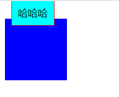
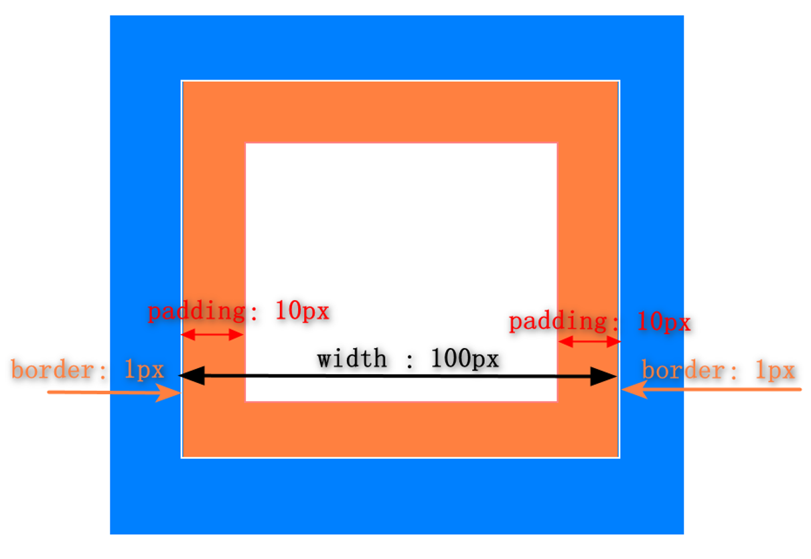
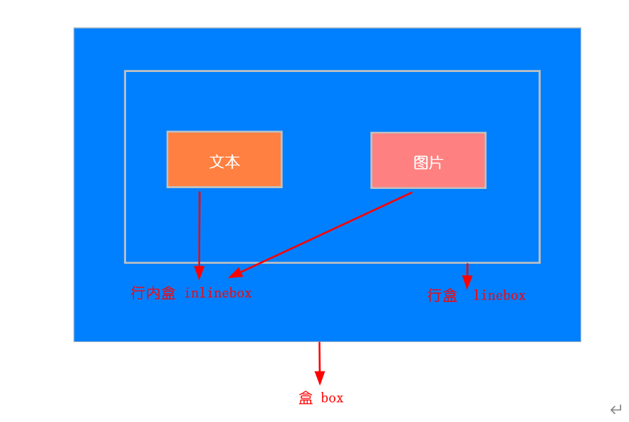
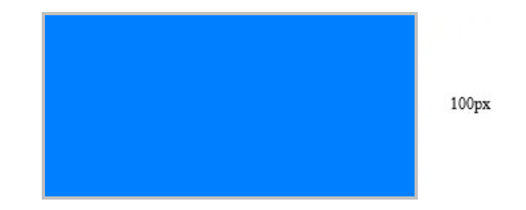
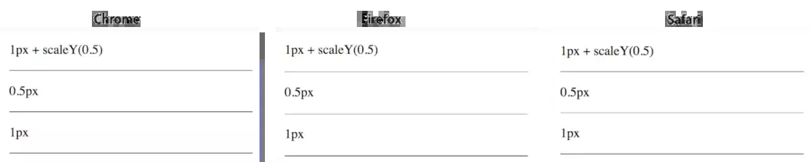
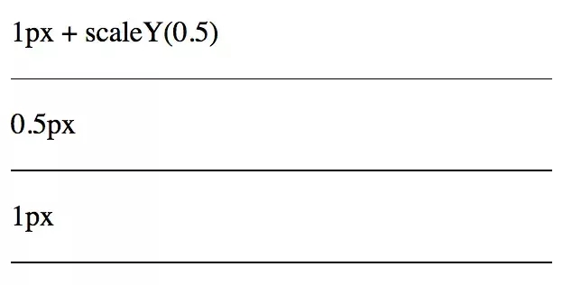
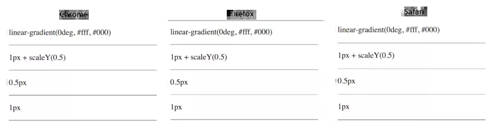

# CSS

## BEM规范

BEM规范我觉得放到css这个模块讲比较合适
因为有了BEM，可以让css的编码变得有规范可循，使得css也变得整洁起来，拥有了很强的可维护性
这里以elementUI的BEM规范为例
BEM代表 块（block）、元素（element）、修饰符（modifier），三个部分结合使用，生成一套具有唯一性的class命名规范，起到样式隔离，避免css样式污染的作用

如el-input , el-input__inner, el-input--mini

[小满-BEM架构](https://xiaoman.blog.csdn.net/article/details/122832888)

### 定义block

作用：给组件添加统一的el-前缀，通过@content将include{}中传递过来的内容导入到指定位置
``` scss
$block-sel: "-" !default;
$element-sel: "__" !default;
$modifier-sel: "--" !default;
$namespace: "el" !default;

// 下面这两者和bem架构无太大关系
@mixin bfc {
  height: 100%;
  overflow: hidden;
}

@mixin flex {
  display: flex;
}

@mixin b($block) {
  $B: $namespace + $block-sel + $block; // 变量
  // 插值语法#{}
  .#{$B} {
    @content; // 插入传递进来的内容块
  }
}
```
block示例
```css
// 编译前
@include b(button) {
  display: inline-block;
  line-height: 1;
  white-space: nowrap;
}

// 编译后
.el-button {
  display: inline-block;
  line-height: 1;
  white-space: nowrap;
}
```

### 定义element

作用：
1）通过`__`连接符将父级选择器和传入的子元素拼接起来
2）如果父级选择器包含这几种字符，输出父级选择器包含子元素的嵌套关系
```scss
@mixin e($element) {
  $selector: &; // $selector变量存储了当前选择器的父级选择器，&表示当前选择器的父级
  // at-root是Sass的一个指令，用于将嵌套的规则提升到根层级，避免嵌套
  @at-root {
    #{$selector + $element-sel + $element} {
      @content;
    }
  }
}
```
element示例
```scss
// 编译前
@include b(message-box) {
    color: blue;
    @include m(center) {
       padding-bottom: 30px;
	    @include e(header) {
	       padding-top: 30px;
	    }
	}
}
// 编译后
.el-message-box {
    color: blue;
}
.el-message-box--center {
    padding-bottom: 30px; 
}
.el-message-box--center .el-message-box__header {
    padding-top: 30px;
}
```

### 定义modifier(修饰符)

通过 `--` 连接符将父级选择器和传入的修饰符拼接起来
```scss
@mixin m($modifier) {
  $selector: &;
  @at-root {
    #{$selector + $modifier-sel + $modifier} {
      @content;
    }
  }
}
```
modifier示例
```scss
// 编译前
@include b(button) {
  display: inline-block;
  @include m(primary) {
    color:blue;
  }
}
// 编译后
.el-button {
  display: inline-block;
}
.el-button--primary {
  color:blue;
}
```
通过学习elementUI这套BEM规范，可以应用到自己的项目中，使得css编码也规范起来
### vue全局扩充sass
将上面三者的定义集中到一起，就是一个简单的bem架构
```js
import { defineConfig } from 'vite'
import vue from '@vitejs/plugin-vue'

export default defineConfig({
	plugins: [vue()],
	css: {
		preprocessorOptions: {
			scss: {
				additionalData: "@import './src/bem.scss';"
			}
		}
	}
})

```
#### Vue组件用法
``` vue
<template>
    <div class="el-wraps">
         <div>
            <Menu></Menu>
         </div>
         <div class="el-wraps__right">
            <Header></Header>
            <Content></Content>
         </div>
    </div>
</template>
 
<script lang="ts" setup>
import { ref, reactive } from "vue"
import Menu from './Menu/index.vue'
import Content from './Content/index.vue'
import Header from './Header/index.vue'
</script>
 
<style lang="scss" scoped>
@include b('wraps'){
    @include bfc;
    @include flex;
    @include e(right){
        flex:1;
        display: flex;
        flex-direction: column;
    }
}
</style>

```
## var() 实现换肤、换主题

1）通过 css `var()` 函数，定义颜色变量
2）css 中引入 var 变量
3）需要换肤时，通过 js 修改 body 的颜色变量

换肤代码示例
```css
:root {
	--color-bg: #000000;
	--color-text: #ffffff
}

body { // 黑底白字 深色模式
	background-color: var(--color-bg);
	color: var(--color-text);
	transition: background-color 0.3s, color 0.3s; // 在元素状态改变时控制过渡效果
}
```

```js
// 相关点击事件省略
let style = { // 白底黑字，浅色模式
    '--color-bg': '#ffffff',
    '--color-text': '#000000'
};
const root = document.documentElement;
for (let i in style) {
    root.style.setProperty(i, style[i]);
}
```
缺点是兼容性差一些


## link style @import及三者的区别

**加载顺序的差别**

1）当一个页面被加载的时候，link引用的CSS会同时被加载
2）而@import引用的CSS会等到页面全部被下载完再被加载
有时候浏览用@import加载CSS的页面时，可能会出现闪烁的情况

**加载内容的区别**

1）@import只能导入样式文件
2）link不仅可以引入样式，还可以引入js文件和图片（icon图标）
3）style标签，它是定义在当前页面的样式

## css3新特性

### CSS3 边框

在 css3 中新增的边框属性如下：

#### 创建圆角

**语法：** border-radius : length length;

length： 由浮点数字和单位标识符组成的长度值（如：20px）。不可为负值，如果为负值则与0展示效果一样。第一个值设置其水平半径，第二个值设置其垂直半径，如果第二个值省略则默认第二个值等于第一个值。

```css
div{
  border: 1px solid;
  /* 设置每个圆角水平半径和垂直半径都为30px */
  border-radius: 30px;
}
```

border-radius是4个角的缩写方法。四个角的表示顺序与border类似按照border-top-left-radius、border-top-right-radius、border-bottom-right-radius、border-bottom-left-radius的顺序来设置。

border-radius指定不同数量的值遵循对角相等的原则，即指定了值的取指定值，没有指定值的与对角值相等，对角相等模型

#### 边框阴影

通过属性box-shadow向边框添加阴影。

**语法：** {box-shadow : \[inset] x-offset y-offset blur-radius extension-radius spread-radiuscolor}

说明：对象选择器 {box-shadow: \[投影方式] X轴偏移量 Y轴偏移量 模糊半径 阴影扩展半径 阴影颜色}

```css
div{
  /* 内阴影，向右偏移10px，向下偏移10px，模糊半径5px，阴影缩小10px */
  box-shadow: inset 10px 10px 5px -10px #888888;
}
```

#### 边框图片

**语法：**

border-image : border-image-source || border-image-slice \[ border-image-width] || border-image-repeat

border-image ： none | image \[ number | percentage]{1,4} \[ border-width>{1,4} ] ? \[ stretch | repeat | round ]{0,2}

```css
div{
  border-image: url(border.png) 30 30 round;

  border-image: url(border.png) 20/10px repeat;
}
```

### CSS3 背景属性

#### background-size属性

在 CSS3 之前，背景图片的尺寸是由图片的实际尺寸决定的。在 CSS3 中，可以设置背景图片的尺寸，这就允许我们在不同的环境中重复使用背景图片。可以像素或百分比规定尺寸。如果以百分比规定尺寸，那么尺寸相对于父元素的宽度和高度。

```css
div{
  background: url(bg_flower.gif);
  /* 通过像素规定尺寸 */
  background-size: 63px 100px;

  /* 通过百分比规定尺寸 */
  background-size: 100% 50%;
  background-repeat: no-repeat;
}
```

#### background-origin属性

规定背景图片的定位区域，背景图片可以放置于content-box、padding-box或border-box区域，

```css
div{
  background:url(bg_flower.gif);
  background-repeat:no-repeat;
  background-size:100% 100%;
  /* 规定背景图片的定位区域 */
  background-origin:content-box;
}
```

#### background-clip属性

与background-origin属性相似，规定背景颜色的绘制区域，区域划分与background-origin属性相同。

```css
div{
  background-color:yellow;
  background-clip:content-box;
}
```

#### 多重背景图片

CSS3 允许为元素设置多个背景图像

```css
body{
  background-image: url(bg_flower.gif),url(bg_flower_2.gif);
}
```

### CSS3 文本效果

#### text-shadow属性

给为本添加阴影，能够设置水平阴影、垂直阴影、模糊距离，以及阴影的颜色。

```css
h1{
  text-shadow: 5px 5px 5px #FF0000;
}
```

#### text-wrap 属性

设置区域内的自动换行。

**语法：** text-wrap: normal | none | unrestricted | suppress | break-word;

```css
/* 允许对长单词进行拆分，并换行到下一行 */
p {word-wrap:break-word;}
```

| 值         | 描述                                                         |
| ---------- | ------------------------------------------------------------ |
| normal     | 只在允许的换行点进行换行。                                   |
| none       | 不换行。元素无法容纳的文本会溢出。                           |
| break-word | 在任意两个字符间换行。                                       |
| suppress   | 压缩元素中的换行。浏览器只在行中没有其他有效换行点时进行换行。 |

### CSS3 字体

#### 字体定义

在 CSS3 之前，web 设计师必须使用已在用户计算机上安装好的字体。但是通过 CSS3，web 设计师可以使用他们喜欢的任意字体。当找到或购买到希望使用的字体时，可将该字体文件存放到 web 服务器上，它会在需要时被自动下载到用户的计算机上。字体需要在 CSS3 @font-face 规则中定义。

```css
/* 定义字体 */
@font-face{
  font-family: myFont;
  src: url('Sansation_Light.ttf'),
       url('Sansation_Light.eot');     /* IE9+ */
}

div{
  font-family:myFont;
}
```

#### 使用粗体字体

"Sansation_Light.ttf"文件 是定义的正常字体，"Sansation_Bold.ttf" 是另一个字体文件，它包含了 Sansation 字体的粗体字符。只要 font-family 为 "myFirstFont" 的文本需要显示为粗体，浏览器就会使用该字体。

```css
/* 定义正常字体 */
@font-face{
  font-family: "myFirstFont";
  src: url('/example/css3/Sansation_Light.ttf'),
       url('/example/css3/Sansation_Light.eot'); /* IE9+ */
}

/* 定义粗体时使用的字体 */
@font-face{
  font-family: "myFirstFont";
  src: url('/example/css3/Sansation_Bold.ttf'),
       url('/example/css3/Sansation_Bold.eot'); /* IE9+ */
  /* 标识属性 */
  font-weight:bold;
}

div{
  font-family: "myFirstFont";
}
```

**浏览器如何选用字体：** 
当在css中使用了 `font-family: "myFirstFont"` 时，浏览器会根据字重 （ `font-weight` ）自动选择合适的字体文件：
+ 如果文本的 `font-weight` 是 `normal` （默认值），浏览器会使用 `Sansation_Light.ttf` 
+ 如果文本的 `font-weight` 是 `bold` ，浏览器会使用 `Sansation_bold.ttf` 
+ 对于 `<p>` 标签中的文本，浏览器会使用 `Sansation_Light.ttf`
+ 对于 `<strong>` 标签中的文本（通常是粗体），浏览器会使用 `Sansation_Bold.ttf`

如果定义了多个 `@font-face` 规则，并且属于同一个 `font-family` ，浏览器会根据 `font-weight` 的值选择对应的文件，常见的字重为 `normal` （400）和 `bold` （700）

### CSS3 2D 转换

通过 CSS3 转换，我们能够对元素进行**移动、缩放、转动、拉长或拉伸**，转换是使元素改变形状、尺寸和位置的一种效果。

#### translate() 方法

通过 translate(x , y) 方法，元素根据给定的 left（x 坐标） 和 top（y 坐标） 位置参数从其当前位置移动，x为正值向右移动，为负值向左移动；y为正值向下移动，为负值向上移动；

```css
div{
  transform: translate(50px,100px);
  -ms-transform: translate(50px,100px);        /* IE 9 */
  -webkit-transform: translate(50px,100px);     /* Safari and Chrome */
  -o-transform: translate(50px,100px);         /* Opera */
  -moz-transform: translate(50px,100px);        /* Firefox */
}
```

#### rotate() 方法

控制元素顺时针旋转给定的角度。为正值，元素将顺时针旋转。为负值，元素将逆时针旋转。

```css
div{
  transform: rotate(30deg);
  -ms-transform: rotate(30deg);        /* IE 9 */
  -webkit-transform: rotate(30deg);    /* Safari and Chrome */
  -o-transform: rotate(30deg);         /* Opera */
  -moz-transform: rotate(30deg);       /* Firefox */
}
```

#### scale() 方法

根据给定的宽度（X 轴）和高度（Y 轴）参数，控制元素的尺寸的增加、减少。

```css
div{
  transform: scale(2,4);
  -ms-transform: scale(2,4);         /* IE 9 */
  -webkit-transform: scale(2,4);     /* Safari 和 Chrome */
  -o-transform: scale(2,4);         /* Opera */
  -moz-transform: scale(2,4);       /* Firefox */
}
```

#### skew() 方法

根据给定的水平线（X 轴）和垂直线（Y 轴）参数设置元素翻转给定的角度。

```css
/* 设置围绕 X 轴把元素翻转 30 度，围绕 Y 轴翻转 20 度。 */
div{
  transform: skew(30deg,20deg);
  -ms-transform: skew(30deg,20deg);         /* IE 9 */
  -webkit-transform: skew(30deg,20deg);     /* Safari and Chrome */
  -o-transform: skew(30deg,20deg);          /* Opera */
  -moz-transform: skew(30deg,20deg);        /* Firefox */
}
```

#### matrix() 方法

matrix() 方法把所有 2D 转换方法组合在一起。matrix() 方法需要六个参数，包含数学函数，允许旋转、缩放、移动以及倾斜元素。

```css
/* 使用 matrix 方法将 div 元素旋转 30 度 */
div{
  transform:matrix(0.866,0.5,-0.5,0.866,0,0);
  -ms-transform:matrix(0.866,0.5,-0.5,0.866,0,0);          /* IE 9 */
  -moz-transform:matrix(0.866,0.5,-0.5,0.866,0,0);         /* Firefox */
  -webkit-transform:matrix(0.866,0.5,-0.5,0.866,0,0);      /* Safari and Chrome */
  -o-transform:matrix(0.866,0.5,-0.5,0.866,0,0);           /* Opera */
}
```

#### 2D Transform 方法汇总

| 函数                  | 描述                                     |
| --------------------- | ---------------------------------------- |
| matrix(n,n,n,n,n,n)   | 定义 2D 转换，使用六个值的矩阵。         |
| translate(x,y)        | 定义 2D 转换，沿着 X 和 Y 轴移动元素。   |
| translateX(n)         | 定义 2D 转换，沿着 X 轴移动元素。        |
| translateY(n)         | 定义 2D 转换，沿着 Y 轴移动元素。        |
| scale(x,y)            | 定义 2D 缩放转换，改变元素的宽度和高度。 |
| scaleX(n)             | 定义 2D 缩放转换，改变元素的宽度。       |
| scaleY(n)             | 定义 2D 缩放转换，改变元素的高度。       |
| rotate(angle)         | 定义 2D 旋转，在参数中规定角度。         |
| skew(x-angle,y-angle) | 定义 2D 倾斜转换，沿着 X 和 Y 轴。       |
| skewX(angle)          | 定义 2D 倾斜转换，沿着 X 轴。            |
| skewY(angle)          | 定义 2D 倾斜转换，沿着 Y 轴。            |

### CSS3 3D 转换

CSS3 允许使用 3D 转换来对元素进行格式化

#### rotateX() 方法

```css
/* 设置元素围绕其 X 轴以给定的度数进行旋转 */
div{
  transform: rotateX(120deg);
  -webkit-transform: rotateX(120deg);   /* Safari 和 Chrome */
  -moz-transform: rotateX(120deg);  /* Firefox */
}
```

#### rotateY() 旋转

```css
/* 设置元素围绕其 Y 轴以给定的度数进行旋转 */
div{
  transform: rotateY(130deg);
  -webkit-transform: rotateY(130deg);   /* Safari 和 Chrome */
  -moz-transform: rotateY(130deg);  /* Firefox */
}
```

### CSS3 过渡transition

通过 CSS3可以在不使用 Flash 动画或 JavaScript 的情况下，当元素从一种样式变换为另一种样式时为元素添加效果。

要实现这一点，必须规定以下两项内容：
- 设置添加过渡效果的 CSS 属性；
- 设置过渡效果的时长；
 **注意：** 如果时长未设置，则不会有过渡效果，因为默认值是 0。

#### 单项效果改变

```css
/* 设置将变化效果添加在“宽度”上，时长为2秒；该时长在其他属性上并不适用 */
div{
  width: 200px;
  height: 50px;
  transition: width 2s;
  -moz-transition: width 2s;         /* Firefox 4 */
  -webkit-transition: width 2s;      /* Safari 和 Chrome */
  -o-transition: width 2s;           /* Opera */
}
/* 配合在一起使用的效果就是当鼠标移上去的时候宽度变为300px，这个过程耗时2秒 */
div:hover{
  width:300px;
}
```

**注意：** 当鼠标移出元素时，它会逐渐变回原来的样式。

#### 多项效果改变

如需向多个样式添加过渡效果，请添加多个属性，由逗号隔开。

```css
/* 同时向宽度、高度和转换添加过渡效果 */
div{
  width: 100px;
  height: 100px;
  background: #000;
  transition: width 2s, height 2s, transform 2s;
  -moz-transition: width 2s, height 2s, -moz-transform 2s;
  -webkit-transition: width 2s, height 2s, -webkit-transform 2s;
  -o-transition: width 2s, height 2s,-o-transform 2s;
}

/* 当鼠标移上时宽度和高度都变成200px，同时旋转180度，每个属性变化都耗时2秒 */
div:hover{
  width:200px;
  height:200px;
  transform:rotate(180deg);
  -moz-transform:rotate(180deg);        /* Firefox 4 */
  -webkit-transform:rotate(180deg);     /* Safari and Chrome */
  -o-transform:rotate(180deg);          /* Opera */
}
```

#### 过渡属性详解

transition是简写属性，

**语法：** transition : transition-property | transition-duration | transition-timing-function | transition-delay;

```css
/* 设置在宽度上添加过渡效果，时长为1秒，过渡效果时间曲线为linear，等待2秒后开始过渡 */
div{
  transition: width 1s linear 2s;
  -moz-transition: width 1s linear 2s;       /* Firefox 4 */
  -webkit-transition: width 1s linear 2s;    /* Safari and Chrome */
  -o-transition: width 1s linear 2s;         /* Opera */
}
```

| 属性                       | 描述                                         |
| -------------------------- | -------------------------------------------- |
| transition                 | 简写属性，用于在一个属性中设置四个过渡属性。 |
| transition-property        | 规定应用过渡的 CSS 属性的名称。              |
| transition-duration        | 定义过渡效果花费的时间。默认是 0。           |
| transition-timing-function | 规定过渡效果的时间曲线。默认是 "ease"。      |
| transition-delay           | 规定过渡效果何时开始。默认是 0。             |

### CSS3 动画

通过 CSS3可以创建动画，这些动画可以取代网页中的画图片、Flash 动画以及 JavaScript。

CSS3 中通过@keyframes 规则来创建动画。在 @keyframes 中规定某项 CSS 样式，就能创建由当前样式（动画开始前的样式）逐渐改为新样式（需要变到的样式）的动画效果。

#### 通过from , to关键字设置动画发生的时间

```css
/* 通过@keyframes 创建动画 */
@keyframes myfirst{
 from {background: red;}
 to {background: yellow;}
}
/* Firefox */
@-moz-keyframes myfirst {
 from {background: red;}
 to {background: yellow;}
}
/* Safari 和 Chrome */
@-webkit-keyframes myfirst {
 from {background: red;}
 to {background: yellow;}
}
/* Opera */
@-o-keyframes myfirst {
 from {background: red;}
 to {background: yellow;}
}

/*
  将创建的动画绑定到选择器，并至少指定以下两项 CSS3 动画属性
  1.指定动画的名称；
  2.指定动画的时长；
*/
div{
 animation: myfirst 5s;
 -moz-animation: myfirst 5s;       /* Firefox */
 -webkit-animation: myfirst 5s;    /* Safari 和 Chrome */
 -o-animation: myfirst 5s;         /* Opera */
}
```

#### 通过百分比设置动画发生的时间

动画是使元素从一种样式逐渐变化为另一种样式的效果。可以改变任意多的样式任意多的次数。可以用关键词 "from" 和 "to"来设置动画变化发生的时间，其效果等同于 0% 和 100%。0% 是动画的开始，100% 是动画的完成。为了得到最佳的浏览器支持，应该始终定义 0% 和 100% 选择器。

```css
/* 当动画为 25% 及 50% 时改变背景色，然后当动画 100% 完成时再次改变 */
@keyframes myfirst{
 0%   {background: red;}
 25%  {background: yellow;}
 50%  {background: blue;}
 100% {background: green;}
}

/* 同时改变背景色和位置 */
@keyframes myfirst{
 0%   {background: red; left:0px; top:0px;}
 25%  {background: yellow; left:200px; top:0px;}
 50%  {background: blue; left:200px; top:200px;}
 75%  {background: green; left:0px; top:200px;}
 100% {background: red; left:0px; top:0px;}
}
```

#### 动画属性详解

animation是除了animation-play-state属性所有动画属性的简写属性。

**语法：** animation : animation-name | animation-duration | animation-timing-function | animation-delay | animation-iteration-count | animation-direction

```css
/* 应用的动画为myfirst，一个动画周期为5秒，动画的速度曲线为linear，动画2秒后播放，播放次数为infinite，即无限循环，动画下一周期是否逆向播放取值alternate，即逆向播放 */
div{
     animation: myfirst 5s linear 2s infinite alternate;
     /* Firefox: */
     -moz-animation: myfirst 5s linear 2s infinite alternate;
     /* Safari 和 Chrome: */
     -webkit-animation: myfirst 5s linear 2s infinite alternate;
     /* Opera: */
     -o-animation: myfirst 5s linear 2s infinite alternate;
}
```

| 属性                        | 描述                                      |
| ------------------------- | --------------------------------------- |
| @keyframes                | 规定动画。                                   |
| animation                 | 所有动画属性的简写属性，除了 animation-play-state 属性。 |
| animation-name            | 规定 @keyframes 动画的名称。                    |
| animation-duration        | 规定动画完成一个周期所花费的秒或毫秒。默认是 0。               |
| animation-timing-function | 规定动画的速度曲线。默认是 "ease"。                   |
| animation-delay           | 规定动画何时开始。默认是 0。                         |
| animation-iteration-count | 规定动画被播放的次数。默认是 1。                       |
| animation-direction       | 规定动画是否在下一周期逆向地播放。默认是 "normal"。          |
| animation-play-state      | 规定动画是否正在运行或暂停。默认是 "running"。            |
| animation-fill-mode       | 规定对象动画时间之外的状态。                          |

### CSS3 多列

通过 CSS3够创建多个列来对文本进行布局，就像我们经常看到的报纸的布局一样。

#### CSS3 创建多列

column-count属性规定元素应该被分隔的列数。

```css
/* 将div中的文本分为3列 */
div{
 column-count:3;
 -moz-column-count:3;        /* Firefox */
 -webkit-column-count:3;     /* Safari 和 Chrome */
}
```

#### CSS3 规定列之间的间隔

column-gap属性规定列之间的间隔。

```css
/* 设置列之间的间隔为 40 像素 */
div{
 column-gap:40px;
 -moz-column-gap:40px;        /* Firefox */
 -webkit-column-gap:40px;     /* Safari 和 Chrome */
}
```

#### CSS3 列规则

   column-rule属性设置列之间的宽度、样式和颜色规则。

   **语法：** column-rule : column-rule-width | column-rule-style | column-rule-color

```css
div{
 column-rule:3px outset #ff0000;
 -moz-column-rule:3px outset #ff0000;       /* Firefox */
 -webkit-column-rule:3px outset #ff0000;    /* Safari and Chrome */
}
```

| 属性                | 描述                              |
| ----------------- | ------------------------------- |
| column-count      | 规定元素应该被分隔的列数。                   |
| column-fill       | 规定如何填充列。                        |
| column-gap        | 规定列之间的间隔。                       |
| column-rule       | 设置所有 column-rule-* 属性的简写属性。     |
| column-rule-width | 规定列之间规则的宽度。                     |
| column-rule-style | 规定列之间规则的样式。                     |
| column-rule-color | 规定列之间规则的颜色。                     |
| column-span       | 规定元素应该横跨的列数。                    |
| column-width      | 规定列的宽度。                         |
| columns           | 语法 : column-width column-count。 |

### CSS3 用户界面

#### CSS3 resize

在 CSS3中resize属性设置是否可由用户调整元素尺寸。

```css
/* 设置div可以由用户调整大小 */
div{
 resize:both;
 overflow:auto;
}
```

#### CSS3 box-sizing
[[#盒模型]]

   box-sizing属性允许您以确切的方式定义适应某个区域的具体内容。边框计算在width中

```css
/* 规定两个并排的带边框方框 */
div{
 box-sizing:border-box;
 -moz-box-sizing:border-box;        /* Firefox */
 -webkit-box-sizing:border-box;     /* Safari */
 width:50%;
 float:left;
}
   ```

#### CSS3 outline-offset

outline-offset属性对轮廓进行偏移，并在超出边框边缘的位置绘制轮廓。

轮廓与边框有两点不同：
+  轮廓不占用空间；
+  轮廓可能是非矩形；

```css
/* 规定边框边缘之外 15 像素处的轮廓 */
div{
 border:2px solid black;
 outline:2px solid red;
 outline-offset:15px;
}
```

## css预处理工具

**CSS 预处理器**是一个能让你通过预处理器自己独有的语法来生成CSS的程序。最主要的是可以让你减少相关css的代码书写

css预处理器种类繁多，三种主流css预处理器是**Less**、**Sass（Scss）** 及**Stylus**；它们各自的背景如下:

Sass：

2007年诞生，最早也是最成熟的CSS预处理器，拥有ruby社区的支持和compass这一最强大的css框架，目前受LESS影响，已经进化到了全面兼容CSS的SCSS（SCSS 需要使用分号和花括号而不是换行和缩进）。

Less：

2009年出现，受SASS的影响较大，但又使用CSS的语法，让大部分开发者和设计师更容易上手，在ruby社区之外支持者远超过SASS。其缺点是比起SASS来，可编程功能不够。优点是简单和兼容CSS，反过来也影响了SASS演变到了SCSS的时代，著名的Twitter Bootstrap就是采用LESS做底层语言的。

Stylus：

2010年产生，来自Node.js社区，主要用来给Node项目进行CSS预处理支持，在此社区之内有一定支持者，在广泛的意义上人气还完全不如SASS和LESS。

**比较**

在使用 CSS 预处理器之前最重要的是理解语法，幸运的是基本上大多数预处理器的语法跟 CSS 都差不多。

首先 Sass 和 Less 都使用的是标准的 CSS 语法，因此可以很方便的将已有的 CSS 代码转为预处理器代码，默认 Sass 使用 .sass 扩展名，而 Less 使用 .less 扩展名。
.sass 缩进语法，无大括号和分号
.scss 使用大括号和分号

```scss
h1 {
	color: #0982C1;
}
```

这是一个再普通不过的，不过 Sass 同时也支持老的语法，就是不包含花括号和分号的方式：

```sass
h1
	color: #0982c1
```

而 Stylus 支持的语法要更多样性一点，它默认使用 .styl 的文件扩展名，下面是 Stylus 支持的语法

```stylus
/* style.styl */
h1 {
	color: #0982C1;
}
/* 省略括号 */
h1
	color: #0982C1;
/* 省略冒号和分号 */
h1
	color #0982C1
```

可以在同一个样式单中使用不同的变量，例如下面的写法也不会报错：

```stylus
h1 {
	color #0982c1
}
h2
	font-size: 1.2em
```

## 行内元素和块级元素

### 块级元素

1.总是从新的一行开始，即各个块级元素独占一行，默认垂直向下排列；
2.高度、宽度、margin及padding都是可控的，设置有效，有边距效果；
3.宽度没有设置时，默认为100%；
4.块级元素中可以包含块级元素和行内元素。

### 行内元素

1.和其他元素都在一行，即行内元素和其他行内元素都会在一条水平线上排列；
2.高度、宽度是不可控的，设置无效，由内容决定。
3.根据标签语义化的理念，行内元素最好只包含行内元素，不包含块级元素。

### 转换

当然块级元素与行内元素之间的特性是可以相互转换的。HTML可以将元素分为行内元素、块状元素和行内块状元素三种。

使用display属性能够将三者任意转换：

(1)display:inline;    转换为行内元素；
(2)display:block;    转换为块状元素；
(3)display:inline-block;    转换为行内块状元素。（既有块级元素特征，又有行内元素特征）

## 行内元素的margin和padding

+ 水平方向：水平方向上，都有效；
+ 垂直方向：垂直方向上，都无效；（padding-top和padding-bottom会显示出效果，但是高度不会撑开，不会对周围元素有影响，但如果行内元素有背景颜色或者边框样式，会遮挡周围紧邻的盒子）

```html
<style>
    span{
        background-color: aqua;
        padding: 10px;
        margin: 10px;
        border: 1px solid #f00;
    }
    div{
        width: 100px;
        height: 100px;
        background-color: blue;
    }
</style>
<span>哈哈哈</span>
<div></div>
```


## css继承

### 继承相关

css的继承：就是给父级设置一些属性，子级继承了父级的该属性，这就是我们的css中的继承。 官方解释，继承是一种规则，它允许样式不仅应用于特定的html标签元素，而且应用于其后代元素。

### 无继承性的属性

1、display：规定元素应该生成的框的类型

2、文本属性：

vertical-align：垂直文本对齐
text-decoration：规定添加到文本的装饰
text-shadow：文本阴影效果
white-space：空白符的处理
unicode-bidi：设置文本的方向

3、盒子模型的属性：width、height、margin 、margin-top、margin-right、margin-bottom、margin-left、border、 border-style、border-top-style、border-right-style、border-bottom-style、border-left-style、border-width、border-top-width、border-right-right、border-bottom-width、border-left-width、border-color、border-top-color、border-right-color、border-bottom-color、border-left-color、border-top、border-right、border-bottom、border-left、padding、padding-top、padding-right、padding-bottom、padding-left

4、背景属性：background、background-color、background-image、background-repeat、background-position、background-attachment

5、定位属性：float、clear、position、top、right、bottom、left、min-width、min-height、max-width、max-height、overflow、clip、z-index

6、生成内容属性：content、counter-reset、counter-increment

7、轮廓样式属性：outline-style、outline-width、outline-color、outline

8、页面样式属性：size、page-break-before、page-break-after

9、声音样式属性：pause-before、pause-after、pause、cue-before、cue-after、cue、play-during

**有继承性的属性**

1、字体系列属性

font：组合字体
font-family：规定元素的字体系列
font-weight：设置字体的粗细
font-size：设置字体的尺寸
font-style：定义字体的风格
font-variant：设置小型大写字母的字体显示文本，这意味着所有的小写字母均会被转换为大写，但是所有使用小型大写字体的字母与其余文本相比，其字体尺寸更小。
font-stretch：对当前的 font-family 进行伸缩变形。所有主流浏览器都不支持。
font-size-adjust：为某个元素规定一个 aspect 值，这样就可以保持首选字体的 x-height。

2、文本系列属性

text-indent：文本缩进
text-align：文本水平对齐
line-height：行高
word-spacing：增加或减少单词间的空白（即字间隔）
letter-spacing：增加或减少字符间的空白（字符间距）
text-transform：控制文本大小写
direction：规定文本的书写方向
color：文本颜色 a元素除外

3、元素可见性：visibility

4、表格布局属性：caption-side、border-collapse、border-spacing、empty-cells、table-layout

5、列表布局属性：list-style-type、list-style-image、list-style-position、list-style

6、生成内容属性：quotes

7、光标属性：cursor

8、页面样式属性：page、page-break-inside、windows、orphans

9、声音样式属性：speak、speak-punctuation、speak-numeral、speak-header、speech-rate、volume、voice-family、 pitch、pitch-range、stress、richness、、azimuth、elevation

### 所有元素可以继承的属性

1. 元素可见性：visibility
2. 光标属性：cursor

### 内联元素可以继承的属性

1. 字体系列属性
2. 除text-indent、text-align之外的文本系列属性

### 块级元素可以继承的属性

1. text-indent、text-align

## 盒模型

概念

CSS盒模型本质上是一个盒子，封装周围的HTML元素，它包括：外边距（margin）、边框（border）、内边距（padding）、实际内容（content）四个属性。
CSS盒模型：**标准模型 + IE模型(怪异模型)**

### 标准盒模型


盒子总宽度/高度 = width/height + padding + border + margin （width/height只是里面内容的宽度/高度，不包含padding和border）

**怪异盒模型(IE模型)**



盒子总宽度/高度 = (width/height) + margin = (内容区宽度/高度 + padding + border) + margin （即width/height包含了padding和border值）

**如何设置这两种模型**

标准模型：box-sizing:content-box（浏览器默认设置）

IE模型：box-sizing:border-box（推荐使用，方便计算）

## BFC

### BFC基本概念

BFC：块级可视化上下文

基本概念：BFC是css布局的一个概念，是一块独立渲染区域，是一个环境，里面的元素不会影响到外部的元素。

 父子元素和兄弟元素边距重叠，重叠原则取最大值。空元素的边距重叠是取margin与 padding 的最大值。 

### BFC原理（渲染规则|布局规则）

（1）内部的Box会在垂直方向，从顶部开始一个接着一个地放置；
（2）Box垂直方向的距离由margin(外边距)决定，属于同一个BFC的两个相邻Box的margin会发生重叠；
（3）每个元素的margin Box的左边， 与包含块border Box的左边相接触，（对于从左到右的格式化，否则相反）。即使存在浮动也是如此；
（4）BFC 在页面上是一个隔离的独立容器，外面的元素不会影响里面的元素，反之亦然。文字环绕效果，设置float；
（5）BFC 的区域不会与float Box重叠（清浮动）;
（6）计算BFC的高度时，浮动元素也参与计算。

### CSS在什么情况下会创建出BFC（即脱离文档流）

 根元素，即 HTML 元素（最大的一个BFC）
1、浮动（float 的值不为 none）
2、绝对定位元素（position 的值为 absolute 或 fixed）
3、行内块（display 为 inline-block）
4、表格单元（display 为 table、table-cell、table-caption、inline-block 等 HTML 表格相关的属性)
5、弹性盒（display 为 flex 或 inline-flex）
6、默认值。内容不会被修剪，会呈现在元素框之外（overflow 不为 visible） 

### BFC作用（使用场景）

1、自适应两（三）栏布局（避免多列布局由于宽度计算四舍五入而自动换行）
2、避免元素被浮动元素覆盖
3、可以让父元素的高度包含子浮动元素，清除内部浮动（原理：触发父div的BFC属性，使下面的子div都处在父div的同一个BFC区域之内）
4、去除边距重叠现象，分属于不同的BFC时，可以阻止margin重叠

## IFC

### IFC基本概念

IFC：行内格式化上下文



### IFC原理

（1）内部的Box会在水平方向，从含块的顶部开始一个接着一个地放置；
（2）这些Box之间的水平方向的margin，border和padding都有效；
（3）Box垂直对齐方式：以它们的底部、顶部对齐，或以它们里面的文本的基线（baseline）对齐（默认， 文本与图片对其），例：line-heigth与vertical-align。

## 样式优先级

 样式类型分为三类：行间，内联，外部

**行间**

```xml
<h1 style="font-size:12px;color:#000;">我的行间CSS样式。</h1>
```

**内联**

```html
<style type="text/css">
   h1{
		font-size:12px;
	    color:#000;
   }
</style>
```

**外部**

```html
<link rel="stylesheet" href="css/style.css">
```

选择器类型

- ID　　\\#id
- class　　.class
- 标签　　p
- 通用　　*
- 属性　　\\\[type="text"]
- 伪类　　:hover
- 伪元素　　::first-line
- 子选择器、相邻选择器

权重计算规则

第一等：代表内联样式，如: style=””，权值为1000。
第二等：代表ID选择器，如：#content，权值为0100。
第三等：代表类，伪类和属性选择器，如.content，权值为0010。
第四等：代表类型选择器和伪元素选择器，如div p，权值为0001。
通配符、子选择器、相邻选择器等的。如*、>、+,权值为0000。
继承的样式没有权值。

比较规则

遵循如下法则：

- 选择器都有一个权值，权值越大越优先；
- 当权值相等时，后出现的样式表设置要优于先出现的样式表设置；
- 创作者的规则高于浏览者：即网页编写者设置的 CSS 样式的优先权高于浏览器所设置的样式；
- 继承的 CSS 样式不如后来指定的 CSS 样式；
- 在同一组属性设置中标有!important规则的优先级最大
- 通配符、子选择器、相邻选择器等的。虽然权值为0000，但是也比继承的样式优先。

!important 的作用是提升优先级，换句话说。加了这句的样式的优先级是最高的（比内联样式的优先级还高)。

## margin塌陷和合并

首先，margin塌陷是相对于父子级关系的两个元素，而margin合并是相对两个兄弟级关系的两个元素

两个兄弟级关系的元素，垂直方向上的margin，其外边距会发生重叠现象，两者两个的外边距取的是两个所设置margin的最大值，就是所说的margin合并问题

两个父子级关系的元素，垂直方向上的margin会粘合在一起，外层和模型的margin-top取两个元素中margin-top的最大值，发生margin塌陷的内层元素相对于整个文档移动

解决方案：两者都可以通过触发BFC来解决

## 父子边距重合（margin塌陷）

边界重叠是指两个或多个盒子(可能相邻也可能嵌套)的相邻边界(其间没有任何非空内容、补白、边框)重合在一起而形成一个单一边界。

父子元素的边界重叠

```html
<style>
  .parent {
    background: #e7a1c5;
  }
  .parent .child {
    background: #c8cdf5;
    height: 100px;
    margin-top: 10px;
  }
</style>
<section class="parent">
  <article class="child"></article>
</section>
```

以为期待的效果：


实际上效果如下：



在这里父元素的高度不是 110px，而是 100px，在这里发生了高度坍塌。

**产生原因：**

如果块元素的margin-top与它的第一个子元素的margin-top之间没有border、padding、inlinecontent、clearance来分隔，或者块元素的 margin-bottom 与它的最后一个子元素的 margin-bottom 之间没有border、padding、inlinecontent、height、min-height、max-height分隔，那么外边距会塌陷。子元素多余的外边距会被父元素的外边距截断。

**解决办法**：

父子元素的边界重叠的解决方案： 在父元素上加上 overflow:hidden;使其成为 BFC。

## 盒子塌陷（浮动）

### 盒子塌陷原因

当父元素没设置足够大小的时候（主要是没有设置高度时），而子元素设置了浮动的属性（如果不设置浮动，子元素会把父元素撑起来），子元素就会跳出父元素的边界（脱离文档流），尤其是当父元素的高度为auto时，而父元素中又没有其他非浮动的可见元素时，父盒子的高度就会直接塌陷为零，我们称这是**CSS高度塌陷**

### 盒子塌陷

本应该在父盒子内部的元素跑到了外部（或者父盒子没要把子盒子包裹起来）

```html
<style>
    .box{
        background-color: brown;
        border: 1px solid #f00;
    }
    .div{
        width: 100px;
        height: 100px;
        background-color: aqua;
        float: left;
    }
</style>
<div class="box">
    <div class="div"></div>
</div>
```

### 解决方法（清除浮动）

(1) 最简单，直接，粗暴的方法就是盒子大小写死，给每个盒子设定**固定的width和height**，直到合适为止，这样的好处是简单方便，兼容性好，适合只改动少量内容不涉及盒子排布的版面。缺点是非自适应，浏览器的窗口大小直接影响用户体验

(2) 给外部的父盒子也加上浮动，让其也脱离标准文档流，这种方法方便，但是对页面的布局不是很友好，不易维护

(3) 给父盒子添加overflow属性

​	overflow:auto; 有可能出现滚动条，影响美观。

​	overflow:hidden; 可能会带来内容不可见的问题。

(4) 父盒子里最下方引入清除浮动块。最简单的有

```html
<br style="clear:both;" />
```

此方法不推荐，因为引入了不必要的冗余元素

(5) 用after伪元素设置clear属性，再隐藏它。

这其实是对空盒子方案的改进，一种纯css的解决方案，不用引入冗余元素。

```css
.box {
    *zoom: 1;
}

.box::before,
.box::after {
	display: table;
	line-height: 0;
	content: "";
}

.box::after {
    clear: both;
}
```

推荐使用此方法解决css盒子塌陷

备注：该方法虽好，但是低版本IE不兼容，具体选择哪种解决方法，可根据实际情况决定。

(6) 给父盒子设置padding-top（该方法是解决子盒子的margin-top叠加到父盒子上）

## 伪类和伪元素

伪类：用于已有元素处于某种状态时为其添加对应的样式，这个状态是根据用户行为而动态变化的，用来添加一些选择器的特殊效果

​	例如：:hover，和一般的css样式相似，可以为元素添加样式，但只有处于DOM树无法描述的状态下才能为元素添加样式，所以称为伪类。还有:active，:visited，:link，:focus

伪元素：用于创建一些不在DOM树中的元素，并为其添加样式。 

​	例如：:before，在一个元素之前添加一些内容，并添加一些样式，虽然用户可以看见，但它实际上并不在DOM文档中。还有:after

### 区别

- 表示⽅法
  - CSS2 中伪类、伪元素都是以单冒号:表示,
  - CSS2.1 后规定伪类⽤单冒号表示，伪元素⽤双冒号::表示，
  - 浏览器同样接受 CSS2 时代已经存在的伪元素(:before，:after等)的单冒号写法。
  - CSS2 之后所有新增的伪元素(如::selection)，应该采⽤双冒号的写法。
  - CSS3中，伪类与伪元素在语法上也有所区别，伪元素修改为以::开头。浏览器对以:开头的伪元素也继续⽀持，但建议规范书写为::开头

- 定义不同
  - 伪类即假的类，可以添加类来达到效果
  - 伪元素即假元素，需要通过添加元素才能达到效果

- 总结:
  - 伪类和伪元素都是⽤来表示⽂档树以外的"元素"。
  - 伪类和伪元素分别⽤单冒号:和双冒号::来表示。
  - 伪类和伪元素的区别，关键点在于如果没有伪元素(或伪类)，是否需要添加元素才能达到效果，如果是则是伪元素，反之则是伪类
  - 伪类和伪元素都不出现在源⽂件和DOM树中。也就是说在html源⽂件中是看不到伪类和伪元素的。
  - 伪类其实就是基于普通DOM元素⽽产⽣的不同状态，他是DOM元素的某⼀特征。
  - 伪元素能够创建在DOM树中不存在的抽象对象，而且这些抽象对象是能够访问到的。

## css方面如何减少回流、重绘

1）可以使用GPU硬件加速
2）动画可以使用绝对定位或fixed，让其脱离文档流，修改动画不造成主界面的影响
3）使用 visibility: hidden 替换 display: none（前者只会引起重绘，后者则会引发回流）
4）避免使用 table 布局，可能很小的一个小改动会造成整个 table 的重新布局

## min-width/max-width 和 min-height/max-height 属性间的覆盖规则

1. max-width 会覆盖 width，即使 width 是行内样式或者设置了 !important。
2. min-width 会覆盖 max-width，此规则发生在 min-width 和 max-width 冲突的时候；

## 浏览器是怎样解析css选择器的

 CSS选择器的解析是从右向左解析的。若从左向右的匹配，发现不符合规则，需要进行回溯，会损失很多性能。若从右向左匹配，先找到所有的最右节点，对于每一个节点，向上寻找其父节点直到找到根元素或满足条件的匹配规则，则结束这个分支的遍历。两种匹配规则的性能差别很大，是因为从右向左的匹配在第一步就筛选掉了大量的不符合条件的最右节点(叶子节点)，而从左向右的匹配规则的性能都浪费在了失败的查找上面。而在 CSS解析完毕后,需要将解析的结果与DOM Tree的内容一起进行分析建立一棵Render Tree，最终用来进行绘图。在建立Render Tree时(WebKit 中的「Attachment」过程)， 浏览器就要为每个DOM Tree中的元素根据CSS的解析结果(Style Rules)来确定生成怎样的Render Tree。 

## 布局

### 1）未知高度元素垂直居中

```html
<div class="wrap">
    <div class="child">哈哈哈</div>
</div>
<!--该代码内元素需要设置高度，宽度，背景颜色-->
```

#### 1、绝对定位+css3 transform:translate(-50%, -50%)

```css
.wrap{
  position:relative;
}
.child{
  position: absolute;
  top:50%;
  left:50%;
  -webkit-transform:translate(-50%,-50%);
}
```

#### 2、css3 的flex布局

```css
.wrap{
  display:flex;
  justify-content:center;
  // align-items:center; // 当子元素不设置属性时，父元素设置该属性也可以垂直居中
}
.child{
  align-self:center;
}
```

#### 3、table布局

```html
<style>
.wrap{
  display:table;
  text-align:center;
}
.child{
  background:#ccc;
  display:table-cell;
  vertical-align:middle;
}
</style>
（该方法子盒子会覆盖父盒子，所以需要多嵌一层，实际上child才是父盒子，son是子盒子）
<div class="wrap">
    <div class="child">
        <div class="son">哈哈哈</div>
    </div>
</div>
```

### 2）已知宽高元素的垂直水平居中

#### 1. 绝对定位+`margin:auto`

```css
.parent {
  position: relative;
  width: 600px;
  height: 600px;
  margin: auto;
  border: 1px solid red;
}

.child {
  position: absolute;
  margin: auto;
  top: 0;
  left: 0;
  right: 0;
  bottom: 0;
  width: 100px;
  height: 100px;
  border: 1px solid blue;
}
```

#### 2.使用绝对定位与负边距

```css
.parent {
    position: relative;
    width: 600px;
    height: 600px;
    margin: auto;
    border: 1px solid red;
 }

.child {
    position: absolute;
    top: 50%;
    left: 50%;
    margin: -50px 0 0 -50px;
    width: 100px;
    height: 100px;
    border: 1px solid blue;
}
```

### 3）实现图片垂直居中

#### 1、使用flex实现图片垂直居中

 利用 display: flex;align-items: center 实现垂直居中。flex可能不是实现垂直居中最好的选择，因为IE8,9并不支持它。 

html代码

```html
<div class="flexbox">
    
</div>
```

css代码

```css
.flexbox{
    width: 300px;
    height: 250px;
    background:#fff;
    display: flex;
    justify-content: center;
    align-items: center
}
.flexbox img{
    width: 100px;
    height: 100px;
}
```

#### 2、利用display: table

给最外层的div设置display属性为table；img的父元素div设置display:table-cell,vertical-align: middle;如果你也想实现水平居中，你可以给最外层的div元素添加text-align: center属性

html代码：

```html
<div class="tablebox">
    <div id="imgbox">
        
    </div>
</div>
```

css代码：

```css
.tablebox{
    width: 300px;
    height: 250px;
    background: #fff;
    display: table
}
#imgbox{
    display: table-cell;
    vertical-align: middle;
}
#imgbox img{
    width: 100px;
}
```

#### 3、用绝对定位实现（推荐-兼容性好）

1. 给img的父元素添加相对定位属性（position: relative），同时，要给子元素也就是图片img元素添加绝对定位属性（position: absolute）。
2. 将图片元素的top属性设置为50%。
3. 现在我们需要给img元素设置一个负的margin-top值，这个值为你想要实现垂直居中的元素高度的一半，如果不确定元素的高度，可以不使用margin-top，而是使用transform:translateY(-50%);属性。

   记住：如果你想要同时实现水平居中，那么你可以用实现垂直居中的一样的技巧来实现。

   HTML代码：

   ```html
   <div class="posdiv">
   	
   </div>
   ```

   css代码：

   ```css
   body{
       background: #ccc;
   }
   .posdiv{
       width: 300px;
       height: 250px;
       background: #fff;
       position: relative; 
       margin:0 auto
   }
   .posdiv img{
       height: 100px;
       position: absolute;
       top: 50%;
       margin-top: -50px;
   }
   ```

### 4）设置斑马线表格(纯CSS)

```html
<!DOCTYPE html>
<html lang="en">
<head>
 <meta charset="UTF-8">
 <title>斑马线表格</title>
 <style type="text/css">
     *{
      margin: 0;
      padding: 0;
      /*清除浏览器默认设置*/
     }
     table{
      /*表格的外边距和大小*/
      margin: 10px 0 0 0;
      width: 100%;
      border-spacing: 0;
      border-collapse: collapse;
      /*collapse 表格单元格边框合并 
       border-spacing 表格单元格间距为零
      */
     }
     caption{
      font: 30px "楷体";
      padding: 5px;
      /*表格标题*/
     }
     th, td{
      width: 32%;
      height: 50px;
      /*单元格大小*/
     }
     tbody td{
       border: 1px solid;
       /*表格主体的边框*/
     }
     thead{
      background-color: #A2A5A7;
      /*表格头部*/
     }
     tr:hover{
      background-color: #66D9EF;
      cursor: pointer;
      /*鼠标悬停在表格上时，表格的背景和鼠标的形状*/
     }
     table tbody tr:nth-child(even){
      background-color: #8F908A;
      box-shadow: inset 0 5px rgba(255,255,255,0.5);
      /*even为偶数行 odd为奇数行
        设置表格的主体部分偶数行的样式
        shadow 阴影  inset将外部阴影改为内部阴影
      */
     }
     thead tr th:first-child
     {
      /*表头部分th 第一个th左上角设置圆角*/
      border-radius: 15px 0 0 0;
     }
     thead tr th:last-child{
      /*最后一个单元格右上角设置圆角*/
      border-radius: 0 15px 0 0;
     }
 </style>
</head>
<body>
 <table>
 <caption>斑马线表格</caption>
 <thead>
  <tr>
   <th></th>
   <th></th>
   <th></th>
  </tr>
 </thead>
 <tbody>
  <tr>
   <td></td>
   <td></td>
   <td></td>
  </tr>
  <tr>
   <td></td>
   <td></td>
   <td></td>
  </tr>
  <tr>
   <td></td>
   <td></td>
   <td></td>
  </tr>
  <tr>
   <td></td>
   <td></td>
   <td></td>
  </tr>
  <tr>
   <td></td>
   <td></td>
   <td></td>
  </tr>
  <tr>
   <td></td>
   <td></td>
   <td></td>
  </tr>
 </tbody>
  <tfoot>
   <tr>
    <td></td>
    <td></td>
    <td></td>
   </tr>
  </tfoot>
 </table>
</body>
</html>
```

### 5）文本元素居中

#### 1. CSS设置文字水平居中

   在CSS中可以使用text-align属性来设置文字水平居中。该属性规定元素中的文本的水平对齐方式，通过使用center值设置文本居中。
   text-align是一个基本的属性，它会影响一个元素中的文本行互相间的对齐方式。值left、right和center会导致元素中的文本分别左对齐、右对齐和居中，想要使文本居中，直接使用center即可。
   该属性设置文本和img标签等一些内联对象（或与之类似的元素）的居中。
   
   该属性有如下几个特点：
   1）text-align的center应用在一个容器上，它只针对容器里面的文字以及容器里面的display为inline或者inline-block的容器，如果里面的容器display为block，则里面的容器的内容不会居中。
   2）text-align具有向下传递性，会不断地向子元素传递。如果设置一个div，则其子div中的内容也会居中。

   ```html
<!DOCTYPE html>
<html>
   <head>
       <meta charset="UTF-8">
       <title>css 水平居中</title>
       <style>
           .box {
               width: 400px;
               height: 100px;
               background: pink;
               text-align:center;
           }
       </style>
   </head>
   <body>
       <div class="box">css 水平居中了--文本文字</div>
   </body>

</html>
   ```

#### 2. CSS设置字体垂直居中

##### 2.1 单行文字垂直居中

   对于单行文本，我们只需要将文本行高(line-height属性)和所在区域高度(height)设置一致就可以了

   ```html
<!DOCTYPE html>
<html>
   <head>
       <meta charset="UTF-8">
       <title>css 垂直居中</title>
       <style>
           .box {
               width: 300px;
               height: 300px;
               background: paleturquoise;
               line-height:300px;
           }
       </style>
   </head>
   <body>
       <div class="box">css 垂直居中了--文本文字</div>
   </body>
</html>
   ```

##### 2.2 多行文本垂直居中

说明：多行文本垂直居中分为两种情况，一个是父级元素高度不固定，随着内容变化；另一个是父级元素高度固定。
###### 1) 父级元素高度不固定

父级高度不固定的时，高度只能通过内部文本来撑开。所以，我们可以通过设置内填充（padding）的值来使文本看起来垂直居中，只需设置padding-top和padding-bottom的值相等：

   ```html
<!DOCTYPE html>
<html>
   <head>
       <meta charset="UTF-8">
       <title>css 垂直居中</title>
       <style>
           .box {
               width: 300px;
               margin: 50px auto;
               background: paleturquoise;
               padding: 50px 20px;
           }
       </style>
   </head>
   <body>
       <div class="box">css 垂直居中了--文本文字,文本文字,文本文字,文本文字,文本文字,文本文字</div>
   </body>
</html>
   ```

###### 2) 父级元素高度固定

使用vertical-align:middle +display:table-cell 使文字垂直居中

```html
   <!DOCTYPE html>
   <html>
       <head>
           <meta charset="UTF-8">
           <title>css 垂直居中</title>
           <style>
               .box {
                   width: 300px;
                   height: 300px;
                   background: paleturquoise;
                   vertical-align:middle;
                   display:table-cell;
               }
           </style>

       </head>

       <body>

           <div class="box">css 垂直居中了--文本文字,文本文字,文本文字,文本文字,文本文字,文本文字。</div>

       </body>

   </html>
```

说明：vertical-align:middle +display:table-cell能够使单行文字、多行文字都居中。但是因为 table-cell 是 inline 类型，所以会导致原来的块级元素每个 div 一行移动到了同一行。如果需要分列两行，需要在外面额外添加容器对位置进行控制。

### 6）用flex实现九宫格

利用了padding-top和flex-wrap:wrap，当设置background-color时，是包括盒子模型中的content和padding的，但是为什么不设置height呢？因为父元素没有高度，所以定义height:30%是没有用的，且若想每个block都为正方形，最好的方式就是设置padding-top/padding-bottom：a%，因为此时的百分比是父元素宽度的百分比，而width也为父元素宽度的百分比，所以block可以成为正方形。

```html
<!DOCTYPE html>
<html>
<style>
.block {
    padding-top: 30%;
    margin-top: 3%;
    border-radius: 10%;
    background-color: orange;
    width: 30%;
}
.container-flex2  {
    display: flex;
    flex-wrap: wrap;
    justify-content: space-around;
}
</style>
<body>
   <div class="container-flex2">
        <div class="block"></div>
        <div class="block"></div>
        <div class="block"></div>
        <div class="block"></div>
        <div class="block"></div>
        <div class="block"></div>
        <div class="block"></div>
        <div class="block"></div>
        <div class="block"></div>
    </div>
</body>
</html>
```

### 7）css实现一个等腰三角形

主要是通过把宽高设置成0，边框宽度设置宽一些，设置其中三个边透明，只留一个边显示

等边三角形是特殊的等腰三角形，它的三条边都相等，顶角为60度，而高是边长的3^(1/2)/2倍，约等于0.866……假设底为160px，则高约为138.56px，因此要做边长为160px的等边三角形，可以这么做：

```html
<!DOCTYPE html>
<html>
<head>
    <meta charset="utf-8" />
    <title>测试</title>
    <style type="text/css">
        div {
             width:0px;height:0px;margin:100px auto;
             border-left:80px solid transparent; 
             border-right:80px solid transparent; 
             border-bottom:138.56px solid #A962CE; /*--三角形的高--*/
        }
    </style>
</head>
<body>
    <div>
    </div>
</body>
</html>
```

**扩展：**

用CSS实现一个等边三角形：

根据各个边之间的长度关系，我们易知：需要展示的边框的宽度：相邻的透明的边框的宽度 = √3 ：1

```css
.triangle{
    width: 0px;
    height: 0px;
    border-left: 10px solid transparent;
    border-right: 10px solid transparent;;
    border-top: 17.32px solid transparent;
    border-bottom: 17.32px solid red; 
}
```

### 8）实现扇形、圆形

#### 圆形：

border-radius圆角的四个值按顺序取值分别为：左上、右上、右下、左下。这里只设置一个值，代表四个角的取值都为为50%

原理：border-radius: 50% 弯曲元素的边框以创建圆。
由于圆在任何给定点具有相同的半径，故宽和高都需要保证一样的值，不同的值将创建椭圆。

```html
<div class="circle"></div>
<style>
    .circle {
          border-radius: 50%;
          width: 80px;
          height: 80px;
          background: #666;
    }
</style>
```

#### 扇形：

1. 利用border-radius，实现90度角的扇形：
   原理：
   左上角是圆角，其余三个角都是直角：左上角的值为宽和高一样的值，其他三个角的值不变（等于0）。

```html
<div class="sector"></div>
<style>
.sector{
  border-radius:80px 0 0;
  width: 80px;
  height: 80px;
  background: #666;
}</style>
```

1. 绘制任意角度的扇形
   **clip属性**
   两个长方形通过旋转拼凑出来角度，然后border-radius

```html
<div class="shanxing shanxing1">
    <div class="sx1"></div>
     <div class="sx2"></div>
</div>
<!--*绘制一个85度扇形*/-->
<div class="shanxing shanxing2">
    <div class="sx1"></div>
     <div class="sx2"></div>
</div>
<!--*绘制一个向右扇形，90度扇形*-->
<div class="shanxing shanxing3">
    <div class="sx1"></div>
     <div class="sx2"></div>
</div>
<!--*绘制一个颜色扇形 */-->
<div class="shanxing shanxing4">
    <div class="sx1"></div>
     <div class="sx2"></div>
</div>
<!--/*绘制一个不同颜色半圆夹角 */-->
<div class="shanxing shanxing5">
    <div class="sx1"></div>
     <div class="sx2"></div>
</div>
<style>
.shanxing{
    position: relative;
    width: 200px;
    height: 200px;
    border-radius: 100px;
    background-color: yellow;
}

.sx1{
    position: absolute;
    width: 200px;
    height: 200px;
    transform: rotate(0deg);
    clip: rect(0px,100px,200px,0px); /*这个clip属性用来绘制半圆，在clip的rect范围内的内容显示出来，使用clip属性，元素必须是absolute的 */
    border-radius: 100px;
    background-color: #f00;
    /*-webkit-animation: an1 2s infinite linear; */
}

.sx2{
    position: absolute;
    width: 200px;
    height: 200px;
    transform: rotate(0deg);
    clip: rect(0px,100px,200px,0px);
    border-radius: 100px;
    background-color: #f00;
    /*-webkit-animation: an2 2s infinite linear;*/
}

/*绘制一个60度扇形*/
.shanxing1 .sx1{transform: rotate(-30deg);}
.shanxing1 .sx2{transform: rotate(-150deg);}

/*绘制一个85度扇形*/
.shanxing2 .sx1{transform: rotate(-45deg);}
.shanxing2 .sx2{transform: rotate(-140deg);}

/*绘制一个向右扇形，90度扇形*/
.shanxing3 .sx1{transform: rotate(45deg);}
.shanxing3 .sx2{transform: rotate(-45deg);}

/*绘制一个颜色扇形 */
.shanxing4 .sx1{transform: rotate(45deg);background-color: #fff;}
.shanxing4 .sx2{transform: rotate(-45deg);background-color: #fff;}

/*绘制一个不同颜色半圆夹角 */
.shanxing5 .sx1{transform: rotate(45deg);background-color: #f00;}
    .shanxing5 .sx2{transform: rotate(-45deg);background-color: #0f0;}       
</style>
```

### 9）旋转45度

CSS中使用**rotate**方法来实现对元素的旋转，在参数中加入角度值，旋转方式为顺时针旋转。

```html
<!DOCTYPE html>
<html>

<head>
	<meta charset="utf-8" />
	<title>Transform旋转</title>
	<style>
		div {
			width: 300px;
			margin: 150px auto;
			background-color: yellow;
			text-align: center;
			-webkit-transform: rotate(45deg);
			/* for Chrome || Safari */
			-moz-transform: rotate(45deg);
			/* for Firefox */
			-ms-transform: rotate(45deg);
			/* for IE */
			-o-transform: rotate(45deg);
			/* for Opera */
		}
	</style>
</head>

<body>
	<div>黄色div</div>
</body>

</html>
```

### 10）画0.5px的直线（用于移动端）

#### 1.使用scale缩放

```html
<style>
    .scale-half{
        height: 1px;
        transform: scaleY(0.5);
        background-color: #000;
    }
    .half{
        height: 0.5px;
        background-color: #000;
    }
    .line{
        height: 1px;
        background-color: #000;
    }
</style>
<p>1px + scaleY(0.5)</p>
<div class="scale-half"></div>
<p>0.5px</p>
<div class="half"></div>
<p>1px</p>
<div class="line"></div>
```



Chrome/Safari都变虚了，只有Firefox比较完美看起来是实的而且还很细，效果和直接设置0.5px一样。所以通过transform: scale会导致Chrome变虚了，而粗细几乎没有变化。但是如果加上transform-origin: 50% 100%;（**firefox会消失，此处需要再研究**）

```css
.scale-half {
    height: 1px;
    transform: scaleY(0.5);
    transform-origin: 50% 100%;
}
```



#### 2.线性渐变linear-gradient

```html
<style>
.gradient {
    height: 1px;
    background: linear-gradient(0deg, #fff, #000);
}
</style>
<p>linear-gradient(0deg, #fff, #000)</p>
<div class="gradient"></div>
```



 inear-gradient(0deg, \#fff, #000)的意思是：渐变的角度从下往上，从白色#fff渐变到黑色#000，而且是线性的，在高清屏上，1px的逻辑像素代表的物理（设备）像素有2px，由于是线性渐变，所以第1个px只能是#fff，而剩下的那个像素只能是#000，这样就达到了画一半的目的。 

#### 3.box-shadow

```html
<style>
.boxshadow {
    height: 1px;
    background: none;
    box-shadow: 0 0.5px 0 #000;
}
</style>
<p>box-shadow: 0 0.5px 0 #000</p>
<div class="boxshadow"></div>
```

#### 4.viewport

```html
<meta name="viewport" content="width=device-width,initial-sacle=0.5">
```

其中width=device-width表示将viewport视窗的宽度调整为设备的宽度，这个宽度通常是指物理上宽度。默认的缩放比例为1时，如iphone 6竖屏的宽度为750px，它的dpr=2，用2px表示1px，这样设置之后viewport的宽度就变成375px。但是我们可以改成0.5，viewport的宽度就是原本的750px，所以1个px还是1px，正常画就行，但这样也意味着UI需要按2倍图的出，整体面面的单位都会放大一倍。

### 11）css切换主题

#### 1. 主题层

这应该是实现主题功能的一种最常用的手段了。首先，我们的站点会有一个最初的基础样式（或者叫默认样式）；然后通过添加一些后续的额外的CSS来覆盖与重新定义部分样式。

具体实现

首先，我们引入基础的样式components.*文件

```css
@import "components.tabs";
@import "components.buttons"
```

其中components.tabs文件内容如下

```css
.tab {
    margin: 0;
    padding: 0;
    background-color: gray;
}
```

然后，假设我们的某个主题的样式文件存放于theme.\* 文件：
对应于components.tabs，theme.tabs文件内容如下

```css
.tab {
    background-color: red;
}
```

因此，我们只需要引入主题样式文件即可

```css
@import "components.tabs";
@import "components.buttons"

@import "theme.tabs";
```

这样当前的样式就变为了

```css
.tab {
    margin: 0;
    padding: 0;
    /* background-color: gray; */
    background-color: red;
}
```

优点
- 实现方式简单
- 可以实现将主题应用与所有元素
缺点
- 过多的冗余代码
- 许多的CSS其实是无用的，浪费了带宽
- 把样式文件切分到许多文件中，更加琐碎

#### 2. 有状态的主题 

该方式可以实现基于条件选择不同的主题皮肤，并允许用户在客户端随时切换主题。非常适合需要客户端样式切换功能，或者需要对站点某一部分（区域）进行独立样式设置的场景。
具体实现
还是类似上一节中 Tab 的这个例子，我们可以将 Tab 部分的 (S)CSS 改为如下形式：

```scss
.tab {
    background-color: gray;

    .t-red & {
        background-color: red;
    }

    .t-blue & {
        background-color: blue;
    }
}
```

这里我们把.t-red与.t-blue称为 Tab 元素的上下文环境（context）。Tab 元素会根据 context 的不同展示出不同的样式。
最后我们给body元素加上这个开关

```html
<body class="t-red">
    <ul class="tab">...</ul>
</body>
```

此时 Tab 的颜色为红色。
当我们将t-red改为t-blue时，Tab 就变为了蓝色主题。
进一步的，我们可以创建一些 (S)CSS 的 util class（工具类）来专门控制一些 CSS 属性，帮助我们更好地控制主题。例如我们使用如下的.u-color-current类来控制不同主题下的字体颜色

```scss
.u-color-current {
    .t-red & {
        color: red;
    }

    .t-blue & {
        color: blue;
    }
}
```

这样，当我们在不同主题上下文环境下使用.u-color-current时，就可以控制元素展示出不同主题的字体颜色

```html
<body class="t-red">
    <h1 class="page-title u-color-current">...</h1>
</body>
```

上面这段代码会控制<\h1>元素字体颜色为红色主题时的颜色。

优点
- 将许多主题放在了同一处代码中
- 非常适合主题切换的功能
- 非常适合站点局部的主题化
- 可以实现将主题应用于所有元素

缺点
- 有时优点也是缺点，将许多主题混杂在了同一块代码中
- 可能会存在冗余

#### 3. 配置主题

这种方式其实是在开发侧来实现主题样式的区分与切换的。基于不同的配置，配合一些开发的自动化工具，我们可以在开发时期根据配置文件，编译生成不同主题的 CSS 文件。
它一般会结合使用一些 CSS 预处理器，可以对不同的 UI 元素进行主题分离，并且向客户端直接提供主题样式下最终的 CSS。
具体实现
我们还是以 Sass 为例：

首先会有一份 Sass 的配置文件，例如settings.config.scss，在这份配置中定义当前的主题值以及一些其他变量

```scss
$theme: red;
```

然后对于一个 Tab 组件，我们这么来写它的 Sass 文件

```scss
.tab {
    margin: 0;
    padding: 0;

    @if ($theme == red) {
        background-color: red;
    } @else {
        background-color: gray;
    }
}
```

这时，我们在其之前引入相应的配置文件后

```css
@import "settings.config";
@import "components.tabs";
```

Tab 组件就会呈现出红色主题。
当然，我们也可以把我们的settings.config.scss做的更健壮与易扩展一些

```scss
$config: (
    theme: red,
    env: dev,
)

// 从$config中获取相应的配置变量
@function config($key) {
    @return map-get($config, $key);
}
```

与之前相比，这时候使用起来只需要进行一些小的修改，将直接使用theme变量改为调用config方法

```scss
.tab {
    margin: 0;
    padding: 0;

    @if (config(theme) == red) {
        background-color: red;
    } @else {
        background-color: gray;
    }
}
```

优点
- 访问网站时，只会传输所需的 CSS，节省带宽
- 将主题的控制位置放在了一个地方（例如上例中的settings.config.scss文件）
- 可以实现将主题应用于所有元素

缺点
- 在 Sass 中会有非常多逻辑代码
- 只支持有限数量的主题
- 主题相关的信息会遍布代码库中
- 添加一个新主题会非常费劲

#### 4. 主题调色板

这种方式有些类似于我们绘图时，预设了一个调色板（palette），然后使用的颜色都从其中取出一样。
在实现主题功能时，我们也会有一个类似的“调色板”，其中定义了主题所需要的各种属性值，之后再将这些信息注入到项目中。
当你经常需要为客户端提供完全的定制化主题，并且经常希望更新或添加主题时，这种模式会是一个不错的选择。
具体实现
在方式三中，我们在一个独立的配置文件中设置了一些“环境”变量，来标示当前所处的主题。而在方式四中，我们会更进一步，抽取出一个专门的 palette 文件，用于存放不同主题的变量信息。

例如，现在我们有一个settings.palette.red.scss文件

```scss
$color: red;
$color-tabs-background: $color-red;
```

然后我们的components.tabs.scss文件内容如下

```scss
.tabs {
    margin: 0;
    padding: 0;
    backgroung-color: $color-tabs-background;
}
```

这时候，我们只需要引入这两个文件即可

```scss
@import "settings.palette.red";
@import "components.tabs";
```

可以看到，components.tabs.scss中并没有关于主题的逻辑判断，我们只需要专注于编辑样式，剩下就是选择所需的主题调色板（palette）即可。

优点
- 编译出来的样式代码无冗余
- 非常适合做一些定制化主题，例如一个公司采购了你们的系统，你可以很方便实现一个该公司的主题
- 可以从一个文件中完全重制出你需要的主题样式

缺点
- 由于主要通过设定不同变量，所以代码确定后，能实现的修改范围会是有限的

#### 5.用户定制化

这种模式一般会提供一个个性化配置与管理界面，让用户能自己定义页面的展示样式。
“用户定制化”在社交媒体产品、SaaS 平台或者是 Brandable Software 中最为常见。
具体实现
要实现定制化，可以结合方式二中提到的 util class。
首先，页面中支持自定义的元素会被预先添加 util class，例如 Tab 元素中的u-user-color-background

```html
<ul class="tabs u-user-color-background">...</ul>
```

此时，u-user-color-background还并未定义任何样式。而当用户输入了一个背景色时，我们会创建一个`style`标签，并将 hex 值注入其中

```html
<style id="my-custom">
    .u-user-color-background {
        background-color: #00ffff;
    }
</style>
```

这时用户就得到了一个红色的 Tab。

优点
- 不需要开发人员的输入信息（是用户定义的）
- 允许用户拥有自己“独一无二”的站点
- 非常实用

缺点
- 不需要开发人员的输入信息也意味着你需要处理更多的“不可控”情况
- 会有许多的冗余
- 会浪费 CSS 的带宽
- 失去部分 CSS 的浏览器缓存能力

### 12）三栏布局（平均分布）

#### 1. flex:1 : 设置父级弹性盒，子盒子三个各占1份

```html
<div class="Grid">
   <div class="Grid-cell">1/3</div>
   <div class="Grid-cell">1/3</div>
   <div class="Grid-cell">1/3</div>
</div>
   ```

```css
.Grid {
 display: flex;
}

.Grid-cell {
 flex: 1;
 background: #eee;
 margin: 10px;
}
```

#### 2. flex 百分比

```html
<div class="Grid">
   <div class="Grid-cell col3"></div>
   <div class="Grid-cell col3"></div>
   <div class="Grid-cell col3"></div>
</div>
```

```css
.col3 {
 flex: 0 0 33.3%;
}
```

#### 3. 流式布局

```html
<div class="Grid">
   <div class="Grid-cell col3"></div>
   <div class="Grid-cell col3"></div>
   <div class="Grid-cell col3"></div>
</div>
```

```css
.col3 {
	width: 33.33%;
	float:left;
}
```

### 13）移动端 1px 问题

**问题**：1px 的边框，在高清屏下，移动端的1px 会很粗

**产生原因**
那么为什么会产生这个问题呢？主要是跟一个东西有关，DPR(devicePixelRatio) 设备像素比，它是默认缩放为100%的情况下，设备像素和CSS像素的比值。

```js
window.devicePixelRatio=物理像素 /CSS像素
复制代码
```

目前主流的屏幕DPR=2 （iPhone 8）,或者3 （iPhone 8 Plus）。拿2倍屏来说，设备的物理像素要实现1像素，而DPR=2，所以css 像素只能是 0.5。一般设计稿是按照750来设计的，它上面的1px是以750来参照的，而我们写css样式是以设备375为参照的，所以我们应该写的0.5px就好了啊！ 试过了就知道，iOS 8+系统支持，安卓系统不支持。

**解决方案**

#### 1. WWDC对iOS统给出的方案

   在 WWDC大会上，给出来了1px方案，当写 0.5px的时候，就会显示一个物理像素宽度的 border，而不是一个css像素的 border。 所以在iOS下，你可以这样写。

   ```css
   border:0.5px solid #E5E5E5
   ```

   可能你会问为什么在3倍屏下，不是0.3333px 这样的？经过测试，在Chrome上模拟iPhone 8Plus，发现小于0.46px的时候是显示不出来。

   **总结：**
   - 优点：简单，没有副作用
   - 缺点：支持iOS 8+，不支持安卓。后期安卓follow就好了。

#### 2. 使用边框图片

   ```css
    border: 1px solid transparent;
    border-image: url('./../../image/96.jpg') 2 repeat;
   ```

   **总结：**
   - 优点：没有副作用
   - 缺点：border颜色变了就得重新制作图片；圆角会比较模糊。

#### 3. 使用box-shadow实现

   ```css
   box-shadow: 0  -1px 1px -1px #e5e5e5,   //上边线
               1px  0  1px -1px #e5e5e5,   //右边线
               0  1px  1px -1px #e5e5e5,   //下边线
               -1px 0  1px -1px #e5e5e5;   //左边线
   ```

   **总结**
   - 优点：使用简单，圆角也可以实现
   - 缺点：模拟的实现方法，仔细看谁看不出来这是阴影不是边框。

#### 4. 使用伪元素

   1条border

```scss
.setOnePx{
 position: relative;
 &::after{
   position: absolute;
   content: '';
   background-color: #e5e5e5;
   display: block;
   width: 100%;
   height: 1px; /*no*/
   transform: scale(1, 0.5);
   top: 0;
   left: 0;
 }
}
```

   可以看到，将伪元素设置绝对定位，并且和父元素的左上角对齐，将width 设置100%，height设置为1px，然后进行在Y方向缩小0.5倍。

   4 条border

```scss
.setBorderAll{
	position: relative;
	  &::after{
		  content:" ";
		  position:absolute;
		  top: 0;
		  left: 0;
		  width: 200%;
		  height: 200%;
		  transform: scale(0.5);
		  transform-origin: left top;
		  box-sizing: border-box;
		  border: 1px solid #E5E5E5;
		  border-radius: 4px;
	 }
   }
```

   同样为伪元素设置绝对定位，并且和父元素左上角对其。将伪元素的长和宽先放大2倍，然后再设置一个边框，以左上角为中心，缩放到原来的0.5倍

   **总结：**
   - 优点：全机型兼容，实现了真正的1px，而且可以圆角。
   - 缺点：暂用了after 伪元素，可能影响清除浮动。

#### 5. 设置viewport的scale值

   这个解决方案是利用viewport+rem+js 实现的。

   ```html
   <html>
     <head>
         <title>1px question</title>
         <meta http-equiv="Content-Type" content="text/html;charset=UTF-8">
         <meta name="viewport" id="WebViewport" content="initial-scale=1, maximum-scale=1, minimum-scale=1, user-scalable=no">        
         <style>
             html {
                 font-size: 1px;
             }            
             * {
                 padding: 0;
                 margin: 0;
             }
             .top_b {
                 border-bottom: 1px solid #E5E5E5;
             }
   
             .a,.b {
                         box-sizing: border-box;
                 margin-top: 1rem;
                 padding: 1rem;                
                 font-size: 1.4rem;
             }
   
             .a {
                 width: 100%;
             }
   
             .b {
                 background: #f5f5f5;
                 width: 100%;
             }
         </style>
         <script>
             var viewport = document.querySelector("meta[name=viewport]");
             //下面是根据设备像素设置viewport
             if (window.devicePixelRatio == 1) {
                 viewport.setAttribute('content', 'width=device-width,initial-scale=1, maximum-scale=1, minimum-scale=1, user-scalable=no');
             }
             if (window.devicePixelRatio == 2) {
                 viewport.setAttribute('content', 'width=device-width,initial-scale=0.5, maximum-scale=0.5, minimum-scale=0.5, user-scalable=no');
             }
             if (window.devicePixelRatio == 3) {
                 viewport.setAttribute('content', 'width=device-width,initial-scale=0.3333333333333333, maximum-scale=0.3333333333333333, minimum-scale=0.3333333333333333, user-scalable=no');
             }
             var docEl = document.documentElement;
             var fontsize = 32* (docEl.clientWidth / 750) + 'px';
             docEl.style.fontSize = fontsize;
         </script>
     </head>
     <body>
         <div class="top_b a">下面的底边宽度是虚拟1像素的</div>
         <div class="b">上面的边框宽度是虚拟1像素的</div>
     </body>
   </html>
   ```

   **总结**
   - 优点：全机型兼容，直接写1px不能再方便
   - 缺点：适用于新的项目，老项目可能改动大

### 14）BFC

#### 1. 简介

   在解释BFC之前，先说一下文档流。我们常说的文档流其实分为**定位流**、**浮动流**、**普通流**三种。而普通流其实就是指BFC中的FC。FC(Formatting Context)，直译过来是格式化上下文，它是页面中的一块渲染区域，有一套渲染规则，决定了其子元素如何布局，以及和其他元素之间的关系和作用。常见的FC有BFC、IFC，还有GFC和FFC。

   **BFC**(Block Formatting Context)块级格式化上下文，是用于布局块级盒子的一块渲染区域。[MDN上的解释](https://developer.mozilla.org/zh-CN/docs/Web/Guide/CSS/Block_formatting_context)：BFC是Web页面 CSS 视觉渲染的一部分，用于决定块盒子的布局及浮动相互影响范围的一个区域。

   注意：一个BFC的范围包含创建该上下文元素的所有子元素，但**不包括**创建了新BFC的子元素的内部元素。这从另一方角度说明，一个元素不能同时存在于两个BFC中。因为如果一个元素能够同时处于两个BFC中，那么就意味着这个元素能与两个BFC中的元素发生作用，就违反了BFC的隔离作用。

#### 2. 三种文档流的定位方案

   **常规流(Normal flow)**

   - 在常规流中，盒一个接着一个排列;
   - 在块级格式化上下文里面， 它们竖着排列；
   - 在行内格式化上下文里面， 它们横着排列;
   - 当position为static或relative，并且float为none时会触发常规流；
   - 对于静态定位(static positioning)，position: static，盒的位置是常规流布局里的位置；
   - 对于相对定位(relative positioning)，position: relative，盒偏移位置由top、bottom、left、right属性定义。即使有偏移，仍然保留原有的位置，其它常规流不能占用这个位置。

   **浮动(Floats)**

   - 左浮动元素尽量靠左、靠上，右浮动同理
   - 这导致常规流环绕在它的周边，除非设置 clear 属性
   - 浮动元素不会影响块级元素的布局
   - 但浮动元素会影响行内元素的布局，让其围绕在自己周围，撑大父级元素，从而间接影响块级元素布局
   - 最高点不会超过当前行的最高点、它前面的浮动元素的最高点
   - 不超过它的包含块，除非元素本身已经比包含块更宽
   - 行内元素出现在左浮动元素的右边和右浮动元素的左边，左浮动元素的左边和右浮动元素的右边是不会摆放浮动元素的

   **绝对定位(Absolute positioning)**

   - 绝对定位方案，盒从常规流中被移除，不影响常规流的布局；
   - 它的定位相对于它的包含块，相关CSS属性：top、bottom、left、right；
   - 如果元素的属性position为absolute或fixed，它是绝对定位元素；
   - 对于position: absolute，元素定位将相对于上级元素中最近的一个relative、fixed、absolute，如果没有则相对于body；

#### 3. BFC触发方式

   3.1 根元素，即HTML标签
   3.2 浮动元素：float值为left、right
   3.3 overflow值不为 visible，为auto、scroll、hidden
   3.4 display值为inline-block、table-cell、table-caption、table、inline-table、flex、inline-flex、grid、inline-grid
   3.5 定位元素：position值为absolute、fixed

   **注意：** display:table也可以生成BFC的原因在于Table会默认生成一个匿名的table-cell，是这个匿名的table-cell生成了BFC。

#### 4. 约束规则

   浏览器对BFC区域的约束规则：

   1. 生成BFC元素的子元素会一个接一个的放置。
   2. 垂直方向上他们的起点是一个包含块的顶部，两个相邻子元素之间的垂直距离取决于元素的margin特性。在BFC中相邻的块级元素的外边距会折叠(Mastering margin collapsing)
   3. 生成BFC元素的子元素中，每一个子元素左外边距与包含块的左边界相接触（对于从右到左的格式化，右外边距接触右边界），即使浮动元素也是如此（尽管子元素的内容区域会由于浮动而压缩），除非这个子元素也创建了一个新的BFC（如它自身也是一个浮动元素）。

   规则解读：

   1. 内部的Box会在垂直方向上一个接一个的放置
   2. 内部的Box垂直方向上的距离由margin决定。（完整的说法是：属于同一个BFC的两个相邻Box的margin会发生折叠，不同BFC不会发生折叠。）
   3. 每个元素的左外边距与包含块的左边界相接触（从左向右），即使浮动元素也是如此。（这说明BFC中子元素不会超出他的包含块，而position为absolute的元素可以超出他的包含块边界）
   4. BFC的区域不会与float的元素区域重叠
   5. 计算BFC的高度时，浮动子元素也参与计算

#### 5. 作用

   BFC是页面上的一个隔离的独立容器，容器里面的子元素不会影响到外面元素，反之亦然。我们可以利用BFC的这个特性来做很多事。

   5.1 阻止元素被浮动元素覆盖
   一个正常文档流的block元素可能被一个float元素覆盖，挤占正常文档流，因此可以设置一个元素的float、 display、position值等方式触发BFC，以阻止被浮动盒子覆盖。

   5.2 可以包含浮动元素
   通过改变包含浮动子元素的父盒子的属性值，触发BFC，以此来包含子元素的浮动盒子。

   5.3 阻止浏览器因为四舍五入造成的多列布局换行的情况
   有时候因为多列布局采用小数点位的width导致因为浏览器因为四舍五入造成的换行的情况，可以在最后一列触发BFC的形式来阻止换行的发生。

   5.4 阻止相邻元素的margin合并
   属于同一个BFC的两个相邻块级子元素的上下margin会发生重叠，(设置writing-mode:tb-rl时，水平 margin会发生重叠)。所以当两个相邻块级子元素分属于不同的BFC时可以阻止margin重叠。
   这里给任一个相邻块级盒子的外面包一个div，通过改变此div的属性使两个原盒子分属于两个不同的BFC，以此来阻止margin重叠。

### 15）移动端适配方案

适配思路
设计稿（750\*1334） ---> 开发 ---> 适配不同的手机屏幕，使其显得合理

原则
1. 开发时方便，写代码时设置的值要和标注的 px 相关
2. 方案要适配大多数手机屏幕，并且无 BUG
3. 用户体验要好，页面看着没有不适感

思路
1. 写页面时，按照设计稿写固定宽度，最后再统一缩放处理，在不同手机上都能用
2. 按照设计稿的标准开发页面，在手机上部分内容根据屏幕宽度等比缩放，部分内容按需要变化，需要缩放的元素使用 rem, vw 相对单位，不需要缩放的使用 px
3. 固定尺寸+弹性布局，不需要缩放

#### viewport 适配

根据设计稿标准（750px 宽度）开发页面，写完后页面及元素自动缩小，适配 375 宽度的屏幕

在 head 里设置如下代码

```html
<meta name="viewport" content="width=750,initial-scale=0.5">
```

initial-scale = 屏幕的宽度 / 设计稿的宽度

为了适配其他屏幕，需要动态的设置 initial-scale 的值

```html
<head>
  <script>
    const WIDTH = 750
    const mobileAdapter = () => {
      let scale = screen.width / WIDTH
      let content = `width=${WIDTH}, initial-scale=${scale}, maximum-scale=${scale}, minimum-scale=${scale}`
      let meta = document.querySelector('meta[name=viewport]')
      if (!meta) {
        meta = document.createElement('meta')
        meta.setAttribute('name', 'viewport')
        document.head.appendChild(meta)
      }
      meta.setAttribute('content',content)
    }
    mobileAdapter()
    window.onorientationchange = mobileAdapter //屏幕翻转时再次执行
  </script>
</head>
```

缺点就是边线问题，不同尺寸下，边线的粗细是不一样的（等比缩放后），全部元素都是等比缩放，实际显示效果可能不太好

#### vw 适配（部分等比缩放）

1. 开发者拿到设计稿（假设设计稿尺寸为750px，设计稿的元素标注是基于此宽度标注）
2. 开始开发，对设计稿的标注进行转换，把px换成vw。比如页面元素字体标注的大小是32px，换成vw为 (100/750)\*32 vw
3. 对于需要等比缩放的元素，CSS使用转换后的单位
4. 对于不需要缩放的元素，比如边框阴影，使用固定单位px

关于换算，为了开发方便，利用自定义属性，CSS变量

```html
<head>
  <meta name="viewport" content="width=device-width, initial-scale=1, maximum-scale=1, minimum-scale=1">
  <script>
    const WIDTH = 750
    //:root { --width: 0.133333 } 1像素等于多少 vw
    document.documentElement.style.setProperty('--width', (100 / WIDTH)) 
  </script>
</head>
```

注意此时，meta 里就不要去设置缩放了
业务代码里就可以写

```css
header {
  font-size: calc(28vw * var(--width))
}
```

实现了按需缩放

#### rem 适配

1. 开发者拿到设计稿（假设设计稿尺寸为750px，设计稿的元素标是基于此宽度标注）
2. 开始开发，对设计稿的标注进行转换
3. 对于需要等比缩放的元素，CSS使用转换后的单位
4. 对于不需要缩放的元素，比如边框阴影，使用固定单位px

假设设计稿的某个字体大小是 40px, 手机屏幕上的字体大小应为 420/750\*40 = 22.4px (体验好)，换算成 rem（相对于 html 根节点，假设 html 的 font-size = 100px,）则这个字体大小为 0.224 rem

写样式时，对应的字体设置为 0.224 rem 即可，其他元素尺寸也做换算...
但是有问题
举个例子，设计稿的标注是40px，写页面时还得去做计算，很麻烦（全部都要计算）
能不能规定一下，看到 40px，就应该写 40/100 = 0.4 rem,这样看到就知道写多少了（不用计算），此时的 html 的 font-size 就不能是 100px 了，应该为 (420 \*100)/750 = 56px，100为我们要规定的那个参数

根据不同屏幕宽度，设置 html 的 font-size 值

```html
<head>
  <meta name="viewport" content="width=device-width, initial-scale=1, maximum-scale=1, minimum-scale=1">
  <script>
    const WIDTH = 750 //设计稿尺寸
    const setView = () => {
      document.documentElement.style.fontSize = (100 * screen.width / WIDTH) + 'px'
    }
    window.onorientationchange = setView
    setView()
  </script>
</head>
```

对于需要等比缩放的元素，CSS使用转换后的单位

```css
header {
  font-size: .28rem;
}
```

对于不需要缩放的元素，比如边框阴影，使用固定单位px

```css
header > span.active {
  color: #fff;
  border-bottom: 2px solid rgba(255, 255, 255, 0.3);
}
```

假设 html 的 font-size = 1px 的话，就可以写 28 rem 了，更方便了，但是浏览器对字体大小有限制，设为 1px 的话，在浏览器中是失效的，会以 12px（或者其他值） 做一个计算 , 就会得到一个很夸张的结果，所以可以把 html 写的大一些

使用 sass 库时
JS 处理还是一样的，但看着好看些

```scss
@function px2rem($px) {
  @return $px * 1rem / 100;
}

header {
  font-size: px2rem(28);
}
```

以上的三种适配方案，都是等比缩放，放到 ipad 上时（设计稿以手机屏幕设计的），页面元素会很大很丑，有些场景下，并不需要页面整体缩放（viewport 自动处理的也很好了），所以有时只需要合理的布局即可。

rem布局的缺点
字体并不合适使用rem, 字体的大小和字体宽度，并不成线性关系，会出现随着屏幕的变大，字体变的越来越大，所以需要结合媒体查询来调整字体大小

#### rem+vw布局

优势
1）使用纯css的方式来实现，避免使用js动态计算html根元素font-size大小
2）结合使用媒体查询，解决宽屏下（如ipad）字体过大的问题

rem+vw布局的原理
1）设计稿为750px时，rootValue设置为75，则屏幕宽为10rem，1rem=75px，根元素的fontSize大小为75px
2）屏幕总共有100vw，所以1vw为7.5px ，10vw为75px， 得出1rem为10vw， 故得到根元素的fontSize为10vw

在项目入口文件中引入flexible.less中，flexible.less代码如下
```less
@base_fontSize: 10vw;

html{
    font-size: @base_fontSize;
}
// 使用媒体查询，解决ipad屏幕下（宽屏）字体过大的问题
@media screen and (min-width: 560px) {  
    html{
        font-size: @base_fontSize * 0.7 
    }
}
```

#### 弹性盒适配（合理布局）

```html
<meta name="viewport" content="width=device-width">
```

使用 flex 布局

```css
section {
  display: flex;
}
```

总结一下，什么样的页面需要做适配（等比缩放）呢
- 页面中的布局是栅格化的

换了屏幕后，到底有多宽多高很难去做设置，整体的都需要改变，所以需要整体的缩放
- 头屏大图，宽度自适应，高度固定的话，对于不同的屏幕，形状就会发生改变（放到ipad上就变成长条了），宽度变化后，高度也要保持等比例变化

以上所有的适配都是宽度的适配，但是在某些场景下，也会出现高度的适配
比如大屏，需要适配很多的电视尺寸，要求撑满屏幕，不能有滚动条，此时若换个屏幕
此时需要考虑小元素用 vh，宽和高都用 vh 去表示，中间的大块去自适应，这就做到了大屏的适配，屏幕变小了，整体变小了（体验更好），中间这块撑满了屏幕
对于更复杂的场景，需要更灵活考虑，没有一种适配方式可以囊括所有场景。

## padding，margin 百分比单位依据

在CSS 盒模型中，依据CSS2.2文档，margin与padding的百分比指定值时，一律参考**包含盒的宽度**。
示例：

```css
.father{
	height: 100px;
	width: 200px;
	border: solid;
}

.son{
	margin: 20%;
	padding: 20%;
	width: 50%;
	height: 50%;
}
```

如上面，包括padding-top/bottom，margin-top/bottom在内，所有padding和margin均是参考的包含块的宽度，故它们的值为200px * 20% = 40px。

## 移动端实现1px

**需要兼容不同的设备像素比**

1）device-pixel-ratio 设备像素比 和resolution 分辨率来区分的不同设备像素比
2）伪类 + scale缩放 来实现1px效果（包括圆角功能）

如果设备像素比为1，伪类不缩放
如果设备像素比为2，伪类缩放为0.5
如果设备像素比为3，伪类缩放为0.33

*示例*
```css
// 使用scss语法实现
@mixin side-parse($color, $border:1px, $side:all, $radius:0, $style: solid) {
  @if ($side == all) {
    border:$border $style $color;
  } @else {
    border-#{$side}:$border $style $color;
  }
}
@mixin border-s1px($color, $border:1px, $side:all, $radius:0, $style: solid, $radius: 0){
  position: relative;
  &::after{
    content: '';
    position: absolute;
    pointer-events: none;
    top: 0; left: 0;
    border-radius: $radius;
    @include side-parse($color, $border, $side, $radius, $style);
    -webkit-box-sizing: border-box;
    box-sizing: border-box;
    -webkit-transform-origin: 0 0;
    transform-origin: 0 0;  // 默认值为50% 50%
    @media (max--moz-device-pixel-ratio: 1.49), (-webkit-max-device-pixel-ratio: 1.49), (max-device-pixel-ratio: 1.49), (max-resolution: 143dpi), (max-resolution: 1.49dppx){
      width: 100%;
      height: 100%;
      border-radius: $radius;
    }
    @media (min--moz-device-pixel-ratio: 1.5) and (max--moz-device-pixel-ratio: 2.49), (-webkit-min-device-pixel-ratio: 1.5) and (-webkit-max-device-pixel-ratio: 2.49),(min-device-pixel-ratio: 1.5) and (max-device-pixel-ratio: 2.49),(min-resolution: 144dpi) and (max-resolution: 239dpi),(min-resolution: 1.5dppx) and (max-resolution: 2.49dppx){
      width: 200%;
      height: 200%;
      transform: scale(.5);
      -webkit-transform: scale(.5);
      border-radius: $radius * 2;
    }
    @media (min--moz-device-pixel-ratio: 2.5), (-webkit-min-device-pixel-ratio: 2.5),(min-device-pixel-ratio: 2.5), (min-resolution: 240dpi),(min-resolution: 2.5dppx){
      width: 300%;
      height: 300%;
      transform: scale(0.333);
      -webkit-transform: scale(0.333);
      border-radius: $radius * 3;
    }
  }
}
```


## css字体大小设置（em，rem，px）

**px（绝对长度单位）**

相信对于前端来说px这个单位是大家并不陌生，px这个单位，兼容性可以说是相当可以，大家对px的了解肯 定是没有很大的问题的。

**em（相对长度单位）**

**使用：**

1. 浏览器的默认字体都是16px，那么1em=16px，以此类推计算12px=0.75em，10px=0.625em,2em=32px；

2. 这样使用很复杂，很难很好的与px进行对应,也导致书写、使用、视觉的复杂(0.75em、0.625em全是小数点)；

3. 为了简化font-size的换算，我们在body中写入一下代码

   ```css
   body {font-size: 62.5%;  } /*  公式16px*62.5%=10px  */ 
   ```

   这样页面中1em=10px,1.2em=12px,1.4em=14px,1.6em=16px，使得视觉、使用、书写都得到了极大的帮助。

   例子如下：

   ```html
   <div class="font1" style='font-size:1.6em'>我是1.6em</div>
   ```

   缺点：

   1. em的值并不是固定的；

   2. em会继承父级元素的字体大小（参考物是父元素的font-size；）；

   3. em中所有的字体都是相对于父元素的大小决定的；所以如果一个设置了font-size:1.2em的元素在另一个设置了font-size:1.2em的元素里，而这个元素又在另一个设置了font-size:1.2em的元素里，那么最后计算的结果是1.2X1.2X1.2=1.728em

      ```html
      <div class="big">
          我是大字体
         <div class="small">我是小字体</div>
      </div>
      ```

      样式为

      ```html
      <style>
           body {font-size: 62.5%; } /*  公式:16px*62.5%=10px  */ 
          .big{font-size: 1.2em}
          .small{font-size: 1.2em}
      </style>
      ```

      但运行结果small的字体大小为：1.2em*1.2em=1.44em

   **rem（相对长度单位）**

**使用：**

1. 浏览器的默认字体都是16px，那么1rem=16px，以此类推计算12px=0.75rem，10px=0.625rem，2rem=32px；

2. 这样使用很复杂，很难很好的与px进行对应,也导致书写、使用、视觉的复杂(0.75rem、0.625em全是小数点) ；

3. 为了简化font-size的换算，我们在根元素html中加入font-size: 62.5%;

   ```css
   html {font-size: 62.5%;  } /*  公式16px*62.5%=10px  */  
   ```

   这样页面中1rem=10px,1.2rem=12px,1.4rem=14px,1.6rem=16px;使得视觉、使用、书写都得到了极大的帮助；

   ```html
   <div class="font1" style='font-size:1.6rem'>我是1.6rem=16px</div>
   ```

特点：

1. 1. rem单位可谓集相对大小和绝对大小的优点于一身

   2. 和em不同的是rem总是相对于根元素(如:root{})，而不像em一样使用级联的方式来计算尺寸。这种相对单位使用起来更简单。

   3. rem支持IE9及以上，意思是相对于根元素html（网页），不会像em那样，依赖于父元素的字体大小，而造成混乱。使用起来安全了很多。

      ```html
      <div class="big">
          我是14px=1.4rem<div class="small">我是12px=1.2rem</div>
      </div>
      ```

      ```html
      <style>
          html {font-size: 10px;  } /*  公式16px*62.5%=10px  */  
          .big{font-size: 1.4rem}
          .small{font-size: 1.2rem}
      </style>
      ```

   **注意：**

- 值得注意的浏览器支持问题： IE8，Safari 4或 iOS 3.2中不支持rem单位。
- 如果你的用户群都使用最新版的浏览器，那推荐使用rem，如果要考虑兼容性，那就使用px,或者两者同时使用。

## css：inline-block 的 div 之间的空隙，原因及解决

display:inline-block布局的元素在chrome下会出现几像素的间隙，原因是因为我们在编辑器里写代码的时候，同级别的标签不写在同一 行以保持代码的整齐可读性，即inline-block布局的元素在编辑器里不在同一行，即存在换行符，因此这就是著名的inline-block“换行 符/空格间隙问题”。如果inline-block元素间有空格或是换行产生了间隙，那是正常的，应该的。如果没有空格与间隙才是不正常的（**IE6/7** block水平元素）。

**解决方法：**

1、把img标签的display属性改成block：

```css
img{dispaly:block;}
```

2、把div中的字体大小设为0：

```css
div{font-size:0;}
```

3、如果是img，修改img的vertical-align属性：

```css
img{vertical-align:buttom;}
img{vertical-align:middle;}
img{vertical-align:top;}
```

1. 移除标签间的空格

```html
<ul>
    <li>这是一个li</li><li>这是另一个li</li><li>这是另另一个li</li><li>这是另另另一个li</li>
</ul>

// 方式二：在标签结束处消除换行符
<ul>
    <li>这是一个li
    </li><li>这是另一个li
    </li><li>这是另另一个li
    </li><li>这是另另另一个li</li>
</ul>

// 方式三：HTML注释标签
<ul>
    <li>这是一个li</li><!--
    --><li>这是另一个li</li><!--
    --><li>这是另另一个li</li><!--
    --><li>这是另另另一个li</li>
</ul>
```
## CSS3 硬件加速

CSS3 硬件加速又叫做 `GPU 加速`，是利用 GPU 进行渲染，减少 CPU 操作的一种优化方案，可以提升网页的性能

**开启GPU硬件加速的属性有：**

1）transform不为none
2）opacity
3）filter
4）will-change

**硬件加速的弊端**

GPU处理过多的内容会导致内存问题；
不在动画结束的时候关闭硬件加速，会出现字体模糊

## 关于transform开启GPU加速渲染，相比top&left，优势在哪里

> 页面性能优化有一条，用transform代替top，left来实现动画。那么transform的优势在哪里？如何开启GPU加速渲染？开启GPU硬件加速可能会触发的问题，如何解决？

首先相比定位的top&left来说，transform不会引起整个页面的回流和重绘。其次我们可以通过transform开启GPU硬件加速，提高渲染速度，但相应的transform也会占用更多的内存。

### transform如何开启GPU硬件加速

```
.box{
    transform:translateZ(0);
    //或者
    transfor:translate3d(0,0,0);
}
```

### 开启GPU硬件加速可能会触发哪些问题，如何处理

可能会导致浏览器频繁闪烁或者抖动，解决方案：

```
.box{
    backface-visibility: hidden;
    perspective: 1000;
    -webkit-backface-visibility: hidden;
    -webkit-perspective: 1000;
}
```

## css定位方式有哪些

```
static(默认值)
absolute(绝对定位，相对于最近已定位的父元素，如果没有则相对于<html>)
fixed(固定定位，相对于窗口)
relative(相对定位，相对于自身)
sticky(2017年浏览器开始支持，粘性定位)
```

absolute会使元素位置与文档流无关，不占据空间，absolute 定位的元素和其他元素重叠

relative相对定位时，无论元素是否移动，仍然占据原来的空间

sticky是2017年浏览器才开始支持，会产生动态效果，类似relative和fixed的结合，一个实例是"[动态固定](http://www.ruanyifeng.com/blog/2019/11/css-position.html)"，生效前提是必须搭配`top,left,bottom,right`一起使用，不能省略，否则等同于`relative`定位，不产生"动态固定"的效果

**以下情况粘性布局会失效**

1）父元素设置overflow：hidden
2）父元素高度不够或者高度为内部元素高度之和（总之没有剩余的高度，不会产生滚动）

## 对css sprits的理解，好处是什么

css sprits又名雪碧图，也叫css精灵，开发人员会将很多小图标合并在一起之后的图片成为雪碧图，使用时通过background-image、background-position和background-size属性，将对应的小图标添加元素中

优点是：

- 减少加载多张图片的HTTP请求数
- 可以提前加载资源

缺点是：

- 维护成本较高，需要改动这张合并的图片
- 加载优势在http2之后不复存在，http2采用多路复用，多张图片也可以重复使用一个连接

## animation 动画

`animation：动画名称 + 动画时间 + 速度曲线 + 是否延迟 + 动画次数 + 是否逆向播放`
```css
// linear 线性的  infinite 无穷的   alternate 逆向的
animation: mymove 2s linear infinite alternate;   
```
实现不间断播报

利用translate，修改内容在父元素中 y 轴的位置，来实现不间断播报效果
为了保证广播滚动效果的连贯性，防止滚动到最后一帧时没有内容，**需要多添加一条重复数据进行填充**
translate设置的高度为列表的总高度（不包含最后一条插入的数据）

示例
```html
<html>
  <div class="container">
    <div class="ul">
      <div class="li">小王同学加入了凹凸实验室</div>
      <div class="li">小李同学加入了凹凸实验室</div>
      <div class="li">小赵同学加入了凹凸实验室</div>
      <div class="li">小马同学加入了凹凸实验室</div>
      <!-- 重复插入第一条数据 -->
      <div class="li">小王同学加入了凹凸实验室</div>
    </div>
  </div>
  <style>
    .container {
      height: 30px;
      overflow: hidden;
      background-color: #256def;
      color: #ffffff;
      width: 300px;
      border-radius: 30px;
      text-align: center;
    }
    .ul{
      animation: scroll 5s linear infinite;
    }
    .li{
      line-height: 30px;
      height: 30px;
    } 
    @keyframes scroll {
    0% {
       transform: translate(0,0)
    }
    100% {
      /* 120 = 4*30 不包含最后一条数据的总高度*/
      transform: translate(0,-120px)
    }
  }
  </style>
</html>
```