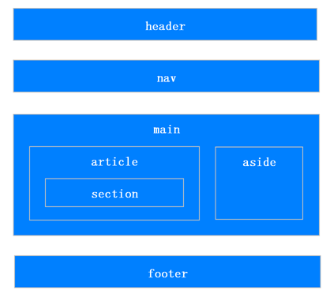

# HTML

**内容来源**

+ 牛客网(https://www.nowcoder.com/issue/tutorial?tutorialId=96&uuid=f5212664ab664984882b00635066ded2)
+ 前端面试小册(https://docs.chenqaq.com/)

## HTML5新特性

+ 新增选择器 document.querySelector、document.querySelectorAll

+ 拖拽释放(Drag and drop) API

+ 媒体播放的 video 和 audio

+ 本地存储 localStorage 和 sessionStorage

+ 离线应用 manifest

+ 桌面通知 Notifications

+ 语意化标签 article、footer、header、nav、section

+ 增强表单控件 calendar、date、time、email、url、search

+ 地理位置 Geolocation

+ 多任务 webworker

+ 全双工通信协议 websocket

+ 历史管理 history

+ 跨域资源共享(CORS) Access-Control-Allow-Origin

+ 页面可见性改变事件 visibilitychange

+ 跨窗口通信 PostMessage

+ Form Data 对象

+ 绘画 canvas

H5移除的元素：

  - 纯表现的元素：basefont、big、center、font、s、strike、tt、u
  - 对可用性产生负面影响的元素：frame、frameset、noframes

## html标签的类型（head， body，!Doctype） 他们的作用是什么

!DOCTYPE 标签：

- 它是指示 web 浏览器关于页面使用哪个 HTML 版本进行编写的指令.
-  Doctype是一种DTD文档定义类型，必须声明在HTML文档的第一行，用来规范文档使用哪种方式解析HTML，三种模式分别是怪异模式，标准模式，近乎模式(IE8的一种近乎于前两者之间的一种模式)；标准模式按照HTML和CSS定义渲染，怪异模式会模拟更旧的浏览器行为 

head：

- 是所有头部元素的容器, 绝大多数头部标签的内容不会显示给读者

body :

- 用于定义文档的主体, 包含了文档的所有内容
- 该标签支持 html 的全局属性和事件属性.

## html5语义化

html5之前，用div来表示页面模块，但div本身没有语义，新增的html5语义化标签，可以清晰的表达文档结构

  

```html
<header>     <!--：页眉通常包括网站标志、主导航、全站链接以及搜索框。-->
<nav>         <!--：标记导航，仅对文档中重要的链接群使用。-->
<main>         <!--：页面主要内容，一个页面只能使用一次。如果是web应用，则包围其主要功能。-->
<article>    <!--：定义外部的内容，其中的内容独立于文档的其余部分。-->
<section>    <!--：定义文档中的节（section、区段）。比如章节、页眉、页脚或文档中的其他部分。-->
<aside>         <!--：定义其所处内容之外的内容。如侧栏、文章的一组链接、广告、友情链接、相关产品列表等。-->
<footer>     <!--：页脚，只有当父级是body时，才是整个页面的页脚。-->
```

**扩展：**

语义化优点：

- 易于用户阅读，样式丢失的时候能让页面呈现清晰的结构。
- 有利于SEO，搜索引擎根据标签来确定上下文和各个关键字的权重。
- 方便屏幕阅读器解析，如盲人阅读器根据语义渲染网页
- 有利于开发和维护，语义化更具可读性，代码更好维护，与CSS3关系更和谐。

## 文件引入方式

### link 和 @import

作用：样式的导入方式

link 的使用

```html
<link href="index.css" rel="stylesheet">
```

@import 的使用

```html
<style type="text/css">
@import url(index.css);
</style>
```

link 和 @import 的区别

1. 引入的内容不同
   link 除了引用样式文件，还可以引用图片（标题上的icon）等资源文件，而 @import 只引用样式文件
2. 加载顺序不同
   link 引用 CSS 时，在页面载入时同时加载；@import 需要页面网页完全载入以后加载
3. 兼容性不同
   link 是 XHTML 标签，无兼容问题；@import 是在 CSS2.1 提出的，低版本的浏览器不支持
4. 对 JS 的支持不同
   link 支持使用 Javascript 控制 DOM 去改变样式；而 @import 不支持

### 为什么link用href获取资源，script和img用src

src用于替换当前元素，href用于在当前文档和引用资源之间确立联系。
src
- src是source的缩写，指向外部资源的位置，指向的内容将会嵌入到文档中当前标签所在位置（比如引入一个img标签，在页面图片就会展示在这个位置）；在请求src资源时会将其指向的资源下载并应用到文档内，例如js脚本，img图片和frame等元素

  ```html
  <script src="js.js"></script> 
  ```

当浏览器解析到该元素时，**会暂停其他资源的下载和处理**，直到将该资源加载、编译、执行完毕，图片和框架等元素也如此，类似于将所指向资源嵌入当前标签内。**这也是为什么将js脚本放在底部而不是头部**

href
- href是Hypertext Reference的缩写，指向网络资源所在位置，建立和当前元素（锚点）或当前文档（链接）之间的链接

- 在文档中添加link标签，浏览器会识别该文档为css文件，就会并行下载资源并且**不会**停止对当前文档的处理。这也是为什么建议使用link方式来加载css，而不是使用@import方式

  ```html
  <link href="common.css" rel="stylesheet"/>
  ```