# js

## 执行上下文和执行栈

**什么是执行上下文**

Javascript 代码都是在执行上下文中运行的
执行上下文： 指当前执行环境中的变量、函数声明、作用域链、this等信息

**执行上下文生命周期**

1）创建阶段
生成变量对象、建立作用域链、确定this的指向
2）执行阶段
变量赋值、函数的引用、执行其他代码


**变量对象**

变量对象是与执行上下文相关的数据作用域，存储了上下文中定义的变量和函数声明
变量对象是一个抽象的概念，在全局执行上下文中，变量对象就是全局对象。 在顶层js代码中，this指向全局对象，全局变量会作为该对象的属性来被查询。在浏览器中，window就是全局对象

**执行栈**

是一种先进后出的数据结构，用来存储代码运行的所有执行上下文
1）当 JS 引擎第一次遇到js脚本时，会创建一个全局的执行上下文并且压入当前执行栈
2）每当JS 引擎遇到一个函数调用，它会为该函数创建一个新的执行上下文并压入栈的顶部
3）当该函数执行结束时，执行上下文从栈中弹出，控制流程到达当前栈中的下一个上下文
4）一旦所有代码执行完毕，JS 引擎从当前栈中移除全局执行上下文

执行栈示例
```js
var a = 1; // 1. 全局上下文环境
function bar (x) {
    console.log('bar')
    var b = 2;
    fn(x + b); // 3. fn上下文环境
}
function fn (c) {
    console.log(c);
}
bar(3); // 2. bar上下文环境
```

执行栈图解


**全局、函数、eval执行上下文**

执行上下文分为全局、函数、Eval执行上下文

1）全局执行上下文（浏览器环境下，为全局的 window 对象）
2）函数执行上下文，每当一个函数被调用时, 都会为该函数创建一个新的上下文
3）Eval 函数执行上下文，如eval("1 + 2")
对于每个执行上下文，都有三个重要属性：变量对象、作用域链(Scope chain)、this

**执行上下文的特点**

1）单线程，只在主线程上运行；
2）同步执行，从上向下按顺序执行；
3）全局上下文只有一个，也就是window对象；
4）函数每调用一次就会产生一个新的执行上下文环境。

## 作用域及作用域链

**概念：** 作用域就是一个独立的地盘，让变量不会外泄、暴露出去。也就是说作用域最大的用处就是隔离变量，不同作用域下同名变量不会有冲突。

**ES6 之前 JavaScript 没有块级作用域,只有全局作用域和函数作用域**。ES6 的到来，为我们提供了 *块级作用域* ,可通过新增命令 let 和 const 来体现。

**作用域类型**

全局作用域、函数作用域、ES6中新增了块级作用域

**函数作用域**

是指声明在函数内部的变量，函数的作用域在函数定义的时候就决定了

**块作用域**

1）块作用域由 { } 包括，if 和 for 语句里面的 { } 也属于块作用域
2）在块级作用域中，可通过let和const声明变量，该变量在指定块的作用域外无法被访问

**作用域链**

当查找变量的时候，首先会先从当前上下文的变量对象（作用域）中查找，如果没有找到，就会从父级的执行上下文的变量对象中查找，如果还没有找到，一直找到全局上下文的变量对象，也就是全局对象。这样由多个执行上下文的变量对象构成的链表就叫做作用域链

**扩展：** 看let const var

## let const var

var ——ES5 变量声明方式

1. 在变量未赋值时，变量undefined（未使用声明变量时也为undefined）
2. 作用域——var的作用域为方法作用域；只要在方法内定义了，整个方法内的定义变量后的代码都可以使用

let——ES6变量声明方式

1. 在变量未声明前直接使用会报错
2. 作用域——let为块作用域——通常let比var 范围要小
3. let禁止重复声明变量，否则会报错；var可以重复声明

const——ES6变量声明方式

1. const为常量声明方式；声明变量时必须初始化，在后面出现的代码中不能再修改该常量的值

2. const实际上保证的，并不是变量的值不得改动，而是变量指向的那个内存地址不得改动

**var与let的经典案例**

1） 用var定义i变量，循环后打印i的值
```js
// 案例1
// i是var声明的，在全局范围内都有效，全局只有一个变量i，输出的是最后一轮的i值，也就是 10

var a = [];
for (var i = 0; i < 10; i++) {
  a[i] = function() {
    console.log(i);
  };
}
a[0]("0");  // 10
```
2） 用let定义i变量，循环后打印i的值
```js
// 案例2
// 用let声明i，for循环体内部是一个单独的块级作用域，相互独立，不会相互覆盖
var a = [];
for (let i = 0; i < 10; i++) {
  a[i] = function() {
    console.log(i);
  };
}
a[0]( "0"); // 0
```

**let实现原理**

借助闭包和函数作用域来实现块级作用域的效果
```js
// 用var实现案例2的效果
var a = [];

var _loop = function _loop(i) {
  a[i] = function() {
    console.log(i);
  };
};

for (var i = 0; i < 10; i++) {
  _loop(i);
}
a[0]( "0"); // 0
```

## js数据类型，区别

基本数据类型：

Number，String，Boolean，null，undefined，symbol，bigint（后两个为ES6新增）

引用数据类型：

object，function（**proto** Function.prototype）

object：普通对象，数组对象，正则对象，日期对象，Math数学函数对象。

两种数据存储方式：

基本数据类型是直接存储在栈中的简单数据段，占据空间小、大小固定，属于被频繁使用的数据。栈是存储基本类型值和执行代码的空间。保存与复制的是值本身，可以用 **typeof** 检测类型

引用数据类型是存储在堆内存中，占据空间大、大小不固定。引用数据类型在栈中存储了指针，该指针指向堆中该实体的起始地址，当解释器寻找引用值时，会检索其在栈中的地址，取得地址后从堆中获得实体。保存与复制是指向对象的一个指针，使用 **instanceof** 检测数据类型，使用 **new()** 方法构造出的对象是引用型

两种数据类型的区别：

1. 堆比栈空间大，栈比堆运行速度快。
2. 堆内存是无序存储，可以根据引用直接获取。
3. 基础数据类型比较稳定，而且相对来说占用的内存小。
4. 引用数据类型大小是动态的，而且是无限的。

## Object.assign()

作用：Object.assign可以实现对象的合并。

语法：Object.assign(target, ...sources)

**解析**：

1. Object.assign 会将 source里面的可枚举属性复制到 target，如果和 target 的已有属性重名，则会覆盖。
2. 后续的 source 会覆盖前面的 source 的同名属性。
3. Object.assign 复制的是属性值，如果属性值是一个引用类型，那么复制的其实是引用地址，就会存在引用共享的问题。
**实现** 
```js
Object.assign = function(target, ...source){
	if (target == null) {
		throw new Error("target is null")
	}
	let obj = Object(target)
	source.forEach(item=>{
		if (item != null){
			for(let key in item){
				if (item.hasOwnProperty(key)) {
					obj[key] = item[key]
				}
			}
		}
	}
	return obj
}
```

## constructor的理解

创建的每个函数都有一个 prototype（原型）对象，这个属性是一个指针，指向一个对象。在默认情况下，所有原型对象都会自动获得一个 constructor（构造函数）属性，这个属性是一个指向 prototype 属性所在函数的指针。当调用构造函数创建一个新实例后，该实例的内部将包含一个指针（继承自构造函数的 prototype），指向构造函数的原型对象。注意当将构造函数的 prototype 设置为等于一个以对象字面量形式创建的新对象时，constructor 属性不再指向该构造函数。

## 数组中常用的方法

数组也是一种数据类型，类比数据类型的学习我们可以从其特性，增删改查，其他方法，支持的运算符七个方面来学习，可以明显提高效率

数组的方法我们除了作用以外，我们还比较关心的就是该数组方法是否改变原数组，下面就按照这个规则来分类：

```
// 改变原数组的方法：
pop()  // 删除数组中的最后一个元素，把数组长度减 1，并且返回它删除的元素的值
push() // 该方法可把它的参数顺序添加到数组的尾部。它直接修改数组，返回修改后数组的长度
reverse() // 将数组元素倒序，改变原数组
unshift() // 可以向数组开头增加一个或多个元素，并返回新的长度
shift() // 数组的第一个元素从其中删除，并返回第一个元素的值，减少数组的长度
sort() // 在原数组上进行排序，不生成副本
splice(start,删除的个数,插入的元素) //可删除从index处开始的零个或多个元素，并且用参数列表中声明的一个或多个值来替换那些被删除的元素

// 不改变原数组：
concat() // 用于连接两个或多个数组，不改变原数组，返回一个新的数组
join() // 将数组中的所有元素都转化为字符串并拼接在一起，默认使用逗号，返回最终生成的字符串
map() // 对数组的每一项运行给定函数，返回每次函数调用的结果组成的数组，不改变原数组
indexof() // 返回指定位置的元素值或字符串，通过搜索值与下标寻找
every() // 如果每一项都为true，则返回true
some() // 某一项返回true，则返回true
forEach() // 对数组的每一项运行给定函数，没有返回值
```

## map和reduce的理解和区别

map 方法的调用者一般是数组，参数是一个 callback 函数，返回值是一个由原数组中每个元素执行 callback 函数得到的返回值组成的新数组

举个栗子：

```js
// 接口数据映射
let arr = res.map(item=>{
    return {
        name:item.name,
        age:item.age,
        sex:item.sex === 1? '男':item.sex === 0?'女':'保密',
        avatar: item.img
    }
})
```

reduce 方法调用者也一般为数组，参数是 callback 和一个可选的initialValue，数组中每个元素执行callback函数，返回一个具体的结果，如果给定initialValue可以作为第一次调用callback的第一个参数，可以控制返回值的格式

举个栗子：

```js
// 求一个字符串中每个字母出现的次数
let str = 'abcabdaac'
str.split('').reduce((res,cur)=>{
    res[cur] ? res[cur]++ : res[cur] = 1
    return res
},{})
// {a: 4, b: 2, c: 2, d: 1}
```

### map和reduce实现的理解

数组方法map模拟实现：

```js
Array.prototype._map = function(fn) {
    let newArr = [];
    let me = this;
    for(let i = 0;i<me.length;i++){
        newArr.push(fn(me[i]));
    }
    return newArr;
}

// 或者

Array.prototype.selfMap = function(fn, content) {
  // map中的第二个参数作为fn函数的this
  // Array.prototype.slice.call将类数组转化为数组，同Array.from, this为调用的数组（arr）
  let arr = Array.prototype.slice.call(this);
  let mappedArr = Array(); // 创建一个空数组
  for (let i = 0; i < arr.length; i++) {
    // 判断稀疏数组，跳过稀疏数组中的空值
    // 稀疏数组：数组中元素的个数小于数组的长度，比如Array(2) 长度为2的稀疏数组
    if (!arr.hasOwnProperty(i)) continue;
    mappedArr[i] = fn.call(content, arr[i]);
  }
  return mappedArr;
};
let arr = [1, 2, 3];
console.log(arr.selfMap(item => item * 2)); // [2, 4, 6]
```

数组方法reduce模拟实现：方法类似核心是数组的遍历，因为reduce有第二个可选参数initialValue做起始值，所以要判断是否有可选参数作为遍历的起始值，并将得到的参数传入回调函数中执行

```js
Array.prototype._reduce = function(callback, initialValue) {
    let arr = this;
    let base = typeof initialValue == 'undefined' ? arr[0] : initialValue;
    // 提供了初始值，从index=0开始，没有提供，从index=1开始
    let startPoint = typeof initialValue === 'undefined' ? 1 : 0;
    arr.slice(startPoint).forEach((val, index) => {
        base = callback(base, val, index + startPoint, arr)
    })
    return base
}

// 或者

// 如果提供了initialValue时，则作为pre的初始值，index从0开始；
// 如果没有提供initialValue，找到数组中的第一个存在的值作为pre，下一个元素的下标作为index
Array.prototype.myReduce = function(fn, initialValue) {
  let pre, index;
  let arr = this.slice();
  if (initialValue === undefined) {
    // 没有设置初始值
    for (let i = 0; i < arr.length; i++) {
      // 找到数组中第一个存在的元素，跳过稀疏数组中的空值
      if (!arr.hasOwnProperty(i)) continue;
      pre = arr[i]; // pre 为数组中第一个存在的元素
      index = i + 1; // index 下一个元素
      break; // 易错点：找到后跳出循环
    }
  } else {
    index = 0;
    pre = initialValue;
  }
  for (let i = index; i < arr.length; i++) {
    // 跳过稀疏数组中的空值
    if (!arr.hasOwnProperty(i)) continue;
    // 注意：fn函数接收四个参数，pre之前累计值、cur 当前值、 当前下标、 arr 原数组
    pre = fn.call(null, pre, arr[i], i, this);
  }
  return pre;
};
console.log([, , , 1, 2, 3, 4].myReduce((pre, cur) => pre + cur)); // 10
```

## map 和 forEach 的区别

 相同点：

1. 都是循环遍历数组中的每一项
2. 每次执行匿名函数都支持三个参数，参数分别为item（当前每一项），index（索引值），arr（原数组）
3. 匿名函数中的this都是指向window
4. 只能遍历数组

不同点：

1. map()会分配内存空间存储新数组并返回，forEach()不会返回数据。
2. forEach()允许callback更改原始数组的元素。map()返回新的数组。

## for of 可以遍历哪些对象

for..of..: 它是es6新增的一个遍历方法，但**只限于迭代器(iterator)**, 所以普通的对象用for..of遍历是会报错的。

可迭代的对象：包括Array, Map, Set, String, TypedArray, arguments对象等等

## indexof

语法：str.indexOf(searchValue [, fromIndex])

参数：searchValue：要被查找的字符串值。

如果没有确切地提供字符串，[searchValue 会被强制设置为"undefined"]， 然后在当前字符串中查找这个值。

举个例子：'undefined'.indexOf()将会返回0，因为undefined在位置0处被找到，但是'undefine'.indexOf()将会返回 -1 ，因为字符串'undefined'未被找到

fromIndex：可选

数字表示开始查找的位置。可以是任意整数，默认值为0。

如果fromIndex的值小于0，或者大于str.length，那么查找分别从0和str.length开始。（译者 注：fromIndex的值小于0，等同于为空情况；fromIndex的值大于或等于str.length，那么结果会直接返回-1。）

举个例子，'hello world'.indexOf('o', -5)返回4，因为它是从位置0处开始查找，然后o在位置4处被找到。另一方面，'hello world'.indexOf('o', 11)（或fromIndex填入任何大于11的值） 将会返回-1，因为开始查找的位置11处，已经是这个字符串的结尾了。

返回值：

查找的字符串searchValue的 **第一次** 出现的索引，如果没有找到，则返回-1。

若被查找的字符串searchValue是一个空字符串，则返回fromIndex。如果fromIndex值为空，或者fromIndex值小于被查找的字符串的长度，返回值和以下的fromIndex值一样。

如果fromIndex值大于等于字符串的长度，将会直接返回字符串的长度（str.length）

特点：

1. 严格区分大小写

2. 在使用indexOf检索数组时，用 === 去匹配，意味着会检查数据类型

## iframe的优缺点

优点：

1. iframe能够原封不动的把嵌入的网页展现出来。
2. 如果有多个网页引用iframe，那么你只需要修改iframe的内容，就可以实现调用的每一个页面内容的更改，方便快捷。
3. 网页如果为了统一风格，头部和版本都是一样的，就可以写成一个页面，用iframe来嵌套，可以增加代码的可重用。
4. 如果遇到加载缓慢的第三方内容如图标和广告，这些问题可以由iframe来解决。

缺点：

1. iframe会阻塞主页面的onload事件；
2. iframe和主页面共享连接池，而浏览器对相同域的连接有限制，所以会影响页面的并行加载。会产生很多页面，不容易管理。
3. iframe框架结构有时会让人感到迷惑，如果框架个数多的话，可能会出现上下、左右滚动条，会分散访问者的注意力，用户体验度差。
4. 代码复杂，无法被一些搜索引擎索引到，这一点很关键，现在的搜索引擎爬虫还不能很好的处理iframe中的内容，所以使用iframe会不利于搜索引擎优化（SEO）。
5. 很多的移动设备无法完全显示框架，设备兼容性差。
6. iframe框架页面会增加服务器的http请求，对于大型网站是不可取的。

## 变量提升

 JavaScript是单线程语言，所以执行肯定是按顺序执行。但是并不是逐行的分析和执行，而是一段一段地分析执行，会先进行编译阶段然后才是执行阶段。在编译阶段，代码真正执行前的几毫秒，会检测到所有的变量和函数声明，所有这些函数和变量声明都被添加到名为Lexical Environment的JavaScript数据结构内的内存中。所以这些变量和函数能在它们真正被声明之前使用。

JavaScript引擎会先进行预解析，获取所有变量的声明赋值undefined，然后逐行执行，这导致所有被声明的变量，都会被提升到代码的头部（被提升的只有变量，值不会被提升），也就是变量提升（hoisting）

```js
console.log(a) // undefined

var a = 1
function b(){
    console.log(a)
}
b() // 1
```

预解析阶段会先获得变量a赋值undefined，并将`var a = undefined放在最顶端`，此时a = 1还在原来的位置，实际就是：

```js
var a = undefined
console.log(a) // undefined

a = 1
function b(){
    console.log(a)
}

b() // 1
```

然后会是执行阶段，逐行执行造成了打印出a是undefined


## js中arguments相关的问题

**arguments**

在js中，我们在调用有参数的函数时，当往这个调用的有参函数传参时，js会把所传的参数全部存到一个叫arguments的对象里面。它是一个 **类数组数据**

**由来**

Javascrip中每个函数都会有一个Arguments对象实例arguments，引用着函数的实参。它是寄生在js函数当中的，不能显式创建，arguments对象只有函数开始时才可用

**作用**

有了arguments这个对象之后，我们可以不用给函数预先设定形参了，可以动态地通过arguments为函数加入参数

## instanceof 原理

instanceof可以判断一个对象的原型链上是否包含该构造函数的原型，经常用来判断对象是否为该构造函数的实例

```js
let person = function(){}
let no = new person()
no instanceof person//true
```
**特殊示例**
```js
console.log(Object instanceof Object); //true
console.log(Function instanceof Function); //true
console.log(Function instanceof Object); //true
console.log(function() {} instanceof Function); //true
```

instanceof 原理

```js
function new_instance_of(leftValue, rightValue) {
    let rightProto = rightValue.prototype; // 取右表达式的 prototype 值
    let leftValue = leftValue.__proto__; // 取左表达式的__proto__值
    while (true) {
        if (leftValue === null) {
            return false;
        }
        if (leftValue === rightProto) {
            return true;
        }
        leftValue = leftValue.__proto__
    }
}
```

其实 instanceof 主要的实现原理就是只要右边变量的 prototype 在左边变量的原型链上即可。因此，instanceof 在查找的过程中会遍历左边变量的原型链，直到找到右边变量的 prototype，如果查找失败，则会返回 false，告诉我们左边变量并非是右边变量的实例。

同时还要了解js的原型继承原理 

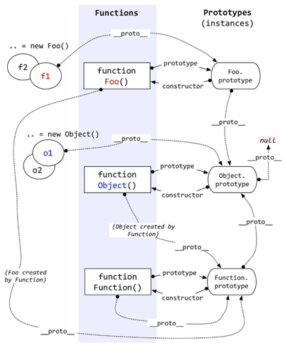

我们知道每个 JavaScript 对象均有一个隐式的 proto 原型属性，而显式的原型属性是 prototype，只有 Object.prototype.proto 属性在未修改的情况下为 null 值

手动实现

```js
function instance_of(L, R) {//L 表示左表达式，R 表示右表达式
    var O = R.prototype;
    L = L.__proto__;
    while (true) {
        if (L === null)
            return false;
        if (O === L) // 这里重点：当 O 严格等于 L 时，返回true
            return true;
        L = L.__proto__;
    }
}
// 开始测试
var a = []
var b = {}

function Foo(){}
var c = new Foo()
function child(){}
function father(){}
child.prototype = new father()
var d = new child()

console.log(instance_of(a, Array)) // true
console.log(instance_of(b, Object)) // true
console.log(instance_of(b, Array)) // false
console.log(instance_of(a, Object)) // true
console.log(instance_of(c, Foo)) // true
console.log(instance_of(d, child)) // true
console.log(instance_of(d, father)) // true
```
**instanceof与typeof的区别**
1）typeof一般被用于来判断一个变量的类型
typeof可以用来判断number、undefined、symbol、string、function、boolean、object?这七种数据类型，特殊情况：typeof null === 'object'
2）instanceof判断一个对象的原型链上是否包含该构造函数的原型

## 数组去重

### 利用ES6 Set去重（ES6中最常用）

```js
function unique (arr) {
  return Array.from(new Set(arr))
}
var arr = [1,1,'true','true',true,true,15,15,false,false, undefined,undefined, null,null, NaN, NaN,'NaN', 0, 0, 'a', 'a',{},{}];
console.log(unique(arr))
 //[1, "true", true, 15, false, undefined, null, NaN, "NaN", 0, "a", {}, {}]
```

不考虑兼容性，这种去重的方法代码最少。这种方法还无法去掉“{}”空对象，后面的高阶方法会添加去掉重复“{}”的方法。

### 利用for嵌套for，然后splice去重（ES5中最常用）

```js
function unique(arr){
    for(var i=0; i<arr.length; i++){
        for(var j=i+1; j<arr.length; j++){
            if(arr[i]==arr[j]){         //第一个等同于第二个，splice方法删除第二个
                arr.splice(j,1);
                j--;
            }
        }
    }
    return arr;
}
var arr = [1,1,'true','true',true,true,15,15,false,false, undefined,undefined, null,null, NaN, NaN,'NaN', 0, 0, 'a', 'a',{},{}];
console.log(unique(arr)) //[1, "true", 15, false, undefined, NaN, NaN, "NaN", "a", {}, {}]     //NaN和{}没有去重，两个null直接消失了
```

双层循环，外层循环元素，内层循环时比较值。值相同时，则删去这个值。

### 利用indexOf去重

```js
function unique(arr) {
    if (!Array.isArray(arr)) {
        console.log('type error!')
        return
    }
    var array = [];
    for (var i = 0; i < arr.length; i++) {
        if (array.indexOf(arr[i]) === -1) {
            array.push(arr[i])
        }
    }
    return array;
}
var arr = [1,1,'true','true',true,true,15,15,false,false, undefined,undefined, null,null, NaN, NaN,'NaN', 0, 0, 'a', 'a',{},{}];
console.log(unique(arr))
   // [1, "true", true, 15, false, undefined, null, NaN, NaN, "NaN", 0, "a", {}, {}]  //NaN、{}没有去重
```

新建一个空的结果数组，for 循环原数组，判断结果数组是否存在当前元素，如果有相同的值则跳过，不相同则push进数组。

### 利用sort()

```js
function unique(arr) {
    if (!Array.isArray(arr)) {
        console.log('type error!')
        return;
    }
    arr = arr.sort()
    var arrry= [arr[0]];
    for (var i = 1; i < arr.length; i++) {
        if (arr[i] !== arr[i-1]) {
            arrry.push(arr[i]);
        }
    }
    return arrry;
}
var arr = [1,1,'true','true',true,true,15,15,false,false, undefined,undefined, null,null, NaN, NaN,'NaN', 0, 0, 'a', 'a',{},{}];
console.log(unique(arr))
// [0, 1, 15, "NaN", NaN, NaN, {}, {}, "a", false, null, true, "true", undefined]      //NaN、{}没有去重
```

利用sort()排序方法，然后根据排序后的结果进行遍历及相邻元素比对。

### 利用对象的属性不能相同的特点进行去重（这种数组去重的方法有问题，不建议用，有待改进）

```js
function unique(arr) {
    if (!Array.isArray(arr)) {
        console.log('type error!')
        return
    }
    var arrry= [];
    var obj = {};
    for (var i = 0; i < arr.length; i++) {
        if (!obj[arr[i]]) {
            arrry.push(arr[i])
            obj[arr[i]] = 1
        } else {
            obj[arr[i]]++
        }
    }
    return arrry;
}
var arr = [1,1,'true','true',true,true,15,15,false,false, undefined,undefined, null,null, NaN, NaN,'NaN', 0, 0, 'a', 'a',{},{}];
console.log(unique(arr))
//[1, "true", 15, false, undefined, null, NaN, 0, "a", {}]    //两个true直接去掉了，NaN和{}去重
```

### 利用includes

```js
function unique(arr) {
    if (!Array.isArray(arr)) {
        console.log('type error!')
        return
    }
    var array =[];
    for(var i = 0; i < arr.length; i++) {
        if(!array.includes( arr[i])) {//includes 检测数组是否有某个值
            array.push(arr[i]);
        }
    }
    return array
}
var arr = [1,1,'true','true',true,true,15,15,false,false, undefined,undefined, null,null, NaN, NaN,'NaN', 0, 0, 'a', 'a',{},{}];
    console.log(unique(arr))
    //[1, "true", true, 15, false, undefined, null, NaN, "NaN", 0, "a", {}, {}]     //{}没有去重
```

### 利用hasOwnProperty

```js
function unique(arr) {
    var obj = {};
    return arr.filter(function(item, index, arr){
        return obj.hasOwnProperty(typeof item + item) ? false : (obj[typeof item + item] = true)
    })
}
var arr = [1,1,'true','true',true,true,15,15,false,false, undefined,undefined, null,null, NaN, NaN,'NaN', 0, 0, 'a', 'a',{},{}];
console.log(unique(arr))
//[1, "true", true, 15, false, undefined, null, NaN, "NaN", 0, "a", {…}]   //所有的都去重了
```

利用hasOwnProperty 判断是否存在对象属性

### 利用filter

```js
function unique(arr) {
  return arr.filter(function(item, index, arr) {
    //当前元素，在原始数组中的第一个索引==当前索引值，否则返回当前元素
    return arr.indexOf(item, 0) === index;
  });
}
var arr = [1,1,'true','true',true,true,15,15,false,false, undefined,undefined, null,null, NaN, NaN,'NaN', 0, 0, 'a', 'a',{},{}];
console.log(unique(arr))
//[1, "true", true, 15, false, undefined, null, "NaN", 0, "a", {}, {}]
// NaN没了，｛｝没去重
```

### 利用递归去重

```js
function unique(arr) {
    var array= arr;
    var len = array.length;

    array.sort(function(a,b){   //排序后更加方便去重
        return a - b;
    })

    function loop(index){
        if(index >= 1){
            if(array[index] === array[index-1]){
                array.splice(index,1);
            }
            loop(index - 1);    //递归loop，然后数组去重
        }
    }
    loop(len-1);
    return array;
}
 var arr = [1,1,'true','true',true,true,15,15,false,false, undefined,undefined, null,null, NaN, NaN,'NaN', 0, 0, 'a', 'a',{},{}];
console.log(unique(arr))
//[1, "a", "true", true, 15, false, 1, {}, null, NaN, NaN, "NaN", 0, "a", {}, undefined]
// NaN {} 没去重
```

**10. 利用Map数据结构去重**

```js
function arrayNonRepeatfy(arr) {
  let map = new Map();
  let array = new Array();  // 数组用于返回结果
  for (let i = 0; i < arr.length; i++) {
    if(map.has(arr[i])) {  // 如果有该key值
      map.set(arr[i], true);
    } else {
      map.set(arr[i], false);   // 如果没有该key值
      array.push(arr[i]);
    }
  }
  return array ;
}
var arr = [1,1,'true','true',true,true,15,15,false,false, undefined,undefined, null,null, NaN, NaN,'NaN', 0, 0, 'a', 'a',{},{}];
console.log(arrayNonRepeatfy(arr))
// [1, 'true',true, 15,false, undefined,null, NaN,'NaN', 0,'a', {},{}]
// {} 没去重
```

创建一个空Map数据结构，遍历需要去重的数组，把数组的每一个元素作为key存到Map中。由于Map中不会出现相同的key值，所以最终得到的就是去重后的结果。

### 利用reduce+includes

```js
function unique(arr){
    return arr.reduce((prev,cur) => prev.includes(cur) ? prev : [...prev,cur],[]);
}
var arr = [1,1,'true','true',true,true,15,15,false,false, undefined,undefined, null,null, NaN, NaN,'NaN', 0, 0, 'a', 'a',{},{}];
console.log(unique(arr));
// [1, "true", true, 15, false, undefined, null, NaN, "NaN", 0, "a", {}, {}]
// {}没去重
```

### [...new Set(arr)]

```js
[...new Set(arr)] 
//代码就是这么少----（其实，严格来说并不算是一种，相对于第一种方法来说只是简化了代码）
```

## null 和 undefined 的区别，如何让一个属性变为null

undefined 表示一个变量自然的、最原始的状态值，而 null 则表示一个变量被人为的设置为空对象，而不是原始状态。所以，在实际使用过程中，为了保证变量所代表的语义，不要对一个变量显式的赋值 undefined，当需要释放一个对象时，直接赋值为 null 即可。

**解析：**

**undefined** 的字面意思就是：未定义的值 。这个值的语义是，希望 **表示一个变量最原始的状态，而非人为操作的结果**。 这种原始状态会在以下 4 种场景中出现：

1. 声明了一个变量，但没有赋值
2. 访问对象上不存在的属性
3. 函数定义了形参，但没有传递实参
4. 使用 void 对表达式求值

因此，undefined 一般都来自于某个表达式最原始的状态值，不是人为操作的结果。当然，你也可以手动给一个变量赋值 undefined，但这样做没有意义，因为一个变量不赋值就是 undefined 。

**null** 的字面意思是：空值 。这个值的语义是，希望 **表示一个对象被人为的重置为空对象，而非一个变量最原始的状态**。在内存里的表示就是，栈中的变量没有指向堆中的内存对象

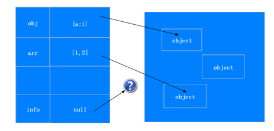

null 有属于自己的类型 Null，而不属于Object类型，typeof 之所以会判定为 Object 类型，是因为JavaScript 数据类型在底层都是以二进制的形式表示的，**二进制的前三位为 0 会被 typeof 判断为对象类型**，而 null 的二进制位恰好都是 0 ，因此，null 被误判断为 Object 类型。

## 数组和伪数组的区别

**定义**

- 数组是一个特殊对象,与常规对象的区别：
  - 当由新元素添加到列表中时，自动更新length属性
  - 设置length属性，可以截断数组
  - 从Array.protoype中继承了方法
  - 属性为'Array'
- 类数组是一个拥有length属性，并且他属性为非负整数的普通对象，类数组不能直接调用数组方法。

**区别**
本质：类数组是简单对象，它的原型关系与数组不同。

```js
// 原型关系和原始值转换
let arrayLike = {
    length: 10,
};
console.log(arrayLike instanceof Array); // false
console.log(arrayLike.__proto__.constructor === Array); // false
console.log(arrayLike.toString()); // [object Object]
console.log(arrayLike.valueOf()); // {length: 10}

let array = [];
console.log(array instanceof Array); // true
console.log(array.__proto__.constructor === Array); // true
console.log(array.toString()); // ''
console.log(array.valueOf()); // []
```

**类数组转换为数组**

- 转换方法
  - 使用Array.from()
  - 使用Array.prototype.slice.call()
  - 使用Array.prototype.forEach()进行属性遍历并组成新的数组
- 转换须知
  1. 转换后的数组长度由length属性决定。索引不连续时转换结果是连续的，会自动补位。

```js
// 转换后的数组长度由length属性决定，索引不连续时转换结果是连续的，会自动补位。
let al1 = {
    length: 4,
    0: 0,
    1: 1,
    3: 3,
    4: 4,
    5: 5,
};
console.log(Array.from(al1)) // [0, 1, undefined, 3]
```

  2. 仅考虑 0或正整数 的索引

```js
// 代码示例
let al2 = {
    length: 4,
    '-1': -1,
    '0': 0,
    a: 'a',
    1: 1
};
console.log(Array.from(al2)); // [0, 1, undefined, undefined]
```

3. 使用slice转换产生稀疏数组

```js
// 代码示例
let al2 = {
    length: 4,
    '-1': -1,
    '0': 0,
    a: 'a',
    1: 1
};
console.log(Array.prototype.slice.call(al2)); //[0, 1, empty × 2]
```

**使用数组方法操作类数组注意地方**

```js
let arrayLike2 = {
  2: 3,
  3: 4,
  length: 2,
  push: Array.prototype.push
}

// push 操作的是索引值为 length 的位置，即原length长度按照转换须知转换
arrayLike2.push(1);
console.log(Array.from(arrayLike2)); // [undefined, undefined, 1]
console.log(arrayLike2); // {2: 1, 3: 4, length: 3, push: ƒ}
arrayLike2.push(2);
console.log(Array.from(arrayLike2)); // [ undefined, undefined, 1, 2 ]
console.log(arrayLike2); // {2: 1, 3: 2, length: 4, push: ƒ}
```

## 手写发布订阅

```js
// 发布订阅中心, on-订阅, off取消订阅, emit发布, 内部需要一个单独事件中心caches进行存储;
interface CacheProps {
  [key: string]: Array<((data?: unknown) => void)>;
}

class Observer {
  private caches: CacheProps = {}; // 事件中心
  on (eventName: string, fn: (data?: unknown) => void){ // eventName事件名-独一无二, fn订阅后执行的自定义行为
    this.caches[eventName] = this.caches[eventName] || [];
    this.caches[eventName].push(fn);
  }

  emit (eventName: string, data?: unknown) { // 发布 => 将订阅的事件进行统一执行
    if (this.caches[eventName]) {
      this.caches[eventName].forEach((fn: (data?: unknown) => void) => fn(data));
    }
  }

  off (eventName: string, fn?: (data?: unknown) => void) { // 取消订阅 => 若fn不传, 直接取消该事件所有订阅信息
    if (this.caches[eventName]) {
      const newCaches = fn ? this.caches[eventName].filter(e => e !== fn) : [];
      this.caches[eventName] = newCaches;
    }
  }

}

// 实例化。先订阅，才能发布，如果先发布，后订阅，则没有内容输出
// 创建Observer类的实例
const observer = new Observer();

// 定义一个事件处理函数
function handleEvent(data?: unknown) {
	console.log("事件处理函数被调用，接收到的数据：", data);
}

// 使用on方法订阅事件
observer.on("event1", handleEvent);
// observer.on("event1", handleEvent); // 可以这样类似写多个函数
observer.on("event2", (data) => {
	console.log("匿名函数处理event2，接收到的数据：", data);
});

// 使用emit方法发布事件
observer.emit("event1", "这是event1的数据");
observer.emit("event2", { key: "value" });

// 使用off方法取消订阅
observer.off("event1", handleEvent); // 只取消handleEvent函数对event1的订阅
observer.off("event2"); // 取消event2的所有订阅

// 再次发布event1和event2，观察输出
observer.emit("event1", "再次发布event1");
observer.emit("event2", "再次发布event2");

// 输出结果
事件处理函数被调用，接收到的数据： 这是event1的数据
匿名函数处理event2，接收到的数据： { key: 'value' }

```

## 手写数组转树

```js
// 例如将 input 转成output的形式
let input = [
    {
        id: 1, val: '学校', parentId: null
    }, {
        id: 2, val: '班级1', parentId: 1
    }, {
        id: 3, val: '班级2', parentId: 1
    }, {
        id: 4, val: '学生1', parentId: 2
    }, {
        id: 5, val: '学生2', parentId: 2
    }, {
        id: 6, val: '学生3', parentId: 3
    },
]

let output = {
    id: 1,
    val: '学校',
    children: [{
        id: 2,
        val: '班级1',
        children: [
            {
                id: 4,
                val: '学生1',
                children: []
            },
            {
                id: 5,
                val: '学生2',
                children: []
            }
        ]
    }, {
        id: 3,
        val: '班级2',
        children: [{
            id: 6,
            val: '学生3',
            children: []
        }]
    }]
}
```

**答案**：

```js
// 代码实现
function arrayToTree(array) {
    let root = array[0]
    array.shift()
    let tree = {
        id: root.id,
        val: root.val,
        children: array.length > 0 ? toTree(root.id, array) : []
    }
    return tree;
}

function toTree(parenId, array) {
    let children = []
    let len = array.length
    for (let i = 0; i < len; i++) {
        let node = array[i]
        if (node.parentId === parenId) {
            children.push({
                id: node.id,
                val: node.val,
                children: toTree(node.id, array)
            })
        }
    }
    return children
}

console.log(arrayToTree(input))
```

## 介绍下 Set、Map、WeakSet 和 WeakMap的区别

**Set**

1. 成员不能重复；
2. 只有键值，没有键名，有点类似数组；
3. 可以遍历，方法有add、delete、has

**WeakSet**

1. 成员都是对象（引用）；
2. 成员都是弱引用，随时可以消失（不计入垃圾回收机制）。可以用来保存 DOM 节点，不容易造成内存泄露；
3. 不能遍历，方法有add、delete、has；

**Map**

1. 本质上是键值对的集合，类似集合；
2. 可以遍历，方法很多，可以跟各种数据格式转换；

**WeakMap**

1. 只接收对象为键名（null 除外），不接受其他类型的值作为键名；
2. 键名指向的对象，不计入垃圾回收机制；
3. 不能遍历，方法同get、set、has、delete；

## js中内存泄漏有哪几种

1. 意外的全局变量；
2. 闭包；
3. 未被清空的定时器；
4. 未被销毁的事件监听；
5. DOM 引用；

## 笔试题

### 异步(事件循环)

```js
// 今日头条面试题
async function async1() {
  console.log('async1 start')
  await async2()
  console.log('async1 end')
}

async function async2() {
  console.log('async2')
}

console.log('script start')

setTimeout(function () {
  console.log('settimeout')
})

async1()

new Promise(function (resolve) {
  console.log('promise1')
  resolve()
}).then(function () {
  console.log('promise2')
})

console.log('script end')
```

题目的本质，就是考察setTimeout、promise、async await的实现及执行顺序，以及 JS 的事件循环的相关问题。

答案：

```js
script start
async1 start
async2
promise1
script end
async1 end
promise2
settimeout
```

### js执行顺序，涉及settimeout、console、process.nextTick、promise.then

```js
console.time('start');

setTimeout(function() {
  console.log(2);
}, 10);

setImmediate(function() {
  console.log(1);
});

new Promise(function(resolve) {
  console.log(3);
  resolve();
  console.log(4);
}).then(function() {
  console.log(5);
  console.timeEnd('start')
});

console.log(6);

process.nextTick(function() {
  console.log(7);
});

console.log(8);
```

**参考答案：**

综合的执行顺序就是：3——>4——>6——>8——>7——>5——>start: 7.009ms——>1——>2

**解析：**

本题目，考察的就是 node 事件循环 Event Loop 我们可以简单理解Event Loop如下：

1. 所有任务都在主线程上执行，形成一个执行栈(Execution Context Stack)
2. 在主线程之外还存在一个任务队列(Task Queen)，系统把异步任务放到任务队列中，然后主线程继续执行后续的任务
3. 一旦执行栈中所有的任务执行完毕，系统就会读取任务队列。如果这时异步任务已结束等待状态，就会从任务队列进入执行栈，恢复执行
4. 主线程不断重复上面的第三步

在上述的例子中，我们明白首先执行主线程中的同步任务，因此依次输出3、4、6、8。当主线程任务执行完毕后，再从Event Loop中读取任务。

Event Loop读取任务的先后顺序，取决于任务队列（Job queue）中对于不同任务读取规则的限定。

在Job queue中的队列分为两种类型：

宏任务 Macrotask宏任务是指Event Loop在**每个阶段**执行的任务

微任务 Microtask微任务是指Event Loop在**每个阶段之间**执行的任务

我们举例来看执行顺序的规定，我们假设

宏任务队列包含任务: A1, A2 , A3

微任务队列包含任务: B1, B2 , B3

执行顺序为，首先执行宏任务队列开头的任务，也就是 A1 任务，执行完毕后，在执行微任务队列里的所有任务，也就是依次执行B1, B2 , B3，执行完后清空微任务队中的任务，接着执行宏任务中的第二个任务A2，依次循环。

了解完了宏任务 Macrotask和微任务 Microtask两种队列的执行顺序之后，我们接着来看，真实场景下这两种类型的队列里真正包含的任务（我们以node V8引擎为例），在node V8中，这两种类型的真实任务顺序如下所示：

宏任务 Macrotask队列真实包含任务：

```
script(主程序代码),setTimeout, setInterval, setImmediate, I/O, UI rendering
```

微任务 Microtask队列真实包含任务：

```
process.nextTick, Promises, Object.observe, MutationObserver
```

由此我们得到的执行顺序应该为：

```
script(主程序代码)—>process.nextTick—>Promises...——>setTimeout——>setInterval——>setImmediate——> I/O——>UI rendering
```

> 在ES6中宏任务 Macrotask队列又称为ScriptJobs，而微任务 Microtask又称PromiseJobs

我们的题目相对复杂，但是要注意，我们在定义promise的时候，promise构造部分是同步执行的

接下来我们分析我们的题目，首先分析Job queue的执行顺序：

```
script(主程序代码)——>process.nextTick——>promise——>setTimeout——>setImmediate
```

- 主体部分： 定义promise的构造部分是同步的，因此先输出3、4 ，主体部分再输出6、8（同步情况下，就是严格按照定义的先后顺序）
- process.nextTick: 输出7
- promise： 这里的promise部分，严格的说其实是promise.then部分，输出的是5、以及 timeEnd('start')
- setImmediate：输出1，依据上面优先级，应该先setTimeout，但是注意，setTimeout 设置 10ms 延时
- setTimeout ： 输出2

### 传入[ 1, [[2], 3 ,4 ],5]，返回[1,2,3,4,5] 数组扁平化

#### 递归

我们最一开始能想到的莫过于循环数组元素，如果还是一个数组，就递归调用该方法：

```js
// 方法 1
var arr = [1, [2, [3, 4]]];

function flatten(arr) {
    var result = [];
    for (var i = 0, len = arr.length; i < len; i++) {
        if (Array.isArray(arr[i])) {
            result = result.concat(flatten(arr[i]))
        }
        else {
            result.push(arr[i])
        }
    }
    return result;
}
console.log(flatten(arr))
```

#### toString

如果数组的元素都是数字，那么我们可以考虑使用 toString 方法，因为：

```js
[1, [2, [3, 4]]].toString() // "1,2,3,4"
```

调用 toString 方法，返回了一个逗号分隔的扁平的字符串，这时候我们再 split，然后转成数字不就可以实现扁平化了吗？

```js
// 方法2
var arr = [1, [2, [3, 4]]];

function flatten(arr) {
    return arr.toString().split(',').map(function(item){
        // + 将字符串转为数字
        return +item
    })
}

console.log(flatten(arr))
```

然而这种方法使用的场景却非常有限，如果数组是 [1, '1', 2, '2'] 的话，这种方法就会产生错误的结果。

#### reduce

既然是对数组进行处理，最终返回一个值，我们就可以考虑使用 reduce 来简化代码：

```js
// 方法3
var arr = [1, [2, [3, 4]]];

function flatten(arr) {
    return arr.reduce(function(prev, next){
        return prev.concat(Array.isArray(next) ? flatten(next) : next)
    }, [])
}
console.log(flatten(arr))
```

#### ...扩展运算符

ES6 增加了扩展运算符，用于取出参数对象的所有可遍历属性，拷贝到当前对象之中：

```js
var arr = [1, [2, [3, 4]]];
console.log([].concat(...arr)); // [1, 2, [3, 4]]
```

我们用这种方法只可以扁平一层，但是顺着这个方法一直思考，我们可以写出这样的方法：

```js
// 方法4
var arr = [1, [2, [3, 4]]];

function flatten(arr) {

    while (arr.some(item => Array.isArray(item))) {
        arr = [].concat(...arr);
    }

    return arr;
}

console.log(flatten(arr))
```

#### underscore

那么如何写一个抽象的扁平函数，来方便我们的开发呢，所以又到了我们抄袭 underscore 的时候了~

在这里直接给出源码和注释，但是要注意，这里的 flatten 函数并不是最终的 _.flatten，为了方便多个 API 进行调用，这里对扁平进行了更多的配置。

```js
/**
 * 数组扁平化
 * @param  {Array} input   要处理的数组
 * @param  {boolean} shallow 是否只扁平一层
 * @param  {boolean} strict  是否严格处理元素，下面有解释
 * @param  {Array} output  这是为了方便递归而传递的参数
 * 源码地址：https://github.com/jashkenas/underscore/blob/master/underscore.js#L528
 */
function flatten(input, shallow, strict, output) {

    // 递归使用的时候会用到output
    output = output || [];
    var idx = output.length;

    for (var i = 0, len = input.length; i < len; i++) {

        var value = input[i];
        // 如果是数组，就进行处理
        if (Array.isArray(value)) {
            // 如果是只扁平一层，遍历该数组，依此填入 output
            if (shallow) {
                var j = 0, length = value.length;
                while (j < length) output[idx++] = value[j++];
            }
            // 如果是全部扁平就递归，传入已经处理的 output，递归中接着处理 output
            else {
                flatten(value, shallow, strict, output);
                idx = output.length;
            }
        }
        // 不是数组，根据 strict 的值判断是跳过不处理还是放入 output
        else if (!strict){
            output[idx++] = value;
        }
    }

    return output;

}
```

解释下 strict，在代码里我们可以看出，当遍历数组元素时，如果元素不是数组，就会对 strict 取反的结果进行判断，如果设置 strict 为 true，就会跳过不进行任何处理，这意味着可以过滤非数组的元素，举个例子：

```js
var arr = [1, 2, [3, 4]];
console.log(flatten(arr, true, true)); // [3, 4]
```

那么设置 strict 到底有什么用呢？不急，我们先看下 shallow 和 strct 各种值对应的结果：

- shallow true + strict false ：正常扁平一层
- shallow false + strict false ：正常扁平所有层
- shallow true + strict true ：去掉非数组元素
- shallow false + strict true ： 返回一个[]

我们看看 underscore 中哪些方法调用了 flatten 这个基本函数：

#### _.flatten

首先就是 _.flatten：

```js
_.flatten = function(array, shallow) {
    return flatten(array, shallow, false);
};
```

在正常的扁平中，我们并不需要去掉非数组元素。

#### flat

手写数组扁平化
```js
// deep初始值为1
Array.prototype.myFlat = function(deep = 1) {
  let arr = this;
  // deep为0则返回，递归结束
  if (deep == 0) return arr;
  // 使用reduce作为累加器
  return arr.reduce((pre, cur) => {
    // cur为数组，继续递归，deep-1
    if (Array.isArray(cur)) {
      return [...pre, ...cur.myFlat(deep - 1)];
    } else {
      return [...pre, cur];
    }
  }, []);
};
console.log([1, 2, 3, [4, [5, [6]]]].myFlat(2)); // [1, 2, 3, 4, 5, [6]]

```

### 字符串中的单词逆序输出

方法一：reverse

```js
function strReverse(str) {
     return str.split("").reverse().join("")
}
```

方法二：for循环

```js
function strReverse(str) {
    var i=str.length;
    var nstr = "";
    i=i-1;
    for (var x = i; x >=0; x--) {
        nstr+=str.charAt(x)
    }
    return nstr
}
```

方法三：while循环

```js
function strReverse(str) {
    if(str.length == 0)return null;
    var i = str.length;
    var dstr = "";
    while(--i >= 0)
    {
        dstr += str.charAt(i);
    }
    return dstr;
}
```

方法四：reduce

```js
function strReverse(str) {
    return str.split('').reduce((prev, next) => next + prev);
}
```

方法五：for循环

```js
function strReverse(str) {
    var newstr="";
    for(var i=0;i<str.length;i++){
        newstr=str.charAt(i)+newstr;
    }
    return newstr
}
```

方法六：递归

```js
function strReverse(str) {
    if(str.length===1){
        return str
    }
    return str.slice(-1)+strReverse(str.slice(0,-1));
}
```

### 给定一个字符串，请你找出其中不含有重复字符的 最长子串 的长度

思路分析：

对字符串进行遍历，使用String.prototype.indexOf()实时获取遍历过程中的无重复子串并存放于str，并保存当前状态最长无重复子串的长度为res，当遍历结束时，res的值即为无重复字符的最长子串的长度。

代码示例：

```javascript
/**
 * @param {string} s
 * @return {number}
 */
var lengthOfLongestSubstring = function(s) {
    var res = 0; // 用于存放当前最长无重复子串的长度
    var str = ""; // 用于存放无重复子串
    var len = s.length;
    for(var i = 0; i < len; i++) {
      var char = s.charAt(i);
      var index = str.indexOf(char);
      // 新字符串不包含
      if(index === -1) {
        str += char;
        res = res < str.length ? str.length : res;
      }
      // 新字符串含有单个字母，裁剪后再拼接
      else {
        str = str.substr(index + 1) + char;
      }
    }
    return res;
};
```

### 去掉字符串前后的空格

第五种方法在处理长字符串时效率最高

第一种：循环检查替换

```js
//供使用者调用
function trim(s){
    return trimRight(trimLeft(s));
}
//去掉左边的空白
function trimLeft(s){
    if(s == null) {
        return "";
    }
    var whitespace = new String(" \t\n\r");
    var str = new String(s);
    if (whitespace.indexOf(str.charAt(0)) != -1) {
        var j=0, i = str.length;
        while (j < i && whitespace.indexOf(str.charAt(j)) != -1){
            j++;
        }
        str = str.substring(j, i);
    }
    return str;
}
//去掉右边的空白 www.2cto.com
function trimRight(s){
    if(s == null) return "";
    var whitespace = new String(" \t\n\r");
    var str = new String(s);
    if (whitespace.indexOf(str.charAt(str.length-1)) != -1){
        var i = str.length - 1;
        while (i >= 0 && whitespace.indexOf(str.charAt(i)) != -1){
            i--;
        }
        str = str.substring(0, i+1);
    }
    return str;
}
```

第二种：正则替换

```html
<SCRIPT LANGUAGE="JavaScript">
String.prototype.Trim = function()  {
    return this.replace(/(^\s*)|(\s*$)/g, "");
}
String.prototype.LTrim = function()  {
    return this.replace(/(^\s*)/g, "");
}
String.prototype.RTrim = function()  {
    return this.replace(/(\s*$)/g, "");
}
</SCRIPT>
```

第三种：使用jquery

```js
$.trim(str)
//jquery内部实现为：
function trim(str){
    return str.replace(/^(\s|\u00A0)+/,'').replace(/(\s|\u00A0)+$/,'');
}
```

第四种：使用motools

```js
function trim(str){
    return str.replace(/^(\s|\xA0)+|(\s|\xA0)+$/g, '');
}
```

第五种：裁剪字符串方式

```js
function trim(str){
    str = str.replace(/^(\s|\u00A0)+/,'');
    for(var i=str.length-1; i>=0; i--){
        // \S 匹配非空白字符
        if(/\S/.test(str.charAt(i))){
            str = str.substring(0, i+1);
            break;
        }
    }
    return str;
}
```

### 判断输出console.log(0 == []) console.log([1] == [1])

```js
console.log([]==[]);  // false
console.log([]== 0);  // true
```

解析：

原始值的比较是值的比较：
它们的值相等时它们就相等
对象和原始值不同，对象的比较并非值的比较,而是引用的比较：
即使两个对象包含同样的属性及相同的值，它们也是不相等的
即使两个数组各个索引元素完全相等，它们也是不相等的,所以[]!=[]

0,是数组进行了隐式转换，空数组会转换成数字0，所以相等

### 三数之和

题目描述

给定一个包含 n 个整数的数组 nums，判断 nums 中是否存在三个元素 a，b，c ，使得 a + b + c = 0 ？找出所有满足条件且不重复的三元组。

注意：答案中不可以包含重复的三元组。

```js
//例如, 给定数组 nums = [-1, 0, 1, 2, -1, -4]，
//满足要求的三元组集合为：
[
  [-1, 0, 1],
  [-1, -1, 2]
]
```

解答

这题我们用排序+双指针的思路来做，遍历排序后的数组，定义指针l和r,分别从当前遍历元素的下一个元素和数组的最后一个元素往中间靠拢，计算结果跟目标对比。

```js
var threeSum = function(nums) {
    if(nums.length < 3){
        return [];
    }

    let res = [];
    // 排序
    nums.sort((a, b) => a - b);
    for(let i = 0; i < nums.length; i++){
        if(i > 0 && nums[i] == nums[i-1]){
            // 去重
            continue;
        }
        if(nums[i] > 0){
            // 若当前元素大于0，则三元素相加之后必定大于0
            break;
        }
        // l为左下标，r为右下标
        let l = i + 1; r = nums.length - 1;
        while(l<r){
            let sum = nums[i] + nums[l] + nums[r];
            if(sum == 0){
                res.push([nums[i], nums[l], nums[r]]);
                while(l < r && nums[l] == nums[l+1]){
                    l++
                }
                while(l < r && nums[r] == nums[r-1]){
                    r--;
                }
                l++;
                r--;
            }
            else if(sum < 0){
                l++;
            }
            else if(sum > 0){
                r--;
            }
        }
    }

    return res;
};
```

### compose

在函数式编程当中有一个很重要的概念就是函数组合，实际上就是把处理数据的函数像管道一样连接起来，然后让数据穿过管道得到最终的结果
在多个框架源码中都有用到，比如redux、koa 中多次遇到这个方法
效果： 将一系列函数，通过compose函数组合起来，像管道一样连接起来，比如函数结合[f, g, h ]，通过compose最终达到这样的效果： f(g(h()))

**compose函数要求：可执行同步方法，也可执行异步方法，两者都可以兼容**

手写compose函数
```js
function compose(list) {
  // 取出第一个函数，当做reduce函数的初始值
  const init = list.shift();
  return function(...arg) {
    // 执行compose函数，返回一个函数
    return list.reduce(
      (pre, cur) => {
        // 返回list.reduce的结果，为一个promise实例，外部就可以通过then获取
        return pre.then(result => {
          // pre始终为一个promise实例，result为结果的累加值
          // 在前一个函数的then中，执行当前的函数，并返回一个promise实例，实现累加传递的效果
          return cur.call(null, result); 
        });
      },
      // Promise.resolve可以将非promise实例转为promise实例（一种兼容处理）
      Promise.resolve(init.apply(null, arg))
    );
  };
}

// 同步方法案例
let sync1 = data => {
  console.log("sync1");
  return data;
};
let sync2 = data => {
  console.log("sync2");
  return data + 1;
};
let sync3 = data => {
  console.log("sync3");
  return data + 2;
};
let syncFn = compose([sync1, sync2, sync3]);
syncFn(0).then(res => {
  console.log(res);
});
// 依次打印 sync1 → sync2 → sync3 → 3

// 异步方法案例
let async1 = data => {
  return new Promise(resolve => {
    setTimeout(() => {
      console.log("async1");
      resolve(data);
    }, 1000);
  });
};
let async2 = data => {
  return new Promise(resolve => {
    setTimeout(() => {
      console.log("async2");
      resolve(data + 1);
    }, 1000);
  });
};
let async3 = data => {
  return new Promise(resolve => {
    setTimeout(() => {
      console.log("async3");
      resolve(data + 2);
    }, 1000);
  });
};
let composeFn = compose([async1, async2, async3]);
composeFn(0).then(res => {
  console.log(res);
});
// 依次打印 async1 → async1 → async1 → 3
```

### some

some()方法用于检测数组中的元素是否满足指定条件（函数提供）
如果有一个元素满足条件，则表达式返回true , 剩余的元素不会再执行检测；如果没有满足条件的元素，则返回false

手写some函数
```js
Array.prototype.mySome = function(fn) {
  let result = false;
  for (let i = 0; i < this.length; i++) {
    // 判断条件是否满足，满足跳出循环
    if (fn(this[i])) {
      result = true;
      break;
    }
  }
  return result;
};
console.log([1, 2, 3, 4].mySome(item => item > 6)); // false
```

### es6模板字符串

replace函数，第二个参数是函数的情况说明：每个匹配都调用该函数，它返回的字符串将替换文本使用

```js
let name = "小明";
let age = 20;
let str1 = "我叫 ${name},我的年龄 ${ age}";
function tempalteStr(str) {
  return str.replace(/\$\{(.*?)\}/g, function(str, k) {
    // eval(name) 替换成 小明
    // // eval(age) 替换成 20
    return eval(k);
  });
}
console.log(tempalteStr(str1)); // 我叫小明,我的年龄20
```

### render函数

虚拟dom转化为真实dom

```js
// 虚拟dom转化为真实dom
function render(node) {
  if (typeof node === "string") {
    // 创建文本节点
    return document.createTextNode(node);
  }
  // 创建对应的dom节点
  let dom = document.createElement(node.tag);
  if (node.attrs) {
    // 设置dom属性
    Object.keys(node.attrs).forEach(key => {
      dom.setAttribute(key, node.attrs[key]);
    });
  }
  // 递归生成子节点
  if (node.children) {
    node.children.forEach(item => {
      dom.appendChild(render(item));
    });
  }
  return dom;
}
```

### dom to JSON

将真实dom转化为虚拟dom

```js
 // 将真实dom转化为虚拟dom
function dom2Json(dom) {
  if (!dom.tagName) return;
  let obj = {};
  obj.tag = dom.tagName;
  obj.children = [];
  dom.childNodes.forEach(item => {
    // 去掉空的节点
    dom2Json(item) && obj.children.push(dom2Json(item));
  });
  return obj;
}
```

### 图片懒加载

**图片的懒加载原理：** 当图片元素出现在屏幕中时，才给图片的src赋值对应的链接，去加载对应的图片

使用IntersectionObserver监听元素来判断是否出现在视口，当图片出现在视口时，给img.src赋值
IntersectionObserver替代监听scroll事件来判断元素是否在视口中，性能更高

图片懒加载示例
```js
// html内容
// 
// 

function observerImg() {
  // 获取所有的图片元素
  let imgList = document.getElementsByTagName("img"); 
  let observer = new IntersectionObserver(list => {
    // 回调的数据是一个数组
    list.forEach(item => {
      // 判断元素是否出现在视口
      if (item.intersectionRatio > 0) {
        // 设置img的src属性
        item.target.src = item.target.getAttribute("data-src");
        // 设置src属性后，停止监听
        observer.unobserve(item.target);
      }
    });
  });
  for (let i = 0; i < imgList.length; i++) {
    // 监听每个img元素
    observer.observe(imgList[i]);
  }
}
```

### 最大并发数

控制请求最大并发数，前面的请求成功后，再发起新的请求

示例
```js
/*
 * 控制并发数
 * @param {array} list - 请求列表
 * @param {number} num - 最大并发数
 */
function control(list, num) {
  function fn() {
    if (!list.length) return;
    // 从任务数 和 num 中 取最小值，兼容并发数num > list.length的情况
    let max = Math.min(list.length, num);
    for (let i = 0; i < max; i++) {
      let f = list.shift();
      num--;
      // 请求完成后，num++
      f.finally(() => {
        num++;
        fn();
      });
    }
  }
  fn();
}

```

## js有哪几种判断变量的类型

1. 使用typeof检测。当需要判断变量是否是number, string, boolean, function, undefined等类型时，可以使用typeof进行判断。

   ```
   typeof 3	//"number"
   ```

2. 使用instanceof检测。instanceof运算符与typeof运算符相似，用于识别正在处理的对象的类型。与typeof方法不同的是，instanceof 方法要求开发者明确地确认对象为某特定类型。

   ```
   [] instanceof Object	//true
   ```

3. 使用constructor检测。constructor本来是原型对象上的属性，指向构造函数。但是根据实例对象寻找属性的顺序，若实例对象上没有实例属性或方法时，就去原型链上寻找，因此，实例对象也是能使用constructor属性的。

   ```
   [].constructor //ƒ Array() { [native code] }
   ```

4.  Object.prototype.toString.call(value)

```js
//返回 [object Object]
function getDataType(target) {
  return Object.prototype.toString.call(target).slice(8, -1).toLowerCase();
}
// 判断所有的数据类型
console.log(getDataType(null)); // null
console.log(getDataType(undefined)); // undefined
console.log(getDataType(Symbol())); // symbol
console.log(getDataType(new Date())); // date
console.log(getDataType(new Set())); // set
```


## 代码解释题

### min和max

```js
var min = Math.min();
max = Math.max();
console.log(min < max);
// 写出执行结果，并解释原因
```

**答案**
false

**解析**

- 按常规的思路，这段代码应该输出 true，毕竟最小值小于最大值。但是却输出 false
- MDN 相关文档是这样解释的
  - Math.min 的参数是 0 个或者多个，如果多个参数很容易理解，返回参数中最小的。如果没有参数，则返回 Infinity，无穷大。
  - 而 Math.max 没有传递参数时返回的是-Infinity.所以输出 false

### 继承

```js
var company = {
    address: 'beijing'
}
var yideng = Object.create(company);
delete yideng.address
console.log(yideng.address);
// 写出执行结果，并解释原因
```

**答案**
beijing

**解析**
这里的 yideng 通过 prototype 继承了 company的 address。yideng自己并没有address属性。所以delete操作符的作用是无效的。

**扩展**
1.delete使用原则：delete 操作符用来删除一个对象的属性。
2.delete在删除一个不可配置的属性时在严格模式和非严格模式下的区别:
（1）在严格模式中，如果属性是一个不可配置（non-configurable）属性，删除时会抛出异常;
（2）非严格模式下返回 false。
3.delete能删除隐式声明的全局变量：这个全局变量其实是global对象(window)的属性
4.delete能删除的：
（1）可配置对象的属性（2）隐式声明的全局变量 （3）用户定义的属性 （4）在ECMAScript 6中，通过 const 或 let 声明指定的 "temporal dead zone" (TDZ) 对 delete 操作符也会起作用
delete不能删除的：
（2）显式声明的全局变量 （2）内置对象的内置属性 （3）一个对象从原型继承而来的属性
5.delete删除数组元素：
（1）当你删除一个数组元素时，数组的 length 属性并不会变小，数组元素变成undefined
（2）当用 delete 操作符删除一个数组元素时，被删除的元素已经完全不属于该数组。
（3）如果你想让一个数组元素的值变为 undefined 而不是删除它，可以使用 undefined 给其赋值而不是使用 delete 操作符。此时数组元素是在数组中的
6.delete 操作符与直接释放内存（只能通过解除引用来间接释放）没有关系。

## 同步和异步

同步

- 指在 **主线程**上排队执行的任务，只有前一个任务执行完毕，才能继续执行下一个任务。
- 也就是调用一旦开始，这个调用必须 **返回结果**(划重点——）后才能继续往后执行。程序的执行顺序和任务排列顺序是一致的。

异步

- 异步任务是指不进入主线程，而进入 **任务队列**的任务，只有任务队列通知主线程，某个异步任务可以执行了，该任务才会进入主线程。
- 每一个任务有一个或多个 **回调函数**。前一个任务结束后，不是执行后一个任务，而是执行回调函数，后一个任务则是不等前一个任务结束就执行。
- 程序的执行顺序和任务的排列顺序是 **不一致** 的，异步的。
- 我们常用的setTimeout和setInterval函数，Ajax都是异步操作。

## 实现异步的方法

回调函数（Callback）、事件监听、发布订阅、Promise/A+、生成器Generators/ yield、async/await

1. JS 异步编程进化史：callback -> promise -> generator -> async + await

2. async/await 函数的实现，就是将 Generator 函数和自动执行器，包装在一个函数里。

3. async/await可以说是异步终极解决方案了。

   (1) async/await函数相对于Promise，优势体现在：

   - 处理 then 的调用链，能够更清晰准确的写出代码
   - 并且也能优雅地解决回调地狱问题。

   当然async/await函数也存在一些缺点，因为 await 将异步代码改造成了同步代码，如果多个异步代码没有依赖性却使用了 await 会导致性能上的降低，代码没有依赖性的话，完全可以使用 Promise.all 的方式。

   (2) async/await函数对 Generator 函数的改进，体现在以下三点：

   - 内置执行器。 Generator 函数的执行必须靠执行器，所以才有了 co 函数库，而 async 函数自带执行器。也就是说，**async 函数的执行，与普通函数一模一样，只要一行**。
   - 更广的适用性。 co 函数库约定，yield 命令后面只能是 Thunk 函数或 Promise 对象，而 **async 函数的 await 命令后面，可以跟 Promise 对象和原始类型的值（数值、字符串和布尔值，但这时等同于同步操作）**。
   - 更好的语义。 async 和 await，比起星号和 yield，语义更清楚了。async 表示函数里有异步操作，await 表示紧跟在后面的表达式需要等待结果。

### 1.回调函数（Callback）

回调函数是异步操作最基本的方法。以下代码就是一个回调函数的例子：

```js
ajax(url, () => {
    // 处理逻辑
})
```

但是回调函数有一个致命的弱点，就是容易写出**回调地狱（Callback hell）**。假设多个请求存在依赖性，你可能就会写出如下代码：

```js
ajax(url, () => {
    // 处理逻辑
    ajax(url1, () => {
        // 处理逻辑
        ajax(url2, () => {
            // 处理逻辑
        })
    })
})
```

回调函数的优点是简单、容易理解和实现，缺点是不利于代码的阅读和维护，各个部分之间高度耦合，使得程序结构混乱、流程难以追踪（尤其是多个回调函数嵌套的情况），而且每个任务只能指定一个回调函数。此外它不能使用 try catch 捕获错误，不能直接 return。

### 2.事件监听

这种方式下，**异步任务的执行不取决于代码的顺序，而取决于某个事件是否发生**。

下面是两个函数f1和f2，编程的意图是f2必须等到f1执行完成，才能执行。首先，为f1绑定一个事件（这里采用的jQuery的写法）

```js
f1.on('done', f2);
```

上面这行代码的意思是，当f1发生done事件，就执行f2。然后，对f1进行改写：

```js
function f1() {
  setTimeout(function () {
    // ...
    f1.trigger('done');
  }, 1000);
}
```

上面代码中，f1.trigger('done')表示，执行完成后，立即触发done事件，从而开始执行f2。

这种方法的优点是比较容易理解，可以绑定多个事件，每个事件可以指定多个回调函数，而且可以"去耦合"，有利于实现模块化。缺点是整个程序都要变成事件驱动型，运行流程会变得很不清晰。阅读代码的时候，很难看出主流程。

### 3.发布订阅

我们假定，存在一个“信号中心”，某个任务执行完成，就向信号中心“发布”（publish）一个信号，其他任务可以向信号中心“订阅”（subscribe）这个信号，从而知道什么时候自己可以开始执行。这就叫做“发布/订阅模式”（publish-subscribe pattern），又称“观察者模式”（observer pattern）。

首先，f2向信号中心jQuery订阅done信号。

```js
jQuery.subscribe('done', f2);
```

然后，f1进行如下改写：

```js
function f1() {
  setTimeout(function () {
    // ...
    jQuery.publish('done');
  }, 1000);
}
```

上面代码中，jQuery.publish('done')的意思是，f1执行完成后，向信号中心jQuery发布done信号，从而引发f2的执行。 f2完成执行后，可以取消订阅（unsubscribe）

```js
jQuery.unsubscribe('done', f2);
```

这种方法的性质与“事件监听”类似，但是明显优于后者。因为可以通过查看“消息中心”，了解存在多少信号、每个信号有多少订阅者，从而监控程序的运行。

### 4.Promise/A+

Promise本意是承诺，在程序中的意思就是承诺我过一段时间后会给你一个结果。 什么时候会用到过一段时间？答案是异步操作，异步是指可能比较长时间才有结果的才做，例如网络请求、读取本地文件等

4.1 Promise的三种状态

- Pending----Promise对象实例创建时候的初始状态

- Fulfilled----可以理解为成功的状态

- Rejected----可以理解为失败的状态

  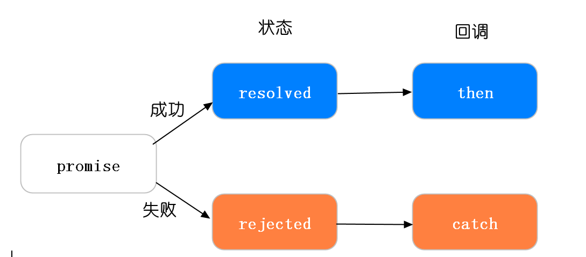

  **这个承诺一旦从等待状态变成为其他状态就永远不能更改状态了**，比如说一旦状态变为 resolved 后，就不能 再次改变为Fulfilled

```js
  let p = new Promise((resolve, reject) => {
    reject('reject')
    resolve('success')//无效代码不会执行
  })
  p.then(
    value => {
      console.log(value)
    },
    reason => {
      console.log(reason)//reject
    }
  )
```

当我们在构造 Promise 的时候，构造函数内部的代码是立即执行的

```js
  new Promise((resolve, reject) => {
    console.log('new Promise')
    resolve('success')
  })
  console.log('end')
  // new Promise => end
```

4.2 promise的链式调用

  - 每次调用返回的都是一个新的Promise实例（这就是then可用链式调用的原因）

  - 如果then中返回的是一个结果的话会把这个结果传递下一次then中的成功回调

  - 如果then中出现异常,会走下一个then的失败回调

  - 在 then中使用了return，那么 return 的值会被Promise.resolve() 包装(见例1，2)

  - then中可以不传递参数，如果不传递会透到下一个then中(见例3)

  - catch 会捕获到没有捕获的异常

    接下来我们看几个例子：

```js
    // 例1
    Promise.resolve(1)
    .then(res => {
      console.log(res) // 1
      return 2 //包装成 Promise.resolve(2)
    })
    .catch(err => 3)
    .then(res => console.log(res)) // 2
    复制代码
    // 例2
    Promise.resolve(1)
    .then(x => x + 1)
    .then(x => {
      throw new Error('My Error')
    })
    .catch(() => 1)  // 到此处return 1
    .then(x => x + 1)
    .then(x => console.log(x)) //2
    .catch(console.error)
    复制代码
    // 例3
    let fs = require('fs')
    function read(url) {
        return new Promise((resolve, reject) => {
            fs.readFile(url, 'utf8', (err, data) => {
                if (err) reject(err)
                resolve(data)
            })
        })
    }
    read('./name.txt')
    .then(function(data) {
      throw new Error() //then中出现异常,会走下一个then的失败回调
    }) //由于下一个then没有失败回调，就会继续往下找，如果都没有，就会被catch捕获到
    .then(function(data) {
      console.log('data')
    })
    .then()
    .then(null, function(err) {
      console.log('then', err)// then error
    })
    .catch(function(err) {
      console.log('error')
    })
```

Promise不仅能够捕获错误，而且也很好地解决了回调地狱的问题，可以把之前的回调地狱例子改写为如下代码：

```js
    ajax(url)
    .then(res => {
        console.log(res)
        return ajax(url1)
    }).then(res => {
        console.log(res)
        return ajax(url2)
    }).then(res => console.log(res))
```

它也是存在一些缺点的，比如无法取消 Promise，错误需要通过回调函数捕获。

### 5.生成器Generators/yield

  Generator 函数是 ES6 提供的一种异步编程解决方案，语法行为与传统函数完全不同，Generator 最大的特点就是可以控制函数的执行。

  - 语法上，首先可以把它理解成，Generator 函数是一个状态机，封装了多个内部状态。

  - **Generator 函数除了状态机，还是一个遍历器对象生成函数**。

  - **可暂停函数, yield可暂停，next方法可启动，每次返回的是yield后的表达式结果**。

  - yield表达式本身没有返回值，或者说总是返回undefined。**next方法可以带一个参数，该参数就会被当作上一个yield表达式的返回值**。

    我们先来看个例子：

```js
  function *foo(x) {
    let y = 2 * (yield (x + 1))
    let z = yield (y / 3)
    return (x + y + z)
  }
  let it = foo(5)
  // next方法可以带一个参数，该参数就会被当作上一个yield表达式的返回值
  console.log(it.next())   // => {value: 6, done: false}
  console.log(it.next(12)) // => {value: 8, done: false} 2*12/3（第一个yield后的值被替换为12）
  console.log(it.next(13)) // => {value: 42, done: true}
```

  可能结果跟你想象不一致，接下来我们逐行代码分析：

  - 首先 Generator 函数调用和普通函数不同，它会返回一个迭代器

  - 当执行第一次 next 时，传参会被忽略，并且函数暂停在 yield (x + 1) 处，所以返回 5 + 1 = 6

  - 当执行第二次 next 时，传入的参数12就会被当作上一个yield表达式的返回值，如果你不传参，yield 永远返回 undefined。此时 let y = 2 * 12，所以第二个 yield 等于 2 * 12 / 3 = 8

  - 当执行第三次 next 时，传入的参数13就会被当作上一个yield表达式的返回值，所以 z = 13, x = 5, y = 24，相加等于 42

    我们再来看个例子：有三个本地文件，分别1.txt,2.txt和3.txt，内容都只有一句话，下一个请求依赖上一个请求的结果，想通过Generator函数依次调用三个文件

```txt
1.txt文件内容为
2.txt

2.txt文件内容为
3.txt文件

3.txt文件内容为
结束
```

```js
let fs = require('fs')
function read(file) {
    return new Promise(function(resolve, reject) {
        fs.readFile(file, 'utf8', function(err, data) {
            if (err) reject(err)
            resolve(data)
        })
    })
}
function* r() {
    let r1 = yield read('./1.txt')
    let r2 = yield read(r1)
    let r3 = yield read(r2)
    console.log(r1)
    console.log(r2)
    console.log(r3)
}
let it = r()
let { value, done } = it.next()
value.then(function(data) { // value是个promise
    console.log(data) //data=>2.txt
    let { value, done } = it.next(data)
    value.then(function(data) {
        console.log(data) //data=>3.txt
        let { value, done } = it.next(data)
        value.then(function(data) {
            console.log(data) //data=>结束
        })
    })
})
```

从上例中我们看出手动迭代Generator函数很麻烦，实现逻辑有点绕，而实际开发一般会配合co库去使用。**co是一个为Node.js和浏览器打造的基于生成器的流程控制工具，借助于Promise，你可以使用更加优雅的方式编写非阻塞代码**。

安装co库只需：`npm install co`

上面例子只需两句话就可以轻松实现

```js
function* r() {
    let r1 = yield read('./1.txt')
    let r2 = yield read(r1)
    let r3 = yield read(r2)
    console.log(r1)
    console.log(r2)
    console.log(r3)
}
let co = require('co')
co(r()).then(function(data) {
    console.log(data)
})
// 2.txt=>3.txt=>结束=>undefined
```

我们可以通过 Generator 函数解决回调地狱的问题，可以把之前的回调地狱例子改写为如下代码：

```js
function *fetch() {
    yield ajax(url, () => {})
    yield ajax(url1, () => {})
    yield ajax(url2, () => {})
}
let it = fetch()
let result1 = it.next()
let result2 = it.next()
let result3 = it.next()
```

### 6.async/await

6.1 Async/Await简介

使用async/await，你可以轻松地达成之前使用生成器和co函数所做到的工作,它有如下特点：

1. async/await是基于Promise实现的，它不能用于普通的回调函数。

2. async/await与Promise一样，是非阻塞的。

3. async/await使得异步代码看起来像同步代码，这正是它的魔力所在。


**一个函数如果加上 async ，那么该函数就会返回一个 Promise**

```js
async function async1() {
    return "1"
}
console.log(async1()) // -> Promise {<resolved>: "1"}
```

Generator函数依次调用三个文件那个例子用async/await写法，只需几句话便可实现

```js
let fs = require('fs')
function read(file) {
    return new Promise(function(resolve, reject) {
        fs.readFile(file, 'utf8', function(err, data) {
            if (err) reject(err)
            resolve(data)
        })
    })
}
async function readResult(params) {
    try {
        let p1 = await read(params, 'utf8')//await后面跟的是一个Promise实例
        let p2 = await read(p1, 'utf8')
        let p3 = await read(p2, 'utf8')
        console.log('p1', p1)
        console.log('p2', p2)
        console.log('p3', p3)
        return p3
    } catch (error) {
        console.log(error)
    }
}
readResult('1.txt').then( // async函数返回的也是个promise
    data => {
        console.log(data)
    },
    err => console.log(err)
)
// p1 2.txt
// p2 3.txt
// p3 结束
// 结束
```

6.2 Async/Await并发请求

如果请求两个文件，毫无关系，可以通过并发请求

```js
let fs = require('fs')
function read(file) {
    return new Promise(function(resolve, reject) {
        fs.readFile(file, 'utf8', function(err, data) {
            if (err) reject(err)
            resolve(data)
        })
    })
}
function readAll() {
    read1()
    read2()//这个函数同步执行
}
async function read1() {
    let r = await read('1.txt','utf8')
    console.log(r)
}
async function read2() {
    let r = await read('2.txt','utf8')
    console.log(r)
}
readAll() // 2.txt 3.txt
```

## 怎么解决callback 多层嵌套

回调地狱有两种解决方案：

1. Promises
2. Async/await

## promise的介绍和使用

**Promise 介绍：**

ES6中的Promise 是异步编程的一种方案。从语法上讲，Promise 是一个对象，它可以获取异步操作的消息。

Promise对象, 可以**将异步操作以同步的流程表达出来**。使用 Promise 主要有以下好处：

- 可以很好地解决**回调地狱**的问题（避免了层层嵌套的回调函数）。
- 语法非常简洁。Promise 对象提供了简洁的API，使得控制异步操作更加容易。

### Promise 使用：

**语法**

```js
var promise = new Promise((resolve, reject) => {/* executor函数 */
    // ... some code
    if (/* 异步操作成功 */){
        resolve(value);
    } else {
        reject(error);
    }
});
promise.then((value) => {
    //success
}, (error) => {
    //failure
})
```

1. 参数
   executor函数在Promise构造函数执行时同步执行，被传递resolve和reject函数（executor函数在Promise构造函数返回新建对象前被调用）。
   executor内部通常会执行一些异步操作，一旦完成，可以调用resolve函数来将promise状态改成fulfilled（完成），或者将promise的状态改为rejected（失败）。
   如果在executor函数中抛出一个错误，那么该promise状态为rejected。executor函数的返回值被忽略。
2. 简单使用

```jsx
function timeout(ms) {
    return new Promise((resolve, reject) => {
        setTimeout(resolve, ms, 'done');
    });
}

timeout(2000).then((value) => {
    console.log(value); //done
});
```

### 原型方法

#### Promise.prototype.then(onFulfilled, onRejected)

1. 语法
   p.then(onFulfilled, onRejected);
   p.then((value) => {// fulfillment}, (reason) => {// rejection});

2. 含义
   为Promise实例添加状态改变时的回调函数。then方法的第一个参数是resolved状态的回调函数，第二个参数（可选）是rejected状态的回调函数。

3. 链式操作
   then方法返回的是一个新的promise，因此可以采用链式写法，即then方法后面再调用另一个then方法。

```js
new Promise(resolve => {
    resolve(1);
})
    .then(result => console.log(result)) //1
    .then(result => {
        console.log(result);              //undefined
        return 2;
    })
    .then(result => {
        console.log(result);             //2
        throw new Error("err");
    })
    .then((result) =>{
        console.log(result);
    }, (err)=>{
        console.log(err);                //Error: err
        return 3;
    })
    .then((result) => {
        console.log(result);            //3
    })
```

注意：①不管是then方法的onfulfilled函数参数执行还是onrejected（可选参数）函数参数执行，then方法返回的都是一个新的Promise对象，都可以继续采用链式写法调用另一个then方法。②Promise.prototype.catch()方法返回的也是一个Promise对象。then方法和catch方法可以链式操作。

4. 返回值
   then方法返回一个Promise，而它的行为与then中的被调用的回调函数(onfulfilled函数/onrejected函数)的返回值有关。
   (1) 如果then中的回调函数返回一个值，那么then返回的Promise将会成为接受状态，并且将返回的值作为接受状态的回调函数的参数值。

```js
new Promise((resolve, reject) => {
    reject();
})
    .then( () => 99, () => 42 )
    .then( result => console.log(result)); // 42
```

(2) 如果then中的回调函数抛出一个错误，那么then返回的Promise将会成为拒绝状态，并且将抛出的错误作为拒绝状态的回调函数的参数值。

```js
new Promise((resolve, reject) => {
    resolve();
})
    .then( () => {throw new Error('err')}, () => {})
    .then( () => {}, (err) => {console.log(err)}); //Error: err
```

(3) 如果then中的回调函数返回一个已经是接受状态的Promise，那么then返回的Promise也会成为接受状态，并且将那个Promise的接受状态的回调函数的参数值作为该被返回的Promise的接受状态回调函数的参数值。

```js
new Promise((resolve, reject) => {
    resolve();
})
    .then( () => {
        return new Promise(resolve => resolve('ok'));
    })
    .then( (result) => {console.log(result)}); //ok
```

(4) 如果then中的回调函数返回一个已经是拒绝状态的Promise，那么then返回的Promise也会成为拒绝状态，并且将那个Promise的拒绝状态的回调函数的参数值作为该被返回的Promise的拒绝状态回调函数的参数值。

```js
new Promise((resolve, reject) => {
    resolve();
})
    .then( () => {
        return new Promise((resolve, reject) => {
            reject(new Error('err'));
        });
    })
    .then( () => {}, (err) => {console.log(err)}); //Error: err
```

(5) 如果then中的回调函数返回一个未定状态（pending）的Promise，那么then返回Promise的状态也是未定的，并且它的终态与那个Promise的终态相同；同时，它变为终态时调用的回调函数参数与那个Promise变为终态时的回调函数的参数是相同的。

```js
new Promise((resolve, reject) => {
    resolve();
})
    .then(() => {
        return new Promise(resolve => {
            setTimeout(resolve, 2000, 'ok');
        });
    })
    .then( (result) => {console.log(result)}); //ok
```

注意：这里是then方法中被调用回调函数的返回值与then方法返回的Promise对象状态之间的关系。

#### Promise.prototype.catch(onRejected)

1. 语法

```js
p.catch(onRejected);

p.catch(function(reason) {
    // 拒绝
});
```

2. 含义
   Promise.prototype.catch方法是.then(null, rejection)的别名，用于指定发生错误时的回调函数，返回一个新的promise对象。

3. 用法

```js
const p = new Promise((resolve,reject) => {
    return reject(new Error('err')); //reject方法的作用，等同于抛出错误
    //throw new Error('err');
});

p.then(null, (err) => {
    console.log(err);  //Err: err
});

//--------等价写法---------
p.catch(err => {
    console.log(err); //Err: err
})
```

注意：由于.catch方法是.then(null, rejection)的别名，故.then中的链式操作(3)、返回值(4)等语法在.catch中都适用。

4. 一般总是建议，Promise对象后面要跟catch方法，这样可以处理Promise内部发生的错误。catch方法返回的还是一个Promise对象，因此后面还可以接着调用then方法。

5. Promise对象的错误具有“冒泡”性质，会一直向后传递，直到被捕获为止。也就是说，错误总是会被下一个catch语句捕获。 即：当前catch方法可以捕获上一个catch方法(包括上一个catch)到当前catch(不包括当前catch)方法之间所有的错误，如果没有错误，则当前catch方法不执行。

```js
new Promise(() => {
    throw new Error('err1');
})
    .then(() => {console.log(1);})
    .then(() => {console.log(2);})
    .catch((err) => {
        console.log(err); //Err: err1
        throw  new Error('err2');
    })
    .catch((err) => {console.log(err);})//Err: err2
```

6. 一般来说，不要在then方法里面定义Reject状态的回调函数（即then的第二个参数），总是使用catch方法。

```js
// bad
new Promise()
    .then((data) => {/* success */ }, (err) => {/* error */ });

// good
new Promise()
    .then((data) => { /* success */ })
    .catch((err) => {/* error */ });
```

上面代码中，第二种写法要好于第一种写法，理由是第二种写法可以捕获前面then方法执行中的错误，也更接近同步的写法。

7. 与传统的try/catch代码块不同的是，即使没有使用catch方法指定错误处理的回调函数，Promise对象抛出的错误也不会中止外部脚本运行。

```js
//————————验证的会终止，不会打印 over
new Promise((resolve) => {
    // 下面一行会报错，因为x没有声明
    resolve(x + 2);
}).then(() => {
    console.log('ok');
});
setTimeout(() => {console.log('over')});
//Uncaught (in promise) ReferenceError: x is not defined
//over
```

8. 在异步函数中抛出的错误不会被catch捕获到

```js
new Promise((resolve, reject) => {
    setTimeout(() => {
        throw 'Uncaught Exception!';
    }, 1000);
}).catch(() => {
    console.log('err'); //不会执行
});

new Promise((resolve, reject) => {
    setTimeout(() => {
        reject();
    }, 1000);
}).catch(() => {
    console.log('err'); //err
});
```

9. 在resolve()后面抛出的错误会被忽略

```js
new Promise((resolve, reject) => {
    resolve();
    throw 'Silenced Exception!';
}).catch(function(e) {
    console.log(e); // 不会执行
});
```

### Promise.all(iterable)

1. 语法
   var p = Promise.all([p1, p2, p3]);

2. 含义
   Promise.all方法接受一个数组作为参数，p1、p2、p3都是Promise实例，如果不是，就会先调用下面讲到的Promise.resolve方法，将参数转为Promise实例，再进一步处理。（Promise.all方法的参数可以不是数组，但必须具有Iterator接口，且返回的每个成员都是Promise实例。）
   p的状态由p1、p2、p3决定，分成两种情况。
   (1) 只有p1、p2、p3的状态都变成fulfilled，p的状态才会变成fulfilled，此时p1、p2、p3的返回值组成一个数组，传递给p的回调函数。
   (2) 只要p1、p2、p3之中有一个被rejected，p的状态就变成rejected，此时第一个被reject的实例的返回值，会传递给p的回调函数。

3. 用法

```js
const p1 = 'p1-ok';
const p2 = Promise.resolve('p2-ok');
const p3 = new Promise((resolve) => setTimeout(resolve, 3000, 'p3-ok'));
const p4 = Promise.reject('p4-err');
Promise.all([p1, p2, p3])
    .then((resolves) => {
        resolves.forEach(resolve => {
            console.log(resolve); //p1-ok   p2-ok  p3-ok
        });
    })
    .catch(() => {
        console.log('err');
    });

Promise.all([p1, p2, p3, p4])
    .then(() => {
        console.log('ok');
    })
    .catch((err) => {
        console.log(err); //p4-err
    })
```

### Promise.race(iterable)

1. 语法
   var p = Promise.race([p1, p2, p3]);

2. 含义
   Promise.race方法同样是将多个Promise实例，包装成一个新的Promise实例。只要p1、p2、p3之中有一个实例率先改变状态，p的状态就跟着改变。那个率先改变的Promise实例的返回值，就传递给p的回调函数。
   Promise.race方法的参数与Promise.all方法一样，如果不是Promise实例，就会先调用下面讲到的Promise.resolve方法，将参数转为Promise实例，再进一步处理。

3. 用法

```js
var p1 = new Promise(resolve => {setTimeout(resolve, 500, "one");});
var p2 = new Promise(resolve => {setTimeout(resolve, 100, "two");});
Promise.race([p1, p2])
    .then(value => {
        console.log(value); // "two"
    });

var p3 = new Promise(resolve => {setTimeout(resolve, 100, "three");});
var p4 = new Promise((resolve, reject) => {setTimeout(reject, 500, "four");});

Promise.race([p3, p4])
    .then((value) => {
        console.log(value); // "three"
    })
    .catch(err => {
        // 未被调用
    });

var p5 = new Promise(resolve => {setTimeout(resolve, 500, "five");});
var p6 = new Promise((resolve, reject) => {
            setTimeout(reject, 100, "six");
        });

Promise.race([p5, p6])
    .then((value) => {
        // 未被调用
    }).catch((reason) => {
        console.log(reason); // "six"
    });
```

### Promise.resolve(value)

Promsie.resolve(value) 可以将任何值转成值为 value 状态是 fulfilled 的 Promise，但如果传入的值本身是 Promise 则会原样返回它。

1. 语法

```js
Promise.resolve(value);
Promise.resolve(promise);
Promise.resolve(thenable);
```

Promise.resolve等价于下面的写法。

```js
Promise.resolve(value) ;
// 等价于
new Promise(resolve => resolve(value));
```

2. 含义
   返回一个状态由给定value决定的Promise实例。

3. 用法
   (1) 如果该值是一个Promise对象，则直接返回该对象；

```js
const p = new Promise((resolve) => {resolve()});
const p2 = Promise.resolve(p);
console.log(p === p2); //true
```

   (2) 如果参数是thenable对象(即带有then方法的对象)，则返回的Promise对象的最终状态由then方法的执行决定；

```js
const thenable = {
    then(resolve, reject) {
        resolve(42);
    }
};
Promise.resolve(thenable)
    .then((value) => {
        console.log(value);  // 42
    });
```

   (3) 如果参数是不具有then方法的对象或基本数据类型，则返回的Promise对象的状态为fulfilled，并且将该参数传递给then方法。

```js
Promise.resolve('Hello')
    .then((s) => {
        console.log(s); //Hello
    });
```

   (4) 如果不带有任何参数，则返回的Promise对象的状态为fulfilled，并且将undefined作为参数传递给then方法。

```js
Promise.resolve()
    .then((s) => {
        console.log(s); //undefined
    });
```

4. 通常而言，如果你不知道一个值是否是Promise对象，使用Promise.resolve(value)来返回一个Promise对象,这样就能将该value以Promise对象形式使用。

5. 立即resolve的Promise对象，是在本轮“事件循环”（event loop）的结束时，而不是在下一轮“事件循环”的开始时。

```js
setTimeout(function () {
    console.log('three');
}, 0);

Promise.resolve().then( () => {
    console.log('two');
});

console.log('one');
// one 
// two
// three
```
**实现** 
```js
Promise.resolve(value) {
	if (value && value instanceof Promise) {
		return value
	} else if (value && typeof value === "object" && value.then === "function") {
		let then = value.then
		return new Promise(resolve=>{
			then(resolve)
		})
	} else if(value) {
		return new Promise(resolve => resolve(value))
	} else {
		return new Promise(resolve => resolve())
	}
}
```

### Promise.reject(reason)

和 Promise.resolve() 类似，Promise.reject() 会实例化一个 rejected 状态的 Promise。但与 Promise.resolve() 不同的是，如果给 Promise.reject() 传递一个 Promise 对象，则这个对象会成为新 Promise 的值。

1. 语法

```js
Promise.reject(reason);
```

Promise.reject等价于下面的写法。

```js
var p = Promise.reject(reason);
// 等同于
var p = new Promise((resolve, reject) => reject(reason));
```

2. 含义
   返回一个状态为rejected的Promise对象，并将给定的失败信息传递给对应的处理方法。

> **注意：Promise.resolve(value)方法返回的Promise实例的状态由value决定，可能是fulfilled，也可能是rejected。Promise.reject(reason)方法返回的Promise实例的状态一定是rejected。**

1. 用法

```js
Promise.reject("Testing static reject")
    .then((value) => {
        // 未被调用
    }).catch((reason) => {
        console.log(reason); // Testing static reject
    });

Promise.reject(new Error("fail"))
    .then((value) => {
        // 未被调用
    }).catch((error) => {
        console.log(error); // Error: fail
    });
```

2. Promise.reject()方法的参数，会原封不动地作为reject的理由，变成后续方法的参数。这一点与Promise.resolve方法不一致。

```js
const thenable = {
    then(resolve) {
        resolve('ok');
    }
};

Promise.resolve(thenable)
    .then(e => {
        console.log(e === 'ok'); //true
    });

Promise.reject(thenable)
    .catch(e => {
        console.log(e === thenable); // true
    });
```

### 手写promise
```js
class Promise {
  constructor(fn) {
    // resolve时的回调函数列表
    this.resolveTask = [];
    // reject时的回调函数列表
    this.rejectTask = [];
    // state记录当前状态,共有pending、fulfilled、rejected 3种状态
    this.state = "pending";
    let resolve = value => {
      // state状态只能改变一次，resolve和reject只会触发一种
      if (this.state !== "pending") return;
      this.state = "fulfilled";
      this.data = value;
      // 模拟异步，保证resolveTask事件先注册成功，要考虑在Promise里面写同步代码的情况
      setTimeout(() => {
        this.resolveTask.forEach(cb => cb(value));
      });
    };
    let reject = err => {
      if (this.state !== "pending") return;
      this.state = "rejected";
      this.error = err;
      // 保证rejectTask事件注册成功
      setTimeout(() => {
        this.rejectTask.forEach(cb => cb(err));
      });
    };

    // 关键代码，执行fn函数
    try {
      fn(resolve, reject);
    } catch (error) {
      reject(error);
    }
  }

  then(resolveCallback, rejectCallback) {
    // 解决链式调用的情况，继续返回Promise
    return new Promise((resolve, reject) => {
      // 将then传入的回调函数，注册到resolveTask中
      this.resolveTask.push(() => {
        // 重点：判断resolveCallback事件的返回值
        // 假如用户注册的resolveCallback事件又返回一个Promise，将resolve和reject传进去，这样就实现控制了链式调用的顺序
        const res = resolveCallback(this.data);
        if (res instanceof Promise) {
          res.then(resolve, reject);
        } else {
          // 假如返回值为普通值，resolve传递出去
          resolve(res);
        }
      });

      this.rejectTask.push(() => {
        // 同理：判断rejectCallback事件的返回值
        // 假如返回值为普通值，reject传递出去
        const res = rejectCallback(this.error);
        if (res instanceof Promise) {
          res.then(resolve, reject);
        } else {
          reject(res);
        }
      });
    });
  }
}

// 测试
// 打印结果：依次打印1、2
new Promise((resolve, reject) => {
  setTimeout(() => {
    resolve(1);
  }, 500);
}).then(
    res => {
      console.log(res);
      return new Promise(resolve => {
        setTimeout(() => {
          resolve(2);
        }, 1000);
      });
    }
  ).then(data => {
      console.log(data);
    });
```
### 手写race、all

race：返回promises列表中第一个执行完的结果
- Promise.race 会返回一个由所有可迭代实例中第一个 fulfilled 或 rejected 的实例包装后的新实例。
all：返回promises列表中全部执行完的结果
- 传入的所有 Promsie 都是 fulfilled，则返回由他们的值组成的，状态为 fulfilled 的新 Promise；
- 只要有一个 Promise 是 rejected，则返回 rejected 状态的新 Promsie，且它的值是第一个 rejected 的 Promise 的值；
- 只要有一个 Promise 是 pending，则返回一个 pending 状态的新 Promise；
```js
class Promise {
  // race静态方法，返回promises列表中第一个执行完的结果
  static race(promises) {
    return new Promise((resolve, reject) => {
      for (let i = 0; i < promises.length; i++) {
        // Promise.resolve包一下，防止promises[i]不是Promise类型
        Promise.resolve(promises[i])
          .then(res => {
            resolve(res);
          })
          .catch(err => {
            reject(err);
          });
      }
    });
  }

  // all静态方法， 返回promises列表中全部执行完的结果
  static all(promises) {
    let result = [];
    let index = 0;
    return new Promise((resolve, reject) => {
      for (let i = 0; i < promises.length; i++) {
        Promise.resolve(promises[i])
          .then(res => {
            // 输出结果的顺序和promises的顺序一致
            result[i] = res; 
            index++;
            if (index === promises.length) {
              resolve(result);
            }
          })
          .catch(err => {
            reject(err);
          });
      }
    });
  }
}
```

### 手写retry

```js
/*
* @param {function} fn - 方法名
* @param {number} delay - 延迟的时间
* @param {number} times - 重发的次数
*/
function retry(fn, delay, times) {
  return new Promise((resolve, reject) => {
    function func() {
      Promise.resolve(fn()).then(res => {
          resolve(res);
        })
        .catch(err => {
          // 接口失败后，判断剩余次数不为0时，继续重发
          if (times !== 0) {
            setTimeout(func, delay);
            times--;
          } else {
            reject(err);
          }
        });
    }
    func();
  });
}
```


## 与promise.all相反的

Promse.race就是赛跑的意思，意思就是说，Promise.race([p1, p2, p3])里面哪个结果获得的快，就返回那个结果，不管结果本身是成功状态还是失败状态。

**扩展：**

语法

```
Promise.race(iterable);
```

参数

- iterable

  可迭代对象，类似Array

返回值

一个 **待定的** Promise只要给定的迭代中的一个promise解决或拒绝，就采用第一个promise的值作为它的值， 从而**异步**地解析或拒绝（一旦堆栈为空）。

## promise实现文件读取

### 封装异步读取文件操作

- fs.readFile()方法用于异步读取文件(node核心模块)
- 将Promise的实例对象作为函数的返回值返回
- 这样函数执行完毕后就得到一个Promise对象的实例,可以通过.then方法传入成功的回调和失败的回调

```js
const fs = require('fs');
const path = require('path');

function asyncGetFileByPath(p) {
    return new Promise((resolve, reject) => {
        // Promise对象里面的参数,会立即执行(前面说过)
        fs.readFile(path.join(__dirname, p), 'utf-8', (err, data) => {
            if (err) {
                reject(err);
            } else {
                resolve(data);
            }
        })
    })
}
asyncGetFileByPath('./files/1.txt')
    .then(
        (data) => { // 成功的回调
            console.log(data);
        },
        (err) => { // 失败的回调
            console.error(err);
        }
    )
```

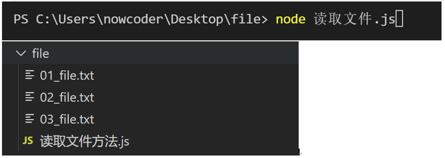

### 解决回调地狱

- 前面已经成功的封装了一个读取文件的函数
- 下面用它来体验一下读取多个文件
- 我们在.then()方法中,第一个参数resolve()方法中,返回一个promise对象B.
- 那么在执行.then()的resolve()方法完毕后,此时的执行环境是这个Promise的实例b
- 可以通过b的.then()方法继续传入resolve取消回调地狱,让代码趋于扁平化

```js
const fs = require('fs');
const path = require('path');

function asyncGetFileByPath(p) {
    return new Promise((resolve, reject) => {
        // Promise对象里面的参数,会立即执行(前面说过)
        fs.readFile(path.join(__dirname, p), 'utf-8', (err, data) => {
            if (err) {
                reject(err);
            } else {
                resolve(data);
            }
        })
    })
}
asyncGetFileByPath('./files/1.txt')
    .then(
        (data) => { // 成功的回调    '1.txt'
            console.log(data); // 打印出 1.txt 数据
            return asyncGetFileByPath('./files/2.txt')
        },
        (err) => { // 失败的回调
            console.error(err);
        }
    )
    .then( // 成功的回调  '2.txt'
        (data) => {
            console.log(data); // 打印出 2.txt 中的数据
            return asyncGetFileByPath('./files/3.txt') // 继续返回Promise对象的实例
        },
        (err) => {
            console.error(err);
        }
    )
    .then(
        (data) => { // 成功的回调 '3.txt'
            console.log(data); // 打印出 3.txt 中的数据
        },
        (err) => {
            console.error(err);
        }
    )
```

## promise和 async await 区别

**概念**
  **Promise** 是异步编程的一种解决方案，比传统的解决方案——回调函数和事件——更合理和更强大，简单地说，Promise好比容器，里面存放着一些未来才会执行完毕（异步）的事件的结果，而这些结果一旦生成是无法改变的

  **async await**也是异步编程的一种解决方案，他遵循的是Generator 函数的语法糖，他拥有内置执行器，不需要额外的调用直接会自动执行并输出结果，它返回的是一个Promise对象。

### 两者的区别

  1. Promise的出现解决了传统callback函数导致的“地域回调”问题，但它的语法导致了它向纵向发展形成了一个回调链，遇到复杂的业务场景，这样的语法显然也是不美观的。而async await代码看起来会简洁些，使得异步代码看起来像同步代码，await的本质是可以提供等同于“同步效果”的等待异步返回能力的语法糖，只有这一句代码执行完，才会执行下一句。
  2. async await与Promise一样，是非阻塞的。
  3. async await是基于Promise实现的，可以说是改良版的Promise，它不能用于普通的回调函数

## async、await

**作用：用同步方式，执行异步操作**

**总结**

1）async函数是generator（迭代函数）的语法糖
2）async函数返回的是一个Promise对象，有无值看有无return值
3）await关键字只能放在async函数内部，await关键字的作用 就是获取Promise中返回的resolve或者reject的值
4）async、await要结合try/catch使用，防止意外的错误

**generator**

1）generator函数跟普通函数在写法上的区别就是，多了一个星号*
2）只有在generator函数中才能使用yield，相当于generator函数执行的中途暂停点
3）generator函数是不会自动执行的，每一次调用它的next方法，会停留在下一个yield的位置

**async、await示例**

```js
const getData = () => new Promise(resolve => setTimeout(() => resolve("data"), 1000));
async function test() {
  const data = await getData();
  console.log("data: ", data);
  const data2 = await getData();
  console.log("data2: ", data2);
  return "success";
}
test().then(res => console.log(res))
```

**将上面示例转化为generator函数**

```js
function* testG() {
  // await被编译成了yield
  const data = yield getData();
  console.log("data: ", data);
  const data2 = yield getData();
  console.log("data2: ", data2);
  return "success";
}
```

**手动执行generator函数**

```js
// 执行结果与`async、await`示例一致
const getData = () =>
  new Promise(resolve => setTimeout(() => resolve("data"), 1000));

function* testG() {
  // await被编译成了yield
  const data = yield getData();
  console.log("data: ", data);
  const data2 = yield getData();
  console.log("data2: ", data2);
  return "success";
}
var gen = testG();
var dataPromise = gen.next();
dataPromise.value.then(value1 => {
  // data1的value被拿到了，继续调用next
  var data2Promise = gen.next(value1);
  data2Promise.value.then(value2 => {
    // data2的value拿到了 继续调用next并且传递value2
    gen.next(value2);
  });
});
```

**手写async、await**

```js
function generatorToAsync(generatorFn) {
  // 返回的是一个新的函数
  return function() {
    // 先调用generator函数 生成迭代器
    // 对应 var gen = testG()
    const gen = generatorFn.apply(this, arguments);

    // 返回一个Promise, 因为外部是用.then的方式 或者await的方式去使用这个函数的返回值
    return new Promise((resolve, reject) => {
      // 内部定义一个step函数 用来一步步next
      function step(key, arg) {
        let res;

        // 这个方法需要包裹在try catch中
        // 如果报错了 就把promise给reject掉 外部通过.catch可以获取到错误
        try {
          res = gen[key](arg "key"); // 这里有可能会执行返回reject状态的Promise
        } catch (error) {
          return reject(error); // 报错的话会走catch，直接reject
        }

        // gen.next() 得到的结果是一个 { value, done } 的结构
        const { value, done } = res;
        if (done) {
          // 如果done为true，说明走完了，进行resolve(value)
          return resolve(value);
        } else {
          // 如果done为false，说明没走完，还得继续走
          // value有可能是：常量\Promise；
          // Promise有可能是成功或者失败
          return Promise.resolve(value).then(
            val => step("next", val),
            err => step("throw", err)
          );
        }
      }

      step("next"); // 第一次执行
    });
  };
}

// 测试generatorToAsync

// 1秒后打印data1 再过一秒打印data2 最后打印success
const getData = () =>
  new Promise(resolve => setTimeout(() => resolve("data"), 1000));
var test = generatorToAsync(function* testG() {
  // await被编译成了yield
  const data = yield getData();
  console.log("data1: ", data);
  const data2 = yield getData();
  console.log("data2: ", data2);
  return "success";
});

test().then(res => console.log(res));
```

## defer和async的区别

区别主要在于一个执行时间，defer会在文档解析完之后执行，并且多个defer会按照顺序执行，而async则是在js加载好之后就会执行，并且多个async，哪个加载好就执行哪个

**解析：**

在没有defer或者async的情况下：会立即执行脚本,所以通常建议把script放在body最后

```html
<script src="script.js"></script>
```

async：有async的话,加载和渲染后续文档元素的过程将和 script.js 的加载与执行并行进行（异步）。
但是多个js文件的加载顺序不会按照书写顺序进行

```html
<script async src="script.js"></script>
```

derer：有derer的话,加载后续文档元素的过程将和 script.js 的加载并行进行（异步），但是 script.js 的执行要在所有元素解析完成之后，DOMContentLoaded 事件触发之前完成,并且多个defer会按照顺序进行加载。

```html
<script defer src="script.js"></script>
```

## 每隔一秒打印1,2,3,4

**for循环setTimeout输出1-10解决方式问题来源**

```js
for (var i = 0; i< 10; i++){
    setTimeout((i) => {
        console.log(i);
    }, 0)
}
```

期望：输出1到10

为什么无法输出1到十

在上面的代码中，for循环是同步代码，setTimeout是异步代码。遇到这种既包含同步又包含异步的情况，JavaScript依旧按照从上到下的顺序执行同步代码，并将异步代码插入任务队列。setTimeout的第二个参数则是把执行代码（console.log(i)）添加到任务队列需等待的毫秒数，但等待的时间是相对主程序完毕的时间计算的，也就是说，在执行到setTimeout函数时会等待一段时间，再将当前任务插入任务队列。
最后，当执行完同步代码，js引擎就会去执行任务队列中的异步代码。这时候任务队列中就会有十个console.log(i)。我们知道，在每次循环中将setTimeout里面的代码“console.log(i)”放入任务队列时，i的值都是不一样的。但JavaScript引擎开始执行任务队列中的代码时，会开始在当前的作用域中开始找变量i，但是当前作用域中并没有对变量i进行定义。这个时候就会在创造该函数的作用域中寻找i。创建该函数的作用域就是全局作用域，这个时候就找到了for循环中的变量i，这时的i是全局变量，并且值已经确定：10。十个console.log“共享”i的值。这就是作用域链的问题。

**解决方法**

- 方法一

```js
for (var i = 0; i< 10; i++){
   setTimeout((i) => {
      console.log(i)
   }, 1000,i);
}
```

> 最精简解决方案

- 方法二

```js
for (let i = 0; i< 10; i++){
   setTimeout(() => {
      console.log(i) 
   }, 1000);
}
```

> 最优解决方案，利用let形成块级作用域

- 方法三

```js
    for (var i = 0; i< 10; i++){
      ((i)=>{
        setTimeout(() => {
          console.log(i)
        },1000);
      })(i)
    }
```

> IIFE(立即执行函数)，类似于let生成了块级作用域。

- 方法四

```js
for (var i = 0; i< 10; i++){
   setTimeout(console.log(i),1000);
}
```

> 直接输出，没有延迟

- 方法五

```js
for (var i = 0; i< 10; i++){
   setTimeout((()=>console.log(i))(),1000);
}
```

> 同上

- 方法六

```js
for (var i = 0; i< 10; i++){
    try{
        throw i
    }catch(i){
        setTimeout(() => {
            console.log(i)
        }, 1000)
    }
}
console.time('start');

setTimeout(function() {
  console.log(2);
}, 10);

setImmediate(function() {
  console.log(1);
});

new Promise(function(resolve) {
  console.log(3);
  resolve();
  console.log(4);
}).then(function() {
  console.log(5);
  console.timeEnd('start')
});

console.log(6);

process.nextTick(function() {
  console.log(7);
});

console.log(8);

// 3 4 6 8 7 5 start: 6.341ms 1 2 0 1 2 3 4 5 6 7 8 9
```

## call apply bind的作用和区别

作用：

都可以改变函数内部的this指向。

区别点：

1. call 和 apply 会调用函数，并且改变函数内部this指向。
2. call 和 apply 传递的参数不一样，call 传递参数arg1,arg2...形式，apply 必须数组形式[arg]，bind可以分为多次传入，实现参数的合并
3. bind 不会调用函数，可以改变函数内部this指向。
4. call、apply是立即执行，bind是返回绑定this之后的函数，如果这个新的函数作为构造函数被调用，那么this不再指向传入给bind的第一个参数，而是指向新生成的对象

**解析：**

### call方法
改变函数内部this指向

call()方法调用一个对象。简单理解为调用函数的方式，但是它可以改变函数的this指向。

写法：fun.call(thisArg, arg1, arg3, ...) // thisArg为想要指向的对象，arg1,arg3为参数

call 的主要作用也可以实现继承

```js
function Person(uname, age) {
    this.uname = uname;
    this.age = age;
}
function Son(uname, age) {
    Person.call(this, uname, age);
}
var son = new Son("zhang", 12);
console.log(son);
// Son { uname: 'zhang', age: 12 }
```

### apply方法

apply()方法调用一个函数。简单理解为调用函数的方式，但是它可以改变函数的this指向。

写法：fun.apply(thisArg, [argsArray])

- thisArg:在fun函数运行时指定的this值
- argsArray:传递的值，必须包含在数组里面
- 返回值就是函数的返回值，因为他就是调用函数

apply的主要应用，比如可以利用apply可以求得数组中最大值

```js
const arr = [1, 22, 3, 44, 5, 66, 7, 88, 9];
const max = Math.max.apply(Math, arr);
console.log(max); // 88
```

### bind方法

bind()方法不会调用函数，但是能改变函数内部this指向

写法：fun.bind(thisArg, arg1, arg2, ...)

- thisArg:在fun函数运行时指定的this值
- arg1,arg2:传递的其他参数
- 返回由指定的this值和初始化参数改造的原函数拷贝

```js
var o = {
    name: "lisa"
};
function fn() {
    console.log(this);
}
var f = fn.bind(o);
f();
// { name: 'lisa' }
```

#### bind应用

如果有的函数我们不需要立即调用，但是又需要改变这个函数的this指向，此时用bind再合适不过了

```js
const btns = document.querySelectorAll("button");
for (let i = 0; i < btns.length; i++) {
    btns[i].onclick = function() {
      this.disabled = true;
      setTimeout(
        function() {
          this.disabled = false;
        }.bind(this),
        2000
      );
    };
}
```

### 手写call apply bind
```js
// 手写call
Function.prototype.Call = function(context, ...args) {
  // context为undefined或null时，则this默认指向全局window
  if (!context || context === null) {
    context = window;
  }
  // 利用Symbol创建一个唯一的key值，防止新增加的属性与obj中的属性名重复
  let fn = Symbol();
  // this指向调用call的函数
  context[fn] = this;
  // 隐式绑定this，如执行obj.foo(), foo内的this指向obj
  let res = context[fn](...args);
  // 执行完以后，删除新增加的属性
  delete context[fn];
  return res;
};

// apply与call相似，只有第二个参数是一个数组，
Function.prototype.Apply = function(context, args=[]) {
  if (!context || context === null) {
    context = window;
  }
  let fn = Symbol();
  context[fn] = this;
  let res = context[fn](...args);
  delete context[fn];
  return res;
};

// bind要考虑返回的函数，作为构造函数被调用的情况
Function.prototype.Bind = function(context, ...args) {
  if (!context || context === null) {
    context = window;
  }
  let fn = this;
  let f = Symbol();
  const result = function(...args1) {
    if (this instanceof fn) {
      // result如果作为构造函数被调用，this指向的是new出来的对象
      // this instanceof fn，判断new出来的对象是否为fn的实例
      this[f] = fn;
      this[f](...args, ...args1);
      delete this[f];
    } else {
      // bind返回的函数作为普通函数被调用时
      context[f] = fn;
      context[f](...args, ...args1);
      delete context[f];
    }
  };
  // 如果绑定的是构造函数 那么需要继承构造函数原型属性和方法
  // 实现继承的方式: 使用Object.create
  result.prototype = Object.create(fn.prototype);
  return result;
};
```

**扩展:**

主要应用场景：

1. call 经常做继承。
2. apply 经常跟数组有关系，比如借助于数学对象实现数组最大值最小值。
3. bind 不调用函数，但是还想改变this指向，比如改变定时器内部的this指向。

### 手写bind

1. Function.prototype.bind,这样就可以让所有函数的隐式原型上都会有一个bind了。

```js
Function.prototype.bind = function() {
    // TODO
}
```

1. bind的第一个形参是要绑定给函数的上下文，所以再完善一下上面的代码

```js
Function.prototype.bind = function(context) {
    var fn = this;
    return function() {
        return fn.apply(context);
    }
}
```

1. 真正的bind函数是可以传递多个参数的，第一个参数是要绑定给调用它的函数的上下文，其他的参数将会作为预设参数传递给这个函数，如下所示

```js
let foo = function(){
    console.log(arguments);
}
foo.bind(null,"a","b")("c","d","e"); // {"1":"a","2":"b","3":"c","4":"d","5":"e"}
```

1. 为了实现上面的效果，我们发现只要在返回的值上将函数合并上去就行了

```js
Function.prototype.bind = function(context, ...args) {
    var fn = this;
    return function(...rest) {
        return fn.apply(context,[...args, ...rest]);
    }
}
```

1. 为了兼容性，替换成ES5的写法

```js
Function.prototype.bind = function() {
    var args = Array.prototype.slice.call(arguments);
    // splice返回一个由被删除元素组成的新数组
    var context = args.splice(0,1)[0];
    var fn = this;
    return function() {
        let rest = Array.prototype.slice.call(arguments);
        return fn.apply(context, args.concat(rest));
    }
}
```

1. 把函数的原型保留下来。

```js
Function.prototype.bind = function() {
    var args = Array.prototype.slice.call(arguments);
    var context = args.splice(0,1)[0];
    var fn = this;
    var res =  function() {
        let rest = Array.prototype.slice.call(arguments);
        return fn.apply(context, args.concat(rest));
    }
    if(this.prototype) {
        res.prototype = this.prototype;
    }
    return res;
}
```

1. 最后还需要再找到一种方法来判断是否对bind之后的结果使用了new操作符。

```js
Function.prototype.bind = function() {
    var args = Array.prototype.slice.call(arguments);
    var context = args.splice(0,1)[0];
    var fn = this;
    var noop = function() {}
    var res =  function() {
        let rest = Array.prototype.slice.call(arguments);
        // this只和运行的时候有关系，所以这里的this和上面的fn不是一码事，new res()和res()在调用的时候，res中的this是不同的东西
        return fn.apply(this instanceof noop ? this : context, args.concat(rest));
    }
    if(this.prototype) {
        noop.prototype = this.prototype;
    }
    res.prototype = new noop();
    return res;
}
```

## this指向（普通函数和箭头函数）

> this有五种绑定规则，默认绑定、隐式绑定、显示绑定、new 绑定，箭头函数
>
> 在ECMA内，this 会调用原生方法 `ResolveThisBinding()` 原生方法，该方法使用正在运行的执行上下文的`LexicalEnvironment`确定关键字this的绑定
>
> 可以简单总结为：谁 **直接调用产生这个this指针的函数** ，this就指向谁

- this在一般模式下指向全局对象；严格模式下 this 默认为undefined
- 箭头函数没有自己的this指针，它的this绑定取决于外层（函数或全局）作用域）
- call，apply，bind在非箭头函数下修改this值（箭头函数下只传递参数），不管call , bind, apply多少次，函数的this永远由第一次的决定

### 普通函数中的this

谁调用了函数或者方法，那么这个函数或者对象中的this就指向谁

```js
let getThis = function () {
    console.log(this);
}

let obj={
    name:"Jack",
    getThis:function(){
        console.log(this);
    }
}
//getThis()方法是由window在全局作用域中调用的，所以this指向调用该方法的对象，即window
getThis();//window
//此处的getThis()方法是obj这个对象调用的，所以this指向obj
obj.getThis();//obj
```

### 匿名函数中的this

匿名函数的执行具有全局性，则匿名函数中的this指向是window，而不是调用该匿名函数的对象；

```js
let obj = {
    getThis: function () {
        return function () {
            console.log(this);
        }
    }
}
obj.getThis()(); //window
```

上面代码中，getThis()方法是由obj调用，但是obj.getThis()返回的是一个匿名函数，而匿名函数中的this指向window，所以打印出window。 如果想在上述代码中使this指向调用该方法的对象，可以提前把this传值给另外一个变量(_this或者that)：

```js
let obj = {
    getThis: function () {
    //提前保存this指向
        let _this=this
        return function () {
            console.log(_this);
        }
    }
}
obj.getThis()(); //obj
```

### 箭头函数中的this

1. 箭头函数中的this是在函数定义的时候就确定下来的，而不是在函数调用的时候确定的；
2. 箭头函数中的this指向父级作用域的执行上下文；（技巧：**因为javascript中除了全局作用域，其他作用域都是由函数创建出来的，所以如果想确定this的指向，则找到离箭头函数最近的function，与该function平级的执行上下文中的this即是箭头函数中的this**）
3. 箭头函数无法使用apply、call和bind方法改变this指向，因为其this值在函数定义的时候就被确定下来。

例1：首先，距离箭头函数最近的是getThis(){}，与该函数平级的执行上下文是obj中的执行上下文，箭头函数中的this就是下面注释代码处的this，即obj。

```js
let obj = {
    //此处的this即是箭头函数中的this
    getThis: function () {
        return  ()=> {
            console.log(this);
        }
    }
}
obj.getThis()(); //obj
```

例2：该段代码中存在两个箭头函数，this找不到对应的function(){}，所以一直往上找直到指向window。

```js
//代码中有两个箭头函数，由于找不到对应的function，所以this会指向window对象。
let obj = {
    getThis: ()=> {
        return  ()=> {
            console.log(this);
        }
    }
}
obj.getThis()(); //window
```
### this题目

#### this 题目1
```js
"use strict";
var a = 10; // var定义的a变量挂载到window对象上
function foo () {
  console.log('this1', this)  // undefined
  console.log(window.a)  // 10
  console.log(this.a)  //  报错，Uncaught TypeError: Cannot read properties of undefined (reading 'a')
}
console.log('this2', this)  // window
foo();
```
注意：开启了严格模式，只是使得函数内的this指向undefined，它并不会改变全局中this的指向。因此this1中打印的是undefined，而this2还是window对象。

#### this 题目2
```js
let a = 10
const b = 20
function foo () {
  console.log(this.a)  // undefined
  console.log(this.b)  // undefined
}
foo();
console.log(window.a) // undefined
```
如果把 var 改成了 let 或 const，变量是不会被绑定到window上的，所以此时会打印出三个undefined

#### this 题目3
```js
var a = 1
function foo () {
  var a = 2
  console.log(this)  // window
  console.log(this.a) // 1
}
foo()
```
foo()函数内的this指向的是window，因为是window调用的foo，打印出的this.a是window下的a

#### this 题目4
```js
var obj2 = {
    a: 2,
    foo1: function () {
      console.log(this.a) // 2
    },
    foo2: function () {
      setTimeout(function () {
        console.log(this) // window
        console.log(this.a) // 3
      }, 0)
    }
  }
var a = 3

obj2.foo1()
obj2.foo2()
```
对于setTimeout中的函数，这里存在隐式绑定的this丢失，也就是当我们将函数作为参数传递时，会被隐式赋值，回调函数丢失this绑定，因此这时候setTimeout中函数内的this是指向window

#### this 题目5
```js
var obj = {
 name: 'obj',
 foo1: () => {
   console.log(this.name) // window
 },
 foo2: function () {
   console.log(this.name) // obj
   return () => {
     console.log(this.name) // obj
   }
 }
}
var name = 'window'
obj.foo1()
obj.foo2()()
```
这道题非常经典，它证明了箭头函数内的this是由外层作用域决定的

题目5解析：
1）对于obj.foo1()函数的调用，它的外层作用域是window，对象obj当然不属于作用域了（作用域只有全局作用域、函数作用域、块级作用域），所以会打印出window
2）obj.foo2()()，首先会执行obj.foo2()，这不是个箭头函数，所以它里面的this是调用它的obj对象，因此第二个打印为obj，而返回的匿名函数是一个箭头函数，它的this由外层作用域决定，那也就是它的this会和foo2函数里的this一样，第三个打印也是obj

## 原型、原型链

### 原型

原型被定义为给其它对象提供共享属性的对象，函数的实例可以共享原型上的属性和方法

### 原型链

它的作用就是当你在访问一个对象上属性的时候，如果该对象内部不存在这个属性，那么就会去它__proto__属性所指向的对象（原型对象）上查找。如果原型对象依旧不存在这个属性，那么就会去其原型的__proto__属性所指向的原型对象上去查找。以此类推，直到找到null，而这个查找的线路，也就构成了我们常说的原型链

### 原型链和作用域的区别

原型链是查找对象上的属性，作用域链是查找当前上下文中的变量

### \_\_proto\_\_、prototype、constructor属性介绍

1）js中对象分为两种，普通对象和函数对象
2）\_\_proto__和constructor是对象独有的。prototype属性是函数独有的，它的作用是包含可以给特定类型的所有实例提供共享的属性和方法；但是在 JS 中，函数也是对象，所以函数也拥有__proto__和 constructor属性
3）constructor属性是对象所独有的，它是一个对象指向一个函数，这个函数就是该对象的构造函数
构造函数.prototype.constructor === 该构造函数本身
4）一个对象的__proto__（即对象创建的实例）指向其构造函数的prototype
函数创建的对象.\_\_proto__ === 该函数.prototype
5）特殊的Object、Function
```js
console.log(Function.prototype === Function.__proto__); // true
console.log(Object.__proto__ === Function.prototype); // true
console.log(Function.prototype.__proto__ === Object.prototype); // true
console.log(Object.prototype.__proto__ === null); // true
```

## 箭头函数能否当构造函数

 **箭头函数表达式**的语法比函数表达式更简洁，并且没有自己的this，arguments，super或new.target。箭头函数表达式更适用于那些本来需要匿名函数的地方，并且它不能用作构造函数。

## es5 和 es6 继承的区别

ES6 中有类 class 的概念，类 class 的继承是通过 extends 来实现的，ES5 中是通过设置构造函数的 prototype 属性，来实现继承的。

ES6 与 ES5 中的继承有 2 个区别，第一个是，ES6 中子类会继承父类的属性，第二个区别是，super() 与 A.call(this) 是不同的，在继承原生构造函数的情况下，体现得很明显，ES6 中的子类实例可以继承原生构造函数实例的内部属性，而在 ES5 中做不到。

**解析：**

下面通过 3 个 demo，来分析它们之间的区别。

### ES5 继承

直接上代码：

```js
function A() {
  this.a = 'hello';
}

function B() {
  A.call(this);
  this.b = 'world';
}

B.prototype = Object.create(A.prototype, {
  constructor: { value: B, writable: true, configurable: true }
});

let b = new B();
```

代码中，构造函数 B 继承构造函数 A，首先让构造函数 B 的 prototype 对象中的 **__proto__** 属性指向构造函数 A 的 prototype 对象，并且将构造函数 B 的 prototype 对象的 constructor 属性赋值为构造函数 B，让构造函数 B 的实例继承构造函数 A 的原型对象上的属性，然后在构造函数 B 内部的首行写上 A.call(this)，让构造函数 B 的实例继承构造函数 A 的实例属性。在 ES5 中实现两个构造函数之间的继承，只需要做这两步即可。下面六幅图分别是，实例 b 的原型链及验证图，构造函数 B 的原型链及验证图，构造函数 A 的原型链及验证图。

实例 b 的原型链如下图：

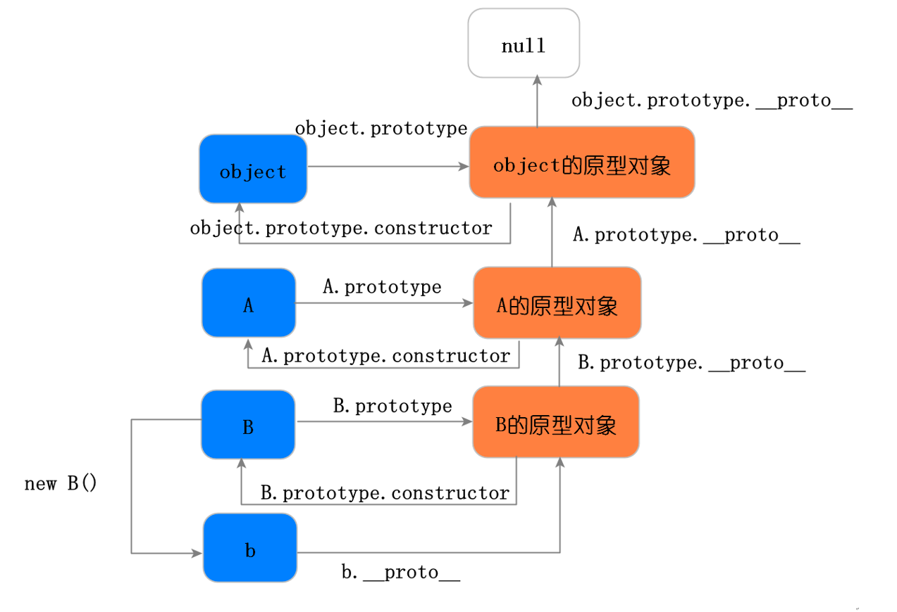

 实例 b 的原型链验证图：

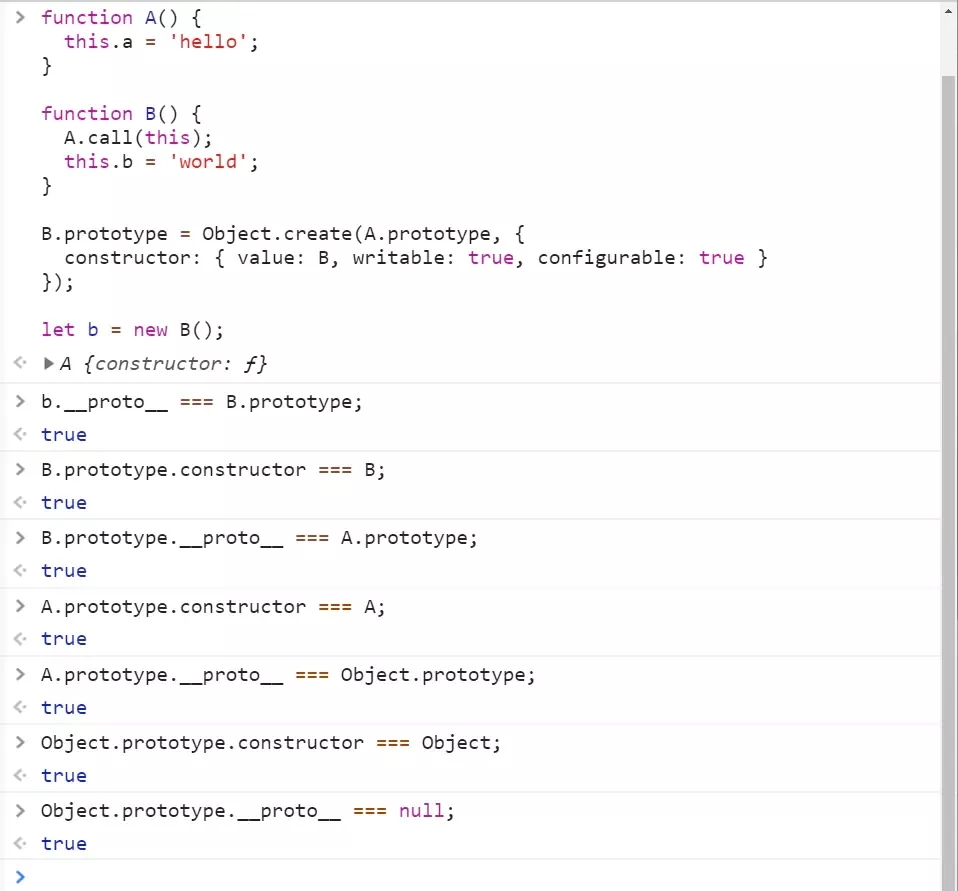

 构造函数 B 的原型链图下图：

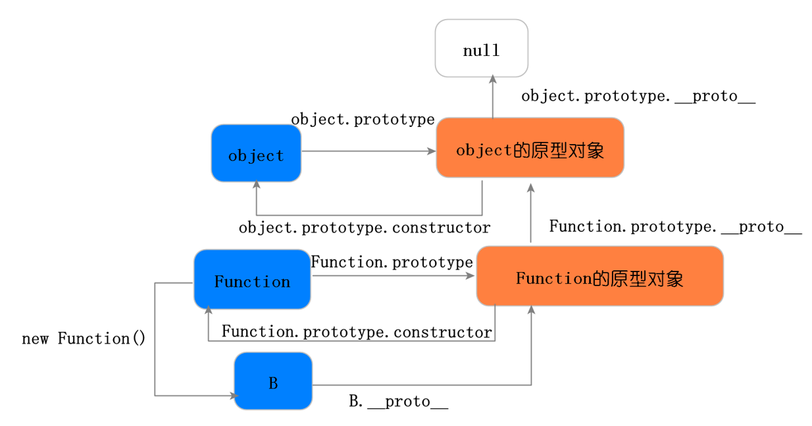

 构造函数 B 的原型链验证图：


 构造函数 A 的原型链图下图：

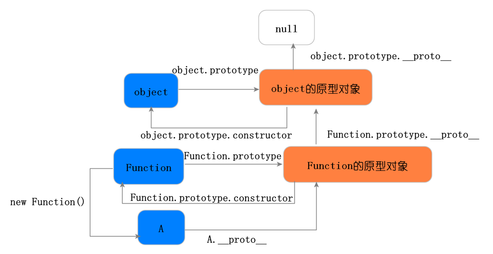

 构造函数 B 的原型链验证图：

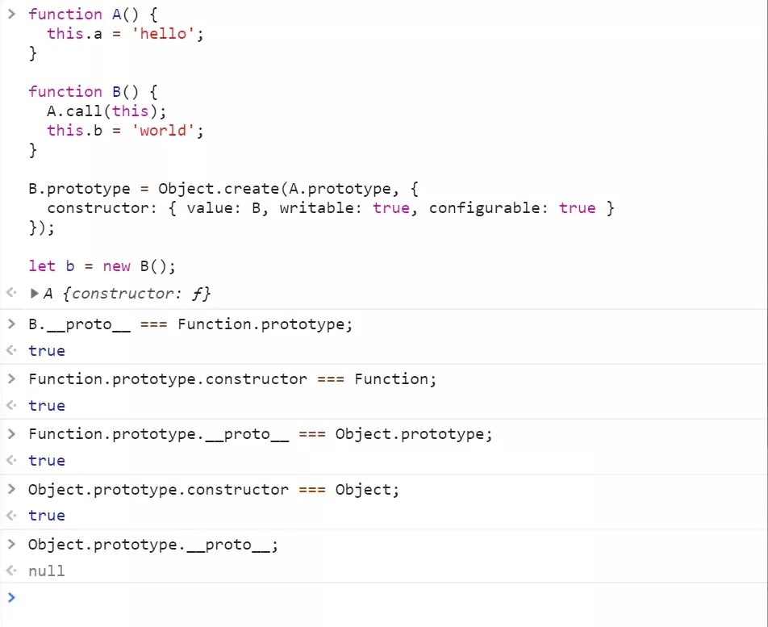

 从上面 6 幅图可知，构造函数 B 的实例 b 继承了构造函数 A 的实例属性，继承了构造函数 A 的原型对象上的属性，继承了构造函数 Object 的原型对象上的属性。构造函数 B 是构造函数 Function 的实例，继承了构造函数 Function 的原型对象上的属性，继承了构造函数 Object 的原型对象上的属性。 构造函数 A 是构造函数 Function 的实例，继承了构造函数 Function 的原型对象上的属性，继承了构造函数 Object 的原型对象上的属性。可看出，构造函数 A 与 构造函数 B 并没有继承关系，即构造函数 B 没有继承构造函数 A 上面的属性，在 ES6 中，用 extends 实现两个类的继承，两个类之间是有继承关系的，即子类继承了父类的方法，这是 ES6 与 ES5 继承的第一点区别，下面通过 ES6 的继承来说明这一点。

[更多有关继承-牛客网](https://www.nowcoder.com/issue/tutorial?tutorialId=96&uuid=7a253a443122467b8d022ca88d33ec62)

## js继承的方法和优缺点

- 继承的好处

  - a：提高了代码的复用性
  - b：提高了代码的维护性
  - c：让类与类之间产生了关系，是多态的前提

- 继承的弊端

  - 类的耦合性增强了，但是开发的原则：高内聚，低耦合

### 1.原型链继承

实现方式：将子类的原型链指向父类的对象实例

```js
function Parent(){
  this.name = "parent";
  this.list = ['a'];
}
Parent.prototype.sayHi = function(){
  console.log('hi');
}
function Child(){

}
Child.prototype = new Parent();
var child = new Child();
console.log(child.name); // parent
child.sayHi(); // hi
```

原理：子类实例child的__proto__指向Child的原型链prototype，而Child.prototype指向Parent类的对象实例，该父类对象实例的__proto__指向Parent.prototype，所以Child可继承Parent的构造函数属性、方法和原型链属性、方法

**优点：** 可继承构造函数的属性，父类构造函数的属性，父类原型的属性
**缺点：** 无法向父类构造函数传参；且所有实例共享父类实例的属性，若父类共有属性为引用类型，一个子类实例更改父类构造函数共有属性时会导致继承的共有属性发生变化；实例如下：

```js
var a = new Child();
var b = new Child();
a.list.push('b');
console.log(b.list); // ['a','b']
```

### 2.构造函数继承

实现方式：在子类构造函数中使用call或者apply劫持父类构造函数方法，并传入参数

```js
function Parent(name, id){
  this.id = id;
  this.name = name;
  this.printName = function(){
    console.log(this.name);
  }
}
Parent.prototype.sayName = function(){
  console.log(this.name);
};
function Child(name, id){
  Parent.call(this, name, id);
  // Parent.apply(this, arguments);
}
var child = new Child("jin", "1");
child.printName(); // jin
child.sayName() // Error
```

原理：使用call或者apply更改子类函数的作用域，使this执行父类构造函数，子类因此可以继承父类共有属性

**优点：** 可解决原型链继承的缺点
**缺点：** 不可继承父类的原型链方法，构造函数不可复用

### 3.组合继承

原理：综合使用构造函数继承和原型链继承

```js
function Parent(name, id){
  this.id = id;
  this.name = name;
  this.list = ['a'];
  this.printName = function(){
    console.log(this.name);
  }
}
Parent.prototype.sayName = function(){
  console.log(this.name);
};
function Child(name, id){
  Parent.call(this, name, id);
  // Parent.apply(this, arguments);
}
Child.prototype = new Parent();
var child = new Child("jin", "1");
child.printName(); // jin
child.sayName() // jin

var a = new Child();
var b = new Child();
a.list.push('b');
console.log(b.list); // ['a']
```

**优点：** 可继承父类原型上的属性，且可传参；每个新实例引入的构造函数是私有的
**缺点：** 会执行两次父类的构造函数，消耗较大内存，子类的构造函数会代替原型上的那个父类构造函数

### 4.原型式继承

原理：类似Object.create，用一个函数包装一个对象，然后返回这个函数的调用，这个函数就变成了个可以随意增添属性的实例或对象，结果是将子对象的__proto__指向父对象

```js
var parent = {
  names: ['a']
}
function copy(object) {
  function F() {}
  F.prototype = object;
  return new F();
}
var child = copy(parent);
console.log(child.names); // [ 'a' ]
```

缺点：共享引用类型

### 5.寄生式继承

原理：二次封装原型式继承，并拓展

```js
function createObject(obj) {
  var o = copy(obj);
  o.getNames = function() {
    console.log(this.names);
    return this.names;
  }
  return o;
}
```

优点：可添加新的属性和方法

### 6.寄生组合式继承

原理：改进组合继承，利用寄生式继承的思想继承原型

```js
function inheritPrototype(subClass, superClass) {
  // 复制一份父类的原型
  var p = copy(superClass.prototype);
  // 修正构造函数
  p.constructor = subClass;
  // 设置子类原型
  subClass.prototype = p;
}

function Parent(name, id){
  this.id = id;
  this.name = name;
  this.list = ['a'];
  this.printName = function(){
    console.log(this.name);
  }
}
Parent.prototype.sayName = function(){
  console.log(this.name);
};
function Child(name, id){
  Parent.call(this, name, id);
  // Parent.apply(this, arguments);
}
inheritPrototype(Child, Parent);
```

## new会发生什么

1. 创建空对象；
   var obj = {};
2. 设置新对象的constructor属性为构造函数的名称，设置新对象的 ** \_\_proto\_\_** 属性指向构造函数的prototype对象；
   obj.**\_\_proto\_\_** = ClassA.prototype;
   扩展了新对象的原型链。
3. 使用新对象调用函数，函数中的this被指向新实例对象：
   ClassA.call(obj);　　//{}.构造函数();
4. 返回this指针。当存在显示的返回时，返回return后面的内容。新建的空对象作废。

```js
function test() {
    this.name = "test";
}
test.prototype = {
    a:{},
    b:{}
}

var c = new test();
```

**手写new**

```js
function selfNew(fn, ...args) {
    // 创建一个instance对象，该对象的原型是fn.prototype
    let instance = Object.create(fn.prototype);
    // 调用构造函数，使用apply，将this指向新生成的对象
    let res = fn.apply(instance, args);
    // 如果fn函数有返回值，并且返回值是一个对象或方法，则返回该对象，否则返回新生成的instance对象
    return ((typeof res === "object" && res !== null) || typeof res === "function") ? res : instance;
}
```

## es6-箭头函数

1. 基本语法

   ES6中允许使用箭头=>来定义箭头函数，具体语法，我们来看一个简单的例子：

```js
// 箭头函数
let fun = (name) => {
    // 函数体
    return `Hello ${name} !`;
};

// 等同于
let fun = function (name) {
    // 函数体
    return `Hello ${name} !`;
};
```

   可以看出，定义箭头函数在语法上要比普通函数简洁得多。箭头函数省去了function关键字，采用箭头=>来定义函数。函数的参数放在=>前面的括号中，函数体跟在=>后的花括号中。

   关于箭头函数的参数：

   **①** 如果箭头函数没有参数，直接写一个空括号即可。

   **②** 如果箭头函数的参数只有一个，也可以省去包裹参数的括号。

   **③** 如果箭头函数有多个参数，将参数依次用逗号(,)分隔，包裹在括号中即可。

```js
// 没有参数
let fun1 = () => {
    console.log(111);
};

// 只有一个参数，可以省去参数括号
let fun2 = name => {
    console.log(`Hello ${name} !`)
};

// 有多个参数
let fun3 = (val1, val2, val3) => {
    return [val1, val2, val3];
};
```

   关于箭头函数的函数体：

   **①** 如果箭头函数的函数体只有一句代码，就是简单返回某个变量或者返回一个简单的JS表达式，可以省去函数体的大括号{ }。

```js
let f = val => val;
// 等同于
let f = function (val) { return val };

let sum = (num1, num2) => num1 + num2;
// 等同于
let sum = function(num1, num2) {
    return num1 + num2;
};
```

   **②** 如果箭头函数的函数体只有一句代码，就是返回一个对象，可以像下面这样写：

```js
// 用小括号包裹要返回的对象，不报错
let getTempItem = id => ({ id: id, name: "Temp" });

// 但绝不能这样写，会报错。
// 因为对象的大括号会被解释为函数体的大括号
let getTempItem = id => { id: id, name: "Temp" };
```

   **③** 如果箭头函数的函数体只有一条语句并且不需要返回值（最常见是调用一个函数），可以给这条语句前面加一个void关键字

```js
let fn = () => void doesNotReturn();
```

箭头函数最常见的用处就是简化回调函数。

```js
// 例子一
// 正常函数写法
[1,2,3].map(function (x) {
    return x * x;
});

// 箭头函数写法
[1,2,3].map(x => x * x);

// 例子二
// 正常函数写法
var result = [2, 5, 1, 4, 3].sort(function (a, b) {
    return a - b;
});

// 箭头函数写法
var result = [2, 5, 1, 4, 3].sort((a, b) => a - b);
```

2. 箭头函数与普通函数的区别

   2.1 语法更加简洁、清晰

   从上面的基本语法示例中可以看出，箭头函数的定义要比普通函数定义简洁、清晰得多，很快捷。

   2.2 箭头函数不会创建自己的this

   箭头函数没有自己的this，它会捕获自己在**定义时**（注意，是定义时，不是调用时）所处的**外层执行环境的this**，并继承这个this值。所以，箭头函数中this的指向在它被定义的时候就已经确定了，之后永远不会改变。

```js
var id = 'Global';

function fun1() {
    // setTimeout中使用普通函数
    setTimeout(function(){
        console.log(this.id);
    }, 2000);
}

function fun2() {
    // setTimeout中使用箭头函数
    setTimeout(() => {
        console.log(this.id);
    }, 2000)
}

fun1.call({id: 'Obj'});     // 'Global'

fun2.call({id: 'Obj'});     // 'Obj'
```

   上面这个例子，函数fun1中的setTimeout中使用普通函数，2秒后函数执行时，这时函数其实是在全局作用域执行的，所以this指向Window对象，this.id就指向全局变量id，所以输出'Global'。 但是函数fun2中的setTimeout中使用的是箭头函数，这个箭头函数的this在定义时就确定了，它继承了它外层fun2的执行环境中的this，而fun2调用时this被call方法改变到了对象{id: 'Obj'}中，所以输出'Obj'

```js
var id = 'GLOBAL';
var obj = {
    id: 'OBJ',
    a: function(){
        console.log(this.id);
    },
    b: () => {
        console.log(this.id);
    }
};

obj.a();    // 'OBJ'
obj.b();    // 'GLOBAL'
```

上面这个例子，对象obj的方法a使用普通函数定义的，**普通函数作为对象的方法调用时，this指向它所属的对象**。所以，this.id就是obj.id，所以输出'OBJ'。 但是方法b是使用箭头函数定义的，箭头函数中的this实际是继承的它定义时所处的全局执行环境中的this，所以指向Window对象，所以输出'GLOBAL'。**这里要注意，定义对象的大括号{}是无法形成一个单独的执行环境的，它依旧是处于全局执行环境中！！**

3. 箭头函数继承而来的this指向永远不变（重要！！深入理解！！）

   上面的例子，就完全可以说明箭头函数继承而来的this指向永远不变。对象obj的方法b是使用箭头函数定义的，这个函数中的this就**永远指向**它定义时所处的全局执行环境中的this，即便这个函数是作为对象obj的方法调用，this依旧指向Window对象。

4. .call()/.apply()/.bind()无法改变箭头函数中this的指向

   .call()/.apply()/.bind()方法可以用来动态修改函数执行时this的指向，但由于箭头函数的this定义时就已经确定且永远不会改变。所以使用这些方法永远也改变不了箭头函数this的指向，虽然这么做代码不会报错。

```js
var id = 'Global';  // let 的话会变成undefined
// 箭头函数定义在全局作用域
let fun1 = () => {
    console.log(this.id)
};

fun1();     // 'Global'
// this的指向不会改变，永远指向Window对象
fun1.call({id: 'Obj'});     // 'Global'
fun1.apply({id: 'Obj'});    // 'Global'
fun1.bind({id: 'Obj'})();   // 'Global'

let fun2 = function () {
    console.log(this.id);
}

fun2();     // 'Global'
fun2.call({ id: 'Obj1' });     // 'Obj1'
fun2.apply({ id: 'Obj1' });    // 'Obj1'
fun2.bind({ id: 'Obj1' })();   // 'Obj1'
```

5. 箭头函数不能作为构造函数使用

   我们先了解一下构造函数的new都做了些什么？简单来说，分为四步： ① JS内部首先会先生成一个对象； ② 再把函数中的this指向该对象； ③ 然后执行构造函数中的语句； ④ 最终返回该对象实例。

   但是因为箭头函数没有自己的this，它的this其实是继承了外层执行环境中的this，且this指向永远不会随在哪里调用、被谁调用而改变，所以箭头函数不能作为构造函数使用，或者说构造函数不能定义成箭头函数，否则用new调用时会报错

```js
let Fun = (name, age) => {
    this.name = name;
    this.age = age;
};

// 报错
let p = new Fun('cao', 24);
```

6. 箭头函数没有自己的arguments

   箭头函数没有自己的arguments对象。在箭头函数中访问arguments实际上获得的是外层局部（函数）执行环境中的值。

```js
// 例子一
let fun = (val) => {
    console.log(val);   // 111
    // 下面一行会报错
    // Uncaught ReferenceError: arguments is not defined
    // 因为外层全局环境没有arguments对象
    console.log(arguments);
};
fun(111);

// 例子二
function outer(val1, val2) {
    let argOut = arguments;
    console.log(argOut);    // ①
    let fun = () => {
        let argIn = arguments;
        console.log(argIn);     // ②
        console.log(argOut === argIn);  // ③
    };
    fun();
}
outer(111, 222);
```

   上面例子二，①②③处的输出结果如下：

   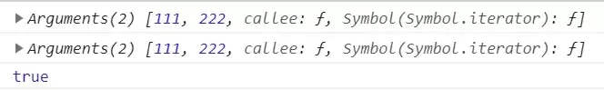

   很明显，普通函数outer内部的箭头函数fun中的arguments对象，其实是沿作用域链向上访问的外层outer函数的arguments对象。

   **可以在箭头函数中使用rest参数代替arguments对象，来访问箭头函数的参数列表！！**

7. 箭头函数没有原型prototype

```js
let sayHi = () => {；
    console.log('Hello World !')
};
console.log(sayHi.prototype); // undefined
```

8. 箭头函数不能用作Generator函数，不能使用yeild关键字

## es6新特性

### 1. 变量和作用域

   1.1 let const var

   1.2 解构赋值（按照一定的结构解析出来进行赋值）

   解构赋值的使用场景：变量快捷赋值、提取数据、函数参数定义和默认值、遍历某结构

### 2. 原生对象的方法扩展

   2.1 String

   加强了对unicode的支持、支持字符串遍历（后面有讲到实际上是部署了iterator接口）、repeat()等方法的支持、**模板字符串**

   2.2 RegExp

   构造函数第一个参数是正则表达式，指定第二个参数不再报错、u修饰符、y修饰符、s修饰符

   2.3 Number

   二进制和八进制新写法、新方法parseInt()、Number.EPSILON极小常量、安全整数、Math新方法

   2.4 Function

   **函数参数默认值**、rest参数、**函数内部严格模式**、函数的name属性、**箭头函数**

   2.5 Array

   **扩展运算符...**

   2.6 Object 和 Symbol

   (1) Object对象

   支持**简写**：同名属性K-V可以省略一个、函数声明可以省略function；支持**属性名表达式**、函数名表达式。（注意：以上2个——表达式和简写不能同时使用）。
   对象的方法的name属性返回方法名，但有几个例外情况要小心。新增了Object方法
   Object.is()——用于解决==和===的部分兼容问题
   Object.assign()——将src的所有可枚举对象属性复制到dest对象上（浅复制）
   Object.setPrototypeOf()、Object.getPrototypeOf() (Object.__proto__属性)
   Object.entries()、Object.keys()、Object.values()
   ES6中5种遍历对象属性的方法

   **for-in——自身和继承的可枚举属性（除Symbol）**

   **Object.keys()——自身非继承的可枚举属性（除Symbol）**

   **Object.getOwnPropertyNames()——自身所有属性键名（包括不可枚举、除Symbol）**

   **Object.getOwnPropertySymbols()——自身的所有 Symbol 属性的键名**

   **Reflect.ownKeys()——自身的所有键名**

   （2）Symbol类型

   ES5以前，对象属性都只能是字符串，容易造成重命名导致的冲突。Symbol提供了一种机制，可以保存属性名是独一无二的。Symbol类型的使用注意：1）创建是调用函数，而不是new关键字 2）Symbol类型的属性不会被for-*、Object.keys()、Object.getPropertyNames()返回，可以用后面两种方法遍历。

### 3. 数据结构Set和Map

   Set是一种类似数组的数据结构，区别在于其存储的成员都是不重复的，由此带来了它的一个应用就是：**去重**。Set通过new关键字实例化，入参可以是数组or类数组的对象。

   值得注意的是：在Set中，只能存储一个NaN，**这说明在Set数据结构中，NaN等于NaN**。

   Set实例的方法：操作方法add()、delete()、has()和clear()；遍历方法：keys()、values()、entries()和forEach();扩展运算符...、数组方法map()、filter()方法也可以用于Set结构。由此它可以很方便的实现数组的交、并、差集。

   WeakSet类似于Set，**主要区别在于1.成员只能是对象类型；2.对象都是弱引用**（如果其他对象都不再引用该对象，垃圾回收机制会自动回收该对象所占的内存，不可预测何时会发生，故WeakSet不可被遍历）

   JavaScript对象Object都是键值K-V对的集合，但K取值只能是字符串和Symbol，Map也是K-V的集合，然而其K可以取任意类型。如果需要键值对的集合，Map比Object更适合。Map通过new关键字实例化。

   Map实例的方法：set()、get()、has()、delete()和clear();遍历方法同Set。

   Map与其它数据结构的互相转换：Map <---> 数组| Map <---> 对象| Map <---> JSON。

   WeakMap类似于Map，主要区别在于：**1.只接受对象作为键名；2.键名所指向的对象不计入垃圾回收机制**。

### 4. 元编程相关Proxy和Reflect

   4.1 Proxy

   对目标对象加一层“拦截”（“代理”），外界对对象的访问、修改都必须先通过这层拦截层。因而它提供了一个机制可以对外界的访问进行过滤和改写。

   用法：var proxy = new Proxy(p1,p2); p1是要被代理的目标对象，p2是配置对象。

   值得注意的是：**Proxy不是对目标对象透明的代理**——即使不做任何拦截的情况下无法保证代理对象与目标对象行为的完全一致。（主要原因在于代理时，目标对象内部的this会指向代理对象）

   4.2 Reflect

   与Proxy一样是ES6为**语言层面的用于操作对象提供的新API**，目前它所拥有的对象方法与Proxy对象一一对应，**引入目的**：1.将Object对象上一些属于语言内部的方法放在Reflect上（目前都可以放）2.修改Object对象上某些方法的返回值，使得更加合理化（健壮）3.让Object对象的操作从命令式完全转化为函数式

### 5. 异步编程Promise、Generator和Async

   在JavaScript的世界里，对于**异步编程存在如下几种方案：1.回调函数；2.事件触发监听；3.发布订阅者模式；4.Promise**。首先介绍Promise，然后介绍ES6提供的生成器函数，async函数。

   Promise来源于社区，代表一个对象，它代表异步操作未来的一个结果（承诺）。它总共有**三个状态**，pending\fulfilled\rejected。另外，它的状态**翻转路径只有两个**：pending->fulfilled or pending->rejected，一旦状态翻转，就不可变了。它支持链式调用，支持错误传递，支持以同步代码的方式写异步操作。

   Promise是一个对象，创建此对象实例的方法如下（可以理解resolve和reject是已返回的承诺对象未来回调函数的占位）

   Generator函数是ES6提供的异步编程解决方案。对于Generator函数，可以将它**理解为一个状态机，封装了多个内部状态；此外它还是一个遍历器生成函数**，这个函数可以遍历出状态机的所有状态。

   函数特征：关键字function与函数名之间有*，函数体内部yeild关键字。

   **生成器函数与普通函数的区别**：函数调用后不执行，而是返回一个指针对象（遍历器对象）。调用对象的next()方法，执行一段yield逻辑。故函数的分段执行的，**yield是暂停执行的标志，next()可以恢复执行**。

   **yield与return的区别**：yield有记忆功能，return没有；一个函数可以多次执行yeild，但只会return一次

   **async函数**是Generator函数的语法糖，它进行了**改进：1.自带执行器；2.返回值是Promise;**

   三家对比：**使用Promise的异步代码存在大量自有API的调用，操作本身的语义夹杂其中，不是很清晰；Generator函数实现的异步代码语义比Promise清晰，但需要一个执行器；async函数的写法最简洁、符合语义，不需要执行器**。

### 6. 语言层面类、模块的支持

   6.1 class

   从 ES6 开始，JavaScript 提供了 class 关键字来定义类，尽管，这样的方案仍然是基于原型运行时系统的模拟，大部分功能ES5可以实现。

   构造函数的prototype属性在 ES6 的“类”上面继续存在。事实上，类中所有方法都定义在类的prototype属性上面（因而也是不可枚举的）。

   constructor方法是类的默认方法，通过new命令生成对象实例时，自动调用该方法。一个类必须有constructor方法，如果没有显式定义，一个空的constructor方法会被默认添加。（默认构造函数）；constructor方法默认返回实例对象（即this），完全可以指定返回另外一个对象。

   注意区别：*类必须使用**new**调用，否则会报错*。这是它跟普通构造函数的一个主要区别，后者不用new也可以执行。

   类相当于实例的原型，所有在类中定义的方法，都会被实例继承。如果在一个方法前，加上static关键字，就表示该方法不会被实例继承，而是直接通过类来调用，这就称为“静态方法”。

   实例属性除了定义在constructor()方法里面的this上面，也可以定义在类的最顶层。

   私有属性和方法如何实现？1.命名上加以区别 2.将私有方法移出模块，利用公有方法调用；3.Symbol属性上（都不完美）

   6.2 module

   在 ES6 之前，社区制定了一些模块加载方案，最主要的有 CommonJS 和 AMD 两种。前者用于服务器，后者用于浏览器。ES6 模块的设计思想是尽量的静态化，使得**编译时就能确定**模块的依赖关系，以及输入和输出的变量。CommonJS 和 AMD 模块，都只能在**运行时确定。**

   **编译时加载VS运行时加载——对象VS代码**

   模块命令：export和import；一个文件即为一个模块，除非导入否则外部无法读取模块属性；

   export支持：变量、函数和类

   export命令可以出现在模块的任何位置，只要处于模块顶层就可以。如果处于块级作用域内，就会报错，下一节的import命令也是如此。

   输入的变量都是只读的，因为它的本质是输入接口。也就是说，不允许在加载模块的脚本里面，改写接口。由于import是静态执行，所以不能使用表达式和变量，这些只有在运行时才能得到结果的语法结构。

   使用import命令的时候，用户需要知道所要加载的变量名或函数名，否则无法加载。但是，用户肯定希望快速上手，未必愿意阅读文档，去了解模块有哪些属性和方法。为了给用户提供方便，让他们不用阅读文档就能加载模块，就要用到export default命令，为模块指定默认输出。

   模块之间也可以继承。

### 7. JS中对象分类、及其它原生对象

   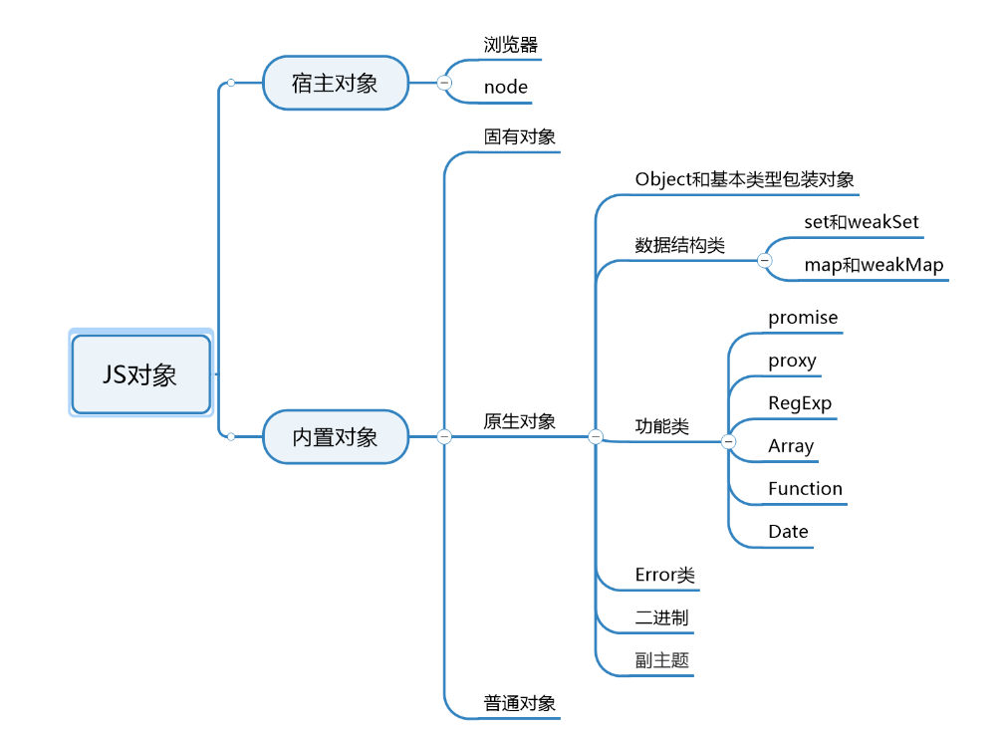

### 8. Iterator

   ES6之前在JS中只有Array和对象可以表示“集合”这种数据结构，ES6中增加了：Set和Map。由此，四种之间互相组合又可以定义新的数据结构。这些**新定义的数据结构如何访问呢？遍历器（Iterator）就是这样一种机制。它是一种接口，为各种不同的数据结构提供统一的访问机制**。任何数据结构只要部署 Iterator 接口，就可以完成遍历操作。遍历器对象本质上是一个指针对象。

   只要为某个数据结构部署了Iterator接口，则可以称此数据结构是可遍历的。iterator属性部署在Symbol上。如下对象默认部署了Iterator接口：Array Set Map String等。部署iterator结构的**要点：1）在Symbol.iterator上部署；2）必须包含next()函数**。默认调用iterator接口的场景：解构赋值、...扩展运算符、yeild* 。for-of循环内部调用的即是调用数据机构内部的Symbol.iterator方法。

   **for-in和for-of循环**

   for-in用于遍历对象属性，对象自身和继承的可枚举属性（不可遍历Symbol属性）

   for-of循环是一种遍历所有数据机构的统一方法。实现原理是数据结构上部署的Symbol.iterator属性。

## Class类

1） Class 类可以看作是构造函数的语法糖
```js
class Point {}
console.log(typeof Point); // "function"
console.log(Point === Point.prototype.constructor); // true
```
2） Class 类中定义的方法，都是定义在该构造函数的原型上
```js
class Point {
  constructor() {}
  toString() {}
}
// 等同于
Point.prototype = { constructor() {}, toString() {} };
```
3）使用static关键字，作为静态方法（静态方法，只能通过类调用，实例不能调用）
```js
class Foo {
  static classMethod() {
    return "hello";
  }
}
Foo.classMethod(); // 'hello'
```
4）实例属性的简写写法
```js
class Foo {
  bar = "hello";
  baz = "world";
}
// 等同于
class Foo {
  constructor() {
    this.bar = "hello";
    this.baz = "world";
  }
}
```
5）extends 关键字，底层也是利用的寄生组合式继承
```js
class Parent {
  constructor(age) {
    this.age = age;
  }
  getName() {
    console.log(this.name);
  }
}
class Child extends Parent {
  constructor(name, age) {
    super(age);
    this.name = name;
  }
}
let child = new Child("li", 16);
child.getName(); // li
```

### 手写Class类

ES6的 Class 内部是基于寄生组合式继承，它是目前最理想的继承方式
ES6的 Class 允许子类继承父类的静态方法和静态属性

```js
// Child 为子类的构造函数， Parent为父类的构造函数
function selfClass(Child, Parent) {
  // Object.create 第二个参数，给生成的对象定义属性和属性描述符/访问器描述符
  Child.prototype = Object.create(Parent.prototype, {
    // 子类继承父类原型上的属性和方法
    constructor: {
      enumerable: false,
      configurable: false,
      writable: true,
      value: Child
    }
  });
  // 继承父类的静态属性和静态方法
  Object.setPrototypeOf(Child, Parent);
}

// 测试
function Child() {
  this.name = 123;
}
function Parent() {}
// 设置父类的静态方法getInfo
Parent.getInfo = function() {
  console.log("info");
};
Parent.prototype.getName = function() {
  console.log(this.name);
};
selfClass(Child, Parent);
Child.getInfo(); // info
let tom = new Child();
tom.getName(); // 123
```

## 哪些类型能被扩展运算符...扩展

**适用类型**：数组、对象、字符串。

复杂数据类型都可以，当要转化为可迭代数据结构时可设置对象的迭代器对扩展运算符扩展出来的值进行操作。

基础数据只有string可以使用扩展运算符，number,boolean,null,undefined无效

### 扩展运算符的应用场景

```js
// 1、函数调用
function add(x, y) {
  return x + y;
}
add(...[4, 38]);

function f(v, w, x, y, z) {  }
f(-1, ...[0, 1], 2, ...[3]);

//2.往数组里push多个元素
var arr1 = [0, 1, 2];
var arr2 = [3, 4, 5];
arr1.push(...arr2);  
console.log(arr1); //[0,1,2,3,4,5]

//3.替代函数的apply方法
function f(x, y, z) {  }  
var args = [0, 1, 2];
f.apply(null, args); //ES5 的写法
f(...args); //ES6的写法

//4.求一个数组的最大数简化
Math.max.apply(null, [14, 3, 77])  //ES5 的写法
Math.max(...[14, 3, 77])  //ES6 的写法，等同于Math.max(14, 3, 77)

//5.扩展运算符后面可以放表达式
const arr = [...(5 > 0 ? ['a'] : []),'b'];
console.log(arr);  //['a','b'] 

//6.与解构赋值结合，用于生成数组
const a1 = [1, 2];
const a2 = [...a1];  //写法1
const [...a2] = a1;  //写法2
const [first, ...rest] = [1, 2, 3, 4, 5];
first  //1
rest  //[2, 3, 4, 5]

const [first, ...rest] = [];
first  //undefined
rest  //[]

const [first, ...rest] = ["foo"];
first  //"foo"
rest   //[]

//7.合并数组
[...arr1, ...arr2, ...arr3]  //[ 'a', 'b', 'c', 'd', 'e' ]

//8.数组的克隆——————————————特别注意（基本类型是深拷贝，引用类型是浅拷贝）
var arr1 = [0, 1, 2];
var arr2 = [...arr1];
arr1[0]=100;
console.log(arr2); //[0, 1, 2]
/* 乍一看，arr2与arr1不共用引用地址，arr2不随着arr1变化，接着往下看 */
var arr1 = [0, [1,11,111], 2];
var arr2 = [...arr1];
arr1[1][0]=100;
console.log(arr2); //[0, [100,11,111], 2]
```

## js工作原理

### 为什么js是单线程

这主要和js的用途有关，js是作为浏览器的脚本语言，主要是实现用户与浏览器的交互，以及操作dom；这决定了它只能是单线程，否则会带来很复杂的同步问题。 举个例子：如果js被设计了多线程，如果有一个线程要修改一个dom元素，另一个线程要删除这个dom元素，此时浏览器就会一脸茫然，不知所措。所以，为了避免复杂性，从一诞生，JavaScript就是单线程，这已经成了这门语言的核心特征，将来也不会改变

**扩展：**

什么是进程？

进程：是cpu分配资源的最小单位；（是能拥有资源和独立运行的最小单位）

什么是线程？

线程：是cpu调度的最小单位；（线程是建立在进程的基础上的一次程序运行单位，一个进程中可以有多个线程）

浏览器是多进程的？

放在浏览器中，每打开一个tab页面，其实就是新开了一个进程，在这个进程中，还有ui渲染线程，js引擎线程，http请求线程等。 所以，浏览器是一个多进程的。

为了利用多核CPU的计算能力，HTML5提出Web Worker标准，允许JavaScript脚本创建多个线程，但是子线程完全受主线程控制，且不得操作DOM。所以，这个新标准并没有改变JavaScript单线程的本质。

### 宏微队列及执行顺序

JS 中用来存储待执行回调函数的队列包含 2 个不同特定的列队

- **宏列队**：用来保存待执行的宏任务（回调），比如：定时器回调、DOM 事件回调、ajax 回调
- **微列队**：用来保存待执行的微任务（回调），比如：promise的回调、MutationObserver 的回调

JS 执行时会区别这 2 个队列

- JS 引擎首先必须先执行所有的初始化同步任务代码
- 每次准备取出第一个宏任务执行前, 都要将所有的微任务一个一个取出来执行，也就是优先级比宏任务高，且与微任务所处的代码位置无关

下面这个例子可以看出Promise要先于setTimeout执行：

```js
　　setTimeout(() => { //立即放入宏队列
      console.log('timeout callback1（）')
      Promise.resolve(3).then(
        value => { //立即放入微队列
          console.log('Promise onResolved3()', value)
        }
      )
    }, 0)

    setTimeout(() => { //立即放入宏队列
      console.log('timeout callback2（）')
    }, 0)

    Promise.resolve(1).then(
      value => { //立即放入微队列
        console.log('Promise onResolved1()', value)
        setTimeout(() => {
          console.log('timeout callback3（）', value)
        }, 0)
      }
    )

    Promise.resolve(2).then(
      value => { //立即放入微队列
        console.log('Promise onResolved2()', value)
      }
    )

    // Promise onResolved1() 1
    // Promise onResolved2() 2
    // timeout callback1（）
    // Promise onResolved3() 3
    // timeout callback2（）
    // timeout callback3（） 1
```

### 死锁

死锁是指两个或两个以上的进程在执行过程中，由于竞争资源而造成阻塞的现象，若无外力作用，它们都将无法继续执行

产生原因

- 竞争资源引起进程死锁
- 可剥夺和非剥夺资源
- 竞争非剥夺资源
- 竞争临时性资源
- 进程推进顺序不当

产生条件

1. 互斥条件：涉及的资源是非共享的
   - 涉及的资源是非共享的,一段时间内某资源只由一个进程占用,如果此时还有其它进程请求资源，则请求者只能等待，直至占有资源的进程用毕释放
2. 不剥夺条件：不能强行剥夺进程拥有的资源
   - 进程已获得的资源，在未使用完之前，不能被剥夺，只能在使用完时由自己释放
3. 请求和保持条件：进程在等待一新资源时继续占有已分配的资源
   - 指进程已经保持至少一个资源，但又提出了新的资源请求，而该资源已被其它进程占有，此时请求进程阻塞，但又对自己已获得的其它资源保持不放，环路等待条件：存在一种进程的循环链，链中的每一个进程已获得的资源同时被链中的下一个进程所请求，在发生死锁时，必然存在一个进程——资源的环形链

解决办法

只要打破四个必要条件之一就能有效预防死锁的发生

### 暂时性死区

暂时性死区的本质就是，只要一进入当前作用域，所要使用的变量就已经存在了，但是不可获取，只有等到声明变量的那一行代码出现，才可以获取和使用该变量。

**扩展：**

let 、const与暂时性死区

let或const声明的变量拥有暂时性死区（TDZ）：当进入它的作用域，它不能被访问（获取或设置）直到执行到达声明。

首先看看不具有暂时性死区的var：

- 当进入var变量的作用域（包围它的函数），立即为它创建（绑定）存储空间。变量会立即被初始化并赋值为undefined。
- 当执行到变量声明的时候，如果变量定义了值则会被赋值。

通过let声明的变量拥有暂时性死区，生命周期如下：

- 当进入let变量的作用域（包围它的语法块），立即为它创建（绑定）存储空间。此时变量仍是未初始化的。
- 获取或设置未初始化的变量将抛出异常ReferenceError。
- 当执行到变量声明的时候，如果变量定义了值则会被赋值。如果没有定义值，则赋值为undefined。

const工作方式与let类似，但是定义的时候必须赋值并且不能改变。

在 TDZ 内部，如果获取或设置变量将抛出异常：

```js
if (true) { // enter new scope, TDZ starts
    // Uninitialized binding for `tmp` is created

    tmp = 'abc'; // ReferenceError
    console.log(tmp); // ReferenceError

    let tmp; // TDZ ends, `tmp` is initialized with `undefined`
    console.log(tmp); // undefined

    tmp = 123;
    console.log(tmp); // 123
}
```

下面的示例将演示死区（dead zone）是真正短暂的（基于时间）和不受空间条件限制（基于位置）

```js
if (true) { // enter new scope, TDZ starts
    const func = function () {
        console.log(myVar); // OK!
    };

    // Here we are within the TDZ and
    // accessing `myVar` would cause a `ReferenceError`

    let myVar = 3; // TDZ ends
    func(); // called outside TDZ
}
```

typeof与暂时性死区

变量在暂时性死区无法被访问，所以无法对它使用typeof：

```js
if (true) {
    console.log(typeof tmp); // ReferenceError
    let tmp;
}
```

## 设计模式

设计模式是从许多优秀的软件系统中，总结出的成功的、能够实现可维护性、复用的设计方案，使用这些方案将可以让我们避免做一些重复性的工作

### 单例模式

一个类只能构造出唯一实例
应用案例：弹框
单例模式示例
```js
class Single {
  constructor(name) {
    this.name = name;
  }
  static getInstance(name) {
    // 静态方法
    if (!this.instance) {
      // 关键代码 this指向的是Single这个构造函数
      this.instance = new Single(name);
    }
    return this.instance;
  }
}

let single1 = Single.getInstance("name1");
let single2 = Single.getInstance("name2");
// this.instance两次都是 Single { name: 'name1' }
console.log(single1 === single2);  // true
```

### 策略模式

根据不同参数命中不同的策略
应用案例：表单验证
策略模式的表单验证示例
```js
// 策略对象
const strategies = {
  // 验证是否为空
  isNoEmpty: function (value, errorMsg) {
    if (value.trim() === "") {
      return errorMsg;
    }
  },
  // 验证最小长度
  minLength: function (value, length, errorMsg) {
    if (value.trim().length < length) {
      return errorMsg;
    }
  },
  // 验证最大长度
  maxLength: function (value, length, errorMsg) {
    if (value.length > length) {
      return errorMsg;
    }
  },
  // 验证手机号
  isMobile: function (value, errorMsg) {
    if (
      !/^(13[0-9]|14[5|7]|15[0|1|2|3|5|6|7|8|9]|17[7]|18[0|1|2|3|5|6|7|8|9])\d{8}$/.test(
        value
      )
    ) {
      return errorMsg;
    }
  }
};

// 验证类
class Validator {
  constructor() {
    this.cache = []; // 存储要验证的方法
    this.errList = []; // 存储最终的验证结果
  }
  add(value, rules) {
    for (let i = 0, rule; (rule = rules[i++]);) {
      // ["minLength","6"]
      let strategyAry = rule.strategy.split(":");
      let errorMsg = rule.errorMsg;
      this.cache.push(() => {
        // minLength
        let strategy = strategyAry.shift();
        // [value,(length,)errorMsg]
        strategyAry.unshift(value);
        strategyAry.push(errorMsg);
        // 执行策略对象中的不同验证规则
        let error = strategies[strategy](...strategyAry);
        if (error) {
          this.errList.push(error);
        }
      });
    }
  }
  start() {
    for (let i = 0, validatorFunc; (validatorFunc = this.cache[i++]);) {
      validatorFunc();
    }
    return this.errList;
  }
}

let validataFunc = function (info) {
  let validator = new Validator();
  validator.add(info.userName, [
    {
      strategy: "isNoEmpty",
      errorMsg: "用户名不可为空"
    },
    {
      strategy: "minLength:2",
      errorMsg: "用户名长度不能小于2位"
    }
  ]);
  validator.add(info.password, [
    {
      strategy: "minLength:6",
      errorMsg: "密码长度不能小于6位"
    }
  ]);
  validator.add(info.phoneNumber, [
    {
      strategy: "isMobile",
      errorMsg: "请输入正确的手机号码格式"
    }
  ]);
  return validator.start();
};

// 需要验证表单的对象
let userInfo = {
  userName: "王",
  password: "1234",
  phoneNumber: "666"
};
let errorMsg = validataFunc(userInfo);
console.log(errorMsg); // ['用户名长度不能小于2位', '密码长度不能小于6位', '请输入正确的手机号码格式']
```

### 代理模式

代理对象和本体对象具有一致的接口
应用案例：图片预加载
图片代理模式示例
```js
// 代理模式
let relImage = (function() {
  let imgNode = document.createElement("img");
  document.body.appendChild(imgNode);
  return {
    setSrc(src) {
      imgNode.src = src;
    }
  };
})();
let proxyImage = (function() {
  let img = new Image();
  // 实际要加载的图片 加载成功后 替换调占位图
  img.onload = function() {
    relImage.setSrc(img.src);
  };
  return {
    setSrc(src) {
      img.src = src;
      // 设置占位图
      relImage.setSrc(
        "https://fuss10.elemecdn.com/e/5d/4a731a90594a4af544c0c25941171jpeg.jpeg"
      );
    }
  };
})();

// 设置实际要加载的图片
proxyImage.setSrc(
  "https://cube.elemecdn.com/6/94/4d3ea53c084bad6931a56d5158a48jpeg.jpeg"
);
```

### 装饰者模式

在不改变对象自身的基础上，动态地给某个对象添加一些额外的职责
应用案例：在函数执行前后添加新的方法
装饰者模式示例
```js
function fuc() {
  console.log(2);
}
Function.prototype.before = function(beFn) {
  let self = this;
  return function() {
    beFn.apply(this, arguments); // 先执行插入到前面的方法，类似于二叉树的前序遍历
    return self.apply(this, arguments); // 后执行当前的方法
  };
};
Function.prototype.after = function(afFn) {
  let self = this;
  return function() {
    self.apply(this, arguments); // 先执行当前的方法
    return afFn.apply(this, arguments); // 后执行插入到后面的方法
  };
};

function fuc1() {
  console.log(1);
}
function fuc3() {
  console.log(3);
}
function fuc4() {
  console.log(4);
}

fuc = fuc.before(fuc1).before(fuc4).after(fuc3);
fuc();

// 最终打印结果：4 1 2 3
```

### 组合模式

组合模式在对象间形成树形结构
组合模式中基本对象和组合对象被一致对待
无须关心对象有多少层, 调用时只需在根部进行调用
应用案例： 打印文件目录
函数组合模式示例
```js
class Combine {
  constructor() {
    this.list = [];
  }
  add(fn) {
    this.list.push(fn);
    return this; // 链式调用
  }
  excute() {
    for (let i = 0; i < this.list.length; i++) {
      this.list[i].excute();
    }
  }
}
let comb1 = new Combine();
comb1
  .add({
    excute() {
      console.log(1);
    }
  })
  .add({
    excute() {
      console.log(2);
    }
  });

let comb2 = new Combine();
comb2
  .add({
    excute() {
      console.log(3);
    }
  })
  .add({
    excute() {
      console.log(4);
    }
  });

let comb3 = new Combine();
comb3
  .add({
    excute() {
      console.log(5);
    }
  })
  .add({
    excute() {
      console.log(6);
    }
  });
comb2.add(comb3);

let comb4 = new Combine();
comb4.add(comb1).add(comb2);
comb4.excute();

// 最终打印结果：1 2 3 4 5 6
```

### 工厂模式

工厂模式是用来创建对象的一种最常用的设计模式
不暴露创建对象的具体逻辑，而是将逻辑封装在一个函数中，这个函数就可以被视为一个工厂
应用案例： jquery中的window.$
工厂模式示例
```js
class Car {
  constructor(name, color) {
    this.name = name;
    this.color = color;
  }
}
class Factory {
  static create(type) {
    switch (type) {
      case "car":
        return new Car("汽车", "白色");
        break;
      case "bicycle":
        return new Car("自行车", "黑色");
        break;
      default:
        console.log("没有该类型");
    }
  }
}
let p1 = Factory.create("car");
let p2 = Factory.create("bicycle");
console.log(p1, p1 instanceof Car); // {name: '汽车', color: '白色'} true
console.log(p2, p2 instanceof Car); // {name: '自行车', color: '黑色'} true
```

### 访问者模式

在不改变该对象的前提下访问其结构中元素的新方法
应用案例：babel插件
访问者模式示例
```js
// 元素类
class Student {
  constructor(name, chinese, math, english) {
    this.name = name;
    this.chinese = chinese;
    this.math = math;
    this.english = english;
  }

  accept(visitor) {
    visitor.visit(this);
  }
}

// 访问者类
class ChineseTeacher {
  visit(student) {
    console.log(`语文 ${student.chinese}`);
  }
}

class MathTeacher {
  visit(student) {
    console.log(`数学 ${student.math}`);
  }
}

class EnglishTeacher {
  visit(student) {
    console.log(`英语 ${student.english}`);
  }
}

// 实例化元素类
const student = new Student("张三", 90, 80, 60);
// 实例化访问者类
const chineseTeacher = new ChineseTeacher();
const mathTeacher = new MathTeacher();
const englishTeacher = new EnglishTeacher();
// 接受访问
student.accept(chineseTeacher); // 语文90
student.accept(mathTeacher); // 数学80
student.accept(englishTeacher); // 英语60
```

### 发布订阅模式

订阅者订阅相关主题，发布者通过发布主题事件的方式，通知订阅该主题的对象
应用案例：EventBus
手写发布订阅模式示例
```js
// 发布订阅模式
class EventBus {
  constructor() {
    this.task = {};
  }
  on(type, fn) {
    // on 注册事件
    if (!this.task[type]) this.task[type] = [];
    this.task[type].push(fn);
  }
  emit(type, ...args) {
    // emit 发送事件
    if (this.task[type]) {
      this.task[type].forEach(fn => {
        fn.apply(this, args); // 注意this指向
      });
    }
  }
  off(type, fn) {
    // 删除事件
    if (this.task[type]) {
      this.task[type] = this.task[type].filter(item => item !== fn);
    }
  }
  once(type, fn) {
    // 只执行一次
    function f(...args) {
      fn(...args);
      this.off(type, f);
    }
    this.on(type, f);
  }
}

// 测试
let event = new EventBus();
event.on("change", (...args) => {
  console.log(args);
});
// 只执行一次
event.once("change", (...args) => {
  console.log(args);
});
event.emit("change", 1, 2);
event.emit("change", 2, 3);
```

### 观察者模式

一个对象有一系列依赖于它的观察者（watcher），当对象发生变化时，会通知观察者进行更新
应用案例： vue 双向绑定
观察者模式示例
```js
let data = {
  name: "ming",
  age: 18
};
Object.keys(data).forEach(key => {
  let value = data[key];
  Object.defineProperty(data, key, {
    get() {
      console.log("get", value);
      return value;
    },
    set(newValue) {
      console.log("更新");
      value = newValue;
    }
  });
});
data.name = "佩奇";
console.log(data.name);

// 依次打印： 更新 → get 佩奇 → 佩奇
```

**观察者与发布订阅模式的区别**

**观察者模式：** 一个对象有一系列依赖于它的观察者（watcher），当对象发生变化时，会通知观察者进行更新

**发布订阅模式：** 订阅者订阅相关主题，发布者通过发布主题事件的方式通知订阅该主题的对象，发布订阅模式中可以基于不同的主题去执行不同的自定义事件

## Web Worker

**让前端拥有后端的计算能力**

在HTML5的新规范中，实现了 Web Worker 来引入 js 的多线程技术, 可以让我们在页面主运行的js线程中，加载运行另外单独的一个或者多个 js线程

Web Worker专门处理复杂计算的，从此让前端拥有后端的计算能力

**页面大量计算，造成假死**

浏览器有GUI渲染线程与JS引擎线程，这两个线程是互斥的关系
当js有大量计算时，会造成UI 阻塞，出现界面卡顿、掉帧等情况，严重时会出现页面卡死的情况，俗称假死

**Web Worker使用案例**

计算十万条数据，计算时长从35s变成6s，并且全程无卡顿

**web worker提高Canvas运行速度**

web worker除了单纯进行计算外，还可以结合离屏canvas进行绘图，提升绘图的渲染性能和使用体验

**计算时长超过多久适合用Web Worker**

原则：
运算时间超过50ms会造成页面卡顿，属于Long task，这种情况就可以考虑使用Web Worker
但还要先考虑通信时长的问题，假如一个运算执行时长为100ms, 但是通信时长为300ms, 用了Web Worker可能会更慢

最终标准：
计算的运算时长 - 通信时长 > 50ms，推荐使用Web Worker

## 沙箱（sandbox）

沙箱(Sandbox)，就是让你的程序跑在一个隔离的环境下，不对外界的其他程序造成影响
Chrome浏览器打开的每个页面就是一个沙箱，保证彼此独立互不影响

**JS中沙箱的使用场景**

1）执行 JSONP 请求回来的字符串时或引入不知名第三方 JS 库时，可能需要创造一个沙箱来执行这些代码

2）Vue模板表达式的计算是运行在一个沙盒之中的，在模板字符串中的表达式只能获取部分全局对象，这一点官方文档有提到，详情可参阅源码

**如何实现一个 JS 沙箱？**

要实现一个沙箱，需要去制定一套程序执行机制，在这套机制的作用下沙箱内部程序的运行不会影响到外部程序的运行

### with

**with的作用：** 在于改变作用域；with语句将某个对象添加到作用域链的顶部

**沙箱要求**
要实现这样一个沙箱，要求程序中访问的所有变量均来自可靠或自主实现的上下文环境，而不会从全局的执行环境中取值

非常简陋的沙箱示例
```js
// 定义全局变量foo
var foo = "foo1";

// 执行上下文对象
const ctx = {
  func: variable => {
    console.log(variable);
  },
  foo: "f1"
};

// 非常简陋的沙箱
function veryPoorSandbox(code, ctx) {
  // 使用with，将eval函数执行时的执行上下文指定为ctx
  with (ctx) {
    // eval可以将字符串按js代码执行，如eval('1+2')
    eval(code);
  }
}

// 待执行程序
const code = `func(foo)`;

veryPoorSandbox(code, ctx); 
// 打印结果："f1"，不是最外层的全局变量"foo1"
```
这个沙箱有一个明显的问题，若提供的上下文对象中没有找到某个变量时，代码仍会沿着作用域链一层一层向上查找，这样的一个沙箱仍然无法控制内部代码的执行

假如上文示例中的ctx对象没有设置foo属性，打印的结果还是外层作用域的foo1

### With + Proxy

**希望沙箱中的代码只在手动提供的上下文对象中查找变量，如果上下文对象中不存在该变量则提示对应的错误**

Proxy中的get和set方法，只能拦截已存在于代理对象中的属性，对于代理对象中不存在的属性这两个钩子是无感知的。因此这里我们使用 Proxy.has() 来拦截 with 代码块中的任意变量的访问，并设置一个白名单，在白名单内的变量可以正常走作用域链的访问方式，不在白名单内的变量，会继续判断是否存在沙箱自行维护的上下文对象中，存在则正常访问，不存在则直接报错

这里使用new Function替代eval
**new Function与eval的区别**
**使用 new Function() 运行代码比eval更为好一些：** 函数的参数提供了清晰的接口来运行代码，而没有必要使用较为笨拙的语法来间接的调用eval()

重写上面的示例
```js
var foo = "foo1";

// 执行上下文对象
const ctx = {
  func: variable => {
    console.log(variable);
  }
};

// 构造一个 with 来包裹需要执行的代码，返回 with 代码块的一个函数实例
function withedYourCode(code) {
  code = "with(shadow) {" + code + "}";
  return new Function("shadow", code);
}

// 可访问全局作用域的白名单列表
const access_white_list = ["func"];

// 待执行程序
const code = `func(foo)`;

// 执行上下文对象的代理对象
const ctxProxy = new Proxy(ctx, {
  has: (target, prop) => {
    // has 可以拦截 with 代码块中任意属性的访问
    if (access_white_list.includes(prop)) {
      // 在可访问的白名单内，可继续向上查找
      return target.hasOwnProperty(prop);
    }
    if (!target.hasOwnProperty(prop)) {
      throw new Error(`Not found - ${prop}!`);
    }
    return true;
  }
});

// 没那么简陋的沙箱
function littlePoorSandbox(code, ctx) {
  withedYourCode(code).call(ctx, ctx); // 将 this 指向手动构造的全局代理对象
}
littlePoorSandbox(code, ctxProxy);

// 执行func(foo)，报错： Uncaught Error: Not found - foo!
```
执行结果
执行func(foo)函数时，会报错Uncaught Error: Not found - foo!

达到预期效果：如果上下文对象中不存在该变量则提示对应的错误


### 天然的优质沙箱（iframe）

`iframe` 标签可以创造一个独立的浏览器原生级别的运行环境，这个环境由浏览器实现了与主环境的隔离

**利用iframe来实现一个沙箱是目前最方便、简单、安全的方法**

可以把iframe.contentWindow作为当前沙箱执行的全局对象
利用iframe实现沙箱的示例
```js
// 沙箱全局代理对象类
class SandboxGlobalProxy {
  constructor(sharedState) {
    // 创建一个 iframe 对象，取出其中的原生浏览器全局对象作为沙箱的全局对象
    const iframe = document.createElement("iframe", { url: "about:blank" });
    iframe.style.display = "none";
    document.body.appendChild(iframe);
    const sandboxGlobal = iframe.contentWindow; // 沙箱运行时的全局对象

    return new Proxy(sandboxGlobal, {
      has: (target, prop) => {
        // has 可以拦截 with 代码块中任意属性的访问
        if (sharedState.includes(prop)) {
          // 如果属性存在于共享的全局状态中，则让其沿着原型链在外层查找
          return false;
        }
        if (!target.hasOwnProperty(prop)) {
          throw new Error(`Not find - ${prop}!`);
        }
        return true;
      }
    });
  }
}

// 构造一个 with 来包裹需要执行的代码，返回 with 代码块的一个函数实例
function withedYourCode(code) {
  code = "with(sandbox) {" + code + "}";
  return new Function("sandbox", code);
}
function maybeAvailableSandbox(code, ctx) {
  withedYourCode(code).call(ctx, ctx);
}

const code_1 = `
  console.log(history == window.history) // false
  window.abc = 'sandbox'
  Object.prototype.toString = () => {
      console.log('Traped!')
  }
  console.log(window.abc) // sandbox
`;

const sharedGlobal_1 = ["history"]; // 希望与外部执行环境共享的全局对象

const globalProxy_1 = new SandboxGlobalProxy(sharedGlobal_1);

maybeAvailableSandbox(code_1, globalProxy_1);

// 对外层的window对象没有影响
console.log(window.abc); // undefined
Object.prototype.toString(); // 并没有打印 Traped
```

## JSBridge

随着移动端盛行，不管是混合开发（Hybrid）应用，还是 React-Native 都离不开 JSBridge，当然也包括在国内举足轻重的微信小程序

**JSBridge的作用**

通过JSBridge可以实现 H5 和 原生之间的双向通信，主要是给 H5 提供调用 原生（Native）功能的接口，让混合开发中的 H5 可以方便地使用地址位置、摄像头甚至支付等原生功能


**JSBridge 的通信原理**

主要有两种：**注入 API**和**拦截 URL SCHEME**

**注入API**

注入 API 方式是最常用的方式，主要原理是通过 WebView 提供的接口，向 JavaScript 的 Context（window）中注入对象或者方法，让 JavaScript 调用时，直接执行相应的 Native 代码逻辑，达到 JavaScript 调用 Native 的目的。

**拦截 URL SCHEME**

先解释一下 URL SCHEME：URL SCHEME是一种类似于url的链接，是为了方便app直接互相调用设计的，形式和普通的 url 近似，主要区别是 protocol 和 host 一般是自定义的
例如打开微信扫码的SCHEME：weixin://scanqrcode
protocol 是 weixin，host 则是 scanqrcode

**拦截 URL SCHEME 的主要流程**

Web 端通过某种方式（例如 iframe.src）发送 URL Scheme 请求，之后 Native 拦截到请求，并根据 URL SCHEME（包括所带的参数）进行相关操作（类似JSONP的方式）

**URL SCHEME的缺陷**

1）使用 iframe.src 发送 URL SCHEME 会有 url 长度的隐患
2）创建请求，需要一定的耗时，比注入 API 的方式调用同样的功能，耗时会较长

注入API时，H5端的代码
1）初始化WebViewJavascriptBridge
```js
// 根据navigator.userAgent来判断当前是 Android 还是 ios
const u = navigator.userAgent;
// Android终端
const isAndroid = u.indexOf("Android") > -1 || u.indexOf("Adr") > -1;
// IOS 终端
const isIOS = !!u.match(/\(i[^;]+;( U;)? CPU.+Mac OS X/);

/**
 * 配合 IOS 使用时的初始化方法
 */
const iosFunction = callback => {
  if (window.WebViewJavascriptBridge) {
    return callback(window.WebViewJavascriptBridge);
  }
  if (window.WVJBCallbacks) {
    return window.WVJBCallbacks.push(callback);
  }
  window.WVJBCallbacks = [callback];
  var WVJBIframe = document.createElement("iframe");
  WVJBIframe.style.display = "none";
  WVJBIframe.src = "demo://__BRIDGE_LOADED__";
  document.documentElement.appendChild(WVJBIframe);
  setTimeout(function() {
    document.documentElement.removeChild(WVJBIframe);
  }, 0);
};

/**
 * 配合 Android 使用时的初始化方法
 */
const androidFunction = callback => {
  if (window.WebViewJavascriptBridge) {
    callback(window.WebViewJavascriptBridge);
  } else {
    document.addEventListener(
      "WebViewJavascriptBridgeReady",
      function() {
        callback(window.WebViewJavascriptBridge);
      },
      false
    );
  }
};

window.setupWebViewJavascriptBridge = isAndroid ? androidFunction : iosFunction;

isAndroid &&
  window.setupWebViewJavascriptBridge(function(bridge) {
    // 注册 H5 界面的默认接收函数
    bridge.init(function(msg, responseCallback) {
      responseCallback("JS 返回给原生的消息内容");
    });
  });

```

2）注册与原生交互的事件函数
```js
// bridge.registerHandler('事件函数名',fun 执行函数);
window.setupWebViewJavascriptBridge(bridge => {
  // data：原生传过来的数据; 
  // callback: 原生传过来的回调函数
  bridge.registerHandler("H5Function", (data, callback) => {
    callback && callback();
  });
});

```
3）调用原生注册的事件函数
```js
// bridge.callHandler('安卓端函数名', "传给原生端的数据", callback 回调函数);
window.setupWebViewJavascriptBridge(bridge => {
  bridge.callHandler("changeData", data, result => {
    console.log(result);
  });
});
```

## 面向对象的三个特征

概念：

**封装：** 将对象运行所需的资源封装在程序对象中——基本上，是方法和数据。对象是“公布其接口”。其他附加到这些接口上的对象不需要关心对象实现的方法即可使用这个对象。这个概念就是“不要告诉我你是怎么做的，只要做就可以了。”对象可以看作是一个自我包含的原子。对象接口包括了公共的方法和初始化数据。

**继承：** 继承可以解决代码复用，让编程更加靠近人类思维。当多个类存在相同的属性(变量)和方法时，可以从这些类中抽象出父类，在父类中定义这些相同的属性和方法，所有的子类不需要重新定义这些属性和方法，只需要通过继承父类中的属性和方法。

**多态：** 多态是指一个引用(类型)在不同情况下的多种状态。也可以理解成：多态是指通过指向父类的引用，来调用在不同子类中实现的方法。

特点：

**封装**可以隐藏实现细节，使得代码模块化；

**继承**可以扩展已存在的代码模块（类），它们的目的都是为了——代码重用。

**多态**就是相同的事物，调用其相同的方法，参数也相同时，但表现的行为却不同。多态分为两种，一种是行为多态与对象的多态

## 防抖、节流的原理和使用场景

函数防抖和函数节流：优化高频率执行js代码的一种手段，js中的一些事件如浏览器的resize、scroll，鼠标的mousemove、mouseover，input输入框的keypress等事件在触发时，会不断地调用绑定在事件上的回调函数，极大地浪费资源，降低前端性能。为了优化体验，需要对这类事件进行调用次数的限制。

**防抖：**

在事件被触发n秒后再执行回调，如果在这n秒内又被触发，则重新计时。场景：输入框匹配

为了方便防抖函数的调用和回调函数fn的传参问题，我们应该用闭包来解决这些问题。

```js
function debounce(fn, delay) {
    var timer; // 维护一个 timer
    return function () {
        var _this = this; // 取debounce执行作用域的this
        var args = arguments;
        if (timer) {
            clearTimeout(timer);
        }
        timer = setTimeout(function () {
            fn.apply(_this, args); // 用apply指向调用debounce的对象，相当于_this.fn(args);
        }, delay);
    };
}
```

使用闭包后，解决传参和封装防抖函数的问题，这样就可以在其他地方随便将需要防抖的函数传入debounce了。

**节流：**

每隔一段时间，只执行一次函数。场景：长列表滚动节流

```js
let throttle = (fn,time = 1000) => {  
    let flag = true;  
  
    return function (...args){  
        if(flag){  
            flag = false;  
            setTimeout(()=>{  
                flag = true;  
                fn(...args)  
            },time)  
        }  
    }  
}
```
- 定时器实现节流函数：

  ```js
  function throttle(fn, delay) {
      var timer;
      return function () {
          var _this = this;
          var args = arguments;
          if (timer) {
              return;
          }
          timer = setTimeout(function () {
              fn.apply(_this, args);
              timer = null; // 在delay后执行完fn之后清空timer，此时timer为假，throttle触发可以进入计时器
          }, delay)
      }
  }
  ```

- 时间戳实现节流函数：

  ```js
  function throttle(fn, delay) {
      var previous = 0;
      // 使用闭包返回一个函数并且用到闭包函数外面的变量previous
      return function() {
          var _this = this;
          var args = arguments;
          var now = new Date();
          if(now - previous > delay) {
              fn.apply(_this, args);
              previous = now;
          }
      }
  }
  ```

**异同比较**

相同点：

- 都可以通过使用 setTimeout 实现。
- 目的都是，降低回调执行频率。节省计算资源。

不同点：

- 函数防抖，在一段连续操作结束后，处理回调，**利用clearTimeout 和 setTimeout实现**。       
- 函数节流，在一段连续操作中，**每一段时间只执行一次**，频率较高的事件中使用来提高性能。
- 函数防抖关注一定时间连续触发的事件只在最后执行一次，而函数节流侧重于一段时间内只执行一次。

常见应用场景

**函数防抖的应用场景:**

连续的事件，只需触发一次回调的场景有：

- 搜索框搜索输入。只需用户最后一次输入完，再发送请求
- 手机号、邮箱验证输入检测
- 窗口大小Resize。只需窗口调整完成后，计算窗口大小。防止重复渲染。

**函数节流的应用场景:** 

间隔一段时间执行一次回调的场景有：

- 滚动加载，加载更多或滚到底部监听
- 谷歌搜索框，搜索联想功能
- 高频点击提交，表单重复提交

## 浅拷贝、深拷贝

浅拷贝和深拷贝都只针对于引用数据类型，浅拷贝只复制指向某个对象的指针，而不复制对象本身，新旧对象还是共享同一块内存；但深拷贝会另外创造一个一模一样的对象，新对象跟原对象不共享内存，修改新对象不会改到原对象；

区别：浅拷贝只复制对象的第一层属性、深拷贝可以对对象的属性进行递归复制；

**实现浅拷贝方法**

（1）Object.assign方法

```js
var obj = {
    a: 1,
    b: 2
}
var obj1 = Object.assign({},obj);
boj1.a = 3;
console.log(obj.a) // 3
```

（2）for in方法

```js
// 只复制第一层的浅拷贝
function simpleCopy(obj1) {
   var obj2 = Array.isArray(obj1) ? [] : {};
   for (let i in obj1) {
   obj2[i] = obj1[i];
  }
   return obj2;
}
var obj1 = {
   a: 1,
   b: 2,
   c: {
         d: 3
      }
}
var obj2 = simpleCopy(obj1);
obj2.a = 3;
obj2.c.d = 4;
alert(obj1.a); // 1
alert(obj2.a); // 3
alert(obj1.c.d); // 4
alert(obj2.c.d); // 4
```

**实现深拷贝方法**

（1）采用递归去拷贝所有层级属性

```js
function deepClone(obj){
    let objClone = Array.isArray(obj)?[]:{};
    if(obj && typeof obj==="object"){
        for(key in obj){
            if(obj.hasOwnProperty(key)){
                //判断obj子元素是否为对象，如果是，递归复制
                if(obj[key]&&typeof obj[key] ==="object"){
                    objClone[key] = deepClone(obj[key]);
                }else{
                    //如果不是，简单复制
                    objClone[key] = obj[key];
                }
            }
        }
    }
    return objClone;
}
let a=[1,2,3,4],
    b=deepClone(a);
a[0]=2;
console.log(a,b);
```

（2）使用JSON.stringify和JSON.parse实现深拷贝：JSON.stringify把对象转成字符串，再用JSON.parse把字符串转成新的对象；

```js
function deepCopy(obj1){
    let _obj = JSON.stringify(obj1);
    let obj2 = JSON.parse(_obj);
    return obj2;
  }
    var a = [1, [1, 2], 3, 4];
    var b = deepCopy(a);
    b[1][0] = 2;
    alert(a); // 1,1,2,3,4
    alert(b); // 2,2,2,3,4
```

（3）热门的函数库lodash，也有提供_.cloneDeep用来做深拷贝；

```js
var _ = require('lodash');
var obj1 = {
    a: 1,
    b: { f: { g: 1 } },
    c: [1, 2, 3]
};
var obj2 = _.cloneDeep(obj1);
console.log(obj1.b.f === obj2.b.f);
// false
```

**手写深拷贝**

解决 循环引用 和 多个属性引用同一个对象（重复拷贝）的情况

1）循环拷贝：对象的属性引用自己
```js
let target = {name: 'target'}; 
target.target = target
```
2）重复拷贝：对象的属性引用同一个对象
```js
let obj = {}; 
let target = {a: obj, b: obj};
```

**手写深拷贝代码**
```js
// 使用hash 存储已拷贝过的对象，避免循环拷贝和重复拷贝
function deepClone(target, hash = new WeakMap()) {
  if (!isObject(target)) return target;
  if (hash.get(target)) return hash.get(target);
  // 兼容数组和对象
  let newObj = Array.isArray(target) ? [] : {};
  // 关键代码，解决对象的属性循环引用 和 多个属性引用同一个对象的问题，避免重复拷贝
  hash.set(target, newObj);
  for (let key in target) {
    if (target.hasOwnProperty(key)) {
      if (isObject(target[key])) {
        newObj[key] = deepClone(target[key], hash); // 递归拷贝
      } else {
        newObj[key] = target[key];
      }
    }
  }
  return newObj;
}
function isObject(target) {
  return typeof target === "object" && target !== null;
}

// 示例
let info = { item: 1 };
let obj = {
  key1: info,
  key2: info,
  list: [1, 2]
};

// 循环引用深拷贝示例
obj.key3 = obj;
let val = deepClone(obj);
console.log(val);
```
使用WeakMap的好处是，WeakMap存储的key必须是对象，并且key都是弱引用，便于垃圾回收

## 获取当前页面的url

1. window.location.href (设置或获取整个 URL 为字符串)

```js
var test = window.location.href;
alert(test);
//  返回：http://i.cnblogs.com/EditPosts.aspx?opt=1
```

2. window.location.protocol (设置或获取 URL 的协议部分)

```js
var test = window.location.protocol;
alert(test);
//返回：http:
```

3. window.location.host (设置或获取 URL 的主机部分)

```js
var test = window.location.host;
alert(test);
//返回：i.cnblogs.com
```

4. window.location.port (设置或获取与 URL 关联的端口号码)

```js
var test = window.location.port;
alert(test);
//返回：空字符(如果采用默认的80端口 (update:即使添加了:80)，那么返回值并不是默认的80而是空字符)
```

5. window.location.pathname (设置或获取与 URL 的路径部分（就是文件地址）)

```js
var test = window.location.pathname;
alert(test);
//返回：/EditPosts.aspx
```

6. window.location.search (设置或获取 href 属性中跟在问号后面的部分)

```js
var test = window.location.search;
alert(test);
//返回：?opt=1
（PS：获得查询（参数）部分，除了给动态语言赋值以外，我们同样可以给静态页面，并使用javascript来获得相信应的参数值。）
```

7. window.location.hash (设置或获取 href 属性中在井号“#”后面的分段)

```js
var test = window.location.hash;
alert(test);
//返回：空字符(因为url中没有)
```

8. js获取url中的参数值

正则法

```js
 function getQueryString(name) {
          var reg = new RegExp('(^|&)' + name + '=([^&]*)(&|$)', 'i');
          var r = window.location.search.substr(1).match(reg);

          if (r != null) {
             return unescape(r[2]);
          }
          return null;
  }
// 这样调用：
alert(GetQueryString("参数名1"));
alert(GetQueryString("参数名2"));
alert(GetQueryString("参数名3"));
```

split拆分法

```js
function GetRequest() {
         var url = location.search; //获取url中"?"符后的字串
         var theRequest = new Object();

         if (url.indexOf("?") != -1) {
                 var str = url.substr(1);
                 strs = str.split("&");
              for(var i = 0; i < strs.length; i ++) {
                      theRequest[strs[i].split("=")[0]] = unescape(strs[i].split("=")[1]);
               }
         }
     return theRequest;
 }
var Request = new Object();
Request = GetRequest();<br>// var id=Request["id"]; 
// var 参数1,参数2,参数3,参数N;
// 参数1 = Request['参数1'];
// 参数2 = Request['参数2'];
// 参数3 = Request['参数3'];
// 参数N = Request['参数N'];
```

指定取
比如说一个url：[http://i.cnblogs.com/?j=js](https://link.jianshu.com/?t=http://i.cnblogs.com/?j=js), 我们想得到参数j的值，可以通过以下函数调用。

```js
function GetQueryString(name) { 
         var reg = new RegExp("(^|&)" + name + "=([^&]*)(&|$)", "i"); 
         var r = window.location.search.substr(1).match(reg); //获取url中"?"符后的字符串并正则匹配
         var context = ""; 

     if (r != null) 
     context = r[2]; 
    reg = null; 
    r = null; 
    return context == null || context == "" || context == "undefined" ? "" : context; 
 }
alert(GetQueryString("j"));
```

单个参数的获取方法

```js
function GetRequest() {
         var url = location.search; //获取url中"?"符后的字串
         if (url.indexOf("?") != -1) {? //判断是否有参数
                  var str = url.substr(1); //从第一个字符开始 因为第0个是?号 获取所有除问号的所有符串
                  strs = str.split("=");? //用等号进行分隔 （因为知道只有一个参数 
                                          //所以直接用等号进分隔 如果有多个参数 要用&号分隔 再用等号进行分隔）
                  alert(strs[1]);???? //直接弹出第一个参数 （如果有多个参数 还要进行循环的）
         }
  }
```

## js中两个数组怎么取交集（差集、并集、补集）

1. 最普遍的做法

   使用 **ES5** 语法来实现虽然会麻烦些，但兼容性最好，不用考虑浏览器 **JavaScript** 版本。也不用引入其他第三方库。

   直接使用 filter、concat 来计算

   ```js
   var a = [1,2,3,4,5]
   var b = [2,4,6,8,10]
   //交集
   var c = a.filter(function(v){ return b.indexOf(v) > -1 })
   //差集
   var d = a.filter(function(v){ return b.indexOf(v) == -1 })
   //补集
   var e = a.filter(function(v){ return !(b.indexOf(v) > -1) })
           .concat(b.filter(function(v){ return !(a.indexOf(v) > -1)}))
   //并集
   var f = a.concat(b.filter(function(v){ return !(a.indexOf(v) > -1)}));
   ```

   对 Array 进行扩展

   ```js
   //数组功能扩展
   //数组迭代函数
   Array.prototype.each = function(fn){
     fn = fn || Function.K;
      var a = [];
      var args = Array.prototype.slice.call(arguments, 1);
      for(var i = 0; i < this.length; i++){
          var res = fn.apply(this,[this[i],i].concat(args));
          if(res != null) a.push(res);
      }
      return a;
   };
   
   //数组是否包含指定元素
   Array.prototype.contains = function(suArr){
     for(var i = 0; i < this.length; i ++){
         if(this[i] == suArr){
             return true;
         }
      }
      return false;
   }
   
   //不重复元素构成的数组
   Array.prototype.uniquelize = function(){
      var ra = new Array();
      for(var i = 0; i < this.length; i ++){
         if(!ra.contains(this[i])){
             ra.push(this[i]);
         }
      }
      return ra;
   };
   
   //两个数组的交集
   Array.intersect = function(a, b){
      return a.uniquelize().each(function(o){return b.contains(o) ? o : null});
   };
   
   //两个数组的差集
   Array.minus = function(a, b){
      return a.uniquelize().each(function(o){return b.contains(o) ? null : o});
   };
   
   //两个数组的补集
   Array.complement = function(a, b){
      return Array.minus(Array.union(a, b),Array.intersect(a, b));
   };
   
   //两个数组并集
   Array.union = function(a, b){
      return a.concat(b).uniquelize();
   };
   ```

2. 使用 ES6 语法实现

   **ES6** 中可以借助扩展运算符（**...**）以及 **Set** 的特性实现相关计算，代码也会更加简单些。

   ```js
   var a = [1,2,3,4,5]
   var b = [2,4,6,8,10]
   console.log("数组a：", a);
   console.log("数组b：", b);
   
   var sa = new Set(a);
   var sb = new Set(b);
   
   // 交集
   let intersect = a.filter(x => sb.has(x));
   
   // 差集
   let minus = a.filter(x => !sb.has(x));
   
   // 补集
   let complement  = [...a.filter(x => !sb.has(x)), ...b.filter(x => !sa.has(x))];
   
   // 并集
   let unionSet = Array.from(new Set([...a, ...b]));
   ```

3. 使用 jQuery 实现

   ```js
   var a = [1,2,3,4,5]
   var b = [2,4,6,8,10]
   console.log("数组a：", a);
   console.log("数组b：", b);
   
   // 交集
   let intersect = $(a).filter(b).toArray();
   // 差集
   let minus = $(a).not(b).toArray();
   // 补集
   let complement  = $(a).not(b).toArray().concat($(b).not(a).toArray());
   // 并集
   let unionSet = $.unique(a.concat(b));
   ```

## 用正则和非正则实现123456789.12=》1，234，567，890.12

非正则：

如果数字带有小数点的话，可以使用toLocaleString()方法实现这个需求。

```js
b.toLocaleString();
```

正则：

1. 不带小数点

   ```js
   num.toString().replace(/(\d)(?=(?:\d{3})+$)/g,'$1,')
   ```

2. 带小数点

- 判读是否带有小数点
- 没有小数点，就用正则匹配实

```javascript
function numFormat(num) {
    var c = (num.toString().indexOf ('.') !== -1) ? num.toLocaleString() : 
             num.toString().replace(/(\d)(?=(?:\d{3})+$)/g, '$1,');
    return c;
}
```

## 写一个判断是否是空对象的函数

```js
function isEmpty(value) {
    return (
        value === null || value === undefined ||
        (typeof value === 'object' && Object.keys(value).length === 0) 
    )
}
```

## 闭包

闭包：

就是函数引用了外部作用域的变量。也就是说，闭包让你可以在一个内层函数中访问到其外层函数的作用域。在 JavaScript 中，每当创建一个函数，闭包就会在函数创建的同时被创建出来。

闭包常见的两种情况：
一是函数作为返回值； 另一个是函数作为参数传递

闭包的特点：

让外部访问函数内部变量成为可能；
可以避免使用全局变量，防止全局变量污染；
可以让局部变量常驻在内存中；
会造成内存泄漏（有一块内存空间被长期占用，而不被释放）

闭包的示例
```js
// 原始题目
for (var i = 0; i < 5; i++) {
  setTimeout(function() {
    console.log(i); // 1s后打印出5个5
  }, 1000);
}

// ??利用闭包，将上述题目改成1s后，打印0,1,2,3,4
// 方法一：
for (var i = 0; i < 5; i++) {
  (function(j) {
    setTimeout(function timer() {
      console.log(j);
    }, 1000);
  })(i);
}
// 方法二：
// 利用setTimeout的第三个参数，第三个参数将作为setTimeout第一个参数的参数
for (var i = 0; i < 5; i++) {
  setTimeout(function fn(i) {
    console.log(i);
  }, 1000, i); // 第三个参数i,将作为fn的参数
}

// ??将上述题目改成每间隔1s后，依次打印0,1,2,3,4
for (var i = 0; i < 5; i++) {
  setTimeout(function fn(i) {
    console.log(i);
  }, 1000 * i, i);
}
```

应用场景

1. 埋点（是网站分析的一种常用的数据采集方法）计数器

```js
function count() {
    var num = 0;
    return function () {
        return ++num
    }
}
var getNum = count();
var getNewNum = count();
document.querySelectorAll('button')[0].onclick = function(){
    console.log('点击加入购物车次数： '+getNum());
}
document.querySelectorAll('button')[1].onclick = function(){
    console.log('点击付款次数： '+getNewNum());
}    
```

2. 事件+循环

按照以下方式添加事件，打印出来的i不是按照序号的

形成原因就是操作的是同一个词法环境,因为onclick后面的函数都是一个闭包，但是操作的是同一个词法环境

```js
   var lis = document.querySelectorAll('li');
   for (var i = 0; i < lis.length; i++) {
		lis[i].onclick = function () {
			alert(i)
		}       
    }
```

解决办法：

使用匿名函数之后，就形成一个闭包， 操作的就是不同的词法环境

```js
var lis = document.querySelectorAll('li');  
for (var i = 0; i < lis.length; i++) {
     (function (j) {
		lis[j].onclick = function () {
			alert(j)
		}
	})(i)
 }
```

## 模块化

### CommonJS规范

CommonJS规范加载模块是同步的，只有加载完成，才能执行后面的操作。

CommonJS规范中的module、exports和require

- 每个文件就是一个模块，有自己的作用域。每个模块内部，module变量代表当前模块，是一个对象，它的exports属性（即module.exports）是对外的接口。
- module.exports属性表示当前模块对外输出的接口，其他文件加载该模块，实际上就是读取module.exports变量。
- 为了方便，Node为每个模块提供一个exports变量，指向module.exports。

```js
let exports = module.exports;
```

- require命令用于加载模块文件。

使用示例：

```js
  //name.js
  exports.name = function(){return '李婷婷'}; //导出
  //getName.js
  let getName = require('name'); //引入
```

注：不能直接将exports变量指向一个值，因为这样等于切断了exports与module.exports的联系：如下

```js
exports = function(x){console.log(x)}
```

如果一个模块的对外接口，就是一个单一的值，不能使用exports输出，只能使用module.exports输出。

CommonJS模块导入用require，导出用module.exports。导出的对象需注意，如果是静态值，而且非常量，后期可能会有所改动的，请使用函数动态获取，否则无法获取修改值。导入的参数，是可以随意改动的，所以使用时要注意

### ES6 module 和 CommonJS module 的区别

- **CommonJS**的require语法是同步的，所以就导致了**CommonJS**模块规范只适合用在服务端，而ES6模块无论是在浏览器端还是服务端都是可以使用的，但是在服务端中，还需要遵循一些特殊的规则才能使用 ；
- **CommonJS** 模块输出的是一个值的拷贝，而ES6 模块输出的是值的引用；
- **CommonJS** 模块是运行时加载，而ES6 模块是编译时输出接口，使得对JS的模块进行静态分析成为了可能
- 因为两个模块加载机制的不同，所以在对待循环加载的时候，它们会有不同的表现。**CommonJS**遇到循环依赖的时候，只会输出已经执行的部分，后续的输出或者变化，是不会影响已经输出的变量。而ES6模块相反，使用import加载一个变量，变量不会被缓存，真正取值的时候就能取到最终的值；
- 关于模块顶层的this指向问题，在**CommonJS**顶层，this指向当前模块；而在ES6模块中，this指向undefined；
- 关于两个模块互相引用的问题，在ES6模块当中，是支持加载**CommonJS**模块的。但是反过来，**CommonJS**并不能requireES6模块，在NodeJS中，两种模块方案是分开处理的。

### ES6 module、CommonJS module 循环引用的问题

循环加载指的是a脚本的执行依赖b脚本，b脚本的执行依赖a脚本

1. CommonJS模块是加载时执行。一旦出现某个模块被“循环加载”，就只输出已经执行的部分，没有执行的部分不会输出。

2. ES6模块对导出模块，变量，对象是动态引用，遇到模块加载命令import时不会去执行模块，只是生成一个指向被加载模块的引用。

   CommonJS模块规范主要适用于后端Node.js，后端Node.js是同步模块加载，所以在模块循环引入时模块已经执行完毕。推荐前端工程中使用ES6的模块规范，通过安装Babel转码插件支持ES6模块引入的语法。

**解析：**

1. CommonJS模块的加载原理

CommonJS模块就是一个脚本文件，require命令第一次加载该脚本时就会执行整个脚本，然后在内存中生成该模块的一个说明对象。

```js
{
    id: '',  //模块名，唯一
    exports: {  //模块输出的各个接口
        ...
    },
    loaded: true,  //模块的脚本是否执行完毕
    ...
}
```

以后用到这个模块时，就会到对象的exports属性中取值。即使再次执行require命令，也不会再次执行该模块，而是到缓存中取值。

CommonJS模块是加载时执行，即脚本代码在require时就全部执行。一旦出现某个模块被“循环加载”，就只输出已经执行的部分，没有执行的部分不会输出。

案例说明：

案例来源于Node官方说明：[nodejs.org/api/modules…](https://nodejs.org/api/modules.html#modules_cycles)

```js
//a.js
exports.done = false;

var b = require('./b.js');
console.log('在a.js中，b.done = %j', b.done);

exports.done = true;
console.log('a.js执行完毕！')

//b.js
exports.done = false;

var a = require('./a.js');
console.log('在b.js中，a.done = %j', a.done);

exports.done = true;
console.log('b.js执行完毕！')

//main.js
var a = require('./a.js');
var b = require('./b.js');

console.log('在main.js中，a.done = %j, b.done = %j', a.done, b.done);
```

输出结果如下：

```
//node环境下运行main.js
node main.js

在b.js中，a.done = false
b.js执行完毕！
在a.js中，b.done = true
a.js执行完毕！
在main.js中，a.done = true, b.done = true
```

JS代码执行顺序如下：

1）main.js中先加载a.js，a脚本先输出done变量，值为false，然后加载b脚本，a的代码停止执行，等待b脚本执行完成后，才会继续往下执行。

2）b.js执行到第二行会去加载a.js，这时发生循环加载，系统会去a.js模块对应对象的exports属性取值，因为a.js没执行完，从exports属性只能取回已经执行的部分，未执行的部分不返回，所以取回的值并不是最后的值。

3）a.js已执行的代码只有一行，exports.done = false;所以对于b.js来说，require a.js只输出了一个变量done，值为false。往下执行console.log('在b.js中，a.done = %j', a.done);控制台打印出：

```
在b.js中，a.done = false
```

4）b.js继续往下执行，done变量设置为true，console.log('b.js执行完毕！')，等到全部执行完毕，将执行权交还给a.js。此时控制台输出：

```
b.js执行完毕！
```

5）执行权交给a.js后，a.js接着往下执行，执行console.log('在a.js中，b.done = %j', b.done);控制台打印出：

```
在a.js中，b.done = true
```

6）a.js继续执行，变量done设置为true，直到a.js执行完毕。

```
a.js执行完毕！
```

7）main.js中第二行不会再次执行b.js，直接输出缓存结果。最后控制台输出：

```
在main.js中，a.done = true, b.done = true
```

总结：

1）在b.js中，a.js没有执行完毕，只执行了第一行，所以循环加载中，只输出已执行的部分。

2）main.js第二行不会再次执行，而是输出缓存b.js的执行结果。exports.done = true;

1. ES6模块的循环加载

ES6模块与CommonJS有本质区别，ES6模块对导出变量，方法，对象是动态引用，遇到模块加载命令import时不会去执行模块，只是生成一个指向被加载模块的引用，需要开发者保证真正取值时能够取到值，只要引用是存在的，代码就能执行。

案例说明：

```js
//even.js
import {odd} from './odd';

var counter = 0;
export function even(n){
    counter ++;
    console.log(counter);

    return n == 0 || odd(n-1);
}
复制代码
//odd.js
import {even} from './even.js';

export function odd(n){
    return n != 0 && even(n-1);
}
复制代码
//index.js
import * as m from './even.js';

var x = m.even(5);
console.log(x);

var y = m.even(4);
console.log(y);
```

**执行index.js，输出结果如下：**

```js
babel-node index.js

1
2
3
false
4
5
6
true
```

可以看出counter的值是累加的，ES6是动态引用。如果上面的引用改为CommonJS代码，会报错，因为在odd.js里，even.js代码并没有执行。改成CommonJS规范加载的代码为：

```js
//even.js
var odd = require('./odd.js');

var counter = 0;
module.exports = function even(n){
    counter ++;
    console.log(counter);

    return n == 0 || odd(n-1);
}
//odd.js
var even = require('./even.js');

module.exports = function odd(n){
    return n != 0 && even(n-1);
}
//index.js
var even = require('./even.js');

var x = even(5);
console.log(x);

var y = even(5);
console.log(y);
```

**执行index.js，输出结果如下：**

```
$ babel-node index.js
1
/Users/name/Projects/node/ES6/odd.1.js:6
    return n != 0 && even(n - 1);
                     ^

TypeError: even is not a function
    at odd (/Users/name/Projects/node/ES6/odd.1.js:4:22)
```

## 事件循环Event loop

JS 语言的一大特点就是单线程，也就是说，同一个时间只能做一件事。所有任务都需要排队，前一个任务结束，才会执行后一个任务。如果前一个任务耗时很长，后一个任务就不得不一直等着
所有任务可以分成两种，一种是宏任务，另一种是微任务
宏任务指的是，在主线程上排队执行的任务，只有前一个任务执行完毕，才能执行下一个任务
微任务指的是，不进入主线程、而进入"微任务列表"的任务
当前宏任务执行完后，会判断微任务列表中是否有任务。如果有，会把该微任务放到主线程中并执行，如果没有，就继续执行下一个宏任务

主线程从"任务队列"中读取执行事件，这个过程是循环不断的，这个机制被称为事件循环。此机制具体如下:主线程会不断从任务队列中按顺序取任务执行，每执行完一个任务都会检查microtask队列是否为空（执行完一个任务的具体标志是函数执行栈为空），如果不为空则会一次性执行完所有microtask。然后再进入下一个循环去任务队列中取下一个任务执行。

### 宏任务和微任务

异步任务又分为宏任务（macrotask）和微任务（microtask），那么任务队列就有了宏任务队列和微任务队列，微任务总是在宏任务之前执行，也就是说：同步任务>微任务>宏任务，

宏任务包括：

| #                     | 浏览器 | Node |
| --------------------- | ------ | ---- |
| I/O                   | ✅      | ✅    |
| setTimeout            | ✅      | ✅    |
| setInterval           | ✅      | ✅    |
| setImmediate          | ❌      | ✅    |
| requestAnimationFrame | ✅      | ❌    |

微任务包括：

| #                          | 浏览器 | Node |
| -------------------------- | --- | ---- |
| process.nextTick           | ❌   | ✅    |
| MutationObserver           | ✅   | ❌    |
| Promise.then catch finally | ✅   | ✅    |


**详细步骤**：

1）代码执行过程中，宏任务和微任务放在不同的任务队列中
2）当某个宏任务执行完后,会查看微任务队列是否有任务。如果有，执行微任务队列中的所有微任务(注意这里是执行所有的微任务)
3）微任务执行完成后，会读取宏任务队列中排在最前的第一个宏任务（注意宏任务是一个个取），执行该宏任务，如果执行过程中，遇到微任务，依次加入微任务队列
4）宏任务执行完成后，再次读取微任务队列里的任务，依次类推。

**需要注意的是:当前执行栈执行完毕时会立刻先处理所有微任务队列中的事件, 然后再去宏任务队列中取出一个 事件。同一次事件循环中, 微任务永远在宏任务之前执行。**

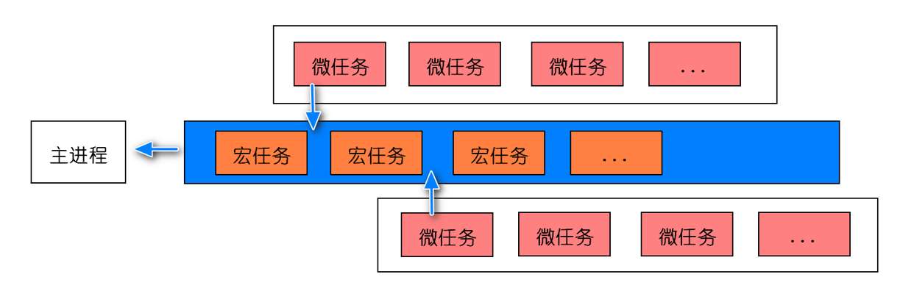

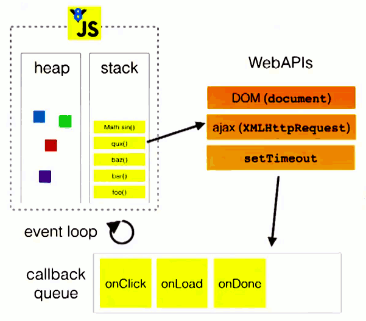

**Event Loop经典题目**

```js
Promise.resolve()
  .then(function() {
    console.log("promise0");
  })
  .then(function() {
    console.log("promise5");
  });
setTimeout(() => {
  console.log("timer1");
  Promise.resolve().then(function() {
    console.log("promise2");
  });
  Promise.resolve().then(function() {
    console.log("promise4");
  });
}, 0);
setTimeout(() => {
  console.log("timer2");
  Promise.resolve().then(function() {
    console.log("promise3");
  });
}, 0);
Promise.resolve().then(function() {
  console.log("promise1");
});
console.log("start");

// 打印结果： start promise0 promise1 promise5 timer1 promise2 promise4 timer2 promise3
```
案例解释：
宏任务是一个个执行，执行一个宏任务，然后就把在任务队列中的所有微任务都执行完，再执行下一个宏任务，再执行所有微任务，依次类推

**async、await事件轮询执行时机**

async隐式返回Promise，会产生一个微任务
await后面的代码是在微任务时执行
```js
console.log("script start");
async function async1() {
  await async2(); // await 隐式返回promise
  console.log("async1 end"); // 这里的执行时机：在执行微任务时执行
}
async function async2() {
  console.log("async2 end"); // 这里是同步代码
}
async1();
setTimeout(function() {
  console.log("setTimeout");
}, 0);
new Promise(resolve => {
  console.log("Promise"); // 这里是同步代码
  resolve();
})
  .then(function() {
    console.log("promise1");
  })
  .then(function() {
    console.log("promise2");
  }); 
console.log("script end");

// 打印结果:  script start => async2 end => Promise => script end => async1 end => promise1 => promise2 => setTimeout
```

**event loop 与 浏览器更新渲染时机**

1） 浏览器更新渲染会在event loop中的 宏任务 和 微任务 完成后进行，即宏任务 → 微任务 → 渲染更新（先宏任务 再微任务，然后再渲染更新）
2）宏任务队列中，如果有大量任务等待执行时，将dom的变动作为微任务，能更快的将变化呈现给用户，这样就可以在这一次的事件轮询中更新dom

### event loop与 vue nextTick

**vue nextTick为什么要优先使用微任务实现？**

1） vue nextTick的源码实现，优先级判断，总结就是Promise > MutationObserver > setImmediate > setTimeout 

2）这里优先使用Promise，因为根据event loop与浏览器更新渲染时机，使用微任务，本次event loop轮询就可以获取到更新的dom

3）如果使用宏任务，要到下一次event loop中，才能获取到更新的dom

### Node中的process.nextTick

有很多文章把Node的process.nextTick和微任务混为一谈，但其实并不是同一个东西

process.nextTick 是 Node.js 自身定义实现的一种机制，有自己的 nextTickQueue

**process.nextTick执行顺序早于微任务**
```js
console.log("start");
setTimeout(() => {
  console.log("timeout");
}, 0);
Promise.resolve().then(() => {
  console.log("promise");
});
process.nextTick(() => {
  console.log("nextTick");
  Promise.resolve().then(() => {
    console.log("promise1");
  });
});
console.log("end");
// 执行结果 start end nextTick  promise promise1 timeout 
```

## let a = "sss"，存在哪

使用let声明的全局变量不是挂在window对象下的，声明的全局变量存在于一个块级作用域中。

具体查看，我们可以通过打印一个全局函数，在let声明的全局变量在全局函数的scope下，我们平时使用时直接 用变量名称就能访问到

具体位置如下图：

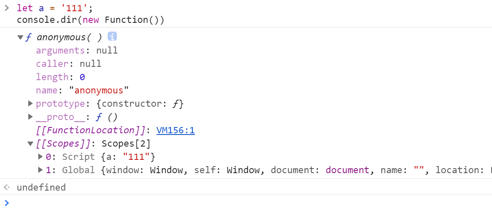

## 顺序表与链表的比较

- 基于空间的比较
  - 存储分配的方式
    - 顺序表的存储空间是静态分配的
    - 链表的存储空间是动态分配的
  - 存储密度 = 结点数据本身所占的存储量/结点结构所占的存储总量
    - 顺序表的存储密度 = 1
    - 链表的存储密度 < 1
- 基于时间的比较
  - 存取方式
    - 顺序表可以随机存取，也可以顺序存取
    - 链表是顺序存取的
  - 插入/删除时移动元素个数
    - 顺序表平均需要移动近一半元素
    - 链表不需要移动元素，只需要修改指针

## 列表无限滚动

 简单列表滚动加载是监听滚动条在满足条件的时候触发回调，然后通过把新的元素加入到页面页尾的方法完成，但是如果用户加载过多列表数据(比如我这一个列表页有一万条数据需要展示)，那么用户不断加载，页面不断增加新的元素，很容易就导致页面元素过多而造成卡顿，所以就提出的列表的无限滚动加载，主要是在删除原有元素并且维持高度的基础上，生成并加载新的数据 

### 如果滚动过快，高频率触发事件解决方案

节流：在一段时间内不管触发了多少次都只认为触发了一次，等计时结束进行响应（假设设置的时间为2000ms，再触发了事件的2000ms之内，你在多少触发该事件，都不会有任何作用，它只为第一个事件等待2000ms。时间一到，它就会执行了。 ）

```javascript
//时间戳方式
function throttle(fn,delay){
    let pre = Date.now();
    return function(){
        let context = this;
        let args = arguments;
        let now = Date.now();
        if(now - pre > delay){
            fn.apply(context,args);
            pre = Date.now();
        }
    }
}
//定时器方式
function throttle(fn,delay){
    let timer = null;
    return function(){
        let context = this;
        let args = arguments;
        if(!timer){
            timer = setTimeout(function(){
                fn.apply(context,args);
                timer = null;
            },delay)
        }
    }
}
```

防抖：在某段时间内，不管你触发了多少次事件，都只认最后一次（假设设置时间为2000ms，如果触发事件的2000ms之内，你再次触发该事件，就会给新的事件添加新的计时器，之前的事件统统作废。只执行最后一次触发的事件。）

```js
//定时器方式
function debounce(fn,delay){
    let timer = null;
    return function(){
        let context = this;
        let args = arguments;
        clearTimeout(timer);
        timer = setTimeout(function(){
            fn.apply(context,args);
        },delay)
    }
}
```

## 0.1+0.2!=0.3

 主要是因为JavaScript同样采用IEEE754标准，在64位中存储一个数字的有效数字形式 

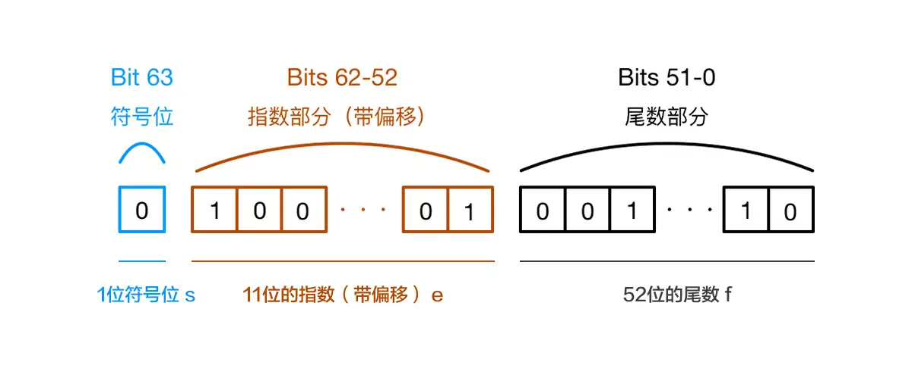

第0位表示符号位，0表示整数1表示负数，第1~~11位存储指数部分，第12~~63位存小数部分；

由于二进制的有效数字总是表示为`1.xxx...`这样的形式，尾数部分在规约形式下的第一位默认为1，故存储时第一位省略不写，尾数部分存储有效数字小数点后的xxx...，最长52位，因此，JavaScript提供的有效数字最长为53个二进制位（尾数部分52位+被省略的1位）

由于需要对求和结果规格化(用有效数字表示)，右规导致低位丢失，此时需对丢失的低位进行舍入操作，遵循IEEE754舍入规则，会有精度损失

## 定时器

JS提供了一些原生方法来实现延时去执行某一段代码

**setTimeout/setInterval**
setTimeout固定时长后执行
setInterval间隔固定时间重复执行
setTimeout、setInterval最短时长为4ms

**定时器不准的原因**
**setTimeout/setInterval的执行时间并不是确定的**

setTimeout/setInterval是宏任务，根据事件轮询机制，其他任务会阻塞或延迟js任务的执行
考虑极端情况，假如定时器里面的代码需要进行大量的计算，或者是DOM操作，代码执行时间超过定时器的时间，会出现定时器不准的情况

**setTimeout/setInterval 动画卡顿**

不同设备的屏幕刷新频率可能不同， setTimeout/setInterval只能设置固定的时间间隔，这个时间和屏幕刷新间隔可能不同

setTimeout/setInterval通过设置一个间隔时间，来不断改变图像实现动画效果，在不同设备上可能会出现卡顿、抖动等现象

**requestAnimationFrame**

requestAnimationFrame 是浏览器专门为动画提供的API

requestAnimationFrame刷新频率与显示器的刷新频率保持一致，使用该api可以避免使用setTimeout/setInterval造成动画卡顿的情况
requestAnimationFrame：告诉浏览器在下次重绘之前执行传入的回调函数(通常是操纵dom，更新动画的函数)

**setTimeout、setInterval、requestAnimationFrame 三者的区别**

1）引擎层面
setTimeout属于 JS引擎 ，存在事件轮询
requestAnimationFrame 属于 GUI引擎
JS引擎与GUI引擎是互斥的，也就是说 GUI引擎在渲染时会阻塞JS引擎的计算
这样设计的原因，如果在GUI渲染的时候，JS同时又改变了dom，那么就会造成页面渲染不同步

2）性能层面
当页面被隐藏或最小化时，定时器 setTimeout仍会在后台执行动画任务
当页面处于未激活的状态下，该页面的屏幕刷新任务会被系统暂停，requestAnimationFrame也会停止

**setTimeout模拟实现setInterval**

```js
// 使用闭包实现
function mySetInterval(fn, t) {
  let timer = null;
  function interval() {
    fn();
    timer = setTimeout(interval, t);
  }
  interval();
  return {
    // cancel用来清除定时器
    cancel() {
      clearTimeout(timer);
    }
  };
}
```

**setInterval模拟实现setTimeout**

```js
function mySetTimeout(fn, time) {
  let timer = setInterval(() => {
    clearInterval(timer);
    fn();
  }, time);
}

// 使用
mySetTimeout(() => {
  console.log(1);
}, 2000);
```

## js的垃圾回收机制

JavaScript内存管理有一个主要概念是可达性，“可达性” 指是那些以某种方式可访问或可用的值，它们被保证存储在内存中。有一组基本的固有可达值，由于显而易见的原因无法删除，比如：本地函数的局部变量和参数，全局变量，当前嵌套调用链上的其他函数的变量和参数，这些值被称为"根"，如果引用或引用链可以从根访问任何其他值，则认为该值是可访问的

JavaScript在创建变量时自动进行了内存分配，并且在它们不使用时 **"自动"** 释放，释放的过程就被称为垃圾回收。

现在各大浏览器通常采用的垃圾回收有两种方法：标记清除、引用计数

- 引用计数垃圾收集：把“对象是否不再需要”简化定义为“对象有没有其他对象引用到它”。如果没有引用指向该对象（零引用），对象将被垃圾回收机制回收。但是有一个限制是"无法处理循环引用问题"

```js
let element = document.getElementById("some_element");
let myObj = new Object();
myObj.element = element;
element.someObject = myObj;
// 变量myObj有一个element属性执行element，而变量element有一个名为someObject属性指回myObj，因为循环引用，引用计数法将没办法回收该内存

// 我们需要手动切断它们的循环引用，防止内存泄露
myObj.element = null;
element.someObject =null;
```

- 标记清除：是js中最常用的垃圾回收方式，把“对象是否不再需要”简化定义为“对象是否可以获得”，定期会执行以下的"垃圾回收"步骤（这正是标记清除算法垃圾收集的工作原理）：
  - 首先垃圾回收器获取根并 **“标记”** 它们
  - 然后它访问并“标记”所有来自它们的引用
  - 接着它访问标记的对象并标记它们的引用(子孙代的引用)
  - 以此类推，直至有未访问的引用，此时进程中不能访问的对象将被认为是不可访问的
  - 除标记的对象外，其余对象将被删除

## 函数柯里化

柯里化（Currying）是函数式编程的一个很重要的概念，将使用多个参数的一个函数转换成一系列使用一个参数的函数

主要有三个作用：1. 参数复用；2. 提前返回；3. 延迟计算/运行

- 参数复用

```js
// 举个栗子：正则验证字符串

// 函数封装后
function check(reg, txt) {
    return reg.test(txt)
}

check(/\d+/g, 'test')       //false
check(/[a-z]+/g, 'test')    //true

// 需要复用第一个reg参数，Currying后，将两个参数分开，可以直接调用hasNumber，hasLetter等函数
function curryingCheck(reg) {
    return function(txt) {
        return reg.test(txt)
    }
}

let hasNumber = curryingCheck(/\d+/g)
let hasLetter = curryingCheck(/[a-z]+/g)

hasNumber('test1')      // true
hasLetter('21212')      // false
```

- 提前返回

```js
// 比如：解决原生方法在现代浏览器和IE之间的兼容问题

// 提前返回: 使用函数立即调用进行了一次兼容判断（部分求值），返回兼容的事件绑定方法
// 延迟执行：返回新函数，在新函数调用兼容的事件方法。等待addEvent新函数调用，延迟执行
const addEvent = (function() {
    if(window.addEventListener) {
        return function(ele, type, fn, isCapture) {
            ele.addEventListener(type, fn, isCapture)
        }
    } else if(window.attachEvent) {
        return function(ele, type, fn) {
             ele.attachEvent("on" + type, fn)
        }
    }
})()
```

- 延迟执行

```js
// js中bind实现机制正是Currying
Function.prototype.bind = function (context) {
    var _this = this
    var args = Array.prototype.slice.call(arguments, 1)

    return function() {
        return _this.apply(context, args)
    }
}
```

## 捕获和冒泡

在 JavaScript 中，事件传播分为三个阶段：**捕获阶段**、**目标阶段**和**冒泡阶段**。理解事件捕获和冒泡的区别以及它们的应用场景，对于处理复杂的事件逻辑非常重要。

### 捕获阶段

- **定义**：事件从最外层的祖先元素（`window`）向下传播到目标元素。
- **顺序**：`window` → `document` → `<html>` → `<body>` → ... → 目标元素。
- **特点**：
    - 事件从外向内传播。
    - 默认情况下，事件监听器不会在捕获阶段触发，除非显式设置

### 目标阶段

- **定义**：事件到达目标元素。
- **特点**：
    - 事件在目标元素上触发。
    - 无论是捕获还是冒泡阶段，目标阶段都会执行。

### 冒泡阶段

- **定义**：事件从目标元素向上传播到最外层的祖先元素。
- **顺序**：目标元素 → ... → `<body>` → `<html>` → `document` → `window`。
- **特点**：
    - 事件从内向外传播。
    - 默认情况下，事件监听器在冒泡阶段触发。

### 代码实例


```html
<div id="outer">
    外部
    <div id="inner">内部</div>
</div>

<script>
    // 捕获阶段
    document.getElementById('outer').addEventListener('click', function() {
        console.log('捕获阶段：外部元素');
    }, true);

    document.getElementById('inner').addEventListener('click', function() {
        console.log('捕获阶段：内部元素');
    }, true);

    // 冒泡阶段
    document.getElementById('outer').addEventListener('click', function() {
        console.log('冒泡阶段：外部元素');
    }, false);

    document.getElementById('inner').addEventListener('click', function() {
        console.log('冒泡阶段：内部元素');
    }, false);
</script>
```

输出结果

```
捕获阶段：外部元素
捕获阶段：内部元素
冒泡阶段：内部元素
冒泡阶段：外部元素
```

### 应用场景

#### 拦截事件
在捕获阶段拦截事件，阻止事件到达目标元素
```js
document.getElementById('outer').addEventListener('click', function(event) {
    console.log('捕获阶段拦截事件');
    event.stopPropagation(); // 阻止事件继续传播
}, true);
```

#### 事件委托
利用事件冒泡，将事件绑定到父元素上，通过事件目标（`event.target`）来判断具体是哪个子元素触发了事件。
 **优点**：
	- 减少事件监听器的数量，提高性能。
	- 动态添加的子元素无需重新绑定事件。
```js
document.getElementById('parent').addEventListener('click', function(event) {
    if (event.target.tagName === 'LI') {
        console.log('点击了子元素：', event.target.textContent);
    }
});
```

#### 阻止默认行为

在目标阶段或冒泡阶段阻止默认行为（如阻止链接跳转或表单提交）。

```js
document.getElementById('link').addEventListener('click', function(event) {
    event.preventDefault(); // 阻止默认行为
    console.log('链接点击，但不会跳转');
});
```

#### 复杂事件处理

在捕获和冒泡阶段分别处理事件，实现更复杂的逻辑

```js
// 捕获阶段记录日志
document.getElementById('outer').addEventListener('click', function() {
    console.log('捕获阶段：记录日志');
}, true);

// 冒泡阶段处理业务逻辑
document.getElementById('outer').addEventListener('click', function() {
    console.log('冒泡阶段：处理业务逻辑');
}, false);
```