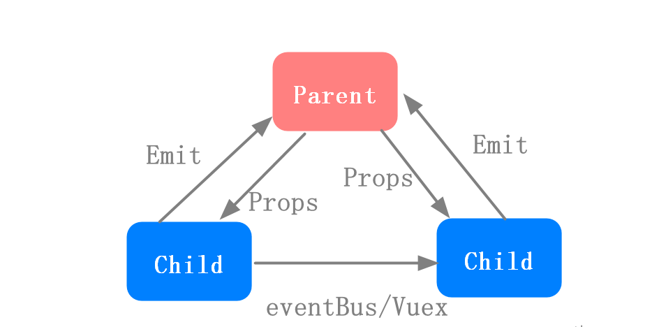
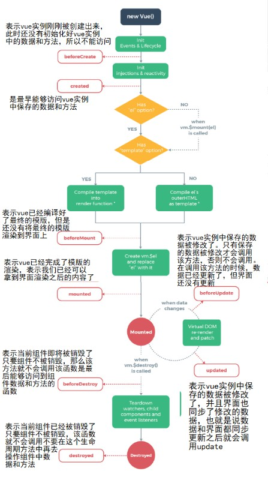
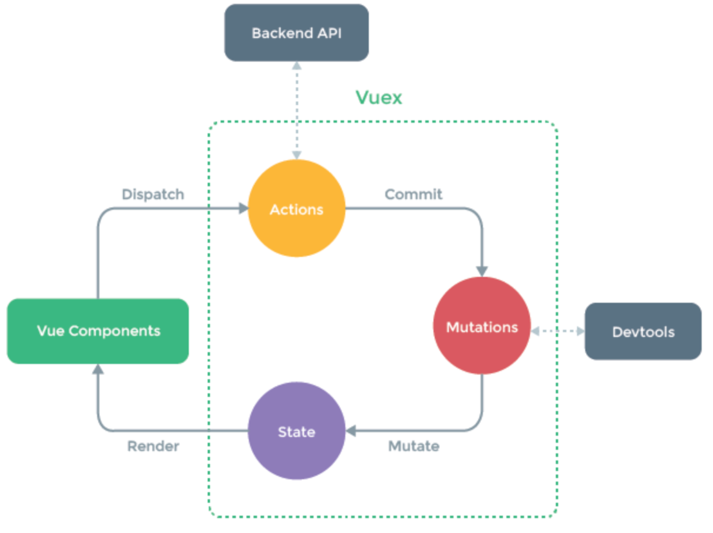
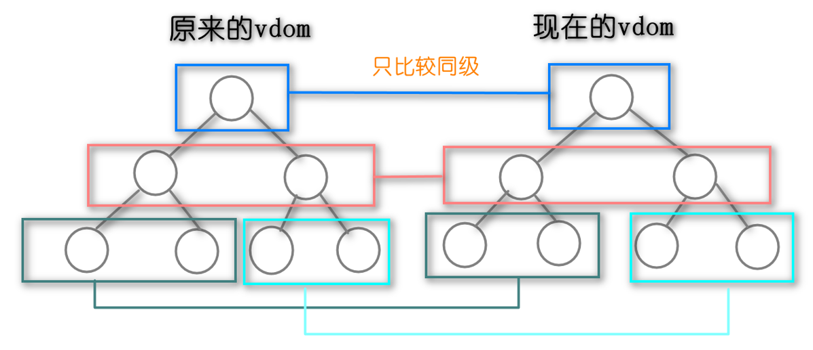
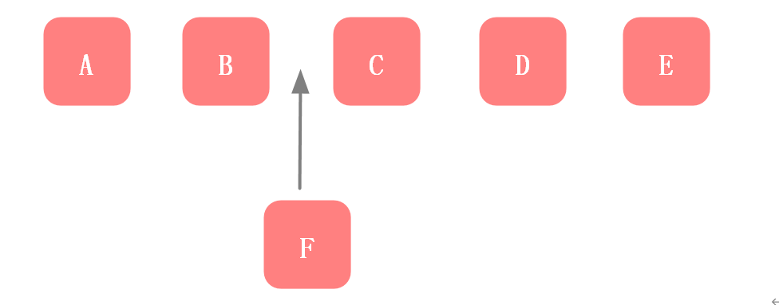
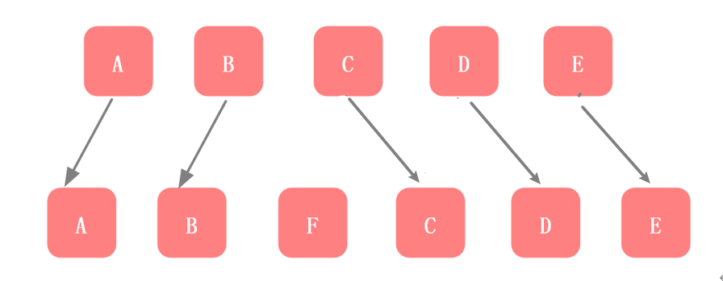

# Vue

## v-model作用

v-model本质上不过是语法糖，可以用 v-model 指令在**表单**及**元素**上创建双向数据绑定。

1. 它会根据控件类型自动选取正确的方法来更新元素
2. 它负责监听用户的输入事件以更新数据，并对一些极端场景进行一些特殊处理
3. v-model会忽略所有表单元素的value、checked、selected特性的初始值，而总是将 Vue 实例的数据作为数据来源，因此我们应该通过 JavaScript 在组件的data选项中声明初始值

**扩展：**

v-model在内部为不同的输入元素使用不同的属性并抛出不同的事件：

1. text 和 textarea 元素使用value属性和input事件；
2. checkbox 和 radio 使用checked属性和change事件；
3. select 字段将value作为 prop 并将change作为事件。

## v-model实现原理（vue双向数据绑定的实现）

vue内部利用Object.defineProperty监听数据变化，使数据具有可观测性，结合发布订阅模式，在数据发生变化时更新视图

[[#双向绑定原理]]

- 利用Proxy或Object.defineProperty生成的Observer针对对象/对象的属性进行"劫持"，在属性发生变化后通知订阅者
- 解析器Compile解析模板中的Directive(指令)，收集指令所依赖的方法和数据，等待数据变化然后进行渲染
- Watcher属于Observer和Compile桥梁，它将接收到的Observer产生的数据变化，并根据Compile提供的指令进行视图渲染，使得数据变化促使视图变化

```js
// 简单的双向数据绑定
const data = {};
Object.keys(data).forEach(function(key) {
    Object.defineProperty(data, key, {
        enumerable: true,
        configurable: true,
        get: function() {
            console.log('get');
        },
        set: function(newVal) {
            // 当属性值发⽣变化时我们可以进⾏额外操作
        },
    });
});
```

v-model只不过是一个语法糖而已，真正的实现靠的还是

1. v-bind:绑定响应式数据
2. 触发oninput 事件并传递数据

```html
<input v-model="sth" />
<!-- 等同于-->
<input :value="sth" @input="sth = $event.target.value" />
<!--自html5开始,input每次输入都会触发oninput事件，所以输入时input的内容会绑定到sth中，于是sth的值就被改变-->
<!--$event 指代当前触发的事件对象;-->
<!--$event.target 指代当前触发的事件对象的dom;-->
<!--$event.target.value 就是当前dom的value值;-->
<!--在@input方法中，value => sth;-->
<!--在:value中,sth => value;-->
```

## 组件通信方式

组件通信的方式有以下8种方法：

### 1. props和$emit

   这是最最常用的父子组件通信方式，父组件向子组件传递数据是通过prop传递的，子组件传递数据给父组件是通过$emit触发事件来做到的

### 2. attrs和listeners

[[#组件传值-attrs和listeners]]

   第一种方式处理父子组件之间的数据传输有一个问题：如果多层嵌套，父组件A下面有子组件B，组件B下面有组件C,这时如果组件A想传递数据给组件C怎么办呢?

   如果采用第一种方法，我们必须让组件A通过prop传递消息给组件B，组件B在通过prop传递消息给组件C；要是组件A和组件C之间有更多的组件，那采用这种方式就很复杂了。从Vue 2.4开始，提供了attrs和listeners来解决这个问题，能够让组件A直接传递消息给组件C。

### 3. v-model

   父组件通过v-model传递值给子组件时，会自动传递一个value的prop属性，在子组件中通过this.$emit(‘input',val)自动修改v-model绑定的值

### 4. provide和inject

   父组件中通过provider来提供变量，然后在子组件中通过inject来注入变量。不论子组件有多深，只要调用了inject那么就可以注入provider中的数据。而不是局限于只能从当前父组件的prop属性来获取数据，只要在父组件的生命周期内，子组件都可以调用。

### 5. 中央事件总线

[[#组件传值-事件总线]]

   上面方式都是处理的父子组件之间的数据传递，那如果两个组件不是父子关系呢?也就是兄弟组件如何通信?

   这种情况下可以使用中央事件总线的方式。新建一个Vue事件bus对象，然后通过bus.emit触发事件，bus.on监听触发的事件。

### 6. parent和children
[[#\$root、\$refs、$parent的使用]]



### 7. boradcast和dispatch

   vue1.0中提供了这种方式，但vue2.0中没有，但很多开源软件都自己封装了这种方式，比如min ui、element ui和iview等。 比如如下代码，一般都作为一个mixins去使用, broadcast是向特定的父组件触发事件，dispatch是向特定的子组件触发事件，本质上这种方式还是on和emit的封装，但在一些基础组件中却很实用

### 8. vuex处理组件之间的数据交互

   如果业务逻辑复杂，很多组件之间需要同时处理一些公共的数据，这个时候采用上面这一些方法可能不利于项目的维护，vuex的做法就是将这一些公共的数据抽离出来，然后其他组件就可以对这个公共数据进行读写操作，这样达到了解耦的目的

## 组件传值-attrs和listeners

attrs和 listeners的作用：解决多层嵌套情况下，父组件A下面有子组件B，组件B下面有组件C，组件A传递数据给组件B的问题，这个方法是在Vue 2.4提出的。 

attrs和listeners解决问题的过程：

C组件

```js
Vue.component('C',{ 
     template:` 
     <div> 
	     <input type="text" v-model="$attrs.messageC" @input="passCData($attrs.messageC)"> 
     </div> 
     `, 
     methods:{ 
         passCData(val){ 
             //触发父组件A中的事件 
             this.$emit('getCData',val) 
         } 
     } 
}) 
```

B组件

```js
Vue.component('B',{ 
 data(){ 
     return { 
         myMessage:this.message 
     } 
 }, 
 template:` 
 <div> 
	 <input type="text" v-model="myMessage" @input="passData(myMessage)"> 
	 <C v-bind="$attrs" v-on="$listeners"></C> 
 </div> 
 `, 
 //得到父组件传递过来的数据 
 props:['message'], 
 methods:{ 
     passData(val){ 
         //触发父组件中的事件 
         this.$emit('getChildData',val) 
     } 
 } 
}) 
```

A组件

```js
Vue.component('A',{ 
 template:` 
 <div> 
	 <p>this is parent compoent!</p> 
	 <B  
		 :messageC="messageC"  
		 :message="message"  
		 v-on:getCData="getCData"  
		 v-on:getChildData="getChildData(message)"> 
	 </B> 
 </div> 
 `, 
 data(){ 
     return { 
         message:'Hello', 
         messageC:'Hello c' 
     } 
 }, 
 methods:{ 
     getChildData(val){ 
         console.log('这是来自B组件的数据') 
     }, 
     //执行C子组件触发的事件 
     getCData(val){ 
		 console.log("这是来自C组件的数据："+val) 
     } 
 } 
}) 
var app=new Vue({ 
 el:'#app', 
 template:` 
 <div> 
	 <A></A> 
 </div> 
 ` 
}) 
```

**解析：**

- C组件中能直接触发getCData的原因在于 B组件调用C组件时使用 v-on 绑定了$listeners 属性
- 通过v-bind 绑定$attrs属性，C组件可以直接获取到A组件中传递下来的props(除了B组件中props声明的)

## 组件传值-事件总线

**中央事件总线**主要用来解决兄弟组件通信的问题。

实现方式：新建一个Vue事件bus对象，然后通过bus.emit触发事件，bus.on监听触发的事件。

```js
Vue.component('brother1',{ 
 data(){ 
     return { 
        myMessage:'Hello brother1' 
     } 
 }, 
 template:` 
 <div> 
	 <p>this is brother1 compoent!</p> 
	 <input type="text" v-model="myMessage" @input="passData(myMessage)"> 
 </div> 
 `, 
 methods:{ 
     passData(val){ 
         //触发全局事件globalEvent 
         bus.$emit('globalEvent',val) 
     } 
 } 
}) 
Vue.component('brother2',{ 
 template:` 
 <div> 
	 <p>this is brother2 compoent!</p> 
	 <p>brother1传递过来的数据：{{brothermessage}}</p> 
 </div> 
 `, 
 data(){ 
     return { 
         myMessage:'Hello brother2', 
         brothermessage:'' 
     } 
 }, 
 mounted(){ 
     //绑定全局事件globalEvent 
     bus.$on('globalEvent',(val)=>{ 
        this.brothermessage=val; 
     }) 
 } 
}) 
//中央事件总线 
var bus=new Vue(); 
var app=new Vue({ 
 el:'#app', 
 template:` 
 <div> 
 <brother1></brother1> 
 <brother2></brother2> 
 </div> 
 ` 
}) 
```

## 双向绑定原理

目前几种主流的mvc(vm)框架都实现了单向数据绑定，而我所理解的双向数据绑定无非就是在单向绑定的基础上给可输入元素（input、textarea等）添加了change(input)事件，来动态修改model和 view，并没有多高深。所以无需太过介怀是实现的单向或双向绑定。

实现数据绑定的做法有大致如下几种：

### 发布者-订阅者模式

一般通过sub, pub的方式实现数据和视图的绑定监听，更新数据方式通常做法是vm.set('property', value)

这种方式现在毕竟太low了，我们更希望通过vm.property = value这种方式更新数据，同时自动更新视图，于是有了下面两种方式

### 脏值检查

angular.js 是通过脏值检测的方式比对数据是否有变更，来决定是否更新视图，最简单的方式就是通过setInterval()定时轮询检测数据变动，当然Google不会这么low，angular只有在指定的事件触发时进入脏值检测，大致如下：

- DOM事件，譬如用户输入文本，点击按钮等。( ng-click )
- XHR响应事件 ( $http )
- 浏览器Location变更事件 ( $location )
- Timer事件( timeout，interval )
- 执行 digest()或apply()

### 数据劫持:

vue.js 则是采用数据劫持结合发布者-订阅者模式的方式，通过Object.defineProperty()来劫持各个属性的setter，getter，在数据变动时发布消息给订阅者，触发相应的监听回调。

## vue2双向绑定的缺陷

Vue2.0的数据响应是采用数据劫持结合发布者-订阅者模式的方式，通过Object.defineProperty () 来劫持各个属性的setter、getter，但是它并不算是实现数据的响应式的完美方案，某些情况下需要对其进行修补或者hack。这也是它的缺陷，主要表现在两个方面：

### 1. 不能检测到对象属性的新增或删除

vue 实例创建后，无法检测到对象属性的新增或删除，只能追踪到数据是否被修改(Object.defineProperty只能劫持对象的属性)。

当创建一个Vue实例时，将遍历所有DOM对象，并为每个数据属性添加了get和set。get和set 允许Vue观察数据的更改并触发更新。但是，如果你在Vue实例化后添加（或删除）一个属性，这个属性不会被vue处理，改变get和set。

解决方案：

   ```js
   Vue.set(obj, propertName/index, value)
   // 响应式对象的子对象新增属性，可以给子响应式对象重新赋值
   data.location = {
       x: 100,
       y: 100
   }
   data.location = {...data, z: 100}
   ```

### 2. 不能监听数组的变化

vue在实现数组的响应式时，它使用了一些hack，把无法监听数组的情况通过重写数组的部分方法来实现响应式，这也只限制在数组的push/pop/shift/unshift/splice/sort/reverse七个方法，其他数组方法及数组的使用则无法检测到，例如如下两种使用方式

```javascript
vm.items[index] = newValue;
vm.items.length
```

vue实现数组响应式的方法

通过重写数组的Array.prototype对应的方法，具体来说就是重新指定要操作数组的prototype，并重新改prototype中对应上面的7个数组方法，通过下面代码简单了解下实现原理：

   ```js
   const methods = ['pop','shift','unshift','sort','reverse','splice', 'push'];
   // 复制Array.prototype，并将其prototype指向Array.prototype
   let proto = Object.create(Array.prototype);
   methods.forEach(method => {
       proto[method] = function () { // 重写proto中的数组方法
           Array.prototype[method].call(this, ...arguments);
           viewRender() // 视图更新
           function observe(obj) {
               if (Array.isArray(obj)) { // 数组实现响应式
                   obj.__proto__ = proto; // 改变传入数组的prototype
                   return;
               }
               if (typeof obj === 'object') {
                   ... // 对象的响应式实现
               }
           }
       }
   })
   ```

## Object.defineProperty和proxy的优劣区别

Object.defineProperty兼容性较好，但不能直接监听数组的变化，只能监听对象的属性(有时需要深层遍历)

与之相比proxy的优点：

- 可以直接监听数组的变化
- 可以直接监听对象而非属性
- proxy有多达13种的拦截方法，不限于apply、ownKeys、deleteProperty、has等等
- proxy受到各大浏览器厂商的重视

## vue3实现数据双向绑定的方法

vue3.0 实现数据双向绑定是通过**Proxy**

**Proxy**是 ES6 中新增的一个特性，翻译过来意思是"代理"，用在这里表示由它来”代理“某些操作。 Proxy 让我们能够以简洁易懂的方式控制外部对对象的访问。其功能非常类似于设计模式中的代理模式。

Proxy 可以理解成，在目标对象之前架设一层“拦截”，外界对该对象的访问，都必须先通过这层拦截，因此提供了一种机制，可以对外界的访问进行过滤和改写。

使用 Proxy 的核心优点是可以交由它来处理一些非核心逻辑（如：读取或设置对象的某些属性前记录日志；设置对象的某些属性值前，需要验证；某些属性的访问控制等）。 从而可以让对象只需关注于核心逻辑，达到关注点分离，降低对象复杂度等目的。

**扩展：**

使用proxy实现双向数据绑定，相比2.0的Object.defineProperty ()优势：

1. 可以劫持整个对象，并返回一个新对象
2. 有13种劫持操作

## vue生命周期（钩子函数）



Vue生命周期经历哪些阶段：

1. 总体来说：初始化、运行中、销毁
2. 详细来说：开始创建、初始化数据、编译模板、挂载Dom、渲染→更新→渲染、销毁等一系列过程

生命周期经历的阶段和钩子函数:

1. 实例化vue(组件)对象：new Vue()
2. 初始化事件和生命周期 init events 和 init cycle
3. beforeCreate函数：
   在实例初始化之后，数据观测 (data observer) 和 event/watcher 事件配置之前被调用。
   即此时vue（组件）对象被创建了，但是vue对象的属性还没有绑定，如data属性，computed属性还没有绑定，即没有值。
   此时还没有数据和真实DOM。
   即：属性还没有赋值，也没有动态创建template属性对应的HTML元素（二阶段的createUI函数还没有执行）
4. 挂载数据（属性赋值）
   包括 属性和computed的运算
5. Created函数：
   vue对象的属性有值了，但是DOM还没有生成，$el属性还不存在。
   此时有数据了，但是还没有真实的DOM
   即：data，computed都执行了。属性已经赋值，但没有动态创建template属性对应的HTML元素，所以，此时如果更改数据不会触发updated函数
   如果：数据的初始值就来自于后端，可以发送ajax，或者fetch请求获取数据，但是，此时不会触发updated函数检查
6.1 检查是否有el属性
	检查vue配置，即new Vue{}里面的el项是否存在，有就继续检查template项。没有则等到手动绑定调用 vm.mount()完成了全局变量el的绑定。
6.2 检查是否有template属性
	检查配置中的template项，如果没有template进行填充被绑定区域，则被绑定区域的el对outerHTML（即 整个#app DOM对象，包括属性和标签）都作为被填充对象替换掉填充区域。即： 如果vue对象中有 template属性，那么，template后面的HTML会替换$el对应的内容。如果有render属 性，那么render就会替换template。 即：优先关系时： render > template > el
7. beforeMount函数：
   模板编译(template)、数据挂载（把数据显示在模板里）之前执行的钩子函数，
   此时 this.$el有值，但是数据还没有挂载到页面上。即此时页面中的{{}}里的变量还没有被数据替换
   模板编译：用vue对象的数据（属性）替换模板中的内容
8. Mounted函数：
   模板编译完成，数据挂载完毕
   即：此时已经把数据挂载到了页面上，所以，页面上能够看到正确的数据了。
   一般来说，我们在此处发送异步请求（ajax，fetch，axios等），获取服务器上的数据，显示在DOM里。
9. beforeUpdate函数：
   组件更新之前执行的函数，只有数据更新后，才能调用（触发）beforeUpdate，注意：此数据一定是在模板上出现的数据，否则，不会也没有必要触发组件更新（因为数据不出现在模板里，就没有必要再次渲染）
   数据更新了，但是，vue（组件）对象对应的dom中的内部（innerHTML）没有变，所以叫作组件更新前
10. updated函数：
	组件更新之后执行的函数
	vue（组件）对象对应的dom中的内部（innerHTML）改变了，所以，叫作组件更新之后
11. activated函数：keep-alive组件激活时调用
12. deactivated函数：keep-alive组件停用时调用
13. beforeDestroy：vue（组件）对象销毁之前
14. destroyed：vue组件销毁后

## vue生命周期中异步加载在mounted还是created里实现

最常用的是在 created 钩子函数中调用异步请求
**解析：**
一般来说，可以在，created，mounted中都可以发送数据请求，但是，大部分时候，会在created发送请求。
Created的使用场景：页面首次渲染的就是来自后端数据。因为，此时data已经挂载到vue实例了。
在 created（如果希望首次渲染的数据来自于后端，就在此处发请求）（只发了异步请求，渲染是在后端响应之后才进行的）、beforeMount、mounted（在mounted中发请求会进行二次渲染） 这三个钩子函数中发送请求时，data 已经创建，可以将服务端端返回的数据进行赋值。但是**最常用的是在 created 钩子函数中调用异步请求**，因为在 created 钩子函数中调用异步请求有两个优点：
第一点：能更快获取到服务端数据，减少页面 loading 时间；
第二点：放在 created 中有助于一致性，因为ssr 不支持 beforeMount 、mounted 钩子函数。

## vue keep-alive

**keep-alive**：keep-alive可以实现组件缓存，是Vue.js的一个内置组件。

作用：
1. 它能够把不活动的组件实例保存在内存中，而不是直接将其销毁
2. 它是一个抽象组件，不会被渲染到真实DOM中，也不会出现在父组件链中

使用方式：
1. 常用的两个属性include/exclude，允许组件有条件的进行缓存。
2. 两个生命周期activated/deactivated，用来得知当前组件是否处于活跃状态。
3. keep-alive中还运用了LRU(Least Recently Used)算法。
使用场景：
比如有一个列表和一个详情，那么用户就会经常执行打开详情=>返回列表=>打开详情…这样的话列表和详情都是一个频率很高的页面，那么就可以对列表组件使用<keep-alive></keep-alive>进行缓存，这样用户每次返回列表的时候，都能从缓存中快速渲染，而不是重新渲染

原理：Vue 的缓存机制并不是直接存储 DOM 结构，而是将 DOM 节点抽象成了一个个 VNode节点，所以，keep-alive的缓存也是基于VNode节点的而不是直接存储DOM结构。

其实就是将需要缓存的VNode节点保存在this.cache中，在render时，如果VNode的name符合在缓存条件（可以用include以及exclude控制），则会从this.cache中取出之前缓存的VNode实例进行渲染。

## vuex是什么，每个属性是干嘛的，如何使用

Vuex是什么？

Vuex是专门为Vuejs应用程序设计的**状态管理工具**。它采用集中式存储管理应用的所有组件的状态，并以相应的规则保证状态以一种可预测的方式发生变化

具体工作：vuex是一种状态管理机制，将全局组件的共享状态抽取出来为一个store，以一个单例模式存在，在应用的任何一个组件中都可以使用，vuex更改state的唯一途径是通过mutation，mutation需要commit触发, action实际触发是mutation，其中mutation处理同步任务，action处理异步任务。

Vuex每个属性是干嘛的？



Vuex的属性包含以下6个：

1）state
state是存储的单一状态，是存储的基本数据。
2）Getters
getters是store的计算属性，对state的加工，是派生出来的数据。就像computed计算属性一样，getter返回的值会根据它的依赖被缓存起来，且只有当它的依赖值发生改变才会被重新计算。
3）Mutations
mutations提交更改数据，使用store.commit方法更改state存储的状态。（mutations同步函数）
[[#mutation和action有什么区别]]
4）Actions
actions像一个装饰器，提交mutation，而不是直接变更状态。（actions可以包含任何异步操作）
5）Module
Module是store分割的模块，每个模块拥有自己的state、getters、mutations、actions。

```js
const moduleA = {
  state: { ... },
  mutations: { ... },
  actions: { ... },
  getters: { ... }
}

const moduleB = {
  state: { ... },
  mutations: { ... },
  actions: { ... }
}

const store = new Vuex.Store({
  modules: {
    a: moduleA,
    b: moduleB
  }
})

store.state.a // -> moduleA 的状态
store.state.b // -> moduleB 的状态
```

6）辅助函数
Vuex提供了mapState、MapGetters、MapActions、mapMutations等辅助函数给开发在vm中处理store。

Vuex的使用方法？


```js
import Vuex from 'vuex';
Vue.use(Vuex); // 1. vue的插件机制，安装vuex
let store = new Vuex.Store({ // 2.实例化store，调用install方法
    state,
    getters,
    modules,
    mutations,
    actions,
    plugins
});
new Vue({ // 3.注入store, 挂载vue实例
    store,
    render: h=>h(app)
}).$mount('#app');
```

## mutation和action有什么区别

**mutation**：更改 Vuex 的 store 中的状态的唯一方法是提交 mutation。Vuex 中的 mutation 非常类似于： 每个 mutation 都有一个字符串的事件类型 (type) 和一个回调函数 (handler)。这个回调函数就是我们实际进行状态更改的地方，并且它会接受 state 作为第一个参数

```js
const store = new Vuex.Store({
  state: {
    count: 1
  },
  mutations: {
    increment (state) {
      // 变更状态
      state.count++
    }
  }
})
```

不能直接调用一个 mutation handler。这个选项更像是事件注册：“当触发一个类型为 increment 的 mutation 时，调用此函数。”要唤醒一个 mutation handler，你需要以相应的 type 调用 store.commit 方法：

```js
store.commit('increment')
```

**Action:** Action 类似于 mutation，不同在于：
1. Action 提交的是 mutation，而不是直接变更状态。
2. Action 可以包含任意异步操作。
   让我们来注册一个简单的 action：

```js
const store = new Vuex.Store({
  state: {
    count: 0
  },
  mutations: {
    increment (state) {
      state.count++
    }
  },
  actions: {
    increment (context) {
      context.commit('increment')
    }
  }
})
```

**扩展：** 事实上在 vuex 里面 actions 只是一个架构性的概念，并不是必须的，说到底只是一个函数，你在里面想干嘛都可以，只要最后触发 mutation 就行。异步状态怎么处理那是用户自己的事情。
vuex 真正限制你的只有 mutation 必须是同步的这一点（在 redux 里面就好像 reducer 必须同步返回下一个状态一样）。同步的意义在于这样每一个 mutation 执行完成后都可以对应到一个新的状态（和 reducer 一样），这样 devtools 就可以打个 snapshot 存下来，然后就可以随便 time-travel 了。如果你开着 devtool 调用一个异步的 action，你可以清楚地看到它所调用的 mutation 是何时被记录下来的，并且可以立刻查看它们对应的状态。

## 修改ElementUI样式的几种方式

修改ElementUI 样式的方式有四种：

1. 新建全局样式表
   新建 global.css 文件，并在 main.js 中引入。 global.css 文件一般都放在 src->assets 静态资源文件夹下的 style 文件夹下，在 main.js 的引用写法如下：

   ```js
   import "./assets/style/global.css"
   ```

   在 global.css 文件中写的样式，无论在哪一个 vue 单页面都会覆盖 ElementUI 默认的样式。
2. 在当前 vue 单页面中添加一个新的style标签
   在当前的vue单页面的style标签后，添加一对新的style标签，新的style标签中不要添加scoped属性。在有写scoped的style标签中书写的样式不会覆盖 ElementUI 默认的样式。
3. 使用/deep/深度修改标签样式
   找到需要修改的 ElementUI 标签的类名，然后在类名前加上/deep/，可以强制修改默认样式。这种方式可以直接用到有scoped属性的 style 标签中。

   ```css
   // 修改级联选择框的默认宽度
   /deep/ .el-cascader {
     width: 100%;
   }
   ```

4. 通过内联样式或者绑定类样式覆盖默认样式
   通过内联样式 style ，绑定类样式的方式，可以在**某些标签**中可以直接覆盖默认样式，不是很通用。具体实例如下：

```html
   <el-button :style="selfstyle">默认按钮</el-button>
   <script>
       export default {
         data() {
           return {
               selfstyle: {
                   color: "white",
		           marginTop: "10px",
		           width: "100px",
		           backgroundColor: "cadetblue"
               }
           };
         }
       }
   </script>
```
通过绑定修改样式方式修改：
```html
   <el-button :class="[selfbutton]">默认按钮</el-button>
   <script>
     export default {
       data() {
         return {
           selfbutton: "self-button"
         };
       } 
     }
   </script>
   <style lang="stylus" rel="stylesheet/stylus" scoped>
   .self-button {
       color: white;
       margin-top: 10px;
       width: 100px;
       background-Color: cadetblue;
   }
   </style>
```

**扩展：**

第一种全局引入css文件的方式，适合于对elementUI整体的修改，比如整体配色的修改；
第二种添加一个style标签的形式，也能够实现修改默认样式的效果，但实际上因为是修改了全局的样式，因此在不同的vue组件中修改同一个样式有可能会有冲突。
第三种方式通过 /deep/ 的方式可以很方便的在vue组件中修改默认样式，也不会与其他页面有冲突。
第四种方式局限性比较大，可以使用，但不推荐使用。

## 导航守卫

导航守卫主要用来**通过跳转或取消的方式守卫导航**。
简单的说，导航守卫就是路由跳转过程中的一些钩子函数。路由跳转是一个大的过程，这个大的过程分为跳转前中后等等细小的过程，在每一个过程中都有一函数，这个函数能让你操作一些其他的事儿的时机，这就是导航守卫。

### 1. 全局前置守卫

**触发时机：** 在路由跳转前触发
**用途：** 常用于权限验证、登录状态检查
[[#路由守卫进行判断登录]]

   你可以使用 router.beforeEach 注册一个全局前置守卫：

```js
const router = new VueRouter({ ... })
router.beforeEach((to, from, next) => {
 // ...
})
```

   当一个导航开始时，全局前置守卫按照注册顺序调用。守卫是异步链式调用的，导航在最后的一层当中。

```js
new Promise((resolve, reject) => {
   resolve('第一个全局前置守卫')
}.then(() => {
   return '第二个全局前置守卫'
}.then(() => {
   ...
}.then(() => {
   console.log('导航终于开始了') // 导航在最后一层中
})
```

每个守卫方法接收三个参数（往后的守卫都大同小异）：
1. to: Route: 即将要进入的目标路由对象
2. from: Route: 当前导航正要离开的路由
3. next: Function: 一定要调用该方法将控制权交给下一个守卫，执行效果依赖 next 方法的参数。
next(): 进入下一个守卫。如果全部守卫执行完了。则导航的状态就是 confirmed (确认的)。
next(false): 中断当前的导航（把小明腿打断了）。如果浏览器的 URL 改变了 (可能是用户手动或者浏览器后退按钮)，那么 URL 地址会重置到 from 路由对应的地址。

next('/') 或者 next({ path: '/' }): 跳转到一个不同的地址。当前的导航被中断，然后进行一个新的导航（小明被打断腿并且送回家了）。你可以向 next 传递任意位置对象，且允许设置诸如 replace: true、name: 'home' 之类的选项以及任何用在 router-link 的 to prop 或 router.push 中的选项。

next(error): (2.4.0+) 如果传入 next 的参数是一个 Error 实例，则导航会被终止且该错误会被传递router.

onError() 注册过的回调。

**注意：** 永远不要使用两次next，这会产生一些误会。

### 2. 全局解析守卫

**触发时机：** 在导航被确认之前，组件内守卫和异步路由组件被解析之后触发
**用途：** 适用于需要在导航确认前执行的操作
router.beforeResolve 这和 router.beforeEach 类似，但他总是被放在最后一个执行。

### 3. 全局后置钩子

**触发时机：** 在导航完成后触发
**用途：** 适用于日志记录、页面分析等
   导航已经确认了的，小明已经到了外婆家了，你打断他的腿他也是在外婆家了。

```js
router.afterEach((to, from) => {
   // 你并不能调用next
 // ...
})
```

### 4. 路由独享的守卫

**触发时机：** 在进入特定路由前触发
**用途：** 适用于特定路由的权限控制

   在路由内写的守卫

   ```js
   const router = new VueRouter({
     routes: [
       {
         path: '/foo',
         component: Foo,
         beforeEnter: (to, from, next) => {
           // ...
         }
       }
     ]
   })
   ```

### 5. 组件内的守卫

#### 5.1 beforeRouteEnter

**触发时机：** 在组件实例被创建前调用
**用途：** 无法访问 `this`，但可以通过 `next(vm => {})` 访问组件实例

#### 5.2 beforeRouteUpdate (2.2 新增)

**触发时机：** 在当前路由改变，但组件复用时调用
**用途：** 适用于动态路由参数变化时更新数据

#### 5.3 beforeRouteLeave

**触发时机：** 在离开当前路由前调用
**用途：** 常用于防止用户未保存数据就离开页面

```js
const Foo = {
 template: `...`,
 beforeRouteEnter (to, from, next) {
   // 路由被 confirm 前调用
   // 组件还未渲染出来，不能获取组件实例 `this`
 },
 beforeRouteUpdate (to, from, next) {
   // 在当前路由改变，但是该组件被复用时调用
   // 举例来说，对于一个带有动态参数的路径 /foo/:id，在 /foo/1 和 /foo/2 之间跳转的时候，
   // 由于会渲染同样的 Foo 组件，因此组件实例会被复用。而这个钩子就会在这个情况下被调用。
   // 可以访问组件实例 `this`，一般用来数据获取。
 },
 beforeRouteLeave (to, from, next) {
   // 导航离开该组件的对应路由时调用
   // 可以访问组件实例 `this`
 }
}
```

**扩展：**

导航全过程

- 导航被触发。
- 在准备离开的组件里调用 beforeRouteLeave 守卫。
- 调用全局的 beforeEach 守卫。
- 在重用的组件里调用 beforeRouteUpdate 守卫 (2.2+)。（如果你的组件是重用的）
- 在路由配置里调用 beforeEnter。
- 解析即将抵达的组件。
- 在即将抵达的组件里调用 beforeRouteEnter。
- 调用全局的 beforeResolve 守卫 (2.5+)。
- 导航被确认。
- 调用全局的 afterEach 钩子。
- 触发 DOM 更新。
- 用创建好的实例调用 beforeRouteEnter 守卫中传给 next 的回调函数。

## 路由守卫进行判断登录

在vue项目中，切换路由时肯定会碰到需要登录的路由，其原理就是在切换路径之前进行判断，你不可能进入页面再去判断有无登录重新定向到login，那样的话会导致页面已经渲染以及它的各种请求已经发出。

1. 如需要登录的路由可在main.js中统一处理（全局前置守卫）

   我们可以在入口文件man.js里面进行配置，使用router.beforeEach方法，不懂得可以打印to，from的参数就ok，requireAuth可以随意换名的，只要man.js里面跟配置路由的routes里面的字段保持一致：

```js
import router from './router'
router.beforeEach((to, from, next) => {
 if (to.matched.some(record => record.meta.requireAuth)){  // 判断该路由是否需要登录权限
   if(!sessionStorage.getItem('token') && !localStorage.getItem('token')){
	 next({
	   path: '/login',
	   query: {redirect: to.fullPath}  // 将跳转的路由path作为参数，登录成功后跳转到该路由
	 })
   }else{
		next();
   }
 }else {
   next();
 }
});
new Vue({
 el: '#app',
 router,
 render: h => h(App)
})
```

```js
export default new Router({
   routes: [
	   {
		   path: '/',
		   name: 'home',
		   redirect: '/home'
	   },
	   {
		   path: '/home',
		   component: Home,
		   meta: {
			 title: '',
			 requireAuth: true,  // 添加该字段，表示进入这个路由是需要登录的
		  }
	   },
	   {
		   path:'/login',
		   name:'login',
		   component:Login
	   },
	   {
		   path:'/register',
		   name:'register',
		   component:Register
	   }
   ]
})
```

## vue-router实现懒加载

懒加载：当打包构建应用时，JavaScript 包会变得非常大，影响页面加载。如果我们能把不同路由对应的组件分割成不同的代码块，然后当路由被访问的时候才加载对应组件，这样就更加高效了。

实现：结合 Vue 的异步组件和 Webpack 的代码分割功能，可以实现路由组件的懒加载
1. 首先，可以将异步组件定义为返回一个 Promise 的工厂函数 (该函数返回的 Promise 应该 resolve 组件本身)：

```js
const Foo = () => Promise.resolve({ /* 组件定义对象 */ })
```

2. 在 Webpack 2 中，我们可以使用[动态 import](https://github.com/tc39/proposal-dynamic-import)语法来定义代码分块点 (split point)：

```js
import('./Foo.vue') // 返回 Promise
```
   
   结合这两者，这就是如何定义一个能够被 Webpack 自动代码分割的异步组件。
   
```js
const Foo = () => import('./Foo.vue')
```

   在路由配置中什么都不需要改变，只需要像往常一样使用Foo：

```js
const router = new VueRouter({
 routes: [
   { path: '/foo', component: Foo }
 ]
})
```

常用的懒加载方式有三种：即使用vue异步组件 和 ES6中的import，以及webpack的require.ensure()

- vue异步组件

```js
// 路由配置，使用vue异步组件
{
  path: '/home',
  name: 'home',
  component: resolve => require(['@/components/home'],resolve)
}
```

- ES6中的import

```js
// 指定了相同的webpackChunkName，合并打包成一个js文件
// 如果不指定，则分开打包
const Home = () => import(/*webpackChunkName:'ImportFuncDemo'*/ '@/components/home')
const Index = () => import(/*webpackChunkName:'ImportFuncDemo'*/ '@/components/index')
```

- webpack推出的require.ensure()

```js
{
  path: '/home',
  name: 'home',
  component: r => require.ensure([], () => r(require('@/components/home')), 'demo')
}
```

## js是如何监听historyRouter的变化的

通过浏览器的地址栏来改变切换页面，前端实现主要有两种方式：

1. **通过hash改变：** 利用window.onhashchange 监听。

2. **HistoryRouter：** 通过history的改变，进行js操作加载页面，然而history并不像hash那样简单，因为history的改变，除了浏览器的几个前进后退（使用 history.back(), history.forward()和 history.go() 方法来完成在用户历史记录中向后和向前的跳转。）等操作会主动触发popstate 事件，pushState，replaceState 并不会触发popstate事件，要解决history监听的问题，方法是：
   首先完成一个订阅-发布模式，然后重写history.pushState, history.replaceState，并添加消息通知，这样一来history无法实现监听的函数就被我们加上了事件通知，只不过这里用的不是浏览器原生事件，而是通过我们创建的event-bus 来实现通知，然后触发事件订阅函数的执行。

具体操作如下：

1. 订阅-发布模式示例

```js
class Dep {                  // 订阅池
    constructor(name){
        this.id = new Date() //这里简单的运用时间戳做订阅池的ID
        this.subs = []       //该事件下被订阅对象的集合
    }
    defined(){              // 添加订阅者
        Dep.watch.add(this);
    }
    notify() {              //通知订阅者有变化
        this.subs.forEach((e, i) => {
            if(typeof e.update === 'function'){
                try {
	                e.update.apply(e)  //触发订阅者更新函数
                } catch(err){
                    console.warr(err)
                }
            }
        })
    }
}
Dep.watch = null;
class Watch {
    constructor(name, fn){
        this.name = name;       //订阅消息的名称
        this.id = new Date();   //这里简单的运用时间戳做订阅者的ID
        this.callBack = fn;     //订阅消息发送改变时->订阅者执行的回调函数     
    }
    add(dep) {                  //将订阅者放入dep订阅池
       dep.subs.push(this);
    }
    update() {                  //将订阅者更新方法
        var cb = this.callBack; //赋值为了不改变函数内调用的this
        cb(this.name);         
    }
}
```

1. 重写history方法，并添加window.addHistoryListener事件机制。

```js
var addHistoryMethod = (function(){
	var historyDep = new Dep();
	return function(name) {
		if(name === 'historychange'){
			return function(name, fn){
				var event = new Watch(name, fn)
				Dep.watch = event;
				historyDep.defined();
				Dep.watch = null;       //置空供下一个订阅者使用
			}
		} else if(name === 'pushState' || name === 'replaceState') {
			var method = history[name];
			return function(){
				method.apply(history, arguments);
				historyDep.notify();
			}
		}
	}
}())
window.addHistoryListener = addHistoryMethod('historychange');
history.pushState =  addHistoryMethod('pushState');
history.replaceState =  addHistoryMethod('replaceState');
```

## hashRouter和HistoryRouter的区别和原理

**vue-router**是Vue官方的路由管理器。它和 Vue.js 的核心深度集成，让构建单页面应用变得易如反掌。vue-router默认 hash 模式，还有一种是history模式。

### hash路由

hash模式的工作原理是hashchange事件，可以在window监听hash的变化。我们在url后面随便添加一个#xx触发这个事件。vue-router默认的是hash模式——使用URL的hash来模拟一个完整的URL，于是当URL改变的时候，页面不会重新加载，也就是单页应用了，当#后面的hash发生变化，不会导致浏览器向服务器发出请求，浏览器不发出请求就不会刷新页面，并且会触发hashChange这个事件，通过监听hash值的变化来实现更新页面部分内容的操作

对于hash模式会创建hashHistory对象，在访问不同的路由的时候，会发生两件事:
HashHistory.push()将新的路由添加到浏览器访问的历史的栈顶，和HashHistory.replace()替换到当前栈顶的路由

### history路由

主要使用 HTML5 的 pushState() 和 replaceState() 这两个 api 结合 window.popstate 事件（监听浏览器前进后退）来实现的，pushState() 可以改变url地址且不会发送请求，replaceState()可以读取历史记录栈，还可以对浏览器记录进行修改

### 区别

#### 1. URL 表现形式

- **Hash 路由**：
    - URL 中带有 `#` 符号，例如：`http://example.com/#/home`。
    - `#` 后面的内容称为 `hash`，不会发送到服务器，仅用于前端路由。
    - 例如：`http://example.com/#/about`。
- **History 路由**：
    - URL 是标准的路径形式，例如：`http://example.com/home`。
    - 完全模拟了传统的 URL 结构，看起来更美观。
    - 例如：`http://example.com/about`。
#### 2. 实现原理

- **Hash 路由**：
    - 基于 `location.hash` 和 `hashchange` 事件。
    - 当 `hash` 变化时，触发 `hashchange` 事件，前端根据 `hash` 值渲染对应的内容。
    - 例如：
```js
window.addEventListener('hashchange', () => {
	  const path = location.hash.slice(1); // 去掉 # 号
	  renderContent(path);
});
```
+ **History 路由**：
	- 基于 HTML5 的 `history.pushState` 和 `popstate` 事件。
	- 使用 `history.pushState` 修改 URL，同时不会刷新页面。
	- 当用户点击浏览器的前进/后退按钮时，触发 `popstate` 事件，前端根据 `location.pathname` 渲染对应的内容。
	- 例如：
```js
function navigate(path) {
  history.pushState(null, null, path);
  renderContent(path);
}

window.addEventListener('popstate', () => {
  const path = location.pathname;
  renderContent(path);
});

```

#### 3. 对服务器配置的要求

- **Hash 路由**：
    - 不需要服务器额外配置。
    - 因为 `#` 后面的内容不会发送到服务器，服务器始终返回同一个 HTML 文件，前端根据 `hash` 渲染不同内容。
- **History 路由**：
    - 需要服务器支持。
    - 如果用户直接访问 `http://example.com/home`，服务器需要配置为返回同一个 HTML 文件（通常是 `index.html`），否则会返回 404 错误。
    - 例如，在 Nginx 中配置：
```nginx
location / {
  try_files $uri $uri/ /index.html;
}
```

#### 4. 兼容性

- **Hash 路由**：
    - 兼容性非常好，支持所有浏览器，包括 IE8 及以下版本。
    - 因为 `hashchange` 事件是早期浏览器的标准特性。
- **History 路由**：
    - 基于 HTML5 的 `history.pushState` 和 `popstate`，兼容性稍差。
    - 不支持 IE9 及以下版本。

#### 5. SEO 友好性

- **Hash 路由**：
    - 对 SEO 不友好。
    - 因为 `#` 后面的内容不会被搜索引擎抓取。
- **History 路由**：
    - 对 SEO 更友好。
    - 因为 URL 是标准的路径形式，搜索引擎可以正确抓取和索引。
#### 6. 使用场景

- **Hash 路由**：
    - 适用于简单的单页应用（SPA），尤其是对兼容性要求较高的场景。
    - 例如：企业内部系统、兼容旧浏览器的项目。
- **History 路由**：
    - 适用于现代化的单页应用（SPA），尤其是对 URL 美观性和 SEO 有要求的场景。
    - 例如：面向公众的网站、需要 SEO 支持的项目。

#### 7. 优缺点对比

| 特性      | Hash 路由                           | History 路由                          |
| ------- | --------------------------------- | ----------------------------------- |
| URL 美观性 | 不美观（带 `#`）                        | 美观（标准路径）                            |
| 实现原理    | 基于 `location.hash` 和 `hashchange` | 基于 `history.pushState` 和 `popstate` |
| 服务器配置   | 不需要额外配置                           | 需要配置支持                              |
| 兼容性     | 兼容所有浏览器                           | 不支持 IE9 及以下                         |
| SEO 友好性 | 不友好                               | 友好                                  |
| 使用场景    | 简单 SPA、兼容性要求高的项目                  | 现代化 SPA、需要 SEO 的项目                  |

## vue router原理，哪个模式不会请求服务器

Vue router 的两种方法，hash模式不会请求服务器

**解析：**

1. url的hash，就是通常所说的锚点#，javascript通过hashChange事件来监听url的变化，IE7以下需要轮询。比如这个 URL：http://www.abc.com/#/hello，hash 的值为#/hello。它的特点在于：hash 虽然出现在 URL 中，但不会被包括在 HTTP 请求中，对后端完全没有影响，因此**改变 hash 不会重新加载页面**。
2. HTML5的History模式，它使url看起来像普通网站那样，以“/”分割，没有#，单页面并没有跳转。不过使用这种模式需要服务端支持，服务端在接收到所有请求后，都指向同一个html文件，不然会出现404。因此单页面应用只有一个html，整个网站的内容都在这一个html里，通过js来处理。

## 既然函数是引用类型，为什么vue的data还是可以用函数

 JavaScript只有函数构成作用域(注意理解作用域，**只有函数{}构成作用域**，对象的{}以及if(){}都不构成作用域)，data是一个函数时，每个组件实例都有自己的作用域，每个实例相互独立，不会相互影响。 

## vue中$nextTick作用与原理

作用：是为了可以获取更新后的DOM 。

由于Vue DOM更新是异步执行的，即修改数据时，视图不会立即更新，而是会监听数据变化，并缓存在同一事件循环中，等同一数据循环中的所有数据变化完成之后，再统一进行视图更新。为了确保得到更新后的DOM，所以设置了 Vue.nextTick()，就是在下次DOM更新循环结束之后执行延迟回调。在修改数据之后立即使用这个方法，获取更新后的DOM。

原理：

在下次 DOM 更新循环结束之后执行延迟回调。nextTick主要使用了宏任务和微任务。根据执行环境分别尝试采用

- Promise
- MutationObserver
- setImmediate
- 如果以上都不行则采用setTimeout

定义了一个异步方法，多次调用nextTick会将方法存入队列中，通过这个异步方法清空当前队列。

## v-if v-show的区别

v-show和v-if都是用来显示隐藏元素，v-if还有一个v-else配合使用，两者达到的效果都一样，但是v-if更消耗性能的，因为v-if在显示隐藏过程中有DOM的添加和删除，v-show就简单多了，只是操作css。

**解析：**

v-show
v-show不管条件是真还是假，第一次渲染的时候都会编译出来，也就是标签都会添加到DOM中。之后切换的时候，通过display: none;样式来显示/隐藏元素。可以说只是改变css的样式，几乎不会影响什么性能。

v-if
在首次渲染的时候，如果条件为假，什么也不操作，页面当作没有这些元素。当条件为真的时候，开始局部编译，动态的向DOM元素里面添加元素。当条件从真变为假的时候，开始局部编译，卸载这些元素，也就是删除。

## vue列表为什么加key（v-for中的key）

vue中列表循环需加:key="唯一标识"，唯一标识且最好是静态的，因为vue组件高度复用，增加Key可以标识组件的唯一性，为了更好地区别各个组件 key的作用主要是为了高效的更新虚拟DOM

**解析：**

vue和react的虚拟DOM的Diff算法大致相同，其核心是基于两个简单的假设
首先讲一下diff算法的处理方法，对操作前后的dom树同一层的节点进行对比，一层一层对比，



当某一层有很多相同的节点时，也就是列表节点时，Diff算法的更新过程默认情况下也是遵循以上原则。

比如一下这个情况：



 可以在B和C之间加一个F，Diff算法默认执行起来是这样的： 


即把C更新成F，D更新成C，E更新成D，最后再插入E，是不是很没有效率？

所以我们需要使用key来给每个节点做一个唯一标识，Diff算法就可以正确的识别此节点，找到正确的位置区插入新的节点。



## jquery和vue相比

1. jquery：轻量级的js库
2. vue：前端js库，是一个精简的MVVM，它专注于MVVM模型的viewModel层，通过双向数据绑定把view和model层连接起来，通过对数据的操作就可以完成对页面视图的渲染。

| **Vue**                            | **jQuery**             |
| ---------------------------------- | ---------------------- |
| 数据驱动视图(MVVM思想：数据视图完全分离；数据驱动、双向绑定；) | 直接操作DOM(获取、修改、赋值、事件绑定) |
| 操作简单                               | 操作麻烦                   |
| 模块化                                | x                      |
| 实现单页面                              | x                      |
| 组件复用                               | x                      |
| 性能高：使用的虚拟DOM，减少 dom的操作             | x                      |

**扩展：**

1. vue适用的场景：复杂数据操作的后台页面，表单填写页面
   jquery适用的场景：比如说一些html5的动画页面，一些需要js来操作页面样式的页面
2. 二者也是可以结合起来一起使用的，vue侧重数据绑定，jquery侧重样式操作，动画效果等，则会更加高效率的完成业务需求

## 为什么选择用vue做页面展示

- MVVM 框架：
  Vue 正是使用了这种 MVVM 的框架形式，并且通过声明式渲染和响应式数据绑定的方式来帮助我们完全避免了对 DOM 的操作。
- 单页面应用程序
  Vue 配合生态圈中的 Vue-Router 就可以非常方便的开发复杂的单页应用
- 轻量化与易学习
  Vue 的生产版本只有 30.90KB 的大小，几乎不会对我们的网页加载速度产生影响。同时因为 Vue 只专注于视图层，单独的 Vue 就像一个库一样，所以使我们的学习成本变得非常低
- 渐进式与兼容性
  Vue 的核心库只关注视图层，不仅易于上手，还便于与第三方库或既有项目整合。Vue 只做界面，而把其他的一切都交给了它的周边生态（axios（Vue 官方推荐）、Lodash.js、Velocity.js 等）来做处理，这就要求 Vue 必须要对其他的框架拥有最大程度的兼容性
- 视图组件化
  Vue 允许通过组件来去拼装一个页面，每个组件都是一个可复用的 Vue 实例，组件里面可以包含自己的数据，视图和代码逻辑。方便复用
- 虚拟 DOM（Virtual DOM）
  Vue 之所以可以完全避免对 DOM 的操作，就是因为 Vue 采用了虚拟 DOM 的方式，不但避免了我们对 DOM 的复杂操作，并且大大的加快了我们应用的运行速度。
- 社区支持
  得益于 Vue 的本土化身份（Vue 的作者为国人尤雨溪），再加上 Vue 本身的强大，所以涌现出了特别多的国内社区，这种情况在其他的框架身上是没有出现过的，这使得我们在学习或者使用 Vue 的时候，可以获得更多的帮助
- 未来的 Vue 走向
  Vue 是由国人尤雨溪在 Google 工作的时候，为了方便自己的工作而开发出来的一个库，而在 Vue 被使用的过程中，突然发现越来越多的人喜欢上了它。所以尤雨溪就进入了一个边工作、边维护的状态，在这种情况下 Vue 依然迅速的发展。
  而现在尤雨溪已经正式辞去了 Google 的工作，开始专职维护 Vue，同时加入进来的还有几十位优秀的开发者，他们致力于把 Vue 打造为最受欢迎的前端框架。事实证明 Vue 确实在往越来越好的方向发展了（从 Angular、React、Vue 的对比图中可以看出 Vue 的势头）。所以我觉得完全不需要担心未来 Vue 的发展，至少在没有新的颠覆性创新出来之前，Vue 都会越做越好。

## 既然 Vue 通过数据劫持可以精准探测数据在具体dom上的变化，为什么还需要虚拟 DOM diff 呢?

**前置知识:** 依赖收集、虚拟 DOM、响应式系统

现代前端框架有两种方式侦测变化，一种是 **pull** ，一种是 **push**

**pull:** 其代表为React，我们可以回忆一下React是如何侦测到变化的，我们通常会用setStateAPI显式更新，然后React会进行一层层的Virtual Dom Diff操作找出差异，然后Patch到DOM上，React从一开始就不知道到底是哪发生了变化，只是知道「有变化了」，然后再进行比较暴力的Diff操作查找「哪发生变化了」，另外一个代表就是Angular的脏检查操作。

**push:** Vue的响应式系统则是push的代表，当Vue程序初始化的时候就会对数据data进行依赖的收集，一但数据发生变化，响应式系统就会立刻得知。因此Vue是一开始就知道是「在哪发生变化了」，但是这又会产生一个问题，如果你熟悉Vue的响应式系统就知道，通常绑定一个数据就需要一个Watcher

一但我们的绑定细粒度过高就会产生大量的Watcher，这会带来内存以及依赖追踪的开销，而细粒度过低会无法精准侦测变化，因此Vue的设计是选择中等细粒度的方案，在组件级别进行push侦测的方式，也就是那套响应式系统，通常我们会第一时间侦测到发生变化的组件，然后在组件内部进行Virtual Dom Diff获取更加具体的差异，而Virtual Dom Diff则是pull操作，Vue是push+pull结合的方式进行变化侦测的。

## 对vue响应式系统的理解

响应式系统简述：

- 任何⼀个 Vue Component 都有⼀个与之对应的 Watcher 实例
- Vue 的 data 上的属性会被添加 getter 和 setter 属性
- 当Vue Component render函数被执⾏的时候，data上会被触碰(touch)， 即被读，getter ⽅法会被调⽤， 此时 Vue 会去记录此 Vue component所依赖的所有data(这⼀过程被称为依赖收集)
- data 被改动时(主要是⽤户操作)， setter ⽅法会被调⽤， 此时 Vue 会去通知所有依赖于此 data 的组件去调⽤他们的 render 函数进⾏更新


## new Vue以后发生的事情

1. new Vue会调用 Vue 原型链上的 init 方法对 Vue 实例进行初始化；
2. 首先是initLifecycle初始化生命周期，对 Vue 实例内部的一些属性（如 children、parent、isMounted）进行初始化；
3. initEvents，初始化当前实例上的一些自定义事件（Vue.$on）；
4. initRender，解析slots绑定在 Vue 实例上，绑定createElement方法在实例上；
5. 完成对生命周期、自定义事件等一系列属性的初始化后，触发生命周期钩子beforeCreate；
6. initInjections，在初始化data和props之前完成依赖注入（类似于 React.Context）；
7. initState，完成对data和props的初始化，同时对属性完成数据劫持内部，启用监听者对数据进行监听（更改）；
8. initProvide，对依赖注入进行解析；
9. 完成对数据（state 状态）的初始化后，触发生命周期钩子created；
10. 进入挂载阶段，将 vue 模板语法通过vue-loader解析成虚拟 DOM 树，虚拟 DOM 树与数据完成双向绑定，触发生命周期钩子beforeMount；
11. 将解析好的虚拟 DOM 树通过 vue 渲染成真实 DOM，触发生命周期钩子mounted；

## vue首屏白屏如何解决

1. 路由懒加载
2. vue-cli开启打包压缩 和后台配合 gzip访问
3. 进行cdn加速
4. 开启vue服务渲染模式
5. 用webpack的externals属性把不需要打包的库文件分离出去，减少打包后文件的大小
6. 在生产环境中删除掉不必要的console.log

```js
plugins: [
    new webpack.optimize.UglifyJsPlugin({ //添加-删除console.log
      compress: {
        warnings: false,
        drop_debugger: true,
        drop_console: true
      },
      sourceMap: true
    }),
]
```

1. 开启nginx的gzip ,在nginx.conf配置文件中配置

```js
http {  //在 http中配置如下代码，
   gzip on;
   gzip_disable "msie6"; 
   gzip_vary on; 
   gzip_proxied any;
   gzip_comp_level 8; #压缩级别
   gzip_buffers 16 8k;
   #gzip_http_version 1.1;
   gzip_min_length 100; #不压缩临界值
   gzip_types text/plain application/javascript application/x-javascript text/css
    application/xml text/javascript application/x-httpd-php image/jpeg image/gif image/png;
 }
```

2. 添加loading效果，给用户一种进度感受

## vue单页面和传统多页面的区别

单页面应用（SPA）
通俗一点说就是指只有一个主页面的应用，浏览器一开始要加载所有必须的 html, js, css。所有的页面内容都包含在这个所谓的主页面中。但在写的时候，还是会分开写（页面片段），然后在交互的时候由路由程序动态载入，单页面的页面跳转，仅刷新局部资源。多应用于pc端。

多页面（MPA）
指一个应用中有多个页面，页面跳转时是整页刷新

**单页面的优点：**
用户体验好，快，内容的改变不需要重新加载整个页面，基于这一点spa对服务器压力较小；前后端分离；页面效果会比较炫酷（比如切换页面内容时的专场动画）。

**单页面缺点：**
不利于seo；导航不可用，如果一定要导航需要自行实现前进、后退。（由于是单页面不能用浏览器的前进后退功能，所以需要自己建立堆栈管理）；初次加载时耗时多；页面复杂度提高很多。

## \$root、\$refs、$parent的使用

$root
可以用来获取vue的根实例，比如在简单的项目中将公共数据放在vue根实例上(可以理解为一个全局 store )，因此可以代替vuex实现状态管理；

$refs
在子组件上使用ref特性后，this.属性可以直接访问该子组件。可以代替事件emit 和on的作用。私用方式是通过ref特性为这个子组件赋予一个ID引用，再通过this.refs.testId获取指定元素。注意：refs只会在组件渲染完成之后生效，并且它们不是响应式的。这仅作为一个用于直接操作子组件的“逃生舱”——你应该避免在模板或计算属性中访问refs

$parent
$parent属性可以用来从一个子组件访问父组件的实例，可以替代将数据以 prop 的方式传入子组件；当变更父级组件的数据的时候，容易造成调试和理解难度增加；

## 路由跳转和location.href的区别

使用location.href='/url'来跳转，简单方便，但是刷新了页面；
使用路由方式跳转，无刷新页面，静态跳转； 

## scss是什么，在vue.cli中的安装使用步骤是，有哪几大特性

css的预编译。

使用步骤：

1. 先装css-loader、node-loader、sass-loader等加载器模块
2. 在build目录找到webpack.base.config.js，在那个extends属性中加一个拓展.scss
3. 在同一个文件，配置一个module属性
4. 然后在组件的style标签加上lang属性 ，例如：lang=”scss”

特性:

可以用变量，例如（$变量名称=值）；
可以用混合器，例如（）
可以嵌套

## delete与vue.delete区别

delte会删除数组的值，但是它依然会在内存中占位置
而vue.delete会删除数组在内存中的占位

```js
let arr1 = [1,2,3]
let arr2 = [1,2,3]
delete arr1[1]
this.$delete(arr2,2)
console.log(arr1)    //【1, empty, 3】
console.log(arr2)    //【1,2】
```

## computed和watch的区别

computed

计算结果并返回，只有当被计算的属性发生改变时才会触发（即：计算属性的结果会被缓存，除非依赖的响应属性变化才会重新计算）

- 1.是计算值，
- 2.应用：就是简化tempalte里面计算和处理props或$emit的传值
- 3.具有缓存性，页面重新渲染值不变化，计算属性会立即返回之前的计算结果，而不必再次执行函数

watch

监听某一个值，当被监听的值发生变化时，执行相关操作。

- 1.是观察的动作，
- 2.应用：监听props，$emit或本组件的值执行异步操作
- 3.无缓存性，页面重新渲染时值不变化也会执行
- `deep: true` 表示深度监听，即使监听的对象的嵌套属性发生变化，也会触发回调。
- 默认情况下，`watch` 只有在监听的值发生变化时才会触发回调。如果希望在组件创建时立即触发回调，可以使用 `immediate: true`。

与computed的区别是，watch更加适用于监听某一个值的变化，并做对应操作，比如请求后台接口等。而computed适用于计算已有的值并返回结果。 监听简单数据类型：

```js
data(){      
    return{        
        'first':2     
    }   
},   
 watch:{      
     first(){        
         console.log(this.first)    
    }   
 },
```

## vue为什么要用vm.$set()解决对象新增属性不能响应的问题

**1）Vue为什么要用vm.$set() 解决对象新增属性不能响应的问题**

1. Vue使用了Object.defineProperty实现双向数据绑定
2. 在初始化实例时对属性执行 getter/setter 转化
3. 属性必须在data对象上存在才能让Vue将它转换为响应式的（这也就造成了Vue无法检测到对象属性的添加或删除）

所以Vue提供了Vue.set (object, propertyName, value) / vm.$set (object, propertyName, value)

**2）框架本身是如何实现的呢?**

> Vue 源码位置：vue/src/core/instance/index.js

```js
export function set (target: Array<any> | Object, key: any, val: any): any {
  // target 为数组  
  if (Array.isArray(target) && isValidArrayIndex(key)) {
    // 修改数组的长度, 避免索引>数组长度导致splcie()执行有误
    target.length = Math.max(target.length, key)
    // 利用数组的splice变异方法触发响应式  
    target.splice(key, 1, val)
    return val
  }
  // key 已经存在，直接修改属性值  
  if (key in target && !(key in Object.prototype)) {
    target[key] = val
    return val
  }
  const ob = (target: any).__ob__
  // target 本身就不是响应式数据, 直接赋值
  if (!ob) {
    target[key] = val
    return val
  }
  // 对属性进行响应式处理
  defineReactive(ob.value, key, val)
  ob.dep.notify()
  return val
}
```

我们阅读以上源码可知，vm.$set 的实现原理是：

1. 如果目标是数组，直接使用数组的 splice 方法触发相应式；
2. 如果目标是对象，会先判读属性是否存在、对象是否是响应式，
3. 最终如果要对属性进行响应式处理，则是通过调用 defineReactive 方法进行响应式处理

## mvc和mvvm的区别

MVC：MVC是应用最广泛的软件架构之一，一般MVC分为：Model(模型)，View(视图)，Controller(控制器)。 这主要是基于分层的目的，让彼此的职责分开。View一般用Controller来和Model进行联系。Controller是Model和View的协调者，View和Model不直接联系。基本都是单向联系。

MVVM：MVVM是把MVC中的Controller改变成了ViewModel。View的变化会自动更新到ViewModel，ViewModel的变化也会自动同步到View上显示，通过数据来显示视图层。

MVVM和MVC的区别:

- MVC中Controller演变成MVVM中的ViewModel
- MVVM通过数据来显示视图层而不是节点操作
- MVVM主要解决了MVC中大量的dom操作使页面渲染性能降低，加载速度变慢，影响用户体验

## 单页应用优缺点

优点
1. 良好的交互体验
   单页应用的内容的改变不需要重新加载整个页面，获取数据也是通过Ajax异步获取，没有页面之间的切换，就不会出现“白屏现象”，也不会出现假死并有“闪烁”现象，页面显示流畅，web应用更具响应性和更令人着迷。
2. 良好的前后端工作分离模式
   后端不再负责模板渲染、输出页面工作，后端API通用化，即同一套后端程序代码，不用修改就可以用于Web界面、手机、平板等多种客户端。
3. 减轻服务器压力
   单页应用相对服务器压力小，服务器只用出数据就可以，不用管展示逻辑和页面合成，吞吐能力会提高几倍。
缺点
1. 首屏加载慢
   - 如果不对路由进行处理，在加载首页的时候，就会将所有组件全部加载，并向服务器请求数据，这必将拖慢加载速度；
   - 通过查看Network，发现整个网站加载时间长达10几秒，加载时间最长的就是js、css文件和媒体文件及图片

   解决方案：
   - Vue-router懒加载
     Vue-router懒加载就是按需加载组件，只有当路由被访问时才会加载对应的组件，而不是在加载首页的时候就加载，项目越大，对首屏加载的速度提升得越明显。
   - 使用CDN加速
   在做项目时，我们会用到很多库，采用cdn加载可以加快加载速度。
   CDN加速是一种通过分布式服务器网络来加速内容传输的技术。它的核心目标是通过将内容缓存到离用户更近的服务器上，减少延迟、提高访问速度，并减轻源服务器的负载。
   - 异步加载组件
   - 服务端渲染
     服务端渲染还能对seo优化起到作用，有利于搜索引擎抓取更多有用的信息（如果页面纯前端渲染，搜索引擎抓取到的就只是空页面）

2. 不利于SEO
   seo 本质是一个服务器向另一个服务器发起请求，解析请求内容。但一般来说搜索引擎是不会去执行请求到的js的。也就是说，搜索引擎的基础爬虫的原理就是抓取url，然后获取html源代码并解析。 如果一个单页应用，html在服务器端还没有渲染部分数据，在浏览器才渲染出数据，即搜索引擎请求到的html是模型页面而不是最终数据的渲染页面。 这样就很不利于内容被搜索引擎搜索到。

   解决方案：
- 服务端渲染：服务器合成完整的 html 文件再输出到浏览器
- 页面预渲染
- 路由采用h5 history模式

3. 不适合开发大型项目
   大型项目中可能会涉及大量的DOM操作、复杂的动画效果，也就不适合使用Vue、react框架进行开发。

## 框架代理的好处和弊端

优势：
1. 组件化：其中以react的组件化最为彻底，甚至可以到函数级别的原子组件，高度的组件化可以使我们的工程易于维护，易于组合扩展；
2. 天然分层：jQuery时代的代码大部分情况下是面条代码，耦合严重，现代框架不管是MVC、MVP还是MVVM模式都可以帮我们进行分层，代码解耦更易于读写；
3. 生态：现代主流框架都自带生态，不管是数据流管理架构还是UI库都有成熟的解决方案；
4. 开发效率：现在前端框架都默认自动更新DOM，而非我们手动操作，解放了开发者的手动DOM成本，提高开发效率，从根本上解决了UI与状体同步问题。
劣势：
1. 兼容性问题，SEO不友好
2. 有场景要求，开发自由度降低
3. 有黑盒开发，框架本身有出错的风险
4. 有学习成本

## 模块化、组件化、工程化

工程化：
前端工程化是一个高层次的思想，而模块化和组件化是工程化思想下相对较具体的开发方式，因此可以简单的认为模块化和组件化是工程化的表现形式。工程化是将前端项目当成一项系统工程进行分析、组织和构建从而达到项目结构清晰、分工明确、团队配合默契、开发效率提高的目的。

模块化：
一个模块就是一个实现特定功能的文件，有了模块我们就可以更方便的使用别人的代码，要用什么功能就加载什么模块。

js模块化方案很多有AMD、CommonJS、UMD、ES6 Module等。css模块化开发大多数是在less、sass、stylus等预处理器的import、minxin特性支持下实现。

模块化优势：

- 避免变量污染，命名冲突
- 提高代码复用率
- 提高维护性
- 依赖关系的管理

组件化：
页面上的每个独立的、可视/可交互区域视为一个组件
每个组件对应一个工程目录，组件所需的各种资源都在这个目录下就近维护；由于组件具有独立性，因此组件与组件之间可以自由组合；页面不过是组件的容器，负责组合组件形成功能完整的界面；

