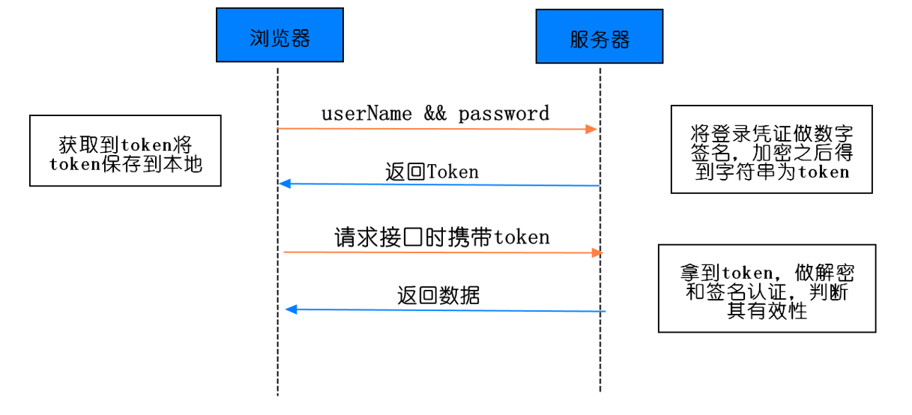
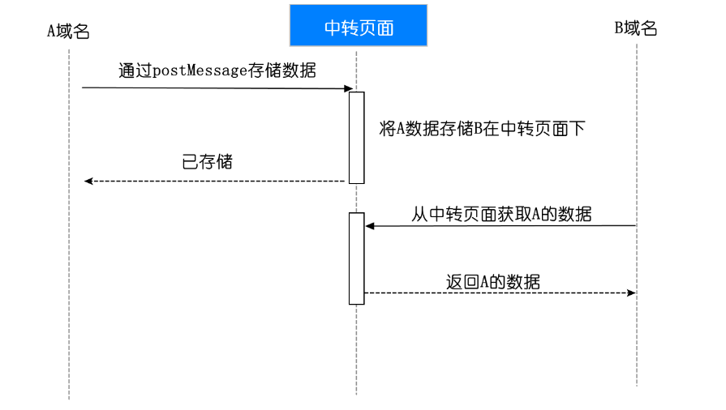
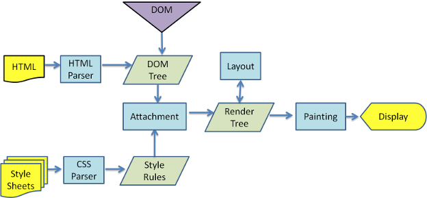

# 浏览器

## cookie sessionStorage localStorage IndexedDB 区别

共同点：都是保存在浏览器端、且同源的

区别：

1. cookie数据始终在同源的http请求中携带（即使不需要），即cookie在浏览器和服务器间来回传递，而sessionStorage和localStorage不会自动把数据发送给服务器，仅在本地保存。cookie数据还有路径（path）的概念，可以限制cookie只属于某个路径下
2. 存储大小限制也不同，cookie数据不能超过4K，同时因为每次http请求都会携带cookie、所以cookie只适合保存很小的数据，如会话标识。sessionStorage和localStorage虽然也有存储大小的限制，但比cookie大得多，可以达到5M或更大
3. 数据有效期不同，sessionStorage：仅在当前浏览器窗口关闭之前有效；localStorage：始终有效，窗口或浏览器关闭也一直保存，因此用作持久数据；cookie：只在设置的cookie过期时间之前有效，即使窗口关闭或浏览器关闭
4. 作用域不同，sessionStorage不在不同的浏览器窗口中共享，即使是同一个页面；localStorage在所有同源窗口中都是共享的；cookie也是在所有同源窗口中都是共享的
5. web Storage支持事件通知机制，可以将数据更新的通知发送给监听者
6. web Storage的api接口使用更方便
7. IndexedDB：被纳入HTML5标准的数据库存储方案，它是一个NoSql数据库，用键值对进行存储，可以快速读取操作，适合web场景和JavaScript操作

###  cookie

#### 1.cookie是什么

- cookie 是存储于访问者计算机中的变量。每当一台计算机通过浏览器来访问某个页面时，那么就可以通过 JavaScript 来创建和读取 cookie。
- 实际上 cookie 是存于用户硬盘的一个文件，这个文件通常对应于一个域名，当浏览器再次访问这个域名时，便使这个cookie可用。因此，cookie可以跨越一个域名下的多个网页，但不能跨越多个域名使用。
- 不同浏览器对 cookie 的实现也不一样。即保存在一个浏览器中的 cookie 到另外一个浏览器是不能获取的。

PS：cookie 和 session 都能保存计算机中的变量，但是 session 是运行在服务器端的，而客户端我们只能通过 cookie 来读取和创建变量

#### 2.cookie能做什么

- 用户在第一次登录某个网站时，要输入用户名密码，如果觉得很麻烦，下次登录时不想输入了，那么就在第一次登录时将登录信息存放在 cookie 中。下次登录时我们就可以直接获取 cookie 中的用户名密码来进行登录。
  PS:虽然浏览器将信息保存在 cookie 中是加密了，但是可能还是会造成不安全的信息泄露
- 类似于购物车性质的功能，第一次用户将某些商品放入购物车了，但是临时有事，将电脑关闭了，下次再次进入此网站，我们可以通过读取 cookie 中的信息，恢复购物车中的物品。
  PS：实际操作中，这种方法很少用了，基本上都是将这些信息存储在数据库中。然后通过查询数据库的信息来恢复购物车里的物品
- 页面之间的传值。在实际开发中，我们往往会通过一个页面跳转到另外一个页面。后端服务器我们可以通过数据库，session 等来传递页面所需要的值。但是在浏览器端，我们可以将数据保存在 cookie 中，然后在另外页面再去获取 cookie 中的数据。
  PS：这里要注意 cookie 的时效性，不然会造成获取 cookie 中数据的混乱。
##### token能放在cookie中吗

能

**解析**：

- token 是在客户端频繁向服务端请求数据，服务端频繁的去数据库查询用户名和密码并进行对比，判断用户名和密码正确与否，并作出相应提示，在这样的背景下，token 便应运而生。
- **「简单 token 的组成」**:uid(用户唯一的身份标识)、time(当前时间的时间戳)、sign（签名，token 的前几位以哈希算法压缩成的一定长度的十六进制字符串）

**token认证流程**



1. 客户端使用用户名跟密码请求登录
2. 服务端收到请求，去验证用户名与密码
3. 验证成功后，服务端签发一个 token ，并把它发送给客户端
4. 客户端接收 token 以后会把它存储起来，比如放在 cookie 里或者 localStorage 里
5. 客户端每次发送请求时都需要带着服务端签发的 token（把 token 放到 HTTP 的 Header 里）
6. 服务端收到请求后，需要验证请求里带有的 token ，如验证成功则返回对应的数据

#### 3.怎么使用cookie（设置/获取/删除）

- 语法

```js
document.cookie = "name=value;expires=evalue; path=pvalue; domain=dvalue; secure;"
```

- 对各个参数的解释

  1. name=value 必选参数
这是一个键值对，分别表示要存入的 属性 和 值。
比如：
```javascript
document.cookie="name=中文";
//为了防止中文乱码，我们可以使用encodeURIComponent()编码；decodeURIComponent()解码
document.cookie = encodeURIComponent("name")+"="+encodeURIComponent("中文");
```

2. expires=evalue 可选参数
该对象的有效时间（可选）只支持GTM 标准时间，即要将时间转换，toUTCString()（默认为当前浏览器会话有用，关闭浏览器就消失）;
比如：

```js
var date = new Date(); 　
date.setTime(date.getTime()+2000);//获取当前时间并加上 2 秒钟 　
alert(date.toUTCString());//格林威治时间 (GMT) 把 Date 对象转换为字符串，并返回结果
alert(date.toGMTString());//与上面的结果一样，但是这个方法已经被上面取代了 
document.cookie="name=value;expires="+date.toUTCString(); 
alert(document.cookie); // name=value 　
setTimeout(function(){alert(document.cookie)},4000);//4 秒后打印空的字符串
```

3. path=pvalue 可选参数
限制访问 cookie 的目录，默认情况下对于当前网页所在的同一目录下的所有页面有效

4.domain=dvalue 可选参数
用于限制只有设置了的域名才可以访问；如果没有设置，则默认在当前域名访问
比如设置 *test.com* 表示域名为 *test.com* 的服务器共享该Cookie

5.secure=true|false 可选参数，默认是 true 不安全传输
安全设置，指明必须通过安全的通信通道来传输（https) 才能获得 cookie,true 不安全，默认值；false 安全，必须通过 https 来访问
比如：如果你设置 document.cookie = "name=vae;secure"
上面的代码如果是在 http 的协议中访问，那么是访问不了的

```javascript
　//设置 cookie
function setCookie(objName, objValue, objHours){//添加cookie
	var str = objName + "=" + encodeURIComponent(objValue);
	if (objHours > 0) {//为0时不设定过期时间，浏览器关闭时cookie自动消失
		var date = new Date();
		var ms = objHours * 3600 * 1000;
		date.setTime(date.getTime() + ms);
		str += "; expires=" + date.toUTCString();
	}
	document.cookie = str;

}
//获取 cookie
function getCookie(objName){//获取指定名称的cookie的值
	//多个cookie 保存的时候是以 ;空格  分开的
	var arrStr = document.cookie.split("; ");
	for (var i = 0; i < arrStr.length; i++) {
		var temp = arrStr[i].split("=");
		if (temp[0] == objName){
			return decodeURIComponent(temp[1]);
		}else{
			return "";
		}

	}
}

//为了删除指定名称的cookie，可以将其过期时间设定为一个过去的时间
function delCookie(name){
	var date = new Date();
	date.setTime(date.getTime() - 10000);
	document.cookie = name + "=a; expires=" + date.toUTCString();
}
```

注意：

（1）cookie可能被禁用。当用户非常注重个人隐私保护时，他很可能禁用浏览器的cookie功能；
（2）cookie是与浏览器相关的。这意味着即使访问的是同一个页面，不同浏览器之间所保存的cookie也是不能互相访问的；
（3）cookie可能被删除。因为每个cookie都是硬盘上的一个文件，因此很有可能被用户删除；
（4）cookie安全性不够高。所有的cookie都是以纯文本的形式记录于文件中，因此如果要保存用户名密码等信息时，最好事先经过加密处理。
（5）cookie 在保存时，只要后面保存的 name 相同，那么就会覆盖前面的 cookie，注意是完全覆盖，包括失效时间

#### 4.cookie禁用

**问题描述：**

sessionID通过cookie保存在客户端，如果将cookie禁用，必将对session的使用造成一定的影响。

**解决这个问题的办法是**：URL重写

**URL重写**

1. servlet中涉及向客户端输出页面元素的时候，可以在相应的请求地址外面包上一层方法，也就是说使用response.encodeURL(“请求地址”);为请求地址添加一个JSESSIONID的值
2. servlet中涉及跳转到新的页面时，可以使用response.encodeRedirectURL(“请求地址”);为请求地址添加一个JSESSIONID的值

### localStorage
#### localStorage的限制

1. 浏览器的大小不统一，并且在IE8以上的IE版本才支持localStorage这个属性
2. 目前所有的浏览器中都会把localStorage的值类型限定为string类型，这个在对我们日常比较常见的JSON对象类型需要一些转换
3. localStorage在浏览器的隐私模式下面是不可读取的
4. localStorage本质上是对字符串的读取，如果存储内容多的话会消耗内存空间，会导致页面变卡
5. localStorage不能被爬虫抓取到

#### 如何写一个会过期的localStorage（懒惰删除和定时删除）

**两种方案：惰性删除 和 定时删除**

**惰性删除**

惰性删除是指，某个键值过期后，该键值不会被马上删除，而是等到下次被使用的时候，才会被检查到过期，此时才能得到删除。我们先来简单实现一下：

```js
var lsc = (function (self) {
    var prefix = 'one_more_lsc_'
    /**
     * 增加一个键值对数据
     * @param key 键
     * @param val 值
     * @param expires 过期时间，单位为秒
     */
    self.set = function (key, val, expires) {
        key = prefix + key;
        val = JSON.stringify({'val': val, 'expires': new Date().getTime() + expires * 1000});
        localStorage.setItem(key, val);
    };
    /**
     * 读取对应键的值数据
     * @param key 键
     * @returns {null|*} 对应键的值
     */
    self.get = function (key) {
        key = prefix + key;
        var val = localStorage.getItem(key);
        if (!val) {
            return null;
        }
        val = JSON.parse(val);
        if (val.expires < new Date().getTime()) {
            localStorage.removeItem(key);
            return null;
        }
        return val.val;
    };
    return self;
}(lsc || {}));
```

上述代码通过惰性删除已经实现了可过期的localStorage缓存，但是也有比较明显的缺点：如果一个key一直没有被用到，即使它已经过期了也永远存放在localStorage。为了弥补这样缺点，我们引入另一种清理过期缓存的策略。

**定时删除**

定时删除是指，每隔一段时间执行一次删除操作，并通过限制删除操作执行的次数和频率，来减少删除操作对CPU的长期占用。另一方面定时删除也有效的减少了因惰性删除带来的对localStorage空间的浪费。

每隔一秒执行一次定时删除，操作如下：

1. 随机测试20个设置了过期时间的key。
2. 删除所有发现的已过期的key。
3. 若删除的key超过5个则重复**步骤1**，直至重复500次。

具体实现如下：

```js
var lsc = (function (self) {
    var prefix = 'one_more_lsc_'
    var list = [];
    //初始化list
    self.init = function () {
        var keys = Object.keys(localStorage);
        var reg = new RegExp('^' + prefix);
        var temp = [];
        //遍历所有localStorage中的所有key
        for (var i = 0; i < keys.length; i++) {
            //找出可过期缓存的key
            if (reg.test(keys[i])) {
                temp.push(keys[i]);
            }
        }
        list = temp;
    };
    self.init();
    self.check = function () {
        if (!list || list.length == 0) {
            return;
        }
        var checkCount = 0;
        while (checkCount < 500) {
            var expireCount = 0;
            //随机测试20个设置了过期时间的key
            for (var i = 0; i < 20; i++) {
                if (list.length == 0) {
                    break;
                }
                var index = Math.floor(Math.random() * list.length);
                var key = list[index];
                var val = localStorage.getItem(list[index]);
                //从list中删除被惰性删除的key
                if (!val) {
                    list.splice(index, 1);
                    expireCount++;
                    continue;
                }
                val = JSON.parse(val);
                //删除所有发现的已过期的key
                if (val.expires < new Date().getTime()) {
                    list.splice(index, 1);
                    localStorage.removeItem(key);
                    expireCount++;
                }
            }
            //若删除的key不超过5个则跳出循环
            if (expireCount <= 5 || list.length == 0) {
                break;
            }
            checkCount++;
        }
    }
    //每隔一秒执行一次定时删除
    window.setInterval(self.check, 1000);
    return self;
}(lsc || {}));
```

#### localStorage 能跨域吗

不能

解决方案：

- 通过postMessage来实现跨源通信
- 可以实现一个公共的iframe部署在某个域名中，作为共享域
- 将需要实现localStorage跨域通信的页面嵌入这个iframe
- 接入对应的SDK操作共享域，从而实现localStorage的跨域存储



## memory cache 如何开启

 memory cache 是一种比较特殊的缓存，他不受max-age、no-cache等配置的影响，即使我们不设置缓存，如果当前的内存空间比较充裕的话，一些资源还是会被缓存下来。但这种缓存是暂时的，一旦关闭了浏览器，这一部分用于缓存的内存空间就会被释放掉。如果真的不想使用缓存，可以设置no-store，这样，即便是内存缓存，也不会生效。 

## 浏览器输入url发生了什么

1. URL 解析
2. DNS 查询
3. TCP 连接（三次握手）
4. 处理请求
5. 接受响应
6. 渲染页面（释放TCP连接，四次挥手）

### 2.DNS解析顺序

- 解析顺序：按照浏览器缓存，系统缓存，路由器缓存，ISP（运营商）DNS缓存，根域名服务器，顶级域名服务器，主域名服务器逐步读取，直到拿到IP地址
- DNS递归查询和迭代查询：从客户端到本地DNS服务器是属于递归查询，而DNS服务器之间就是的交互查询就是迭代查询

### 6 .浏览器如何渲染页面的

1. HTML 被 HTML 解析器解析成 DOM 树；
2. CSS 被 CSS 解析器解析成 CSSOM 树；
	1. 结合 DOM 树和 CSSOM 树，生成一棵渲染树(Render Tree)，这一过程称为 Attachment；
	2. 生成布局(flow)，浏览器在屏幕上“画”出渲染树中的所有节点；

3. 将布局绘制(paint)在屏幕上，显示出整个页面。
   不同的浏览器内核不同，所以渲染过程不太一样。 

   


## 重绘、重排区别及如何避免

1. 重排(Reflow)：当渲染树的一部分必须更新并且节点的尺寸发生了变化，浏览器会使渲染树中受到影响的部分失效，并重新构造渲染树。

2. 重绘(Repaint)：是在一个元素的外观被改变所触发的浏览器行为，浏览器会根据元素的新属性重新绘制，使元素呈现新的外观。比如改变某个元素的背景色、文字颜色、边框颜色等等

3. 区别：**重绘不一定需要重排（比如颜色的改变），重排必然导致重绘（比如改变网页位置）**

4. 引发重排

   4.1 添加、删除可见的dom
   4.2 元素的位置改变
   4.3 元素的尺寸改变(外边距、内边距、边框厚度、宽高、等几何属性)
   4.4 页面渲染初始化
   4.5 浏览器窗口尺寸改变
   4.6 获取某些属性。当获取一些属性时，浏览器为取得正确的值也会触发重排,它会导致队列刷新，这些属性包括：offsetTop、offsetLeft、 offsetWidth、offsetHeight、scrollTop、scrollLeft、scrollWidth、scrollHeight、clientTop、clientLeft、clientWidth、clientHeight、getComputedStyle() (currentStyle in IE)。所以，在多次使用这些值时应进行缓存。

5. 优化：

   浏览器自己的优化：
   浏览器会维护1个队列，把所有会引起重排，重绘的操作放入这个队列，等队列中的操作到一定数量或者到了一定时间间隔，浏览器就会flush队列，进行一批处理，这样多次重排，重绘变成一次重排重绘

   减少 reflow/repaint：
   （1）不要一条一条地修改 DOM 的样式。可以先定义好 css 的 class，然后修改 DOM 的 className。
   （2）不要把 DOM 结点的属性值放在一个循环里当成循环里的变量。
   （3）为动画的 HTML 元件使用 fixed 或 absolute 的 position，那么修改他们的 CSS 是不会 reflow 的。
   （4）千万不要使用 table 布局。因为可能很小的一个小改动会造成整个 table 的重新布局。(table及其内部元素除外，它可能需要多次计算才能确定好其在渲染树中节点的属性，通常要花3倍于同等元素的时间。这也是为什么我们要避免使用table做布局的一个原因。)
   （5）不要在布局信息改变的时候做查询（会导致渲染队列强制刷新）
   （6）对元素进行一个复杂的操作，可以先隐藏它，操作完成之后再显示
   （7）在内存中多次操作节点，完成后再添加到文档中。

## 浏览器垃圾回收机制

### 1. 介绍

浏览器的 Javascript 具有自动垃圾回收机制(GC:Garbage Collecation)，也就是说，执行环境会负责管理代码执行过程中使用的内存。其原理是：**垃圾收集器会定期（周期性）找出那些不在继续使用的变量，然后释放其内存**。但是这个过程不是实时的，因为其开销比较大并且GC时停止响应其他操作，所以垃圾回收器会按照固定的时间间隔周期性的执行。

不再使用的变量也就是生命周期结束的变量，当然只可能是局部变量，全局变量的生命周期直至浏览器卸载页面才会结束。局部变量只在函数的执行过程中存在，而在这个过程中会为局部变量在栈或堆上分配相应的空间，以存储它们的值，然后在函数中使用这些变量，直至函数结束，而闭包中由于内部函数的原因，外部函数并不能算是结束。

还是上代码说明吧：

```js
function fn1() {
    var obj = {name: 'hanzichi', age: 10};
}
function fn2() {
    var obj = {name:'hanzichi', age: 10};
    return obj;
}

var a = fn1();
var b = fn2();
```

我们来看代码是如何执行的。首先定义了两个function，分别叫做fn1和fn2，当fn1被调用时，进入fn1的环境，会开辟一块内存存放对象{name: 'hanzichi', age: 10}，而当调用结束后，出了fn1的环境，那么该块内存会被js引擎中的垃圾回收器自动释放；在fn2被调用的过程中，返回的对象被全局变量b所指向，所以该块内存并不会被释放。

这里问题就出现了：到底哪个变量是没有用的？所以垃圾收集器必须跟踪到底哪个变量没用，对于不再有用的变量打上标记，以备将来收回其内存。用于标记的无用变量的策略可能因实现而有所区别，通常情况下有两种实现方式：**标记清除**和**引用计数**。引用计数不太常用，标记清除较为常用。

### 2. 标记清除

js中最常用的垃圾回收方式就是标记清除。当变量进入环境时，例如，在函数中声明一个变量，就将这个变量标记为“进入环境”。从逻辑上讲，永远不能释放“进入环境”的变量所占用的内存，因为只要执行流进入相应的环境，就可能会用到它们。而当变量离开环境时，则将其标记为“离开环境”。 

```js
function test(){
var a = 10 ;             //被标记 ，进入环境 
var b = 20 ;             //被标记 ，进入环境
}
test();                     //执行完毕 之后 a、b又被标离开环境，被回收。
```

垃圾回收器在运行的时候会给存储在内存中的所有变量都加上标记（当然，可以使用任何标记方式）。然后，它会去掉环境中的变量以及被环境中的变量引用的变量的标记（闭包）。而在此之后再被加上标记的变量将被视为准备删除的变量，原因是环境中的变量已经无法访问到这些变量了。最后，垃圾回收器完成内存清除工作，销毁那些带标记的值并回收它们所占用的内存空间。 到目前为止，IE9+、Firefox、Opera、Chrome、Safari的js实现使用的都是标记清除的垃圾回收策略或类似的策略，只不过垃圾收集的时间间隔互不相同。

### 3. 引用计数

引用计数的含义是跟踪记录每个值被引用的次数。当声明了一个变量并将一个引用类型值赋给该变量时，则这个值的引用次数就是1。如果同一个值又被赋给另一个变量，则该值的引用次数加1。相反，如果包含对这个值引用的变量又取得了另外一个值，则这个值的引用次数减1。当这个值的引用次数变成0时，则说明没有办法再访问这个值了，因而就可以将其占用的内存空间回收回来。这样，当垃圾回收器下次再运行时，它就会释放那些引用次数为0的值所占用的内存。

```js
function test(){
    var a = {} ;         //a的引用次数为0 
    var b = a ;         //a的引用次数加1，为1 
    var c =a;           //a的引用次数再加1，为2
    var b ={};          //a的引用次数减1，为1
}
```

Netscape Navigator3是最早使用引用计数策略的浏览器，但很快它就遇到一个严重的问题：循环引用。循环引用指的是对象A中包含一个指向对象B的指针，而对象B中也包含一个指向对象A的引用。

```js
function fn() {
    var a = {};
    var b = {};
    a.pro = b;
    b.pro = a;
}
fn();
```

以上代码a和b的引用次数都是2，fn()执行完毕后，两个对象都已经离开环境，在标记清除方式下是没有问题的，但是在引用计数策略下，因为a和b的引用次数不为0，所以不会被垃圾回收器回收内存，如果fn函数被大量调用，就会造成内存泄露。在IE7与IE8上，内存直线上升。

我们知道，IE中有一部分对象并不是原生js对象。例如，其内存泄露DOM和BOM中的对象就是使用C++以COM对象的形式实现的，而COM对象的垃圾回收机制采用的就是引用计数策略。因此，即使IE的js引擎采用标记清除策略来实现，但js访问的**COM对象依然是基于引用计数策略**的。换句话说，只要在IE中涉及COM对象，就会存在循环引用的问题。

```js
var element = document.getElementById("some_element");
var myObject = new Object();
myObject.e = element;
element.o = myObject;
```

这个例子在一个DOM元素（element)与一个原生js对象（myObject)之间创建了循环引用。其中，变量myObject有一个属性e指向element对象；而变量element也有一个属性o回指myObject。由于存在这个循环引用，即使例子中的DOM从页面中移除，它也永远不会被回收。

举个栗子：

```js
window.onload=function outerFunction(){
    var obj = document.getElementById("element");
    obj.onclick=function innerFunction(){};
};
```

这段代码看起来没什么问题，但是obj引用了document.getElementById('element')，而document.getElementById('element')的onclick方法会引用外部环境中的变量，自然也包括obj，是不是很隐蔽啊。(在比较新的浏览器中在移除Node的时候已经会移除其上的event了，但是在老的浏览器，特别是ie上会有这个bug)

**解决办法：**

最简单的方式就是自己手工解除循环引用，比如刚才的函数可以这样

```js
myObject.element = null;
element.o = null;

window.onload=function outerFunction(){
    var obj = document.getElementById("element");
    obj.onclick=function innerFunction(){};
    obj=null;
};
复制代码
```

将变量设置为null意味着切断变量与它此前引用的值之间的连接。当垃圾回收器下次运行时，就会删除这些值并回收它们占用的内存。

要注意的是，IE9+并不存在循环引用导致Dom内存泄露问题，可能是微软做了优化，或者Dom的回收方式已经改变

### 4.什么时候触发垃圾回收

垃圾回收器周期性运行，如果分配的内存非常多，那么回收工作也会很艰巨，确定垃圾回收时间间隔就变成了一个值得思考的问题。IE6的垃圾回收是根据内存分配量运行的，当环境中存在256个变量、4096个对象、64k的字符串任意一种情况的时候就会触发垃圾回收器工作，看起来很科学，不用按一段时间就调用一次，有时候会没必要，这样按需调用不是很好吗？但是如果环境中就是有这么多变量等一直存在，现在脚本如此复杂，很正常，那么结果就是垃圾回收器一直在工作，这样浏览器就没法儿玩儿了。

微软在IE7中做了调整，触发条件不再是固定的，而是动态修改的，初始值和IE6相同，如果垃圾回收器回收的内存分配量低于程序占用内存的15%，说明大部分内存不可被回收，设的垃圾回收触发条件过于敏感，这时候把临街条件翻倍，如果回收的内存高于85%，说明大部分内存早就该清理了，这时候把触发条件置回。这样就使垃圾回收工作职能了很多

## 调试工具

### 谷歌浏览器自带的调试工具

1. Elements：可查看网页页面代码（修改只是当前使用有效），也可实时调试修改页面ccs代码样式。
2. console：记录开发者开发过程中的日志信息，也可在里面写js代码。一般页面运行时js报错都是可以在这里看到反馈和定位bug原因及其位置。
3. Sources：断点调试JS，可以查看程序代码执行的过程，断点调试对于每一个程序员来说可是很重要。
4. Network：从发起网页页面请求开始，分析HTTP请求后得到的各个请求资源信息
5. Timeline：记录并分析网站的生命周期所发生的各类事件，分析渲染js执行的每一个阶段。
6. Application：记录网站加载的各个资源信息。
7. Security：判断网页是否安全。
8. Audits：对当前网页的网络利用及网页性能进行检测，并给出一些优化建议。

