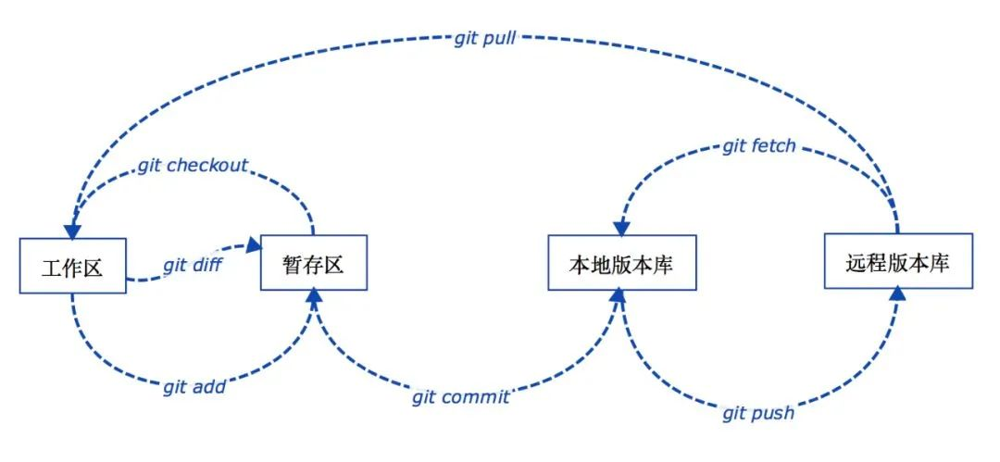
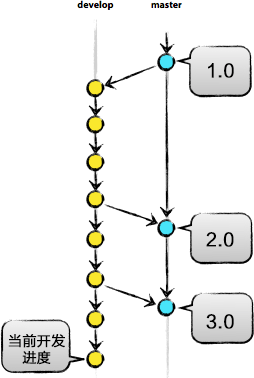

# Git命令

更多详情查看此网站http://gitref.justjavac.com/index.html

## 配置开发者用户名和邮箱

git config user.name "name"

git config user.email "name@qq.com"

每次提交的时候都会生成一条提交记录，其中包含当前配置的用户名和邮箱

## .gitignore

设置哪些内容不需要推送到服务器，这是一个配置文件

touch .gitignore   创建一个 `.gitignore` 文件，并在编辑器中打开文件，每一行代表一个要忽略的文件或目录

## 基本概念

### 工作区（*Working Directory*）

就是电脑上能看到的目录，一般就是项目内容的根目录

### 本地版本库（*Local Repository*）

工作区有一个隐藏目录 `.git` ，这个不算工作区，而是 `.git` 的版本库

### 暂存区（*stage*）

本地版本库里存了很多东西，其中最重要的就是称为 `stage` （或者叫index）的暂存区，还有 `Git` 为我们自动创建的第一个分支 `master` ，以及指向 `master` 的一个指针叫 `HEAD` 

### 远程版本库（*Remote Repository*）

 一般指的是 `Git` 服务器上所对应的仓库 

### 以上概念之间的关系

### 分支（*Branch*）

分支是为了将修改记录的整个流程分开存储，让分开的分支不受其他分支的影响，所以在同一个数据库里可以同时进行多个不同的修改

### 主分支（*Master*）

  `master` 是 `Git` 为我们自动创建的第一个分支，也叫主分支，其它分支开发完成后都要合并到 `master` 

### 标签（*Tag*）

 标签是用于标记特定的点或提交的历史，通常会用来标记发布版本的名称或版本号，打上标签的提交是固定的，不能随意的改动

### HEAD

`HEAD` 指向的就是当前分支的最新提交

## 获取和创建项目

### 将一个目录初始化为git仓库(在目录中执行)

​		git init

### 复制(克隆)一个项目(仓库)

​		git clone [url]	[url]为想要复制的项目

## 基本的快照

### 添加文件到缓存

​		git add .								 添加所有文件

​		git add *								添加所有文件（可以递归添加子目录新文件）

​		git add name(文件名)					   添加该文件

### 查看你的文件在工作目录与缓存的状态

​		git status								获得详细的结果

​	(未添加文件时结果显示---Change not staged for commit: (改动文件未提交到暂存区))

​	(添加文件后显示---Change to be committed: (文件已提交到暂存区))

​		git status -s							获得简短的结果

​		git status --ignored				查看工作区和暂存区文件状态，包括被忽略的文件

### 显示已写入缓存与已修改但尚未写入缓存的改动的区别

​		git diff									 查看 git status 的结果的详细信息——一行一行地显示这些文件是如何被修改或写入缓存的。

​		git diff --cached 					#查看已缓存的改动

​		git diff HEAD 						查看已缓存的与未缓存的所有改动（工作目录与上一次提交的更新的区别，无视缓存）

​		git diff --stat      					 显示摘要而非整个 diff

### 记录缓存内容的快照（提交文件变动到版本库）

​		git commit -m "注释"			 实际存储快照并提供提交注释（直接在命令行输入多行提交原因）

​		git commit -am '提交原因'	将工作区 `修改` 或 `删除` 的文件提交到本地版本库， `新增` 的文件不会被提交

​		git commit --amend -m '提交原因'	 修改最新一条提交记录的提交原因 

​		git commit -a						  自动将在提交前将已记录、修改的文件放入缓存区

​		git commit -C HEAD 		  将当前文件改动提交到 `HEAD` 或当前分支的历史ID  

### 取消缓存已缓存的内容（将缓存区恢复为未修改之前）

​		git reset HEAD -- 文件名   	取消该文件的缓存（取消 git add 的添加）

### 将文件从缓存区移除

​		git rm file								将文件从缓存区和工作区中删除，同时添加变动到暂存区，相比之下该命令省去了 `git add` 的操作			

## 分支和合并

### 	列出可用的分支：

​		git branch        查看本地分支

​		git branch -a	 查看本地版本库和远程版本库上的分支列表 ，加上 `-d` 参数可以删除远程版本库上的分支

​		git branch -r    查看远程分支

​		git branch -vv	查看带有最后提交id、最近提交原因等信息的本地版本库分支列表

### 	创建新分支：

​		git branch name(分支名称)     （新分支创建之后不会自动切换为当前分支）

​		git branch -m oldName newName 	(重命名之前创建的分支)

### 	切换分支

​		git checkout name(分支名称)

### 	创建新分支，并立即切换到该分支

​		git checkout -b name(分支名称)

### 	删除分支

​		git branch -d name(分支名称)		**-d选项只能删除参与合并的分支，对于未有合并的分支是无法删除的。如果想强制删除一个分支，可以使用-D选项**

### 	将分支合并到当前分支

​		git merge 分支名称				  将任何分支（该名称分支）合并到当前分支

​		git merge --squash					将待合并分支上的 `commit` 合并成一个新的 `commit` 放入当前分支，适用于待合并分支的提交记录不需要保留的情况 

### 显示一个分支中提交的更改记录

​		git log

​		git log -p				显示带提交差异对比的历史记录

​		git log demo.html		 显示 `demo.html` 文件的历史记录 

​		git log --oneline						查看历史记录的紧凑简洁的版本

​		git log --oneline --graph		  查看历史中什么时候出现了分支、合并，开启了拓扑图选项

（提交记录可能会非常多，按 `J` 往下翻，按 `K` 往上翻，按 `Q` 退出查看）

### 给历史记录中的某个重要的一点打上标签

​		git tag			查看版本

​		git tag [name]     创建版本

​		git tag -d [name]	删除版本

​		git tag -r		查看远程版本

​		git tag -a [注解] 						`-a` 选项意为“创建一个带注解的标签”

​		

## 分享与更新项目

### 	列出远端仓库别名

​		git remote								 将你项目克隆自的仓库添加到列表中，并命名为origin

​		git remote -v							 可以看到每个别名的实际链接地址

### 	为项目添加一个新的远端仓库

​		git remote add 别名(分支名称) url			添加一个新的远程仓库，指定一个名字，以便引用后面带的url

### 	删除现存的某个远端别名仓库

​		git remote rm 别名(分支名称)

### 	从远端仓库下载新分支与数据

​		git fetch 别名(分支名称)		 默认情况下，`git fetch` 取回所有分支的更新。如果只想取回特定分支的更新，可以指定分支名。 

### 	从远端仓库拉取最新代码

​		git pull

​		git pull origin(远端别名) name(分支名)

### 	推送新分支与数据到某个远端仓库

​		git push origin(别名) name(分支名)			将name[分支名]分支推送成为origin[别名]远端上的[分支名]分支

origin指代的是当前的git的服务器地址

## 检查与比较

###### 过滤提交记录 git log

​		git log --author=name			  只寻找某个特定作者的提交，name大小写敏感

###### 根据日期过滤提交记录

​		git log --since="2 weeks ago"		 显示2周前开始到现在的历史记录，其它时间可以类推 

​		git log  --before="2 weeks ago"		 显示截止到2周前的历史记录，其它时间可以类推 

###### 根据提交注释过滤提交记录

​		git log --grep=[变量]    			  根据提交注释中的某个特定短语[变量]来查找提交记录

###### 依据所引入的差值过滤

​		 git log -S[name]						想要找出哪个提交修改出了[name]，-S和[name]中间没有空格和等号

###### 显示每个提交引入的补丁

​		git log -p									 输出每个提交之后的补丁，总结提交之间发生了什么

###### 显示每个提交引入的改动的差值统计

​		git log --stat								和上面一样，但简短的输出总结这些改动

###### 查看两个提交快照的绝对改动

​		git diff										 查看两个分支彼此之间的差值，和查看自发布或者某个旧历史点之后都有啥改变了

​		git diff [标签]						      查看该[标签]之后的改动

​		git diff  --stat				    简短输出

