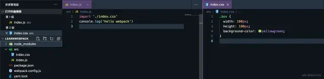

# webpack

## webpack介绍

webpack是一个现代JavaScript应用程序的**静态模块打包器**。如果你接触js够早的话，你一定知道最初的工程可没有这样的打包工具，一个文件就相当于一个模块，最终这些文件需要按照一定的顺序使用script标签引入html（因为如果顺序不对就会导致依赖变量丢失等错误问题）。

但是这个写项目不仅麻烦而且不优雅，随着node.js的出现和发展，才出现了这类基于node.js运行的打包工具（gulp、grunt，以及现在最流行的webpack），因为node.js拥有可对文件操作的能力。所以webpack本质就是为我们打包js的引用，而我们常听到各种loader、各种plugin、热更新、热模块替换等等都是webpack的一个升华，使得webpack能为我们提供更多的帮助。

- loader：webpack本身只能打包js和json格式的文件，但实际项目中我们还有会css、scss、png、ts等其他文件，这时我们就需要使用loader来让它正确打包。
	- **总结：loader是处理编译js和json以外的文件时用的**
	- 常见的loader：
```
style-loader
css-loader
sass-loader
ts-loader
file-loader
babel-loader
postcss-loader
...
```

- plugin：plugin可以在webpack运行到某个阶段时候，帮你做一些事情，类似react/vue中的生命周期。具体的某个插件（plugin）就是在webpack构建过程中的特定时机注入扩展逻辑来改变构建结果，作用于整个构建过程。

### 一些概念

- **postcss**：postcss是一个用 JavaScript 工具和插件转换 CSS 代码的工具。你可以把他理解成babel，他本身作用不大，我们很多具体需求的实现都需要他的插件来完成，他本身更像一个平台。  
    例如，项目中我们需要webpack自动的帮我们为css样式加上兼容性前缀，实际帮我们加上前缀的插件是`autoprefixer`，但他能为我们加前缀的前提又是我们有postcss。**千万不要把postcss误解postcss成scss、less替代品**
	- 对于“ PostCSS”一词，我们可以替代地指两件事：
		1. 该工具本身就是PostCSS（运行时会得到什么）`npm install postcss`，以及
		2. 该工具支持的PostCSS插件生态系统
- **babel**：babel 是一个 JavaScript 编译器，他可以让我们不再考虑兼容性，尽情的使用下一代的 JavaScript 语法编程。但是要实现具体的语法转换，我们还是要使用他的插件才能实现
	- 在babel7后为我们提供了预设[5]，可以让我们不再自己麻烦的对插件进行组合，想在什么环境运行就写什么预设即可（相当于每个预设选项中都帮你组合好了这个环境中需要用到的插件）
- **es6+语法**：babel默认会转换语法，例如：let、const、() => {}、class
- **es6+特性**：babel不会转换特性，特性需要js代码垫片来兼容低版本的浏览器。例如：Iterator、Generator、Set、Map、Proxy、Reflect、Symbol、Promise
- **@babel/core**：@babel/core是babel的核心库，所有的核心api都在这个库里，这些api可供babel-loader调用
- **@babel/preset-env**：这是一个预设的插件集合，包含了一组相关的插件，Bable中是通过各种插件来指导如何进行代码转换。该插件包含所有es6转化为es5的翻译规则
- **@babel/polyfill**：@babel/preset-env只是提供了语法转换的规则，但是它并不能弥补浏览器缺失的一些新的功能，如一些内置的方法和对象，如Promise，Array.from等，此时就需要polyfill来做js的垫片，弥补低版本浏览器缺失的这些新功能。**注意：Babel 7.4.0该包将被废弃**
- **core-js**：它是JavaScript标准库的polyfill，而且它可以实现按需加载。使用@babel/preset-env的时候可以配置core-js的版本和core-js的引入方式。**注意：@babel/polyfill依赖core-js**
- **regenerator-runtime**：提供generator函数的转码
- **browserslist**：browserslist实际上就是声明了一段浏览器的合集，我们的工具可以根据这个合集描述，针对性的输出兼容性代码，browserslist应用于babel、postcss等工具当中。
	- browserslist可以在package.json文件配置，也可以单出写一个.browserslistrc文件进行配置
	- 工具会自动查找.browserslistrc中的配置，如果没有发现.browserslistrc文件，则会去package.json中查找
	- 例如
```json
// 在.browserslistrc中的写法    
> 1%    
last 2 versions    
  
// 还可以配置不同环境下的规则（在.browserslistrc中）    
[production]    
> 1%    
ie 10    
  
[development]    
last 1 chrome version    
last 1 firefox version    
  
// 在package.json中的写法    
{    
  "browserslist": ["> 1%", "last 2 versions"]    
}    
  
// 还可以配置不同环境下的规则（在package.json中）    
// production和development取决你webpack中mode字段的配置    
{    
  "browserslist": {    
	  "production": [    
		  ">0.2%",    
		  "not dead",    
		  "not op_mini all"    
		 ],    
	   "development": [    
		   "last 1 chrome version",    
		   "last 1 firefox version",    
		   "last 1 safari version"    
		  ]    
	 }    
 }
```

 “> 1%”表示兼容市面上使用量大于百分之一的浏览，“last 1 chrome version”表示兼容到谷歌的上一个版本，具体的可以使用命令`npx browserslist "> 1%"`的方式查看都包含了哪些浏览器
 - **chunk**：它不是库也不是插件，它就是一个名词，顾名思义就是代码块。为什么要单独把他拎出来说呢，因为你明白它以后你自然就能理解webpack中配置一些参数的意思了
- **chunks**：一个chunks至少包含一个chunk，chunks是多个chunk的合集
```js
// index.js    
import { a } from 'a.js'    
console.log('我是index文件')    
  
//a.js    
const a = '我是a文件'    
export { a }
```

上面代码来说，a.js就是chunk，而index.js就是chunks
在webpack构建中入口是chunks，出口是chunk（知道这个概念就行）
## webpack配置核心概念

- chunk：指代码块，一个chunk可能由多个模块组合而成，也用于代码合并与分割（这里的合并分割主要指指纹策略的判断），指纹策略简单来说就是文件名后的hash
- bundle：资源经过webpack流程解析编译后最终输出的成果文件（一个.js格式的文件，也就是我们的output文件）
- entry：文件打包的入口，webpack会根据entry递归的去寻找依赖，每个依赖都将被它处理，最后打包到集合文件中
- output：配置打包输出的位置、文件名等
- loader：默认情况下，webpack仅支持js和json文件，通过loader，可以让它解析其他类型的文件。理论上只要有相应的loader，webpack可以处理任何类型的文件
- plugin：loader主要的职责是让webpack认识更多的文件类型，而plugin的职责则是让其可以控制构建流程，从而执行一些特殊的任务。插件的功能非常强大，可以完成各种各样的任务
- mode：目标环境，不用的目标环境会影响webpack打包时的决策
	- production：码进行压缩等一系列优化操作
	- development：有利于热更新的处理，识别哪个模块变化代
	- none：什么都不做，打包时会有提示警告

## 常见webpack功能需求

以下功能是使用的webpack4，其他版本的可能需要进行修改

### 实现加载css

根据webpack介绍知道.css文件无法正常被webpack打包进bundle（bundle的解释可查看“webpack配置核心概念”部分）文件，所以需要一个loader作为加载器将它正确打包进bundle文件
文件内容


需要安装css-loader，并进行配置
```js
const path = require('path')    
module.exports = {    
  entry: './src/index.js',    
  output: {    
    filename: 'main.js',    
    path: path.resolve(__dirname, './dist')    
  },    
  mode: "development",    
  module: {    
    rules: [ // 注意此处
      {    
        test: /\.css$/,    
        use: "css-loader"    
      }    
    ]    
  }    
}
```

运行webpack命令，检查一下dist/main.js中是否包含了css文件中的内容


发现css文件的内容被成功打包了，这时如果在dist文件夹下创建了一个html页面给div元素加上了box类，并引入main.js文件，会发现完全看不到样式效果。

因为此时css中的内容只是被作为一段字符串引入了js中（相当于对css文件的内容进行了JSON.stringify），所以自然是看不到效果的。

想要看到效果要怎么办？当然是将css内容放进style标签啦！不过这步不需要我们做，因为我们有style-loader为我们做这件事情！

### 实现css效果展示

安装style-loader，并配置

```js
const path = require('path')    
module.exports = {    
  entry: './src/index.js',    
  output: {    
    filename: 'main.js',    
    path: path.resolve(__dirname, './dist')    
  },    
  mode: 'development',    
  module: {    
    rules: [    // 注意此处
      {    
        test: /\.css$/,    
        use: ['style-loader', 'css-loader']    
      }    
    ]    
  }    
}
```

这里需要注意的是，对同一种类型文件使用多个 loader的时候，use属性接收一个数组，并且从右向左执行。所以style-loader要写在css-loader前面


css3在浏览器中会存在兼容性问题，我们可以通过给属性加上前缀来解决该问题。前端丰富的生态当然不会让你自己傻傻的做这件事情，我们可以通过autoprefixer这个插件帮我们完成

### 实现css前缀自动补充

安装postcss、postcss-loader、autoprefixer，**这里postcss-loader需要指定4.x的版本，因为4.x的版本和webpack4会存在报错问题**

安装autoprefixer postcss-loader@4.2.0 postcss并配置

```js
const path = require('path')    
module.exports = {    
  entry: './src/index.js',    
  output: {    
    filename: 'main.js',    
    path: path.resolve(__dirname, './dist')    
  },    
  mode: 'development',    
  module: {    
    rules: [    
      {    
        test: /\.css$/,    
        use: [    
          'style-loader',    
          'css-loader',    
          {    // 注意此处
            loader: 'postcss-loader',    
            options: {    
              postcssOptions: {    
                plugins: [require('autoprefixer')]    
              }    
            }    
          }    
        ]    
      }    
    ]    
  }    
}
```

当loader需要写配置的时候，我们可以把loader写成一个对象，loader属性就是要使用的loader名称，options属性就是这个loader的配置对象。autoprefixer是postcss的插件，所以autoprefixer的使用自然就要写在postcss-loader的配置中了

因为postcss有自己的配置文件，所以这里还可以写成这样：

```js
/ webpack.config.js    
const path = require('path')    
module.exports = {    
  entry: './src/index.js',    
  output: {    
    filename: 'main.js',    
    path: path.resolve(__dirname, './dist')    
  },    
  mode: 'development',    
  module: {    
    rules: [    // 注意此处
      {    
        test: /\.css$/,    
        use: ['style-loader', 'css-loader', 'postcss-loader']    
      }    
    ]    
  }    
}    
    
// 根目录下新建postcss.config.js文件    
module.exports = {    // 注意此处
  plugins: [require('autoprefixer')],    
}
```

这里我们需要配置一下browserslist，否则插件不知道按照什么样的规则进行前缀补全

```json
// 在package.json文件中添加    
// 这里的意思表示目标浏览器为ie浏览器，并需要兼容到ie8以上    
"browserslist": ["ie > 8"]
```


### 实现css以文件形式导出

随着项目的增大，我们不想把那么多的样式都放在style标签中，我们想用link标签引入，这时我们就需要使用mini-css-extract-plugin

安装mini-css-extract-plugin并配置

配置mini-css-extract-plugin插件和它的loader，这时我们不需要style-loader了，我们要style-loader替换成MiniCssExtractPlugin.loader
```js
const path = require('path')    
const MiniCssExtractPlugin = require('mini-css-extract-plugin')    
module.exports = {    
  entry: './src/index.js',    
  output: {    
    filename: 'main.js',    
    path: path.resolve(__dirname, './dist')    
  },    
  mode: 'development',    
  module: {    
    rules: [    
      {    
        test: /\.css$/,    
        use: [    
          MiniCssExtractPlugin.loader,    
          'css-loader',    
          'postcss-loader'    
        ]    
      }    
    ]    
  },    
  plugins: [    // 注意此处
    new MiniCssExtractPlugin({    
      filename: "css/[name].css"    
    })    
  ]    
}
```
- MiniCssExtractPlugin可以配置输出文件名
- \[name]为占位符，引入的时候是什么名字，导出的时候就是什么名字
- css/表示导出到css文件夹下

运行`webpack`命令看一下结果


### 实现自动生成html文件

我们发现dist下的html是我们自己手动创建的，这显然不够优雅。html-webpack-plugin帮你解决！

安装html-webpack-plugin4.5.2并配置

```js
const path = require('path')    
const MiniCssExtractPlugin = require('mini-css-extract-plugin')    
const HtmlWebpackPlugin = require('html-webpack-plugin')    
module.exports = {    
  entry: './src/index.js',    
  output: {    
    filename: 'main.js',    
    path: path.resolve(__dirname, './dist')    
  },    
  mode: 'development',    
  module: {    
    rules: [    
      {    
        test: /\.css$/,    
        use: [    
          MiniCssExtractPlugin.loader,    
          'css-loader',    
          'postcss-loader'    
        ]    
      }    
    ]    
  },    
  plugins: [    
    new MiniCssExtractPlugin({    
      filename: "css/[name].css",    
    }),    
    new HtmlWebpackPlugin({  // 注意此处  
      template: './src/index.html'    
    })    
  ]    
}
```


成功！很显然HtmlWebpackPlugin根据我们的模版为我们生成了新的html页面，并自动引入了dist包下的依赖

### 实现打包清空disk文件夹

我们会发现每次打包dist文件夹的内容会被覆盖，但是如果下次打包出来的文件名不同，那旧的打包文件还会存在，这是我们不想要的。

安装clean-webpack-plugin并配置
```js
const path = require('path')    
const MiniCssExtractPlugin = require('mini-css-extract-plugin')    
const HtmlWebpackPlugin = require('html-webpack-plugin')    
const { CleanWebpackPlugin } = require('clean-webpack-plugin')    
module.exports = {    
  entry: './src/index.js',    
  output: {    
    filename: 'main.js',    
    path: path.resolve(__dirname, './dist')    
  },    
  mode: 'development',    
  module: {    
    rules: [    
      {    
        test: /\.css$/,    
        use: [    
          MiniCssExtractPlugin.loader,    
          'css-loader',    
          'postcss-loader'    
        ]    
      }    
    ]    
  },    
  plugins: [    
    new MiniCssExtractPlugin({    
      filename: "css/[name].css",    
    }),    
    new HtmlWebpackPlugin({    
      template: './src/index.html'    
    }),    
    new CleanWebpackPlugin()    // 注意此处
  ]    
}

```

这时，你也在dist文件夹下随意建一个其他文件，运行`webpack`命令看一下结果，你会发现你随意建的文件不在了。验证了这一点，就说明你成功了

### 实现图片在js文件中引入

实现这个功能我们使用url-loader，当然你也可以使用file-loader。url-loader是file-loader的升级版，它内部也依赖了file-loader。**file-loader和url-loader在webpack5后都被废弃了，使用asset modules代替**

安装url-loader和file-loader并配置

**为什么要装file-loader，因为url-loader依赖file-loader。若不装，当url-loader将图片转换为base64导入bundle时不会存在问题，但直接输出图片到dist文件夹下就会报错，告诉你缺少file-loader**

```js
const path = require('path')    
const MiniCssExtractPlugin = require('mini-css-extract-plugin')    
const HtmlWebpackPlugin = require('html-webpack-plugin')    
const { CleanWebpackPlugin } = require('clean-webpack-plugin')    
module.exports = {    
  entry: './src/index.js',    
  output: {    
    filename: 'main.js',    
    path: path.resolve(__dirname, './dist')    
  },    
  mode: 'development',    
  module: {    
    rules: [    
      {    
        test: /\.css$/,    
        use: [    
          MiniCssExtractPlugin.loader,    
          'css-loader',    
          'postcss-loader'    
        ]    
      },    
      {    // 注意此处
        test: /\.(png|jpe?g|gif)$/,    
        use: {    
          loader: 'url-loader',    
          options: {    
            name: '[name].[ext]',    
            limit: 1024 * 3    
          }    
        }    
      }    
    ]    
  },    
  plugins: [    
    new MiniCssExtractPlugin({    
      filename: "css/[name].css",    
    }),    
    new HtmlWebpackPlugin({    
      template: './src/index.html'    
    }),    
    new CleanWebpackPlugin()    
  ]    
}
```

- [ext]表示导入时是什么格式，导出时就是什么格式
- limit表示图片大小的阈值，超过阈值的图片会被原封不动的放置到打包文件夹下（file-loader做的这件事情，在js中引入时会帮你生成一个地址，即打包后对应的访问地址），没有超过会处理成base64放在bundle文件中
在入口文件中引入图片
```js
// index.js    
import './index.css'    
import mk85 from './assets/images/mk85.jpeg'    
console.log(mk85) // mk85.jpeg    
const img = document.createElement('img')    
img.src = mk85    
const BoxDiv = document.getElementsByClassName('box')    
BoxDiv[0].appendChild(img)
```


### 实现图片在css文件中引入

在css中引入图片我们依旧使用url-loader，但需要对配置稍微进行修改

```css
.box {    
  width: 100px;    
  height: 100px;    
  /* background-color: yellowgreen; */    
  background-image: url('./assets/images/mk85.jpeg');    
  display: flex;    
}
```

直接引用并打包，打包成功！打开html页面，发现看不到图片，因为地址不对。打包后mk85图片在dist文件夹下，而index.css的引用路径依旧是mk85.jpeg，可index.css是在css文件夹下的，所以自然是无法引用到。

那如何才能引用到呢？最简单的方法就是加上`/`，**但这里有坑（其实也不是坑，这是一个关于`/images`、`./images`、`image`三者有什么不同的知识点）**。

修改url-loader配置
```js
const path = require('path')    
const MiniCssExtractPlugin = require('mini-css-extract-plugin')    
const HtmlWebpackPlugin = require('html-webpack-plugin')    
const { CleanWebpackPlugin } = require('clean-webpack-plugin')    
    
module.exports = {    
  entry: './src/index.js',    
  output: {    
    filename: 'main.js',    
    path: path.resolve(__dirname, './dist')    
  },    
  mode: 'development',    
  module: {    
    rules: [    
      {    
        test: /\.css$/,    
        use: [    
          MiniCssExtractPlugin.loader,    
          'css-loader',    
          'postcss-loader'    
        ]    
      },    
      {    // 注意此处 
        test: /\.(png|jpe?g|gif)$/,    
        use: {    
          loader: 'url-loader',    
          options: {    
            name: '[name].[ext]',    
            limit: 1024 * 3,    
            outputPath: "images/",    
            publicPath: "/images",    
          }    
        }    
      }    
    ]    
  },    
  plugins: [    
    new MiniCssExtractPlugin({    
      filename: "css/[name].css",    
    }),    
    new HtmlWebpackPlugin({    
      template: './src/index.html'    
    }),    
    new CleanWebpackPlugin()    
  ]    
}
```

- outputPath表示输出的到哪里（file-loader提供的）
- `name: images/[name].[ext]`这样写和用outputPath设置效果一样吗？在配合publicPath字段时不一样。所以当你不需要配置publicPath字段时，可以通过name设置输出路径（file-loader提供的）
```js
options: {    
    name: '[name].[ext]',    
    limit: 1024 * 3,    
    outputPath: "images/",    
    publicPath: "/images",    
 }    
   
 // 等价于    
   
 options: {    
  name: 'images/[name].[ext]',    
  limit: 1024 * 3,    
  publicPath: "/",    
 }
```

- publicPath表示资源引用的路径


成功了！是我们想要的结果，不过问题又来了，当你打开html页面时发现并不能看到图片正常显示，这里就牵扯到**关于`/images`、`./images`、`image`三者有什么不同的知识点**

简单来说，如果我起了服务，我的实际路径就是“localhost:8080/images/mk85.jpeg”，如果没有起服务那就是“/images/mk85.jpeg”
### 实现webpack本地服务

安装webpack-dev-server并配置
```js
const path = require('path')    
const MiniCssExtractPlugin = require('mini-css-extract-plugin')    
const HtmlWebpackPlugin = require('html-webpack-plugin')    
const { CleanWebpackPlugin } = require('clean-webpack-plugin')    
    
module.exports = {    
  entry: './src/index.js',    
  output: {    
    filename: 'main.js',    
    path: path.resolve(__dirname, './dist')    
  },    
  mode: 'development',    
  module: {    
    rules: [    
      {    
        test: /\.css$/,    
        use: [    
          MiniCssExtractPlugin.loader,    
          'css-loader',    
          'postcss-loader'    
        ]    
      },    
      {    
        test: /\.(png|jpe?g|gif)$/,    
        use: {    
          loader: 'url-loader',    
          options: {    
            name: '[name].[ext]',    
            limit: 1024 * 3,    
            outputPath: "images/",    
            publicPath: "/images",    
          }    
        }    
      }    
    ]    
  },    
  devServer: {    // 注意此处
    open: true,    
    port: 8080,    
  },    
  plugins: [    
    new MiniCssExtractPlugin({    
      filename: "css/[name].css",    
    }),    
    new HtmlWebpackPlugin({    
      template: './src/index.html'    
    }),    
    new CleanWebpackPlugin()    
  ]    
}
```

- 只需要加上devServer配置即可
- open表示打开浏览器
- port表示服务的端口号

**注意：这时就不是使用`webpack`命令来启动项目了，需使用`webpack-dev-server`来启动**

### 实现多页面打包

顾名思义，多页面自然是有多个html页面，每个html页面都有自己的js文件，那么，**有多少个入口就要有多少个出口**

我们首先要设置一下目录形式，以适应多页面打包的形式（以下形式不是唯一的，但有助于大家的理解）


- 这里不需要src/index.js
- 新建一个webpack.multiple.config.js
- 新建src/pages/login/js/index.js
- 新建src/pages/main/js/index.js

安装glob，用于处理文件，配置webpack.multiple.config.js
```js
module.exports = {    
  entry: {    
    login: './src/pages/login/js/index.js',    
    main: './src/pages/main/js/index.js'    
  },    
  output: {    
    filename: '[name].js',    
    path: path.resolve(__dirname, './dist')    
  },    
  plugins: [    
    new HtmlWebpackPlugin({    
      template: './src/index.html',    
      filename: 'login.html',    
      chunks: ['login'] // chunks的名字对应entry中的名字    
    }),    
    new HtmlWebpackPlugin({    
      template: './src/index.html',    
      filename: 'main.html',    
      chunks: ['main']    
    })    
  ]    
}
```

这样就完成了！你可以使用``webpack --config ./`webpack.multiple.config.js`` 命令运行一下。结果会如你所愿的

但是，这时你肯定会想难道我每写一个页面就重新配置一次吗？这也太麻烦了，也不优雅！那我们现在解决一下这个问题吧，直接上代码
```js
// 我们写一个方法自动做我们上面配置的事情    
const glob = require("glob")    
    
const setMpa = () => {    
  const entry = {}    
  const htmlwebpackplugins = []    
 // 通过glob库拿到我们的入口文件数组    
  const entryFiles = glob.sync(path.resolve(__dirname, "./src/pages/*/*/index.js"))    
 // console.log(entryFiles)    
  // 打印结果    
  // [    
  //  '/Users/yzy/Desktop/learnSpace/learnWebpack/src/pages/login/js/index.js',    
  //  '/Users/yzy/Desktop/learnSpace/learnWebpack/src/pages/main/js/index.js'    
  // ]    
  entryFiles.forEach((item) => {    
    const entryFile = item    
    const match = entryFile.match(/src\/pages\/(.*)\/js\/index\.js$/)    
    // console.log(match)    
    // 打印结果    
    // [    
    //   'src/pages/login/js/index.js',    
    //   'login',    
    //   index: 43,    
    //   input: '/Users/yzy/Desktop/learnSpace/learnWebpack/src/pages/login/js/index.js',    
    //   groups: undefined    
    // ]    
    const pageName = match[1]    
    entry[pageName] = entryFile    
    htmlwebpackplugins.push(    
      new HtmlWebpackPlugin({    
        template: `./src/index.html`,    
        filename: `${pageName}.html`,    
        chunks: [pageName]    
      })    
    )    
  })    
    
  return {    
    entry,    
    htmlwebpackplugins,    
  }    
}
```
有了这个方法以后，我们把它加到配置文件里
```js
const path = require('path')    
const MiniCssExtractPlugin = require('mini-css-extract-plugin')    
const HtmlWebpackPlugin = require('html-webpack-plugin')    
const { CleanWebpackPlugin } = require('clean-webpack-plugin')    
const glob = require("glob")    
    
const setMpa = () => {    // 注意此处
  const entry = {}    
  const htmlwebpackplugins = []    
  const entryFiles = glob.sync(path.resolve(__dirname, "./src/pages/*/*/index.js"))    
  entryFiles.forEach((item) => {    
    const entryFile = item    
    const match = entryFile.match(/src\/pages\/(.*)\/js\/index\.js$/)    
    const pageName = match[1]    
    entry[pageName] = entryFile    
    htmlwebpackplugins.push(    
      new HtmlWebpackPlugin({    
        template: `./src/index.html`,    
        filename: `${pageName}.html`,    
        chunks: [pageName]    
      })    
    )    
  })    
    
  return {    
    entry,    
    htmlwebpackplugins,    
  }    
}    
const { entry, htmlwebpackplugins } = setMpa()    
module.exports = {    
  entry,    
  output: {    
    filename: '[name].js',    
    path: path.resolve(__dirname, './dist')    
  },    
  mode: 'development',    
  module: {    
    rules: [    
      {    
        test: /\.css$/,    
        use: [    
          'style-loader',    
          'css-loader',    
          'postcss-loader'    
        ]    
      },    
      {    
        test: /\.(png|jpe?g|gif)$/,    
        use: {    
          loader: 'url-loader',    
          options: {    
            name: '[name].[ext]',    
            limit: 1024 * 3,    
            outputPath: "images/",    
            publicPath: "/images",    
          }    
        }    
      }    
    ]    
  },    
  devServer: {    
    open: true,    
    port: 8080,    
    hot: true    
  },    
  plugins: [    
    new MiniCssExtractPlugin({    
      filename: "css/[name].css",    
    }),    
    new CleanWebpackPlugin(),    
    ...htmlwebpackplugins    
  ]    
}
```

我们再使用``webpack --config ./`webpack.multiple.config.js`` 命令运行一下，成功！

### 实现一个loader

首先loader是一个函数，注意这里不能是箭头函数
编写一个替换字符串的loader

```js
// replaceLoader.js    
module.exports = function (soure) {    
  console.log(soure, this) // 这里可以自己打印看一下信息，内容太长我就不放进来了    
 return source.replace('hello webpack', "你好呀，webpack！")    
}
```

- loader是一个函数
- 不能使用箭头函数，因为要用到上下文的this
- soure接收到的是待处理的文件源码
- return处理后的文件源码，也是下一个loader接收到的文件源码
使用loader
```js
{    
  test: /\.js$/,    
  use: path.resolve(__dirname, './loader/replaceLoader.js')    
}
```

运行`webpack`命令看一下结果


### 实现一个plugin

同样简单，我们已经用了很多次plugin了，发现是不是都需要new一下。很显然，自定义loader是一个构造函数。

我们看一下格式：
```js
class PluginName {    
 constructor (options) {    
 }    
 apply(compiler) {    
  ...    
 }    
}
```

- 这里一定要写apply方法，webpack会通过apply方法启动插件
- PluginName可以写成普通function，apply必须挂载到原型对象上（`PluginName.prototype`）
- class类中的apply不能写成箭头函数
- webpack的compiler钩子，查看钩子决定你的插件要在哪一步做什么

编写一个假的html-webpack-plugin，输出一个fake.html文件
```js
class HtmlPlugin {    
 constructor (options) {    
 }    
 apply(compiler) {    
  compiler.hooks.emit.tap('HtmlPlugin', (compolation) => {    
      const content = '<html><body>fake html</body></html>'    
      compolation.assets['fake.html'] = {    
        source: function () {    
          return content    
        },    
        size: function () {    
          return content.length    
        }    
      }    
    })    
 }    
}    
module.exports = HtmlPlugin
```

使用这个plugin

```js
plugins: [    
  new HtmlPlugin()    
]
```

运行`webpack`命令看一下结果


## webpack打包流程

Webpack的运行流程是一个串行的过程，从启动到结束依次执行以下流程：

1. 初始化：启动构建，读取与合并配置参数，加载 Plugin，实例化 Compiler。
2. 编译：从 Entry 发出，针对每个 Module 串行调用对应的 Loader 去翻译文件内容，再找到该 Module 依赖的 Module，递归地进行编译处理。
3. 输出：对编译后的 Module 组合成 Chunk，把 Chunk 转换成文件，输出到文件系统。

如果只执行一次构建，以上阶段将会按照顺序各执行一次。但在开启监听模式下，流程将变为如下：


下面具体介绍一下webpack的三个大阶段具体的小步。

### 初始化阶段

初始化阶段大致分为：

- 合并shell和**配置文件**的参数并且**实例化Complier对象**。
- **加载插件**
- **处理入口**

| 事件名          | 解释                                                         |
| --------------- | ------------------------------------------------------------ |
| 初始化参数      | 从配置文件和 Shell 语句中读取与合并参数，得出最终的参数。 这个过程中还会执行配置文件中的插件实例化语句 new Plugin()。 |
| 实例化 Compiler | 用上一步得到的参数初始化Compiler实例，Compiler负责文件监听和启动编译。Compiler实例中包含了完整的Webpack配置，全局只有一个Compiler实例。 |
| 加载插件        | 依次调用插件的apply方法，让插件可以监听后续的所有事件节点。同时给插件传入compiler实例的引用，以方便插件通过compiler调用Webpack提供的API。 |
| environment     | 开始应用Node.js风格的文件系统到compiler对象，以方便后续的文件寻找和读取。 |
| entry-option    | 读取配置的Entrys，为每个Entry实例化一个对应的EntryPlugin，为后面该Entry的递归解析工作做准备。 |
| after-plugins   | 调用完所有内置的和配置的插件的apply方法。                    |
| after-resolvers | 根据配置初始化完resolver，resolver负责在文件系统中寻找指定路径的文件。 |

### 编译阶段

| 事件名        | 解释                                                         |
| ------------- | ------------------------------------------------------------ |
| before-run    | 清除缓存                                                     |
| run           | 启动一次新的编译。                                           |
| watch-run     | 和run类似，区别在于它是在监听模式下启动的编译，在这个事件中可以获取到是哪些文件发生了变化导致**重新启动**一次新的编译。 |
| compile       | 该事件是为了告诉插件一次**新的**编译将要启动，同时会给插件带上compiler对象。 |
| compilation   | 当Webpack以开发模式运行时，每当检测到文件变化，一次新的Compilation将被创建。一个Compilation对象包含了当前的模块资源、编译生成资源、变化的文件等。Compilation对象也提供了很多事件回调供插件做扩展。 |
| make          | 一个新的Compilation创建完毕，即将从Entry开始读取文件，根据文件类型和配置的Loader对文件进行编译，编译完后再找出该文件依赖的文件，递归的编译和解析。 |
| after-compile | 一次Compilation执行完成。这里会根据编译结果 合并出我们最终生成的文件名和文件内容。 |
| invalid       | 当遇到文件不存在、文件编译错误等异常时会触发该事件，该事件不会导致Webpack退出。 |

这里主要最重要的就是compilation过程，compilation实际上就是调用相应的loader处理文件生成chunks并对这些chunks做优化的过程。几个关键的事件（Compilation对象this.hooks中）：

| 事件名               | 解释                                                         |
| -------------------- | ------------------------------------------------------------ |
| build-module         | 使用对应的Loader去转换一个模块。                             |
| normal-module-loader | 在用Loader对一个模块转换完后，使用acorn解析转换后的内容，输出对应的抽象语法树（AST），以方便Webpack后面对代码的分析。 |
| program              | 从配置的入口模块开始，分析其AST，当遇到require等导入其它模块语句时，便将其加入到**依赖的模块列表**，同时对新找出的**依赖模块递归分析**，最终搞清所有模块的**依赖关系**。 |
| seal                 | 所有模块及其**依赖**的模块都通过Loader转换完成后，根据依赖关系开始生成Chunk。 |

### 输出阶段

| 事件名      | 解释                                                         |
| ----------- | ------------------------------------------------------------ |
| should-emit | 所有需要输出的文件已经生成好，询问插件哪些文件需要输出，哪些不需要。 |
| emit        | 确定好要输出哪些文件后，执行文件输出，可以在这里获取和修改输出内容。 |
| after-emit  | 文件输出完毕。                                               |
| done        | 成功完成一次完成的编译和输出流程。                           |
| failed      | 如果在编译和输出流程中遇到异常导致Webpack退出时，就会直接跳转到本步骤，插件可以在本事件中获取到具体的错误原因。 |

## loader和plugin的不同

- loader能让webpack处理不同的文件，然后对文件进行一些处理，编译，压缩等，最终一起打包到指定文件中（比如loader可以将sass，less文件写法转换成css，而不需要在使用其他转换工具），loader本身是一个函数，接收源文件作为参数，返回转换的结果

   loader能把源文件经过转化后输出新的结果，一个loader遵循单一职责原则，只完成一种转换，然后链式的顺序去依次经过多个loader转换，直到得到最终结果并返回，所以在写loader时要保持其职责的单一性，同时webpack还提供了一些API供loader调用 

```js
// build/webpack.base.conf.js
module: {
    rules: [
      {
        test: /\.vue$/,
        loader: 'vue-loader',
        options: vueLoaderConfig
      },
    ]
  },
```

- plugins则用于执行广泛的任务，从打包，优化，压缩，一直到重新定义环境中的变量，接口很强大，主要用来扩展webpack的功能，可以实现loader不能实现的更复杂的功能

```js
// build/webpack.prod.conf.js
plugins: [
    new webpack.DefinePlugin({
      'process.env': env
    }),
    new UglifyJsPlugin({
      uglifyOptions: {
        compress: {
          warnings: false
        }
      },
      sourceMap: config.build.productionSourceMap,
      parallel: true
    }),
]
```

## webpack如何配置单页和多页应用

单页应用即为webpack的标准模式，直接在entry中指定单页面应用的入口即可：

```
module.exports = {
  entry: {
    app: './src/main.js'
  },
}
```

多页面应用可以考虑使用webpack的`AutoWebPlugin`来完成简单的自动化构建，前提是项目目录结构要符合预先设定的规范

```
├── pages
│   ├── index
│   │   ├── index.css // 该页面单独需要的 CSS 样式
│   │   └── index.js // 该页面的入口文件
│   └── login
│       ├── index.css
│       └── index.js
├── common.css // 所有页面都需要的公共 CSS 样式
├── google_analytics.js
├── template.html
└── webpack.config.js
```

## webpack如何做到热更新

 webpack热更新（Hot Module Replacement），缩写为HMR，实现了不用刷新浏览器而将新变更的模块替换掉旧的模块，原理如下： 


server端和client端都做了处理：

- webpack监听到文件变化，重新编译打包，webpack-dev-server和webpack之间接口交互（主要是webpack-dev-middleware调用webpack暴露的API对代码进行监控，并告诉webpack将打包后代码保存到内存中）
- 通过sockjs（webpack-dev-server的依赖）在浏览器和服务器之间建立 一个`websocket`长连接，将webpack编译打包各阶段的信息告知浏览器端
- webpack根据 webpack-dev-server/client 传给它的信息以及 dev-server的配置决定是刷新浏览器还是进⾏模块热更新，如果是模块热更新继续执行，否者刷新浏览器
- HotModuleReplacement.runtime 是客户端 HMR 的中枢，它接收到上⼀步传递给他的新模块的 hash 值，它通过JsonpMainTemplate.runtime 向 server 端发送 Ajax 请求，服务端返回⼀个 json，该 json 包含了所有要更新的模块的 hash 值，获取到更新列表后，该模块再次通过 jsonp 请求，获取到最新的模块代码
- HotModulePlugin 将会对新旧模块进⾏对⽐，决定是否更新模块
- 当 HMR 失败后，回退到 live reload 操作，也就是进⾏浏览器刷新来获取最新打包代码

## 如何用webpack优化前端性能

- 压缩代码：比如利用UglifyJsPlugin来对js文件压缩
- CDN加速：将引用的静态资源修改为CDN上的路径。比如可以抽离出静态js，在index利用CDN引入；利⽤webpack对于 output 参数和各loader的publicPath参数来修改资源路径
- 删除Tree Shaking：将代码中永远不会走到的片段删除。可以通过在启动webpack时追加参数 `--optimize-minimize` 来实现
- 按照路由拆分代码，实现按需加载，提取公共代码
- 优化图片，对于小图可以使用 base64 的方式写入文件中

