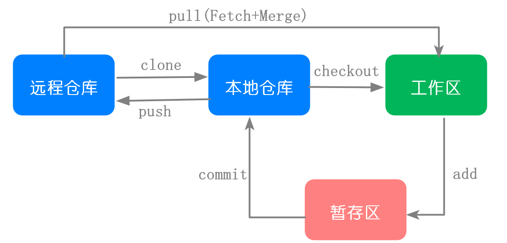
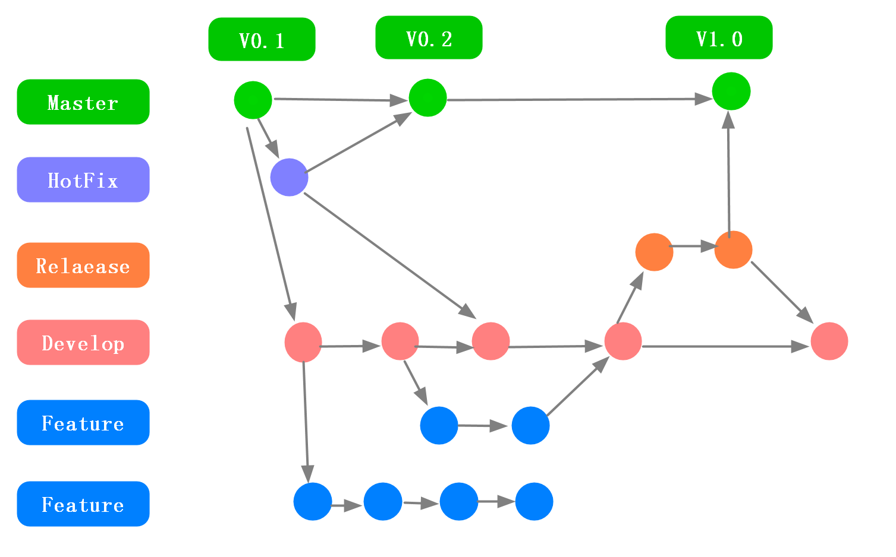

# 版本控制

## 多人开发如何维护代码、版本管理

**版本控制系统**

版本控制是指在软件开发过程中对各种程序代码、配置文件及说明文档等文件变更的管理，版本控制系统能够随着时间的推进记录一系列文件的变化，方便以后随时回退到某个版本。版本控制系统分为三大类：

**本地版本控制系统**

平时开发不使用版本控制系统的情况下，我们习惯用复制整个项目目录的方式来保存不同的版本，或许还会改名加上备份时间以示区别。这种方式需要对项目频繁进行复制，最终整个工作区会比较臃肿混乱且时间一长很难区分项目之间的差异。

为了解决这个问题，人们开发了本地版本控制系统，大多都是采用某种简单的数据库来记录文件的历次更新差异。最流行的是RCS，它的工作原理是在硬盘上保存补丁集（补丁指文件修订前后的变化），通过应用所有的补丁，可以重新计算出各个版本的文件内容。

本地版本控制系统一定程度上解决了手动复制粘贴代码的问题，但无法解决多人协作的问题。

**集中式版本控制系统**

集中式版本控制系统的出现是为了解决不同系统上的开发者协同开发，即多人协作的问题，主要有 CVS 和 SVN。集中式版本控制系统有一个单一的集中管理的中央服务器，保存所有文件的修订版本，由管理员管理和控制开发人员的权限，而协同工作的人们通过客户端连到中央服务器，从服务器上拉取最新的代码，在本地开发，开发完成再提交到中央服务器。

集中式版本控制系统有许多优点：

- 操作比较简单，只需要拉取代码，开发，提交代码。
- 基本解决多人协作问题，每个人都可以从服务器拉取最新代码了解伙伴的进度。
- 同时管理员可以轻松控制各开发者的权限。
- 只需要维护中央服务器上的数据库即可。

缺点也很明显：

- 本地没有全套代码，没有版本信息，提交更新都需联网跟服务器进行交互，对网络要求较高。
- 集中式的通病：风险较大，服务器一旦宕机，所有人无法工作，服务器磁盘一旦损坏，如果没有备份将丢失所有数据。

**分布式版本控制系统**

分布式版本控制系统很好地解决了集中式版本控制系统的缺点。首先，在分布式版本控制系统中，系统保存的不是文件变化的差量，而是文件的快照，即把文件的整体复制下来保存，其次，最重要的是分布式版本控制系统是去中心化的，当你从中央服务器拉取下来代码时，拉取的是一个完整的版本库，不仅仅是一份生硬的代码，还有历史记录，提交记录等版本信息，这样即使某一台机器宕机也能找到文件的完整备份。

## Git

Git 是 Linux 发明者 Linus 开发的一款分布式版本控制系统，是目前最为流行和软件开发着必须掌握的工具。

**Git 基础**

Git 是一个分布式版本控制系统，保存的是文件的完整快照，而不是差异变换或者文件补丁。保存每一次变化的完整内容。

Git 每一次提交都是对项目文件的一个完整拷贝，因此你可以完全恢复到以前的任何一个提交。Git 每个版本只会完整拷贝发生变化的文件，对于没有变化的文件，Git 只会保存一个指向上一个版本的文件的指针，即对一个特定版本的文件，Git 只会保存一个副本，但可以有多个指向该文件的指针。

**Git基本命令**



如上图，使用 Git 的基本工作流程就是：

1. 从远程仓库将项目clone到本地；
2. 在本地工作区进行开发：增加、删除或者修改文件；
3. 将更改的文件add到暂存区域；
4. 将暂存区的更新commit到本地仓库；
5. 将本地仓库push到服务器。

Git 工程在本地有三个工作区域：

- 工作区：进行日常开发的区域。
- 暂存区域：运行 git add 命令后文件保存的区域，也是进行 commit 的区域。
- 本地仓库：本地版本库，记录工程的提交历史，意味着数据永远不会丢失。

对应的，文件有四种状态：

- 未跟踪的（untracked）：表示在工作区新建了某个文件，还没有add。
- 已修改（modofied）：表示在工作区中修改了某个文件，还没有 add。
- 已暂存（staged）：表示把已修改的文件已add到暂存区域。
- 已提交（commit）：表示文件已经commit到本地仓库保存起来了。

**Git 分支**

几乎所有的版本控制系统都以分支的方式进行操作，分支是独立于项目主线的一条支线，我们可以在不影响主线代码的情况下，在分支下进行工作。

Git 初始化仓库时，默认创建的分支名是master，Git有一个分支指针（HEAD），始终指向当前分支。

Git 分支相关的命令如下：

```js
git branch ［branch-name］ //创建分支
git branch [branch-name] //[commit－head] 创建基于head提交的分支
git branch  //列出分支
git branch -r //列出远程分支
git branch -a //列出所有分支
git checkout -b [branch-name] //新建一个本地分支，并切换到该分支
git checkout -b [branch-name] origin/[branch-name] //新建一个基于远程分支的本地分支，并切换到该分支

git checkout [branch-name] //切换分支
git branch -d [branch-name] //删除分支
git branch -dr [remote/branch-name] //删除远程分支

git fetch origin //下载远程仓库代码的变动
```

**Git工作流**



如上图，首先，项目存在两个长期分支：

- 主分支（maste）r：专门用于部署以及负责线上代码回滚的分支，是最为稳定的一个分支，master的代码等于或者落后于develop的代码。
- 开发分支（develop）：专门存放经过测试之后，保证代码无bug的代码分支。开发的时候主要依托于develop分支开发，基于develop分支新建分支，经过严格测试之后，才能合并到develop中，保证develop代码的稳定性（也就是日常开发中不要轻易修改develop分支代码）。

开发过程中会从develop分支中衍生出临时开发分支：

- 项目开发分支或功能分支（feature）：此分支特点是周期长、需要团队协作、代码量大。工作方式是需要创建本地以及远程feature分支，代码基于develop分支代码，经过开发、测试之后，最终合并到develop分支上。当项目上线之后，分支会保留一段时间，直至最终删除。
- 紧急bug、其他问题修复分支（hotfix）：此分支特点是修改时间短、优先级高、代码量稍小、改完之后急需测试、上线。此分支代码也是基于develop。此分支会是团队协作或者单人、团队协作工作方式会类似feature分支，单人只需构建本地分支即可满足开发要求，当修复上线一段时间后，即可删除。
- 预发布分支（release）：此分支是项目开发完成，经过测试没有问题之后，从develop分支分出用于项目的预发布，预发布一段时间没有问题之后合并到master分支进行正式发布。

## git冲突解决，版本回退

1. 版本回退

   1.1当已经提交修改，但是想回到修改前的样子时，可使用版本回退
   ` git reset --hard HEAD^HEAD is now at 1bc0043 Merge branch 'master' of put-me-down`

   1.2 找到想要的那个版本的版本号后进行回退
   $ git reset --hard f8dce4b（版本号）uHEAD is now at f8dce4b 完成成就界面设计及编码，根据数据内容显示功能实现

2. merge时出现冲突

3. 1合并分支语句

```
$ git merge 分支名
```

2.2 在写合并分支语句之前把要合并的分支的内容pull下来，如将主分支pull下来

```
$ git pull origin master
```

- pull 会出现冲突，pull下来的版本比本地版本更新，可以用git status 看存在哪些冲突，打开文件进行修改，如果要保存原来版本，可在修改前用下列语句存储代码：

  1. 保存

  ```
  $ git stash save "...."
  ```

  2.可用下列语句恢复

  ```
  $ git stash apply 
  ```

- 和分支进行合并的时候(git merge 分支名)，会出现冲突，同样用git status进行查看冲突，或者运行代码看报错情况，对冲突进行修改。修改后要用git status 查看情况

-  看提示，要将修改的代码add，add后不能git commit -m "..."，git push origin 分支名，这样会报错，提示存在未合并的文件，不可提交，按照git status 的提示，将需要add的文件都add 

- 然后用git commit 提交，会进入vim 编辑器，写提交备注

  ```
  shift + c 键-- 进入编辑状态
  esc键 --退出编辑状态
  退出编辑状态后后“：+wq”退出编辑器
  ```

- 将冲突都解决，并提交后，程序试运行，看是否能跑，能跑再push 

 

