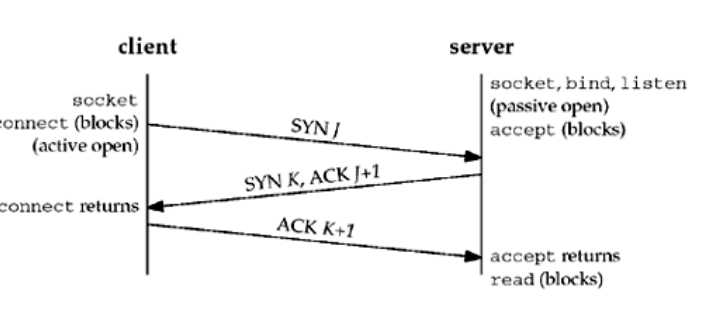
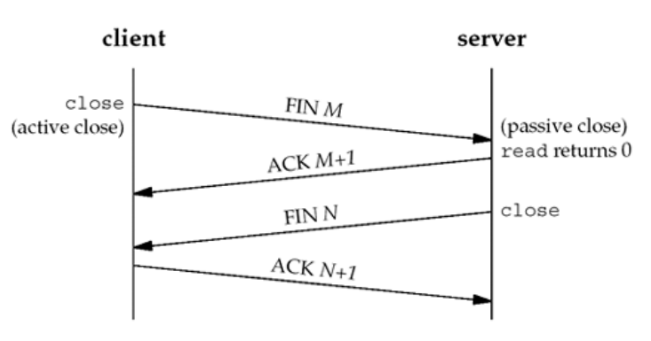
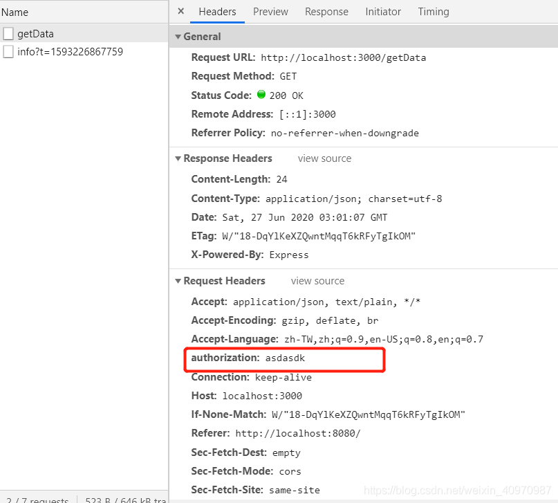
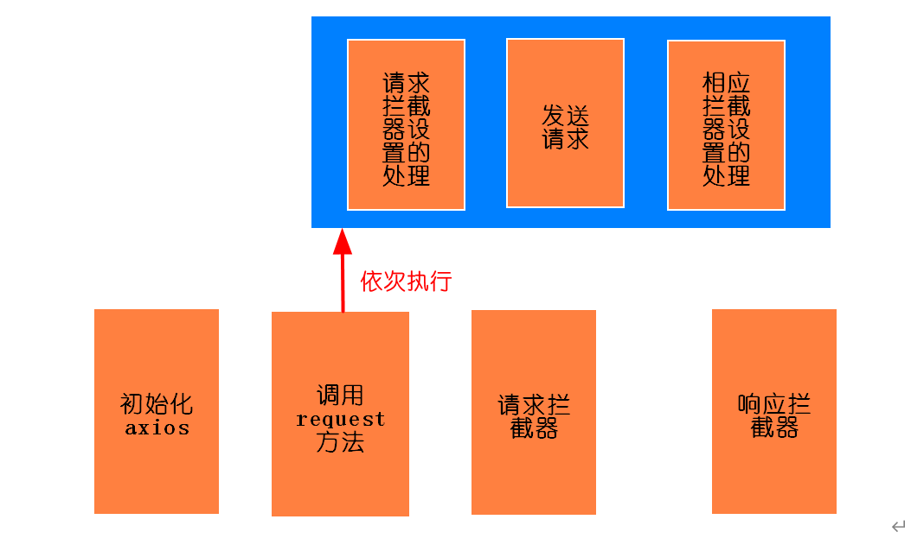

# 网络

## URL路径包含什么，URI是什么

**URL 路径包含什么**

一个完整的url分为4部分：

1. 协议 例 Http（超文本传输协议） 、Https、
2. 域名 例[www.baidu.com](https://link.jianshu.com/?t=http://www.baidu.com)为网站名字。 [baidu.com](https://link.jianshu.com/?t=http://baidu.com)为一级域名，www是服务
3. 端口 不填写的话默认走的是80端口号
4. 路径 [http://www.baidu.com/](https://link.jianshu.com/?t=http://www.baidu.com/)路径1/路径1.2。/表示根目录
5. 查询参数 [http://www.baidu.com/](https://link.jianshu.com/?t=http://www.baidu.com/)路径1/路径1.2?name="man"(可有可无)

**URI 是什么**

**URI**是一个用于标识互联网资源名称的字符串。 该种标识允许用户对网络中（一般指[万维网](https://link.jianshu.com/?t=https://zh.wikipedia.org/wiki/万维网)）的资源通过特定的协议进行交互操作。URI的最常见的形式是统一资源定位符（URL），经常指定为非正式的网址。更罕见的用法是统一资源名称（URN），其目的是通过提供一种途径。用于在特定的命名空间资源的标识，以补充网址。

**扩展**：

URL和URN是URI的子集，URI属于URL更高层次的抽象，一种字符串文本标准。

## 什么是同源策略，为什么需要同源策略

**同源策略**：

同源策略(Same Origin Policy)是一种约定，它是浏览器最核心最基本的安全功能。所谓的同源是指域名、协议、端口相同。不同源的客户端脚本在没有明确授权的情况下是不允许读写其他网站的资源

**同源策略的限制**:

1. Cookie、LocalStorage 和 IndexDB 无法读取。
2. DOM 无法获得。
3. AJAX 请求不能发送。

**同源策略作用**:

1. 防止恶意网页可以获取其他网站的本地数据。
2. 防止恶意网站iframe其他网站的时候，获取数据。
3. 防止恶意网站在自已网站有访问其他网站的权利，以免通过cookie免登，拿到数据。

## 跨域是什么？如何解决跨域

什么是同源策略及其限制内容？

同源策略是一种约定，它是浏览器最核心也最基本的安全功能，如果缺少了同源策略，浏览器很容易受到XSS、CSRF等攻击。所谓同源是指"协议+域名+端口"三者相同，即便两个不同的域名指向同一个ip地址，也非同源。


**同源策略限制内容有：**

- Cookie、LocalStorage、IndexedDB 等存储性内容
- DOM 节点
- AJAX 请求发送后，结果被浏览器拦截了

但是有三个标签是允许跨域加载资源：

- `` 
- `<link href='xxx'>`
- `<script src='xxx'>` 

跨域并不是请求发不出去，请求能发出去，服务端能收到请求并正常返回结果，只是结果被浏览器拦截了。

跨域解决方案

解决方案有jsonp、cors、postMessage、websocket、Node中间件代理(两次跨域)、nginx反向代理、window.name + iframe、location.hash + iframe、document.domain + iframe，CORS支持所有类型的HTTP请求，是跨域HTTP请求的根本解决方案，JSONP只支持GET请求，JSONP的优势在于支持老式浏览器，以及可以向不支持CORS的网站请求数据。不管是Node中间件代理还是nginx反向代理，主要是通过同源策略对服务器不加限制。日常工作中，用得比较多的跨域方案是cors和nginx反向代理

**解析**：

### 1.jsonp

1) JSONP原理

利用 `<script>` 标签没有跨域限制的漏洞，网页可以得到从其他来源动态产生的 JSON 数据。JSONP请求一定 需要对方的服务器做支持才可以。

2) JSONP优缺点

JSONP优点是简单兼容性好，可用于解决主流浏览器的跨域数据访问的问题。缺点是仅支持get方法具有局限性, 不安全可能会遭受XSS攻击。

3) JSONP的实现流程

声明一个回调函数，其函数名(如show)当做参数值，要传递给跨域请求数据的服务器，函数形参为要获取目 标数据(服务器返回的data)。

创建一个`script`标签，把那个跨域的API数据接口地址，赋值给script的src,还要在这个地址中向服务器传递该函数 名（可以通过问号传参:?callback=show）。

服务器接收到请求后，需要进行特殊的处理：把传递进来的函数名和它需要给你的数据拼接成一个字符串,例 如：传递进去的函数名是show，它准备好的数据是show('我不爱你')。

最后服务器把准备的数据通过HTTP协议返回给客户端，客户端再调用执行之前声明的回调函数（show），对 返回的数据进行操作。

### 2. cors

   CORS 需要浏览器和后端同时支持。IE 8 和 9 需要通过 XDomainRequest 来实现。

   浏览器会自动进行 CORS 通信，实现 CORS 通信的关键是后端。只要后端实现了 CORS，就实现了跨域。

   服务端设置 Access-Control-Allow-Origin 就可以开启 CORS。 该属性表示哪些域名可以访问资源，如果设置通配符则表示所有网站都可以访问资源。

   ```js
   //node处理
   if(req.headers.origin){
       res.wirteHead(200,{
           'Content-type':'text/html;charset=UTF-8',
           'Access-Control-Allow-Origin':'*', // *通配，或者安全考虑替换为指定域名
       });
       res.write('cors');
       res.end();
   }
   ```

### 3. postMessage

   postMessage是HTML5 XMLHttpRequest Level 2中的API，且是为数不多可以跨域操作的window属性之一，它可用于解决以下方面的问题：

   - 页面和其打开的新窗口的数据传递
   - 多窗口之间消息传递
   - 页面与嵌套的iframe消息传递
   - 上面三个场景的跨域数据传递

   **postMessage()方法允许来自不同源的脚本采用异步方式进行有限的通信，可以实现跨文本档、多窗口、跨域消息传递**。

### 4. websocket

   Websocket是HTML5的一个持久化的协议，它实现了浏览器与服务器的全双工通信，同时也是跨域的一种解决方案。WebSocket和HTTP都是应用层协议，都基于 TCP 协议。但是 **WebSocket 是一种双向通信协议，在建立连接之后，WebSocket 的 server 与 client 都能主动向对方发送或接收数据**。同时，WebSocket 在建立连接时需要借助 HTTP 协议，连接建立好了之后 client 与 server 之间的双向通信就与 HTTP 无关了。

   原生WebSocket API使用起来不太方便，我们使用Socket.io，它很好地封装了webSocket接口，提供了更简单、灵活的接口，也对不支持webSocket的浏览器提供了向下兼容

### 5. Node中间件代理(两次跨域)

   实现原理：**同源策略是浏览器需要遵循的标准，而如果是服务器向服务器请求就无需遵循同源策略。** 代理服务器，需要做以下几个步骤：

   - 接受客户端请求 。
   - 将请求 转发给服务器。
   - 拿到服务器 响应 数据。
   - 将 响应 转发给客户端。

### 6. nginx反向代理

   实现原理类似于Node中间件代理，需要你搭建一个中转nginx服务器，用于转发请求。

   使用nginx反向代理实现跨域，是最简单的跨域方式。只需要修改nginx的配置即可解决跨域问题，支持所有浏览器，支持session，不需要修改任何代码，并且不会影响服务器性能。

   实现思路：通过nginx配置一个代理服务器（域名与domain1相同，端口不同）做跳板机，反向代理访问domain2接口，并且可以顺便修改cookie中domain信息，方便当前域cookie写入，实现跨域登录。

### 7. window.name + iframe

   window.name属性的独特之处：name值在不同的页面（甚至不同域名）加载后依旧存在，并且可以支持非常长的 name 值（2MB）。

   总结：通过iframe的src属性由外域转向本地域，跨域数据即由iframe的window.name从外域传递到本地域。这个就巧妙地绕过了浏览器的跨域访问限制，但同时它又是安全操作。

### 8. location.hash + iframe

   实现原理： a.html欲与c.html跨域相互通信，通过中间页b.html来实现。 三个页面，不同域之间利用iframe的location.hash传值，相同域之间直接js访问来通信。

   具体实现步骤：一开始a.html给c.html传一个hash值，然后c.html收到hash值后，再把hash值传递给b.html，最后b.html将结果放到a.html的hash值中。 同样的，a.html和b.html是同域的，都是http://localhost:3000;而c.html是http://localhost:4000

### 9. document.domain + iframe

   **该方式只能用于二级域名相同的情况下，比如a.test.com和b.test.com适用于该方式**。 只需要给页面添加document.domain ='test.com'表示二级域名都相同就可以实现跨域。

   实现原理：两个页面都通过js强制设置document.domain为基础主域，就实现了同域。

## jsonp原理

利用 `<script>` 标签没有跨域限制的漏洞，网页可以得到从其他来源动态产生的 JSON 数据。JSONP请求一定 需要对方的服务器做支持才可以。

**解析**：

1. JSONP和AJAX对比

   JSONP和AJAX相同，都是客户端向服务器端发送请求，从服务器端获取数据的方式。但AJAX属于同源策略，JSONP属于非同源策略（跨域请求）

2. JSONP优缺点

   JSONP优点是简单兼容性好，可用于解决主流浏览器的跨域数据访问的问题。**缺点是仅支持get方法具有局限性,不安全可能会遭受XSS攻击。**

3. JSONP的实现流程

- 声明一个回调函数，其函数名(如show)当做参数值，要传递给跨域请求数据的服务器，函数形参为要获取目标数据(服务器返回的data)。
- 创建一个`script`标签，把那个跨域的API数据接口地址，赋值给script的src,还要在这个地址中向服务器传递该函数名（可以通过问号传参:?callback=show）。
- 服务器接收到请求后，需要进行特殊的处理：把传递进来的函数名和它需要给你的数据拼接成一个字符串,例如：传递进去的函数名是show，它准备好的数据是show('我不爱你')。
- 最后服务器把准备的数据通过HTTP协议返回给客户端，客户端再调用执行之前声明的回调函数（show），对返回的数据进行操作。

- 在开发中可能会遇到多个 JSONP 请求的回调函数名是相同的，这时候就需要自己封装一个 JSONP函数。

```js
// index.html中
function jsonp({ url, params, callback }) {
  return new Promise((resolve, reject) => {
    let script = document.createElement('script')
    window[callback] = function(data) {
      resolve(data)
      document.body.removeChild(script)
    }
    params = { ...params, callback } // wd=b&callback=show
    let arrs = []
    for (let key in params) {
      arrs.push(`${key}=${params[key]}`)
    }
    script.src = `${url}?${arrs.join('&')}`
    document.body.appendChild(script)
  })
}
jsonp({
  url: 'http://localhost:3000/say',
  params: { wd: 'Iloveyou' },
  callback: 'show'
}).then(data => {
  console.log(data)
})

```

上面这段代码相当于向http://localhost:3000/say?wd=Iloveyou&callback=show这个地址请求数据，然后后台返回show('我不爱你')，最后会运行show()这个函数，打印出'我不爱你'

```js
// server.js
let express = require('express')
let app = express()
app.get('/say', function(req, res) {
  let { wd, callback } = req.query
  console.log(wd) // Iloveyou
  console.log(callback) // show
  res.end(`${callback}('我不爱你')`)
})
app.listen(3000)
```

1. jQuery的jsonp形式

**JSONP都是GET和异步请求的，不存在其他的请求方式和同步请求，且jQuery默认就会给JSONP的请求清除缓存。**

```js
$.ajax({
url:"http://crossdomain.com/jsonServerResponse",
dataType:"jsonp",
type:"get",//可以省略
jsonpCallback:"show",//->自定义传递给服务器的函数名，而不是使用jQuery自动生成的，可省略
jsonp:"callback",//->把传递函数名的那个形参callback，可省略
success:function (data){
console.log(data);}
});
```

**手写jsonp**

实现步骤：

1. 创建script元素，设置src属性，并插入文档中，同时触发AJAX请求。

2. 返回Promise对象，then函数才行继续，回调函数中进行数据处理

3. script元素删除清理

```html
   <!DOCTYPE html>
   <html lang="en">
   
   <head>
     <meta charset="UTF-8">
     <meta name="viewport" content="width=device-width, initial-scale=1.0">
     <meta http-equiv="X-UA-Compatible" content="ie=edge">
     <title>Document</title>
   </head>
   
   <body>
   
     <script>
       /**
        * 手写jsonp并返回Promise对象
        * 参数url，data:json对象，callback函数
        */
       function jsonp(url, data = {}, callback = 'callback') {
         // 处理json对象，拼接url
         data.callback = callback
         let params = []
         for (let key in data) {
           params.push(key + '=' + data[key])
         }
         console.log(params.join('&'))
         // 创建script元素
         let script = document.createElement('script')
         script.src = url + '?' + params.join('&')
         document.body.appendChild(script)
         // 返回promise
         return new Promise((resolve, reject) => {
           window[callback] = (data) => {
             try {
               resolve(data)
             } catch (e) {
               reject(e)
             } finally {
               // 移除script元素
               script.parentNode.removeChild(script)
               console.log(script)
             }
           }
         })
   
       }
       jsonp('http://photo.sina.cn/aj/index', {
         page: 1,
         cate: 'recommend'
       }, 'jsoncallback').then(data => {
         console.log(data)
       })
     </script>
   </body>
   
   </html>
```

## webSocket的原理

Websocket是HTML5的一个持久化的协议，它实现了浏览器与服务器的全双工通信，同时也是跨域的一种解决方案。WebSocket和HTTP都是应用层协议，都基于 TCP 协议。但是 **WebSocket 是一种双向通信协议，在建立连接之后，WebSocket 的 server 与 client 都能主动向对方发送或接收数据**。同时，WebSocket 在建立连接时需要借助 HTTP 协议，连接建立好了之后 client 与 server 之间的双向通信就与 HTTP 无关了。

原生WebSocket API使用起来不太方便，我们使用Socket.io，它很好地封装了webSocket接口，提供了更简单、灵活的接口，也对不支持webSocket的浏览器提供了向下兼容。

我们先来看个例子：本地文件socket.html向localhost:3000发生数据和接受数据

```html
// socket.html
<script>
    let socket = new WebSocket('ws://localhost:3000');
    socket.onopen = function () {
      socket.send('我爱你');//向服务器发送数据
    }
    socket.onmessage = function (e) {
      console.log(e.data);//接收服务器返回的数据
    }
</script>
// server.js
let express = require('express');
let app = express();
let WebSocket = require('ws');//记得安装ws
let wss = new WebSocket.Server({port:3000});
wss.on('connection',function(ws) {
  ws.on('message', function (data) {
    console.log(data);
    ws.send('我不爱你')
  });
})
```

## 有什么办法可以保持前后端实时通信

实现保持前后端实时通信的方式有以下几种

- WebSocket： IE10以上才支持，Chrome16, FireFox11,Safari7以及Opera12以上完全支持，移动端形势大
- event-source: IE完全不支持（注意是任何版本都不支持），Edge76，Chrome6,Firefox6,Safari5和Opera以上支持， 移动端形势大好
- AJAX轮询： 用于兼容低版本的浏览器
- 永久帧（ forever iframe）可用于兼容低版本的浏览器
- flash socket 可用于兼容低版本的浏览器

**这几种方式的优缺点**

**1.WebSocket**

- 优点：WebSocket 是 HTML5 开始提供的一种在单个 TCP 连接上进行全双工通讯的协议，可从HTTP升级而来，浏览器和服务器只需要一次握手，就可以进行持续的，双向的数据传输，因此能显著节约资源和带宽
- 缺点：1. 兼容性问题:不支持较低版本的IE浏览器（IE9及以下）2.不支持断线重连，需要手写心跳连接的逻辑 3.通信机制相对复杂

**2. server-sent-event（event-source）**

- 优点：（1）只需一次请求，便可以stream的方式多次传送数据，节约资源和带宽 （2）相对WebSocket来说简单易用 （3）内置断线重连功能(retry)
- 缺点： （1）是单向的，只支持服务端->客户端的数据传送，客户端到服务端的通信仍然依靠AJAX，没有”一家人整整齐齐“的感觉（2）兼容性令人担忧，IE浏览器完全不支持

**3. AJAX轮询**

- 优点：兼容性良好，对标低版本IE
- 缺点：请求中有大半是无用的请求，浪费资源

**4.Flash Socket**

- 缺点：（1）浏览器开启时flash需要用户确认，（2）加载时间长，用户体验较差 （3）大多数移动端浏览器不支持flash，为重灾区
- 优点： 兼容低版本浏览器

**5. 永久帧（ forever iframe）**

- 缺点： iframe会产生进度条一直存在的问题，用户体验差
- 优点：兼容低版本IE浏览器

**综上，综合兼容性和用户体验的问题，我在项目中选用了WebSocket ->server-sent-event -> AJAX轮询这三种方式做从上到下的兼容**

## 常见http状态码

**1XX系列**：指定客户端应相应的某些动作，代表请求已被接受，需要继续处理。由于 HTTP/1.0 协议中没有定义任何 1xx 状态码，所以除非在某些试验条件下，服务器禁止向此类客户端发送 1xx 响应。

**2XX系列**：代表请求已成功被服务器接收、理解、并接受。这系列中最常见的有200、201状态码。

**3XX系列**：代表需要客户端采取进一步的操作才能完成请求，这些状态码用来重定向，后续的请求地址（重定向目标）在本次响应的 Location 域中指明。这系列中最常见的有301、302状态码。

**4XX系列**：表示请求错误。代表了客户端看起来可能发生了错误，妨碍了服务器的处理。常见有：401、404状态码。

**5xx系列**：代表了服务器在处理请求的过程中有错误或者异常状态发生，也有可能是服务器意识到以当前的软硬件资源无法完成对请求的处理。常见有500、503状态码。

### 2开头 （请求成功）

表示成功处理了请求的状态代码。

- 200 （成功） 服务器已成功处理了请求。 通常，这表示服务器提供了请求的网页。
- 201 （已创建） 请求成功并且服务器创建了新的资源。
- 202 （已接受） 服务器已接受请求，但尚未处理。
- 203 （非授权信息） 服务器已成功处理了请求，但返回的信息可能来自另一来源。
- 204 （无内容） 服务器成功处理了请求，但没有返回任何内容。
- 205 （重置内容） 服务器成功处理了请求，但没有返回任何内容。
- 206 （部分内容） 服务器成功处理了部分 GET 请求。

### 3开头 （请求被重定向）

表示要完成请求，需要进一步操作。 通常，这些状态代码用来重定向。

- 300 （多种选择） 针对请求，服务器可执行多种操作。 服务器可根据请求者 (user agent) 选择一项操作，或提供操作列表供请求者选择。
- 301 （永久移动） 请求的网页已永久移动到新位置。 服务器返回此响应（对 GET 或 HEAD 请求的响应）时，会自动将请求者转到新位置。
- 302 （临时移动） 服务器目前从不同位置的网页响应请求，但请求者应继续使用原有位置来进行以后的请求。
- 303 （查看其他位置） 请求者应当对不同的位置使用单独的 GET 请求来检索响应时，服务器返回此代码。
- 304 （未修改） 自从上次请求后，请求的网页未修改过。 服务器返回此响应时，不会返回网页内容。
- 305 （使用代理） 请求者只能使用代理访问请求的网页。 如果服务器返回此响应，还表示请求者应使用代理。
- 307 （临时重定向） 服务器目前从不同位置的网页响应请求，但请求者应继续使用原有位置来进行以后的请求。
#### 301和302

301和302都是重定向的状态码，重定向（Redirect）是指通过各种方法将客户端的网络请求重新定义或指定一个新方向转到其他位置（重定向包括网页重定向、域名重定向）。
301 redirect: 301 代表永久性转移(Permanently Moved)
302 redirect: 302 代表暂时性转移(Temporarily Moved )

**相同点：** 都表示重定向，就是说浏览器在拿到服务器返回的这个状态码后会自动跳转到一个新的URL地址，这个地址可以从响应的Location首部中获取（用户看到的效果就是他输入的地址A瞬间变成了另一个地址B）

**不同点：**

1. 301表示旧地址A的资源已经被永久地移除了（这个资源不可访问了），搜索引擎在抓取新内容的同时也将旧的网址交换为重定向之后的网址；
   302表示旧地址A的资源还在（仍然可以访问），这个重定向只是临时地从旧地址A跳转到地址B，搜索引擎会抓取新的内容而保存旧的网址。

2. 302会出现“网址劫持”现象，从A网址302重定向到B网址，由于部分搜索引擎无法总是抓取到目标网址，或者B网址对用户展示不够友好，因此浏览器会仍旧显示A网址，但是所用的网页内容却是B网址上的内容。

**应用场景**

301：域名需要切换、协议从http变成https；
302：未登录时访问已登录页时跳转到登录页面、404后跳转首页

### 4开头 （请求错误）

这些状态代码表示请求可能出错，妨碍了服务器的处理。

- 400 （错误请求） 服务器不理解请求的语法。
- 401 （未授权） 请求要求身份验证。 对于需要登录的网页，服务器可能返回此响应。
- 403 （禁止） 服务器拒绝请求。
- 404 （未找到） 服务器找不到请求的网页。
- 405 （方法禁用） 禁用请求中指定的方法。
- 406 （不接受） 无法使用请求的内容特性响应请求的网页。
- 407 （需要代理授权） 此状态代码与 401（未授权）类似，但指定请求者应当授权使用代理。
- 408 （请求超时） 服务器等候请求时发生超时。
- 409 （冲突） 服务器在完成请求时发生冲突。 服务器必须在响应中包含有关冲突的信息。
- 410 （已删除） 如果请求的资源已永久删除，服务器就会返回此响应。
- 411 （需要有效长度） 服务器不接受不含有效内容长度标头字段的请求。
- 412 （未满足前提条件） 服务器未满足请求者在请求中设置的其中一个前提条件。
- 413 （请求实体过大） 服务器无法处理请求，因为请求实体过大，超出服务器的处理能力。
- 414 （请求的 URI 过长） 请求的 URI（通常为网址）过长，服务器无法处理。
- 415 （不支持的媒体类型） 请求的格式不受请求页面的支持。
- 416 （请求范围不符合要求） 如果页面无法提供请求的范围，则服务器会返回此状态代码。
- 417 （未满足期望值） 服务器未满足"期望"请求标头字段的要求。

### 5开头（服务器错误）

这些状态代码表示服务器在尝试处理请求时发生内部错误。 这些错误可能是服务器本身的错误，而不是请求出错。

- 500 （服务器内部错误） 服务器遇到错误，无法完成请求。
- 501 （尚未实施） 服务器不具备完成请求的功能。 例如，服务器无法识别请求方法时可能会返回此代码。
- 502 （错误网关） 服务器作为网关或代理，从上游服务器收到无效响应。
- 503 （服务不可用） 服务器目前无法使用（由于超载或停机维护）。 通常，这只是暂时状态。
- 504 （网关超时） 服务器作为网关或代理，但是没有及时从上游服务器收到请求。
- 505 （HTTP 版本不受支持） 服务器不支持请求中所用的 HTTP 协议版本。

#### 504如何排查

排查步骤：

1. 检查500/502/504错误截图，判断是负载均衡问题，高防/安全网络配置问题，还是后端ECS配置问题。
2. 如果有高防/安全网络，请确认高防/安全网络的七层转发配置正确。
3. 请确认是所有客户端都有问题，还仅仅是部分客户端有问题。如果仅仅是部分客户端问题，排查该客户端是否被云盾阻挡，或者负载均衡域名或者IP是否被ISP运营商拦截。
4. 检查负载均衡状态，是否有后端ECS健康检查失败的情况，如果有健康检查失败，解决健康检查失败问题。
5. 在客户端用hosts文件将负载均衡的服务地址绑定到后端服务器的IP地址上，确认是否是后端问题。如果5XX错误间断发生，很可能是后端某一台ECS服务器的配置问题。
6. 尝试将七层负载均衡切换为四层负载均衡，查看问题是否会复现。
7. 检查后端ECS服务器是否存在CPU、内存、磁盘或网络等性能瓶颈。
8. 如果确认是后端服务器问题，请检查后端ECS Web服务器日志是否有相关错误，Web服务是否正常运行，确认Web访问逻辑是否有问题，卸载服务器上杀毒软件重启测试。
9. 检查后端ECS Linux操作系统的TCP内核参数是否配置正确。

## http和https

### 1.http和https的基本概念

HTTP：是互联网上应用最为广泛的一种网络协议，是一个客户端和服务器端请求和应答的标准（TCP），用于从WWW服务器传输超文本到本地浏览器的传输协议，它可以使浏览器更加高效，使网络传输减少。

HTTPS：是以安全为目标的HTTP通道，简单讲是HTTP的安全版，即HTTP下加入SSL层，HTTPS的安全基础是SSL，因此加密的详细内容就需要SSL。

HTTPS协议的主要作用可以分为两种：一种是建立一个信息安全通道，来保证数据传输的安全；另一种就是确认网站的真实性。

### 2.http与https有什么区别

HTTP协议传输的数据都是未加密的，也就是明文的，因此使用HTTP协议传输隐私信息非常不安全，为了保证 这些隐私数据能加密传输，于是网景公司设计了SSL（Secure Sockets Layer）协议用于对HTTP协议传输的数据进行加密，从而就诞生了HTTPS。简单来说，HTTPS协议是由SSL+HTTP协议构建的可进行加密传输、身份认证的网络协议，要比http协议安全。

HTTPS和HTTP的区别主要如下：

1、https协议需要到ca申请证书，一般免费证书较少，因而需要一定费用。
2、http是超文本传输协议，信息是明文传输，https则是具有安全性的ssl加密传输协议。
3、http和https使用的是完全不同的连接方式，用的端口也不一样，前者是80，后者是443。
4、http的连接很简单，是无状态的；HTTPS协议是由SSL+HTTP协议构建的可进行加密传输、身份认证的网络协议，比http协议安全。

### https如何保证安全

**HTTPS**（全称：Hypertext Transfer Protocol over Secure Socket Layer），是以安全为目标的HTTP通道，简单讲是HTTP的安全版。HTTPS = HTTP + SSL/TLS，如今 SSL 已废弃，所以现在只关注 HTTP + TLS。为了解决 HTTP 协议的问题，HTTPS 引入了**数据加密**和**身份验证机制**。在开始传输数据之前，通过安全可靠的 TLS 协议进行加密，从而保证后续加密传输数据的安全性。

**TLS 协议**：**传输层安全性协议**（Transport Layer Security，**TLS**）及其前身**安全套接层**（Secure Sockets Layer，**SSL**）是一种安全协议，目的是为了保证**网络通信安全**和**数据完整性**。

**受 TLS 协议保护的通信过程**：先对传输的数据进行了加密（使用对称加密算法）。并且对称加密的密钥是为每一个连接唯一生成的（基于 TLS 握手阶段协商的加密算法和共享密钥），然后发送的每条消息都会通过消息验证码（Message authentication code, MAC），来进行消息完整性检查，最后还可以使用公钥对通信双方进行身份验证

**Https的作用**

- **内容加密** 建立一个信息安全通道，来保证数据传输的安全；
- **身份认证** 确认网站的真实性
- **数据完整性** 防止内容被第三方冒充或者篡改

### https加密流程

https加密解密流程分成以下8个步骤：

1. **客户端发起HTTPS请求** 这个没什么好说的，就是用户在浏览器里输入一个HTTPS网址，然后连接到服务端的443端口。
2. **服务端的配置** 采用HTTPS协议的服务器必须要有一套数字证书，可以自己制作，也可以向组织申请。区别就是自己颁发的证书需要客户端验证通过，才可以继续访问，而使用受信任的公司申请的证书则不会弹出提示页面。这套证书其实就是一对公钥和私钥。如果对公钥不太理解，可以想象成一把钥匙和一个锁头，只是世界上只有你一个人有这把钥匙，你可以把锁头给别人，别人可以用这个锁把重要的东西锁起来，然后发给你，因为只有你一个人有这把钥匙，所以只有你才能看到被这把锁锁起来的东西。
3. **传送证书** 这个证书其实就是公钥，只是包含了很多信息，如证书的颁发机构，过期时间等等。
4. **客户端解析证书** 这部分工作是由客户端的SSL/TLS来完成的，首先会验证公钥是否有效，比如颁发机构，过期时间等等，如果发现异常，则会弹出一个警示框，提示证书存在的问题。如果证书没有问题，那么就生成一个**随机值**。然后用证书（也就是公钥）对这个随机值进行加密。就好像上面说的，把随机值用锁头锁起来，这样除非有钥匙，不然看不到被锁住的内容。
5. **传送加密信息** 这部分传送的是用证书加密后的随机值，目的是让服务端得到这个随机值，以后客户端和服务端的通信就可以通过这个随机值来进行加密解密了。
6. **服务端解密信息** 服务端用私钥解密后，得到了客户端传过来的随机值，然后把内容通过该随机值进行对称加密，将信息和私钥通过某种算法混合在一起，这样除非知道私钥，不然无法获取内容，而正好客户端和服务端都知道这个私钥，所以只要加密算法够彪悍，私钥够复杂，数据就够安全。
7. **传输加密后的信息** 这部分信息就是服务端用私钥加密后的信息，可以在客户端用随机值解密还原。
8. **客户端解密信息** 客户端用之前生产的私钥解密服务端传过来的信息，于是获取了解密后的内容。整个过程第三方即使监听到了数据，也束手无策。 

## http1.1相比http1.0的区别有哪些

目前通用标准是HTTP1.1，在1.0的基础上升级加了部分功能，主要从连接方式，缓存，带宽优化（断点传输），host头域，错误提示等方面做了改进和优化

- 连接方式：HTTP1.0使用短连接（非持久连接）；HTTP1.1默认采用带流水线的长连接（持久连接），PS：在持久连接的基础上可选的是管道化的连接
- 缓存：HTTP1.1新增例如ETag，If-None-Match，Cache-Control等更多的缓存控制策略
- 带宽优化：HTTP1.0在断连后不得不下载完整的包，存在一些带宽浪费的现象；HTTP1.1则支持断点续传的功能，在请求消息中加入range 头域，允许请求资源的某个部分，在响应消息中Content-Range头域中声明了返回这部分对象的偏移值和长度
- host头域：在HTTP1.0中每台服务器都绑定一个唯一的ip地址，所有传递消息中的URL并没有传递主机名；HTTP1.1请求和响应消息都应支持host头域，且请求消息中没有host头域名会抛出一个错误（400 Bad Request）
- 错误提示：HTTP1.1新增24个状态响应码，比如409（请求的资源与资源当前状态冲突），410（服务器上某个资源被永久性删除）；相比HTTP1.0只定义了16个状态响应码

## http1.X 和 http2.X的区别

http1.x 和http2.x主要有以下4个区别：

1. HTTP2使用的是二进制传送，HTTP1.X是文本（字符串）传送。
   二进制传送的单位是帧和流。帧组成了流，同时流还有流ID标示

2. HTTP2支持多路复用
   因为有流ID，所以通过同一个http请求实现多个http请求传输变成了可能，可以通过流ID来标示究竟是哪个流从而定位到是哪个http请求

3. HTTP2头部压缩
   HTTP2通过gzip和compress压缩头部然后再发送，同时客户端和服务器端同时维护一张头信息表，所有字段都记录在这张表中，这样后面每次传输只需要传输表里面的索引Id就行，通过索引ID查询表头的值

4. HTTP2支持服务器推送
   HTTP2支持在未经客户端许可的情况下，主动向客户端推送内容

## http请求方式

http请求方式有以下8种，其中get和post是最常用的：

### 1、OPTIONS

返回服务器针对特定资源所支持的HTTP请求方法，也可以利用向web服务器发送 ‘\*’ 的请求来测试服务器的功能性

**作用**：

1. 检测服务器所支持的请求方法

   可以使用 OPTIONS 方法对服务器发起请求，以检测服务器支持哪些 HTTP 方法：

   ```js
   curl -X OPTIONS http://example.org -i
   ```

2. CORS 中的预检请求

   在 [CORS](https://developer.mozilla.org/zh-CN/docs/Web/HTTP/Access_control_CORS) 中，可以使用 OPTIONS 方法发起一个预检请求，以检测实际请求是否可以被服务器所接受。预检请求报文中的 [Access-Control-Request-Method](https://developer.mozilla.org/zh-CN/docs/Web/HTTP/Headers/Access-Control-Request-Method) 首部字段告知服务器实际请求所使用的 HTTP 方法；[Access-Control-Request-Headers](https://developer.mozilla.org/zh-CN/docs/Web/HTTP/Headers/Access-Control-Request-Headers) 首部字段告知服务器实际请求所携带的自定义首部字段。服务器基于从预检请求获得的信息来判断，是否接受接下来的实际请求。

### 2、HEAD

向服务器索与GET请求相一致的响应，只不过响应体将不会被返回。这一方法可以在不必传输整个响应内容的情况下，就可以获取包含在响应消息头中的原信息。

### 3、GET

向特定的资源发出请求。注意：GET方法不应当被用于产生“副作用”的操作中，例如在Web Application中，其中一个原因是GET可能会被网络蜘蛛等随意访问。

### 4、POST

向指定资源提交数据进行处理请求（例如提交表单或者上传文件）。数据被包含在请求体中。POST请求可能会导致新的资源的建立或已有资源的修改。 

### 5、PUT

向指定资源位置上传其最新内容

### 6、DELETE

请求服务器删除Request-URL所标识的资源

### 7、TRACE

回显服务器收到的请求，主要用于测试或诊断

### 8、CONNECT

HTTP/1.1协议中预留给能够将连接改为管道方式的代理服务器。

### get和post区别

1. get用来获取数据，post用来提交数据
2. get参数有长度限制（受限于url长度，具体的数值取决于浏览器和服务器的限制，最长2048字节），而post无限制
3. get请求的数据会附加在url之 ，以 "?" 分割url和传输数据，多个参数用 "&" 连接，而post请求会把请求的数据放在http请求体中。
4. get是明文传输，post是放在请求体中，但是开发者可以通过抓包工具看到，也相当于是明文的。
5. get请求会保存在浏览器历史记录中，还可能保存在web服务器的日志中

## http建立持久连接的意义及keep-alive是什么

HTTP持久连接也称作HTTP keep-alive，使用同一个TCP连接发送和接收多个HTTP请求，是HTTP1.1的新特性，HTTP1.1默认所有连接都是持久连接。在HTTP1.0，使用非持久连接，每个TCP连接只用于传输一个请求和响应，没有官方的keepalive操作，如果浏览器支持通常在请求和响应头中加上`Connection: Keep-Alive`

那么由于同时打开的TCP连接减少，可以减少内存和CPU的占用；其次之后也无需再次握手，也减少了后续请求的延迟

### 什么是KeepAlive

- KeepAlive可以简单理解为一种状态保持或重用机制，比如当一条连接建立后，我们不想它立刻被关闭，如果实现了KeepAlive机制，就可以通过它来实现连接的保持
- HTTP的KeepAlive在HTTP 1.0版本默认是关闭的，但在HTTP1.1是默认开启的；操作系统里TCP的KeepAlive默认也是关闭，但一般应用都会修改设置来开启。因此网上TCP流量中基于KeepAlive的是主流
- HTTP的KeepAlive和TCP的KeepAlive有一定的依赖关系，名称又一样，因此经常被混淆，但其实是不同的东西，下面是TCP的KeepAliva

### TCP为什么要做KeepAlive

- 我们都知道TCP的三次握手和四次挥手。当两端通过三次握手建立TCP连接后，就可以传输数据了，数据传输完毕，连接并不会自动关闭，而是一直保持。只有两端分别通过发送各自的FIN报文时，才会关闭自己侧的连接。
- 这个关闭机制看起来简单明了，但实际网络环境千变万化，衍生出了各种问题。假设因为实现缺陷、突然崩溃、恶意攻击或网络丢包等原因，一方一直没有发送FIN报文，则连接会一直保持并消耗着资源，为了防止这种情况，一般接收方都会主动中断一段时间没有数据传输的TCP连接，比如LVS会默认中断90秒内没有数据传输的TCP连接，F5会中断5分钟内没有数据传输的TCP连接
- 但有的时候我们的确不希望中断空闲的TCP连接，因为建立一次TCP连接需要经过一到两次的网络交互，且由于TCP的slow start机制，新的TCP连接开始数据传输速度是比较慢的，我们希望通过连接池模式，保持一部分空闲连接，当需要传输数据时，可以从连接池中直接拿一个空闲的TCP连接来全速使用，这样对性能有很大提升
- 为了支持这种情况，TCP实现了KeepAlive机制。KeepAlive机制并不是TCP规范的一部分，但无论Linux和Windows都实现了该机制。TCP实现里KeepAlive默认都是关闭的，且是每个连接单独设置的，而不是全局设置
- 另外有一个特殊情况就是，当某应用进程关闭后，如果还有该进程相关的TCP连接，一般来说操作系统会自动关闭这些连接

## 非对称加密和对称加密，具体怎么实现

**对称加密：** 在对称加密算法中，加密使用的密钥和解密使用的密钥是相同的。也就是说，加密和解密都是使用的同一个密钥。

**非对称加密：** 指加密和解密使用不同密钥的加密算法。非对称加密算法需要两个密钥：公钥（publickey）私钥（privatekey）。

公钥与私钥是一对存在，如果用公钥对数据进行加密，只有用对应的私钥才能解密；如果用私钥对数据进行加密，那么只有用对应的公钥才能解密。因为加密和解密使用的是两个不同的密钥，所以这种算法叫作非对称加密算法。

**解析：**

### 1、对称加密算法的缺点

> 1、要求提供一条安全的渠道使通讯双方在首次通讯时协商一个共同的密钥。直接的面对面协商可能是不现实而且难于实施的，所以双方可能需要借助于邮件和电话等其它相对不够安全的手段来进行协商；
> 2、密钥的数目难于管理。因为对于每一个合作者都需要使用不同的密钥，很难适应开放社会中大量的信息交流；
> 3、对称加密算法一般不能提供信息完整性的鉴别。它无法验证发送者和接受者的身份；
> 4、对称密钥的管理和分发工作是一件具有潜在危险的和烦琐的过程。对称加密是基于共同保守秘密来实现的，采用对称加密技术的贸易双方必须保证采用的是相同的密钥，保证彼此密钥的交换是安全可靠的，同时还要设定防止密钥泄密和更改密钥的程序。

### 2、两种加密体制的特点

非对称密码体制的特点：算法强度复杂、安全性依赖于算法与密钥，但是由于其算法复杂，而使得加密解密速度没有对称加密解密的速度快。

对称密码体制中只有一种密钥，并且是非公开的，如果要解密就得让对方知道密钥，所以保证其安全性就是保证密钥的安全。而非对称密钥体制有两种密钥，其中一个是公开的，这样就可以不需要像对称密码那样传输对方的密钥了。这样安全性就大了很多。

假设两个用户要加密交换数据，双方交换公钥，使用时一方用对方的公钥加密，另一方即可用自己的私钥解密。

如果企业中有n个用户，企业需要生成n对密钥，并分发n个公钥。由于公钥是可以公开的，用户只要保管好自己的私钥即可，因此加密密钥的分发将变得 十分简单。同时，由于每个用户的私钥是唯一的，其他用户除了可以通过"信息发送者的公钥"来验证信息的来源是否真实，还可以确保发送者无法否认曾发送过该信息。非对称加密的缺点是加解密速度要远远慢于对称加密，在某些极端情况下，甚至能比对称加密慢上1000倍。

> 非对称的好处显而易见，非对称加密体系不要求通信双方事先传递密钥或有任何约定就能完成保密通信，并且密钥管理方便，可实现防止假冒和抵赖，因此，更适合网络通信中的保密通信要求。

### 3、什么是数字证书

3.1 数字证书就是互联网通讯中标志通讯各方身份信息的一串数字，提供了一种在Internet上验证通信实体身份的方式，数字证书不是数字身份证，而是身份认证机构盖在数字身份证上的一个章或印（或者说加在数字身份证上的一个签名）。

3.2 它是由权威机构——CA机构，又称为证书授权（Certificate Authority）中心发行的，人们可以在网上用它来识别对方的身份。

3.3 数字证书绑定了公钥及其持有者的真实身份，它类似于现实生活中的居民身份证，所不同的是数字证书不再是纸质的证照，而是一段含有证书持有者身份信息并经过认证中心审核签发的电子数据，广泛用在电子商务和移动互联网中。

### 4、什么是数字签名

4.1 数字签名是将摘要信息用发送者的私钥加密，与原文一起传送给接收者。接收者只有用发送者的公钥才能解密被加密的摘要信息，然后用HASH函数对收到的原文产生一个摘要信息，与解密的摘要信息对比。

> 如果相同，则说明收到的信息是完整的，在传输过程中没有被修改；
> 否则说明信息被修改过，因此数字签名能够验证信息的完整性。
> 如果中途数据被纂改或者丢失。那么对方就可以根据数字签名来辨别是否是来自对方的第一手信息数据。

4.2 数字签名是个加密的过程，数字签名验证是个解密的过程。

4.3 数字签名用来，保证信息传输的完整性、发送者的身份认证、防止交易中的抵赖发生。

非对称加密算法实现机密信息交换的基本过程是：甲方生成一对密钥并将其中的一把作为公用密钥向其它方公开；得到该公用密钥的乙方使用该密钥对机密信息进行加密后再发送给甲方；甲方再用自己保存的另一把专用密钥对加密后的信息进行解密。

### 5、非对称加密和对称加密在HTTPS协议中的应用

5.1 浏览器向服务器发出请求，询问对方支持的对称加密算法和非对称加密算法；服务器回应自己支持的算法。

5.2 服务器选择双方都支持的加密套件，并发送自己的证书（包含公钥）给客户端。。

5.3 浏览器随机产生一个用于本次会话的对称加密的钥匙，并使用服务器证书中附带的公钥对该钥匙进行加密后传递给服务器；服务器为本次会话保持该对称加密的钥匙。第三方不知道服务器的私钥，即使截获了数据也无法解密。非对称加密让任何浏览器都可以与服务器进行加密会话。

5.4 浏览器使用对称加密的钥匙对请求消息加密后传送给服务器，服务器使用该对称加密的钥匙进行解密；服务器使用对称加密的钥匙对响应消息加密后传送给浏览器，浏览器使用该对称加密的钥匙进行解密。第三方不知道对称加密的钥匙，即使截获了数据也无法解密。对称加密提高了加密速度 。

### 6、完整的非对称加密过程

假如现在 你向支付宝 转账（术语数据信息），为了保证信息传送的保密性、真实性、完整性和不可否认性，需要对传送的信息进行数字加密和签名，其传送过程为：

1. 首先你要确认是否是支付宝的数字证书，如果确认为支付宝身份后，则对方真实可信。可以向对方传送信息
2. 你准备好要传送的数字信息（明文）计算要转的多少钱，对方支付宝账号等；
3. 你对数字信息进行哈希运算，得到一个信息摘要（客户端主要职责）；
4. 你用自己的私钥对信息摘要进行加密得到 你 的数字签名，并将其附在数字信息上；
5. 你随机产生一个加密密钥，并用此密码对要发送的信息进行加密（密文）；
6. 你用支付宝的公钥对刚才随机产生的加密密钥进行加密，将加密后的 DES 密钥连同密文一起传送给支付宝
7. 支付宝收到 你 传送来的密文和加密过的 DES 密钥，先用自己的私钥对加密的 DES 密钥进行解密，得到 你随机产生的加密密钥；
8. 支付宝 然后用随机密钥对收到的密文进行解密，得到明文的数字信息，然后将随机密钥抛弃；
9. 支付宝 用你 的公钥对 你的的数字签名进行解密，得到信息摘要；
10. 支付宝用相同的哈希算法对收到的明文再进行一次哈希运算，得到一个新的信息摘要；
11. 支付宝将收到的信息摘要和新产生的信息摘要进行比较，如果一致，说明收到的信息没有被修改过；
12. 确定收到信息，然后进行向对方进行付款交易，一次非对称密过程结束。

## ajax原理，为什么要用ajax

**ajax原理：**

Ajax的工作原理相当于在用户和服务器之间加了—个中间层(AJAX引擎)，使用户操作与服务器响应异步化。并不是所有的用户请求都提交给服务器，像—些数据验证和数据处理等都交给Ajax引擎自己来做，只有确定需要从服务器读取新数据时再由Ajax引擎代为向服务器提交请求。Ajax其核心有JavaScript、XMLHTTPRequest、DOM对象组成，通过XmlHttpRequest对象来向服务器发异步请求，从服务器获得数据，然后用JavaScript来操作DOM而更新页面

**为什么要用ajax：**

Ajax是一种异步请求数据的web开发技术，对于改善用户的体验和页面性能很有帮助。简单地说，在不需要重新刷新页面的情况下，Ajax 通过异步请求加载后台数据，并在网页上呈现出来。常见运用场景有表单验证是否登入成功、百度搜索下拉框提示和快递单号查询等等。**Ajax的目的是提高用户体验，较少网络数据的传输量。** 同时，由于AJAX请求获取的是数据而不是HTML文档，因此它也节省了网络带宽，让互联网用户的网络冲浪体验变得更加顺畅

### 创建ajax过程

1. 创建XMLHttpRequest对象,也就是创建一个异步调用对象.
2. 创建一个新的HTTP请求,并指定该HTTP请求的方法、URL及验证信息.
3. 设置响应HTTP请求状态变化的函数.
4. 发送HTTP请求.
5. 获取异步调用返回的数据.
6. 使用JavaScript和DOM实现局部刷新.

```js
//Ajax原生简单实现
let xhr = new XMLHttpRequest();
xhr.onreadystatechange = () => {
    if(xhr.readyState === 4){
        if(xhr.status === 200){
            console.log(xhr.responseText);
        }else{
            console.error(xhr.statusText);
        }
    }
}
xhr.onerror = e => {
    console.error(xhr.statusText);
}
xhr.open('GET','/EndPonint',true);
xhr.send(null);
```

### 实现ajax的封装

```js
/*
 * ajax
 * type === GET: data格式 name=baukh&age=29
 * type === POST: data格式 { name: 'baukh', age:29 }
 * 与 jquery 不同的是,[success, error, complete]返回的第二个参数, 并不是返回错误信息, 而是错误码
 * */
var extend = require('./extend');
var utilities = require('./utilities');
function ajax(options) {
    var defaults = {
        url: null,// 请求地址
        type: 'GET',// 请求类型
        data: null,// 传递数据
        headers: {},// 请求头信息
        async: true,// 是否异步执行
        beforeSend: utilities.noop,// 请求发送前执行事件
        complete: utilities.noop,// 请求发送后执行事件
        success: utilities.noop,// 请求成功后执行事件
        error: utilities.noop// 请求失败后执行事件
    };
    options = extend(defaults, options);
    if (!options.url) {
        utilities.error('jTool ajax: url不能为空');
        return;
    }
    var xhr = new XMLHttpRequest();
    var formData = '';
    if (utilities.type(options.data) === 'object') {
        utilities.each(options.data, function (key, value) {
        if(formData !== '') {
            formData += '&';
        }
        formData += key + '=' + value;
        });
    }else {
        formData = options.data;
    }
    if(options.type === 'GET' && formData) {
        options.url = options.url + (options.url.indexOf('?') === -1 ?  '?' : '&') + formData;
        formData = null;
    }
    xhr.open(options.type, options.url, options.async);
    for (var key in options.headers) {
        xhr.setRequestHeader(key, options.headers[key]);
    }
    // xhr.setRequestHeader("Content-Type","application/x-www-form-urlencoded");
    // 执行发送前事件
    options.beforeSend(xhr);
    // 监听onload并执行完成事件
    xhr.onload = function() {
        // jquery complete(XHR, TS)
        options.complete(xhr, xhr.status);
    };
    // 监听onreadystatechange并执行成功失败事件
    xhr.onreadystatechange = function() {
        if (xhr.readyState !== 4) {
            return;
        }
        if (xhr.status >= 200 && xhr.status < 300 || xhr.status === 304) {
            // jquery success(XHR, TS)
            options.success(xhr.response, xhr.status);
        } else {
        // jquery error(XHR, TS, statusText)
            options.error(xhr, xhr.status, xhr.statusText);
        }
    };
    xhr.send(formData);
}
function post(url, data, callback) {
    ajax({ url: url, type: 'POST', data: data, success: callback });
}
function get(url, data, callback) {
    ajax({ url: url, type: 'GET', data: data, success: callback });
}
module.exports = {
    ajax: ajax,
    post: post,
    get: get
};
```

## 建立和释放TCP连接的过程

三次握手：（SYN （同步序列编号）ACK（确认字符））

- 第一次握手：Client将标志位SYN置为1，随机产生一个值seq=J，并将该数据包发送给Server，Client进入SYN_SENT状态，等 待Server确认。
- 第二次握手：Server收到数据包后由标志位SYN=1知道Client请求建立连接，Server将标志位SYN和ACK都置为1，ack=J+1，随机产生一个值seq=K，并将该数据包发送给Client以确认连接请求，Server进入SYN_RCVD状态
- 第三次握手：Client收到确认后，检查ack是否为J+1，ACK是否为1，如果正确则将标志位ACK置为1，ack=K+1，并将该数据包发送给Server，Server检查ack是否为K+1，ACK是否为1，如果正确则连接建立成功，Client和Server进入ESTABLISHED状态，完成三次握手，随后Client与Server之间可以开始传输数据了。



四次挥手：

- 第一次挥手：Client发送一个FIN=M(释放一个连接)，用来关闭Client到Server的数据传送，Client进入FIN_WAIT_1状态。
- 第二次挥手：Server收到FIN后，发送一个ack=M+1给Client，确认序号为收到序号+1(与SYN相同，一个FIN占用一个序号)，Server进入CLOSE_WAIT状态。
- 第三次挥手：Server发送一个FIN = N，用来关闭Server到Client的数据传送，Server进入LAST_ACK状态。
- 第四次挥手：Client收到FIN后，Client进入TIME_WAIT状态，接着发送一个ACK给Server，确认序号为收到序号ack=N+1，Server进入CLOSED状态，完成四次挥手



### tcp三次握手，为什么需要三次

两个目的：

1. 确保建立可靠连接
2. 避免资源浪费

三次握手的目的是“为了防止已经失效的连接请求报文段突然又传到服务端，因而产生错误”，这种情况是：一端(client)A发出去的第一个连接请求报文并没有丢失，而是因为某些未知的原因在某个网络节点上发生滞留，导致延迟到连接释放以后的某个时间才到达另一端(server)B。本来这是一个早已失效的报文段，但是B收到此失效的报文之后，会误认为是A再次发出的一个新的连接请求，于是B端就向A又发出确认报文，表示同意建立连接。如果不采用“三次握手”，那么只要B端发出确认报文就会认为新的连接已经建立了，但是A端并没有发出建立连接的请求，因此不会去向B端发送数据，B端没有收到数据就会一直等待，这样B端就会白白浪费掉很多资源。如果采用“三次握手”的话就不会出现这种情况，B端收到一个过时失效的报文段之后，向A端发出确认，此时A并没有要求建立连接，所以就不会向B端发送确认，这个时候B端也能够知道连接没有建立

### 为什么挥手比握手多一次

 因为服务端收到SYN建连报文后，可以把ACK报文和SYN报文放在一起发送。但是当关闭连接的时候，当对方收到FIN报文通知时，仅仅表示对方已经无数据发送给你了，但未必你已经发送完全部数据，这时就不能马上关闭socket，所以释放连接过程SYN包和ACK包要分开发送。 

## fetch请求方式

### fetch

Fetch API 是近年来被提及将要取代XHR的技术新标准，是一个 HTML5 的 API。
Fetch 并不是XHR的升级版本，而是从一个全新的角度来思考的一种设计。Fetch 是基于 Promise 语法结构，而且它的设计足够低阶，这表示它可以在实际需求中进行更多的弹性设计。对于**XHR**所提供的能力来说，Fetch 已经足够取代XHR，并且提供了更多拓展的可能性。

### 基本用法

```js
// 获取 some.json 资源  
fetch('some.json')  
 .then(function(response) {  
    return response.json();  
 })  
 .then(function(data) {  
    console.log('data', data);  
 })  
 .catch(function(error) {  
    console.log('Fetch Error: ', error);  
 });  

// 采用ES2016的 async/await 语法  
async function() {  
 try {  
    const response = await fetch('some.json');  
    const data = response.json();  
    console.log('data', data);  
 } catch (error) {  
    console.log('Fetch Error: ', error)  
 }  
}
```

### fetch.Post请求

```js
fetch('https://www.api.com/api/xxx', {
    method: 'POST',
    headers: {
        'Content-Type': 'application/x-www-form-urlencoded; charset=UTF-8'
    },
    body: 'a=1&b=2',
}).then(resp => resp.json()).then(resp => {
    console.log(resp)
});
```

### fetch.Get请求

```js
fetch('https://www.api.com/api/xxx?location=北京&key=bc08513d63c749aab3761f77d74fe820',{
    method:'GET'
}) // 返回一个Promise对象
.then((res)=>{
    return res.json();
})
.then((res)=>{
    console.log(res) // res是最终的结果
})
```

### fetch请求网页

```js
fetch('https://www.api.com/api/xxx')
    .then(response => response.text())
    .then(data => console.log(data));
```

### 自定义header

```js
var headers = new Headers({
    "Content-Type": "text/plain",
    "X-Custom-Header": "aaabbbccc",
});

var formData = new FormData();
formData.append('name', 'lxa');
formData.append('file', someFile);

var config = {
    credentials: 'include', // 支持cookie
    headers: headers, // 自定义头部
    method: 'POST', // post方式请求
    body: formData // post请求携带的内容
};

fetch('https://www.api.com/api/xxx', config)
    .then(response => response.json())
    .then(data => console.log(data));

// 或者这样添加头部
var content = "Hello World";
var myHeaders = new Headers();
myHeaders.append("Content-Type", "text/plain");
myHeaders.append("Content-Length", content.length.toString());
myHeaders.append("X-Custom-Header", "ProcessThisImmediately");
```

### fetch其他参数

- method: 请求的方法，例如：GET,POST。
- headers: 请求头部信息，可以是一个简单的对象，也可以是 Headers 类实例化的一个对象。
- body: 需要发送的信息内容，可以是Blob,BufferSource,FormData,URLSearchParams或者USVString。注意，GET,HEAD方法不能包含body。
- mode: 请求模式，分别有cors,no-cors,same-origin,navigate这几个可选值。
	+ cors: 允许跨域，要求响应中Acess-Control-Allow-Origin这样的头部表示允许跨域。
	- no-cors: 只允许使用HEAD,GET,POST方法。
	- same-origin: 只允许同源请求，否则直接报错。
	- navigate: 支持页面导航。
- credentials: 表示是否发送cookie，有三个选项
	- omit: 不发送cookie。
	- same-origin: 仅在同源时发送cookie。
	- include: 发送cookie。
- cache: 表示处理缓存的策略。
- redirect: 表示发生重定向时，有三个选项
	- follow: 跟随。
	- error: 发生错误。
	- manual: 需要用户手动跟随。
- integrity: 包含一个用于验证资资源完整性的字符串

```js
var URL = 'https://www.api.com/api/xxx';  
// 实例化 Headers  
var headers = new Headers({  
    "Content-Type": "text/plain",  
    "Content-Length": content.length.toString(),  
    "X-Custom-Header": "ProcessThisImmediately",  
});  
var getReq = new Request(URL, {method: 'GET', headers: headers });  
fetch(getReq).then(function(response) {  
    return response.json();  
}).catch(function(error) {  
    console.log('Fetch Error: ', error);  
});
```

## TCP和UDP

**TCP（传输控制协议）和UDP（用户数据报协议）**

- TCP是一种面向连接的、可靠的、基于字节流的传输层通信协议，是专门为了在不可靠的网络中提供一个可靠的端对端字节流而设计的，面向字节流。
- UDP（用户数据报协议）是iso参考模型中一种无连接的传输层协议，提供简单不可靠的非连接传输层服务，面向报文

**区别：**

1. TCP是面向连接的，可靠性高；UDP是基于非连接的，可靠性低
2. 由于TCP是连接的通信，需要有三次握手、重新确认等连接过程，会有延时，实时性差，同时过程复杂，也使其易于攻击；UDP没有建立连接的过程，因而实时性较强，也稍安全
3. 在传输相同大小的数据时，TCP首部开销20字节；UDP首部开销8字节，TCP报头比UDP复杂，故实际包含的用户数据较少。TCP在IP协议的基础上添加了序号机制、确认机制、超时重传机制等，保证了传输的可靠性，不会出现丢包或乱序，而UDP有丢包，故TCP开销大，UDP开销较小
4. 每条TCP连接只能是点到点的；UDP支持一对一、一对多、多对一、多对多的交互通信

**应用场景选择**

- 对实时性要求高和高速传输的场合下使用UDP;在可靠性要求低，追求效率的情况下使用UDP;
	+ 视频会议（如Zoom）、在线游戏、DNS查询、直播流媒体。
- 需要传输大量数据且对可靠性要求高的情况下使用TCP
	- HTTP网页浏览、电子邮件（SMTP）、文件传输（FTP）、数据库连接。

## FTP DNS基于什么协议

DNS (Domain Name Service 域名服务) 协议基于 UDP协议

FTP (File Transfer Protocol 文件传输协议) 基于 TCP协议

DNS和FTP都是应用层协议

## url get参数写代码获取

方法一：采用正则表达式获取地址栏参数 (代码简洁，重点正则）

```jsx
function getQueryString(name) {
  const reg = new RegExp(`(^|&)${name}=([^&]*)(&|$)`, 'i');
  const match = window.location.search.substring(1).match(reg);
  return match ? decodeURIComponent(match[2]) : null;
}
```

方法二：对象存储法（适合获取全部参数）

```jsx
function getRequestParams() {
  const params = {};
  const query = window.location.search.substring(1);
  
  if (query) {
    query.split('&').forEach(pair => {
      const [key, value] = pair.split('=');
      if (key) {
        params[decodeURIComponent(key)] = 
          value ? decodeURIComponent(value.replace(/\+/g, ' ')) : '';
      }
    });
  }
  return params;
}
```

方法三：单参数获取法（简化版）

```jsx
function getQueryParam(key) {
  const params = new URLSearchParams(window.location.search);
  return params.get(key);
}
```

## DNS是什么

 DNS（Domain Name Server，域名服务器）是进行域名(domain name)和与之相对应的IP地址 (IP address)转换的服务器。DNS中保存了一张域名(domain name)和与之相对应的IP地址 (IP address)的表，以解析消息的域名。 域名是Internet上某一台计算机或计算机组的名称，用于在数据传输时标识计算机的电子方位（有时也指地理位置）。域名是由一串用点分隔的名字组成的，通常包含组织名，而且始终包括两到三个字母的后缀，以指明组织的类型或该域所在的国家或地区。 

## 域名解析原理

DNS是应用层协议，事实上他是为其他应用层协议工作的，包括不限于HTTP和SMTP以及FTP，用于将用户提供的主机名解析为ip地址。
具体过程如下：

1. 客户机提出域名解析请求 , 并将该请求发送给本地的域名服务器 ;
2. 当本地的域名服务器收到请求后 , 就先查询本地的缓存 , 如果有该纪录项 , 则本地的域名服务器就直接把查询的结果返回 ;
3. 如果本地的缓存中没有该纪录 , 则本地域名服务器就直接把请求发给根域名服务器 , 然后根域名服务器再返回给本地域名服务器一个所查询域 (根的子域) 的主域名服务器的地址 ;
4. 本地服务器再向上一步返回的域名服务器发送请求 , 然后接受请求的服务器查询自己的缓存 , 如果没有该纪录 , 则返回相关的下级的域名服务器的地址 ;
5. 重复第四步 , 直到找到正确的纪录 ;
6. 本地域名服务器把返回的结果保存到缓存 , 以备下一次使用 , 同时还将结果返回给客户机 ;

## http缓存

**http缓存的分类：**
根据是否需要重新向服务器发起请求来分类，可分为(强制缓存，协商缓存)； 根据是否可以被单个或者多个用户使用来分类，可分为(私有缓存，共享缓存) 。强制缓存如果生效，不需要再和服务器发生交互，而协商缓存不管是否生效，都需要与服务端发生交互。下面是强制缓存和协商缓存的一些对比： 

|                    | 强缓存                    | 协商缓存                                               |
| ------------------ | ------------------------- | ------------------------------------------------------ |
| 存储位置           | 本地浏览器                | 本地浏览器                                             |
| http状态码         | 200                       | 304                                                    |
| 相关请求头和响应头 | cache-control<br />Expire | Etag/If-Not-Match<br />Last-Modified/If-Modified-Since |

### 1、强制缓存
强制缓存在缓存数据未失效的情况下（即Cache-Control的max-age没有过期或者Expires的缓存时间没有过期），那么就会直接使用浏览器的缓存数据，不会再向服务器发送任何请求。强制缓存生效时，http状态码为200。这种方式页面的加载速度是最快的，性能也是很好的，但是在这期间，如果服务器端的资源修改了，页面上是拿不到的，因为它不会再向服务器发请求了。这种情况就是我们在开发中经常遇到的，比如你修改了页面上的某个样式，在页面上刷新了但没有生效，因为走的是强缓存，所以Ctrl + F5一顿操作之后就好了。 跟强制缓存相关的header头属性有（Pragma/Cache-Control/Expires）， Pragma和Cache-control共存时，Pragma的优先级是比Cache-Control高的。

### 2、协商缓存
当第一次请求时服务器返回的响应头中没有Cache-Control和Expires或者Cache-Control和Expires过期还或者它的属性设置为no-cache时(即不走强缓存)，那么浏览器第二次请求时就会与服务器进行协商，与服务器端对比判断资源是否进行了修改更新。如果服务器端的资源没有修改，那么就会返回304状态码，告诉浏览器可以使用缓存中的数据，这样就减少了服务器的数据传输压力。如果数据有更新就会返回200状态码，服务器就会返回更新后的资源并且将缓存信息一起返回。跟协商缓存相关的header头属性有（ETag/If-Not-Match 、Last-Modified/If-Modified-Since）请求头和响应头需要成对出现

### 3、私有缓存（浏览器级缓存）
私有缓存只能用于单独的用户：Cache-Control: Private

### 4、共享缓存（代理级缓存）
共享缓存可以被多个用户使用: Cache-Control: Public

## http缓存策略

### http 缓存策略

浏览器每次发起请求时，先在本地缓存中查找结果以及缓存标识，根据缓存标识来判断是否使用本地缓存。如果缓存有效，则使用本地缓存；否则，则向服务器发起请求并携带缓存标识。根据是否需向服务器发起HTTP请求，将缓存过程划分为两个部分：
强制缓存和协商缓存，强缓优先于协商缓存。

- 强缓存，服务器通知浏览器一个缓存时间，在缓存时间内，下次请求，直接用缓存，不在时间内，执行比较缓存策略。
- 协商缓存，让客户端与服务器之间能实现缓存文件是否更新的验证、提升缓存的复用率，将缓存信息中的Etag和Last-Modified通过请求发送给服务器，由服务器校验，返回304状态码时，浏览器直接使用缓存。

HTTP缓存都是从第二次请求开始的：

- 第一次请求资源时，服务器返回资源，并在response header中回传资源的缓存策略；
- 第二次请求时，浏览器判断这些请求参数，击中强缓存就直接200，否则就把请求参数加到request header头中传给服务器，看是否击中协商缓存，击中则返回304，否则服务器会返回新的资源。这是缓存运作的一个整体流程图：


### 强缓存
  - 强缓存命中则直接读取浏览器本地的资源，在network中显示的是from memory或者from disk
  - 控制强制缓存的字段有：Cache-Control（http1.1）和Expires（http1.0）
  - Cache-control是一个相对时间，用以表达自上次请求正确的资源之后的多少秒的时间段内缓存有效。
  - Expires是一个绝对时间。用以表达在这个时间点之前发起请求可以直接从浏览器中读取数据，而无需发起请求
  - Cache-Control的优先级比Expires的优先级高。前者的出现是为了解决Expires在浏览器时间被手动更改导致缓存判断错误的问题。
    如果同时存在则使用Cache-control。
#### Cache-Control和expires区别是什么，哪个优先级高

**Cache-Control和expires区别：**
Cache-Control设置时间长度
Expires 设置时间点
**优先级：**
强缓存expires和cache-control同时存在时，则cache-control会覆盖expires，expires无论有没有过期，都无效。 即：cache-control优先级 > expires优先级。
#### 强缓存-expires
  - 该字段是服务器响应消息头字段，告诉浏览器在过期时间之前可以直接从浏览器缓存中存取数据。
  - Expires 是 HTTP 1.0 的字段，表示缓存到期时间，是一个绝对的时间 (当前时间+缓存时间)。在响应消息头中，设置这个字段之后，就可以告诉浏览器，在未过期之前不需要再次请求。
  - 由于是绝对时间，用户可能会将客户端本地的时间进行修改，而导致浏览器判断缓存失效，重新请求该资源。此外，即使不考虑修改，时差或者误差等因素也可能造成客户端与服务端的时间不一致，致使缓存失效。
  - 优势特点
    - HTTP 1.0 产物，可以在HTTP 1.0和1.1中使用，简单易用。
    - 以时刻标识失效时间。
  - 劣势问题
    - 时间是由服务器发送的(UTC)，如果服务器时间和客户端时间存在不一致，可能会出现问题。
    - 存在版本问题，到期之前的修改客户端是不可知的。
#### 强缓存-cache-control
  - 已知Expires的缺点之后，在HTTP/1.1中，增加了一个字段Cache-control，该字段表示资源缓存的最大有效时间，在该时间内，客户端不需要向服务器发送请求。
  - 这两者的区别就是前者是绝对时间，而后者是相对时间。下面列举一些Cache-control字段常用的值：(完整的列表可以查看MDN)
    - max-age：即最大有效时间。
    - must-revalidate：如果超过了max-age的时间，浏览器必须向服务器发送请求，验证资源是否还有效。
    - no-cache：不使用强缓存，需要与服务器验证缓存是否新鲜。
    - no-store: 真正意义上的“不要缓存”。所有内容都不走缓存，包括强制和对比。
    - public：所有的内容都可以被缓存 (包括客户端和代理服务器， 如 CDN)
    - private：所有的内容只有客户端才可以缓存，代理服务器不能缓存。默认值。
  - **Cache-control 的优先级高于 Expires**，为了兼容 HTTP/1.0 和 HTTP/1.1，实际项目中两个字段都可以设置。
  - 该字段可以在请求头或者响应头设置，可组合使用多种指令：
    - 可缓存性
		- public：浏览器和缓存服务器都可以缓存页面信息
		- private：default，代理服务器不可缓存，只能被单个用户缓存
		- no-cache：浏览器和服务器都不应该缓存页面信息，但仍可缓存，只是在缓存前需要向服务器确认资源是否被更改。可配合private，过期时间设置为过去时间。
		- only-if-cache：客户端只接受已缓存的响应
    - 到期
		- max-age=：缓存存储的最大周期，超过这个周期被认为过期。
		- s-maxage=：设置共享缓存，比如can。会覆盖max-age和expires。
		- max-stale[=]：客户端愿意接收一个已经过期的资源
		- min-fresh=：客户端希望在指定的时间内获取最新的响应
		- stale-while-revalidate=：客户端愿意接收陈旧的响应，并且在后台一部检查新的响应。时间代表客户端愿意接收陈旧响应的时间长度。
		- stale-if-error=：如新的检测失败，客户端则愿意接收陈旧的响应，时间代表等待时间。
    - 重新验证和重新加载
		- must-revalidate：如页面过期，则去服务器进行获取。
		- proxy-revalidate：用于共享缓存。
		- immutable：响应正文不随时间改变。
    - 其他
		- no-store：绝对禁止缓存
		- no-transform：不得对资源进行转换和转变。例如，不得对图像格式进行转换。
  - 优势特点
	- HTTP 1.1 产物，以时间间隔标识失效时间，解决了Expires服务器和客户端相对时间的问题。
	- 比Expires多了很多选项设置。
  - 劣势问题
	- 存在版本问题，到期之前的修改客户端是不可知的。
##### no-store 和 no-cache的区别

no-cache 和 no-store 都是 HTTP 协议头 Cache-Control 的值。
区别是：
- no-store
  彻底禁用缓存，所有内容都不会被缓存到缓存或临时文件中。
- no-cache
  在浏览器使用缓存前，会往返对比 ETag，如果 ETag 没变，返回 304，则使用缓存。
### 协商缓存
  - 协商缓存的状态码由服务器决策返回200或者304
  - 当浏览器的强缓存失效的时候或者请求头中设置了不走强缓存，并且在请求头中设置了If-Modified-Since 或者 If-None-Match 的时候，会将这两个属性值到服务端去验证是否命中协商缓存，如果命中了协商缓存，会返回 304 状态，加载浏览器缓存，并且响应头会设置 Last-Modified 或者 ETag 属性。
  - 对比缓存在请求数上和没有缓存是一致的，但如果是 304 的话，返回的仅仅是一个状态码而已，并没有实际的文件内容，因此在响应体体积上的节省是它的优化点。
  - 协商缓存有 2 组字段（不是两个），控制协商缓存的字段有：Last-Modified/If-Modified-since（http1.0）和 Etag/If-None-match（http1.1）
  - Last-Modified/If-Modified-since 表示的是服务器的资源最后一次修改的时间；Etag/If-None-match 表示的是服务器资源的唯一标识，只要资源变化，Etag就会重新生成。
  - Etag/If-None-match 的优先级比Last-Modified/If-Modified-since高。
#### 协商缓存-Last-Modified/If-Modified-since
  - 服务器通过Last-Modified字段告知客户端，资源最后一次被修改的时间，例如Last-Modified: Mon, 10 Nov 2018 09:10:11 GMT
  - 浏览器将这个值和内容一起记录在缓存数据库中。
  - 下一次请求相同资源时，浏览器从自己的缓存中找出“不确定是否过期的”缓存。因此在请求头中将上次的Last-Modified的值写入到请求头的If-Modified-Since字段
  - 服务器会将If-Modified-Since的值与Last-Modified字段进行对比。如果相等，则表示未修改，响应 304；反之，则表示修改了，响应 200 状态码，并返回数据。
  - 优势特点
    - 不存在版本问题，每次请求都会去服务器进行校验。服务器对比最后修改时间如果相同则返回304，不同返回200以及资源内容。
  - 劣势问题
    - 只要资源修改，无论内容是否发生实质性的变化，都会将该资源返回客户端。例如周期性重写，这种情况下该资源包含的数据实际上一样的。
    - 以时刻作为标识，无法识别一秒内进行多次修改的情况。 如果资源更新的速度是秒以下单位，那么该缓存是不能被使用的，因为它的时间单位最低是秒。
    - 某些服务器不能精确的得到文件的最后修改时间。
    - 如果文件是通过服务器动态生成的，那么该方法的更新时间永远是生成的时间，尽管文件可能没有变化，所以起不到缓存的作用。
#### 协商缓存-Etag/If-None-match
  - 为了解决上述问题，出现了一组新的字段Etag和If-None-Match
  - Etag存储的是文件的特殊标识(一般都是 hash 生成的)，服务器存储着文件的Etag字段。之后的流程和Last-Modified一致，只是Last-Modified字段和它所表示的更新时间改变成了Etag字段和它所表示的文件 hash，把If-Modified-Since变成了If-None-Match。服务器同样进行比较，命中返回 304, 不命中返回新资源和 200。
  - 浏览器在发起请求时，服务器返回在Response header中返回请求资源的唯一标识。在下一次请求时，会将上一次返回的Etag值赋值给If-No-Matched并添加在Request Header中。服务器将浏览器传来的if-no-matched跟自己的本地的资源的ETag做对比，如果匹配，则返回304通知浏览器读取本地缓存，否则返回200和更新后的资源。
  - **Etag 的优先级高于 Last-Modified**。
  - 优势特点
    - 可以更加精确的判断资源是否被修改，可以识别一秒内多次修改的情况。
    - 不存在版本问题，每次请求都回去服务器进行校验。
  - 劣势问题
    - 计算ETag值需要性能损耗。
    - 分布式服务器存储的情况下，计算ETag的算法如果不一样，会导致浏览器从一台服务器上获得页面内容后到另外一台服务器上进行验证时现ETag不匹配的情况。

## OSI七层协议

**OSI**（Open System Interconnect），即开放式系统互联。 一般都叫OSI参考模型，是ISO（国际标准化组织）组织在1985年研究的网络互连模型。ISO为了更好的使网络应用更为普及，推出了OSI参考模型。其含义就是推荐所有公司使用这个规范来控制网络。这样所有公司都有相同的规范，就能互联了。
**OSI定义了网络互连的七层框架**（物理层、数据链路层、网络层、传输层、会话层、表示层、应用层），即ISO开放互连系统参考模型。

**1.应用层**

作用：它是与其他计算机进行通信的应用，它是对应应用程序的通信服务的。各种应用软件，包括web应用。

协议：DNS、FTP、HTTP、SMTP、TELNET、IRC、WHOIS

**2.表示层**

作用：这一层的主要作用是定义数据格式和加密。

**3.会话层**

作用：控制应用程序的会话能力，它定义了一段会话的开始、控制和结束，包括对多个双向消息的控制和管理，以便在只完成一部分消息时可以通知应用。

协议：

HTTP（Hyper text Transfer Protocol）协议：超文本传输协议使用TCP的80端口

FTP（File Transfer Protocol）文本传输协议

SMTP（Simple Mail Transfer Protocol）简单邮件传输协议，TCP是我25端口用户发邮件。

POP3（Post Office Protocol version3）邮局协议版本3，TCP的110号端口，用于收邮件的。

DNS（Domain Name System）域名解析协议。使用TCP和UDP的53号端口，作用是把www的域名解析成IP地址。

**4.传输层**

作用：对差错恢复协议和无差错恢复协议的选择，对同一主机上不同数据流的输入进行复用，对数据包进行重新排序。是最关键的一层，是唯一负责整体的数据传输和数据控制的。对上三层提供可靠的传输服务，对网络层提供可靠的目的地信息。在这一层数据的单位被称为数据段。

协议：TCP、UDP等

**5.网络层**

作用：主要负责寻找地址和路由选择，网络层还可以实现阻塞控制、网际互联等。

协议：IP、IPX、RIP、OSPF等

**6.数据链路层**

作用：负责物理层面上的互联的、节点间的通信传输；该层的作用包括：物理地址寻址、数据的成帧、流量控制、数据的检错、重发等。在这一层，数据的单位称为帧（frame）

协议：ARP、RARP、SDLC、HDLC、PPP、STP、帧中继等

**7.物理层**

作用：负责0、1 比特流（0/1序列）与电压的高低、逛的闪灭之间的转换 规定了激活、维持、关闭通信端点之间的机械特性、电气特性、功能特性以及过程特性；该层为上层协议提供了一个传输数据的物理媒体。在这一层，数据的单位称为比特（bit）。

典型规范：EIA/TIA RS-232、EIA/TIA RS-449、V.35、RJ-45、fddi令牌环网等

## 怎么用UDP实现可靠传输，两条连接

最简单的方式是在应用层模仿传输层TCP的可靠性传输。下面不考虑拥塞处理，可靠UDP的简单设计。

- 1、添加seq/ack机制，确保数据发送到对端
- 2、添加发送和接收缓冲区，主要是用户超时重传。
- 3、添加超时重传机制。

详细说明：送端发送数据时，生成一个随机seq=x，然后每一片按照数据大小分配seq。数据到达接收端后接收端放入缓存，并发送一个ack=x的包，表示对方已经收到了数据。发送端收到了ack包后，删除缓冲区对应的数据。时间到后，定时任务检查是否需要重传数据。

目前有如下开源程序利用udp实现了可靠的数据传输。分别为***RUDP、RTP、UDT\***。

1、RUDP（Reliable User Datagram Protocol）

***RUDP 提供一组数据服务质量增强机制，如拥塞控制的改进、重发机制及淡化服务器算法等\***，从而在包丢失和网络拥塞的情况下， RTP 客户机（实时位置）面前呈现的就是一个高质量的 RTP 流。在不干扰协议的实时特性的同时，可靠 UDP 的拥塞控制机制允许 TCP 方式下的流控制行为。

2、RTP（Real Time Protocol）

***RTP为数据提供了具有实时特征的端对端传送服务\***，如在组播或单播网络服务下的交互式视频音频或模拟数据。

应用程序通常在 UDP 上运行 RTP 以便使用其多路结点和校验服务；这两种协议都提供了传输层协议的功能。但是 RTP 可以与其它适合的底层网络或传输协议一起使用。如果底层网络提供组播方式，那么 RTP 可以使用该组播表传输数据到多个目的地。

RTP 本身并没有提供按时发送机制或其它服务质量（QoS）保证，它依赖于底层服务去实现这一过程。 RTP 并不保证传送或防止无序传送，也不确定底层网络的可靠性。 RTP 实行有序传送， RTP 中的序列号允许接收方重组发送方的包序列，同时序列号也能用于决定适当的包位置，例如：在视频解码中，就不需要顺序解码。

3、UDT（UDP-based Data Transfer Protocol）

基于UDP的数据传输协议（UDP-basedData Transfer Protocol，简称UDT）是一种互联网数据传输协议。***UDT的主要目的是支持高速广域网上的海量数据传输\***，而互联网上的标准数据传输协议TCP在高带宽长距离网络上性能很差。

顾名思义，UDT建于UDP之上，并引入新的拥塞控制和数据可靠性控制机制。UDT是面向连接的双向的应用层协议。它同时支持可靠的数据流传输和部分可靠的数据报传输。由于UDT完全在UDP上实现，它也可以应用在除了高速数据传输之外的其它应用领域，例如点到点技术（P2P），防火墙穿透，多媒体数据传输等等。

## 数据量很大的时候UDP怎么可靠性传输

基于UDP的数据传输协议（UDP-basedData Transfer Protocol，简称UDT）是一种互联网数据传输协议。***UDT的主要目的是支持高速广域网上的海量数据传输\***，而互联网上的标准数据传输协议TCP在高带宽长距离网络上性能很差。

顾名思义，UDT建于UDP之上，并引入新的拥塞控制和数据可靠性控制机制。UDT是面向连接的双向的应用层协议。它同时支持可靠的数据流传输和部分可靠的数据报传输。由于UDT完全在UDP上实现，它也可以应用在除了高速数据传输之外的其它应用领域，例如点到点技术（P2P），防火墙穿透，多媒体数据传输等等。

## TCP断点续传是怎么实现的

断点续传的关键是断点，所以在制定传输协议的时候要设计好，如下图，我自定义了一个交互协议，每次下载请求都会带上下载的起始点，这样就可以支持从断点下载了，其实HTTP里的断点续传也是这个原理，在HTTP的头里有个可选的字段RANGE，表示下载的范围


## http多个tcp连接怎么实现的

 某些服务器对 Connection: keep-alive 的 Header 进行了支持。意思是说，完成这个 HTTP 请求之后，不要断开 HTTP 请求使用的 TCP 连接。这样的好处是连接可以被重新使用，之后发送 HTTP 请求的时候不需要重新建立 TCP 连接，以及如果维持连接，那么 SSL 的开销也可以避免 

## TCP/IP协议、网络模型

TCP/IP 协议栈是一系列网络协议的总和，是构成网络通信的核心骨架，它定义了电子设备如何连入因特网，以及数据如何在它们之间进行传输。TCP/IP 协议采用4层结构，分别是**应用层、传输层、网络层和链路层**，

- **链路层**：对0和1进行分组，定义数据帧，确认主机的物理地址，传输数据；
- **网络层**：定义IP地址，确认主机所在的网络位置，并通过IP进行MAC寻址，对外网数据包进行路由转发；
- **传输层**：定义端口，确认主机上应用程序的身份，并将数据包交给对应的应用程序；
- **应用层**：定义数据格式，并按照对应的格式解读数据。

## tcp是如何确保有效传输的，拥塞控制

通过以下7种方式确保有效传输

- 校验和
- 序列号
- 确认应答
- 超时重传
- 连接管理
- 流量控制
- 拥塞控制

**TCP 拥塞控制**

TCP不仅可以可以控制端到端的数据传输，还可以对网络上的传输进行监控。这使得TCP非常强大智能，它会根据网络情况来调整自己的收发速度。网络顺畅时就可以发的快，拥塞时就发的相对慢一些。拥塞控制算法主要有四种：**慢启动，拥塞避免，快速重传，快速恢复。**

- 慢启动和拥塞避免
  慢启动和拥塞避免算法必须被TCP发送端用来控制正在向网络输送的数据量。为了
  实现这些算法，必须向TCP每连接状态加入两个参量。拥塞窗口（cwnd）是对发送端收到确
  认（ACK）之前能向网络传送的最大数据量的一个发送端限制，接收端通知窗口（rwnd）是对
  未完成数据量的接收端限制。cwnd和rwnd的最小值决定了数据传送。
  另一个状态参量，慢启动阀值（ssthresh），被用来确定是用慢启动还是用拥塞避免
  算法来控制数据传送。
  在不清楚环境的情况下向网络传送数据，要求TCP缓慢地探测网络以确定可用流量，避免突然传送大量数据而使网络拥塞。在开始慢启动时cwnd为1，每收到一个用于确认新数据的ACK至多增加SMSS（SENDER MAXIMUM SEGMENT SIZE）字节。
  慢启动算法在cwndssthresh时使用。当cwnd和ssthresh相等时，发送端既可以使用慢启动也可以使用拥塞避免。
  当拥塞发生时，ssthresh被设置为当前窗口大小的一半（cwnd和接收方通告窗口大小的最小值，但最少为2个报文段）。如果是超时重传，cwnd被设置为1个报文段（这就是慢启动，其实慢启动也不慢，它是指数性增长，只是它的起始比较低）当达到ssthresh时，进入拥塞避免算法（拥塞避免是线性增长）。
- 快速重传和快速恢复
  当接收端收到一个顺序混乱的数据，它应该立刻回复一个重复的ACK。这个ACK的目的是通知发送端收到了一个顺序紊乱的数据段，以及期望的序列号。发送端收到这个重复的ACK可能有多种原因，可能丢失或者是网络对数据重新排序等。在收到三个重复ACK之后（包含第一次收到的一共四个同样的ACK），TCP不等重传定时器超时就重传看起来已经丢失（可能数据绕路并没有丢失）的数据段。因为这个在网络上并没有超时重传那么恶劣，所以不会进入慢启动，**而进入快速恢复**。快速恢复首先会把ssthresh减半(一般还会四舍五入到数据段的倍数)，然后cwnd=ssthresh+收到重复ACK报文段累计的大小。

## CDN

 CDN的全称是Content Delivery Network，即内容分发网络。其目的是通过在现有的internet中增加一层新的网络架构，将网站的内容发布到最接近用户的网络边缘，使用户可以就近取得所需的内容，提高用户访问网站的响应速度。CDN有别于镜像，因为它比镜像更智能，或者可以做这样一个比喻：CDN=更智能的镜像+缓存+流量导流。因而，CDN可以明显提高Internet网络中信息流动的效率。从技术上全面解决由于网络带宽小、用户访问量大、网点分布不均等问题，提高用户访问网站的响应速度。 

### cdn加速原理

1. 当用户点击网站页面上的url时，经过本地dns系统解析，dns系统会将域名的解析权给交cname指向的cdn专用dns服务器。
2. cdn的dns服务器将cdn的全局负载均衡设备ip地址返回给用户。
3. 用户向cdn的全局负载均衡设备发起内容url访问请求。
4. cdn全局负载均衡设备根据用户ip，以及用户请求的内容url，选择一台用户所属区域的区域负载均衡设备
5. 区域负载均衡设备会为用户选择一台合适的缓存服务器提供服务，选择的依据包括：根据用户IP地址，判断哪一台服务器距用户最近；根据用户所请求的URL中携带的内容名称，判断哪一台服务器上有用户所需内容；查询各个服务器当前的负载情况，判断哪一台服务器尚有服务能力。基于以上这些条件的综合分析之后，区域负载均衡设备会向全局负载均衡设备返回一台缓存服务器的IP地址全局负载均衡设备把服务器的IP地址返回给用户。
6. 用户向缓存服务器发起请求，缓存服务器响应用户请求，将用户所需内容传送到用户终端。如果这台缓存服务器上没有用户想要的内容，而区域均衡设备依然将它分配给了用户，那么这台服务器 就要向它的上一级缓存服务器发起请求内容，直至追溯到网站的源服务器将内容拉回给用户。

## xhr的readyState

readyState是XMLHttpRequest对象的一个属性，用来标识当前XMLHttpRequest对象处于什么状态。
readyState总共有5个状态值，分别为0~4，每个值代表了不同的含义

0：初始化，XMLHttpRequest对象还没有完成初始化

1：载入，XMLHttpRequest对象开始发送请求

2：载入完成，XMLHttpRequest对象的请求发送完成

3：解析，XMLHttpRequest对象开始读取服务器的响应

4：完成，XMLHttpRequest对象读取服务器响应结束

## axios的拦截器原理及应用

**应用场景**
请求拦截器用于在接口请求之前做的处理，比如为每个请求带上相应的参数（token，时间戳等）。
返回拦截器用于在接口返回之后做的处理，比如对返回的状态进行判断（token是否过期）。

**拦截器的使用**

1. 在src目录下建立api文件夹
2. 文件夹内建立axios.js文件，进行接口请求的初始化配置

```js
import axios from 'axios'
let instance = axios.create({
    baseURL: "http://localhost:3000/",
    headers: {
        'content-type': 'application/x-www-form-urlencoded'
    }
})
//请求拦截器
instance.interceptors.request.use(config => { //拦截请求，做统一处理
    const token = "asdasdk"
    //在每个http header都加上token
    config.headers.authorization = token
    return config
}, err => {//失败
    return Promise.reject(err)
})
//响应拦截器
instance.interceptors.response.use(response => { //拦截响应，做统一处理
    if (response.data.code) {
        switch (response.data.code) {
            case 200:
                console.log("1111")
        }
    }
    return response
}, err => { //无响应时的处理
    return Promise.reject(err.response.status)
})
export default instance
```

1. 在main.js中引入，并将其绑定到Vue原型上，设为全局，不用在每个页面重新引入

```javascript
import instance from './api/axios'
Vue.prototype.$http = instance
```

1. 页面使用

```javascript
this.$http.get(url).then(r => console.log(r)).catch(err => console.log(err))
this.$http.post(url, params).then(r => console.log(r)).catch(err => console.log(err))
```

1.效果展示




**axios拦截器实现原理剖析**

axios接口请求内部流程



axios原理简化

```js
function Axios(){
    this.interceptors = {
        //两个拦截器
        request: new interceptorsManner(),
        response: new interceptorsManner()
    }
}
//真正的请求
Axios.prototype.request = function(){
    let chain = [dispatchRequest, undefined];//这儿的undefined是为了补位，因为拦截器的返回有两个
    let promise = Promise.resolve();
    //将两个拦截器中的回调加入到chain数组中
    this.interceptors.request.handler.forEach((interceptor)=>{
        chain.unshift(interceptor.fulfilled, interceptor.rejected);
    })
    this.interceptors.response.handler.forEach((interceptor)=>{
        chain.push(interceptor.fulfilled, interceptor.rejected);
    })
    while(chain.length){
        //promise.then的链式调用，下一个then中的chain为上一个中的返回值，每次会减去两个
        //这样就实现了在请求的时候，先去调用请求拦截器的内容，再去请求接口，返回之后再去执行响应拦截器的内容
        promise = promise.then(chain.shift(),chain.shift());
    }
}
function interceptorsManner(){
    this.handler = [];
}
interceptorsManner.prototype.use = function(fulfilled,rejected){
    //将成功与失败的回调push到handler中
    this.handler.push({
        fulfilled: fulfilled,
        rejected: rejected
    })
}
//类似方法批量注册,实现多种请求
util.forEach(["get","post","delete"],(methods)=>{
    Axios.prototype[methods] = function(url,config){
        return this.request(util.merge(config||{},{//合并
            method: methods,
            url: url
        }))
    }
})
```

## 介绍下 https中间人攻击

https 协议由 http + ssl 协议构成。

中间人攻击过程如下：

1. 服务器向客户端发送公钥；
2. 攻击者截获公钥，保留在自己手上；
3. 然后攻击者自己生成一个【伪造的】公钥，发给客户端；
4. 客户端收到伪造的公钥后，生成加密 hash（秘钥） 值发给服务器；
5. 攻击者获得加密 hash 值，用自己的私钥解密获得真秘钥；
6. 同时生成假的加密 hash 值，发给服务器；
7. 服务器用私钥解密获得假秘钥；
8. 服务器用假秘钥加密传输信息；

防范方法：

服务器在发送浏览器的公钥中加入 CA 证书，浏览器可以验证 CA 证书的有效性；（现有 HTTPS 很难被劫持，除非信任了劫持者的 CA 证书）。

## SSL连接断开后如何恢复

**Session ID**

每一次的会话都有一个编号，当对话中断后，下一次重新连接时，只要客户端给出这个编号，服务器如果有这个编号的记录，那么双方就可以继续使用以前的密钥，而不用重新生成一把。

**Session Ticket**

session ticket 是服务器在上一次对话中发送给客户的，这个 ticket 是加密的，只有服务器可能够解密，里面包含了本次会话的信息，比如对话密钥和加密方法等。这样不管我们的请求是否转移到其他的服务器上，当服务器将 ticket 解密以后，就能够获取上次对话的信息，就不用重新生成对话秘钥了。

## hosts 文件是什么

 hosts 文件是个没有扩展名的系统文件，其作用就是将网址域名和其对应的 IP 地址建立一个关联“数据库”，当用户在浏览器中输入一个 url 时，系统会首先自动从 hosts 文件中寻找对应的 IP 地址。 

## 同域请求的并发数限制的原因

浏览器的并发请求数目限制是针对同一域名的，同一时间针对同一域名下的请求有一定数量限制，超过限制数目的请求会被阻塞（chorme和firefox的限制请求数都是6个）。

限制其数量的原因是：基于浏览器端口的限制和线程切换开销的考虑，浏览器为了保护自己不可能无限量的并发请求，如果一次性将所有请求发送到服务器，也会造成服务器的负载上升。

## 常用的http请求头以及响应头

**一、常用的http请求头**

**1.Accept**

- **Accept: text/html** 浏览器可以接受服务器回发的类型为 text/html。
- **Accept: \*/\*** 代表浏览器可以处理所有类型,(一般浏览器发给服务器都是发这个)。

**2.Accept-Encoding**

- **Accept-Encoding: gzip, deflate** 浏览器申明自己接收的编码方法，通常指定压缩方法，是否支持压缩，支持什么压缩方法（gzip，deflate），（注意：这不是只字符编码）。

**3.Accept-Language**

- **Accept-Language:zh-CN,zh;q=0.9** 浏览器申明自己接收的语言。

**4.Connection**

- **Connection: keep-alive** 当一个网页打开完成后，客户端和服务器之间用于传输HTTP数据的TCP连接不会关闭，如果客户端再次访问这个服务器上的网页，会继续使用这一条已经建立的连接。
- **Connection: close** 代表一个Request完成后，客户端和服务器之间用于传输HTTP数据的TCP连接会关闭， 当客户端再次发送Request，需要重新建立TCP连接。

**5.Host（发送请求时，该报头域是必需的）**

- **Host：** 请求报头域主要用于指定被请求资源的Internet主机和端口号，它通常从HTTP URL中提取出来的。

**6.Referer**

- **Referer:** 当浏览器向web服务器发送请求的时候，一般会带上Referer，告诉服务器我是从哪个页面链接过来的，服务器籍此可以获得一些信息用于处理。

**7.User-Agent**

- **User-Agent:Mozilla/5.0 (Windows NT 6.1; Win64; x64) AppleWebKit/537.36 (KHTML, like Gecko) Chrome/70.0.3538.110 Safari/537.36** 告诉HTTP服务器， 客户端使用的操作系统和浏览器的名称和版本。

**8.Cache-Control**

- **Cache-Control:private** 默认为private 响应只能够作为私有的缓存，不能再用户间共享
- **`\**Cache-Control:public** `**响应会被缓存，并且在多用户间共享。正常情况, 如果要求HTTP认证,响应会自动设置为 private.
- **Cache-Control:must-revalidate** 响应在特定条件下会被重用，以满足接下来的请求，但是它必须到服务器端去验证它是不是仍然是最新的。
- **Cache-Control:no-cache** 响应不会被缓存,而是实时向服务器端请求资源。
- **Cache-Control:max-age=10** 设置缓存最大的有效时间，但是这个参数定义的是时间大小（比如：60）而不是确定的时间点。单位是[秒 seconds]。
- **Cache-Control:no-store**在任何条件下，响应都不会被缓存，并且不会被写入到客户端的磁盘里，这也是基于安全考虑的某些敏感的响应才会使用这个。

**9.Cookie**

Cookie是用来存储一些用户信息以便让服务器辨别用户身份的（大多数需要登录的网站上面会比较常见），比如cookie会存储一些用户的用户名和密码，当用户登录后就会在客户端产生一个cookie来存储相关信息，这样浏览器通过读取cookie的信息去服务器上验证并通过后会判定你是合法用户，从而允许查看相应网页。当然cookie里面的数据不仅仅是上述范围，还有很多信息可以存储是cookie里面，比如sessionid等。

**10.Range（用于断点续传）**

- **Range:bytes=0-5** 指定第一个字节的位置和最后一个字节的位置。用于告诉服务器自己想取对象的哪部分。

**二、常用的http响应头**

**1.Cache-Control（对应请求中的Cache-Control）**

- **Cache-Control:private** 默认为private 响应只能够作为私有的缓存，不能再用户间共享
- ***\*Cache-Control:public\**** 浏览器和缓存服务器都可以缓存页面信息。
- **Cache-Control:must-revalidate** 对于客户机的每次请求，代理服务器必须想服务器验证缓存是否过时。
- **Cache-Control:no-cache** 浏览器和缓存服务器都不应该缓存页面信息。
- **Cache-Control:max-age=10** 是通知浏览器10秒之内不要烦我，自己从缓冲区中刷新。
- **Cache-Control:no-store** 请求和响应的信息都不应该被存储在对方的磁盘系统中。

**2.Content-Type**

- **Content-Type：text/html;charset=UTF-8** 告诉客户端，资源文件的类型，还有字符编码，客户端通过utf-8对资源进行解码，然后对资源进行html解析。通常我们会看到有些网站是乱码的，往往就是服务器端没有返回正确的编码。

**3.Content-Encoding**

- **Content-Encoding:gzip** 告诉客户端，服务端发送的资源是采用gzip编码的，客户端看到这个信息后，应该采用gzip对资源进行解码。

**4.Date**

- **Date: Tue, 03 Apr 2018 03:52:28 GMT** 这个是服务端发送资源时的服务器时间，GMT是格林尼治所在地的标准时间。http协议中发送的时间都是GMT的，这主要是解决在互联网上，不同时区在相互请求资源的时候，时间混乱问题。

**5.Server**

- **Server：Tengine/1.4.6** 这个是服务器和相对应的版本，只是告诉客户端服务器信息**。**

**6.Transfer-Encoding**

- **Transfer-Encoding：chunked** 这个响应头告诉客户端，服务器发送的资源的方式是分块发送的。一般分块发送的资源都是服务器动态生成的，在发送时还不知道发送资源的大小，所以采用分块发送，每一块都是独立的，独立的块都能标示自己的长度，最后一块是0长度的，当客户端读到这个0长度的块时，就可以确定资源已经传输完了。

**7.Expires**

- **Expires:Sun, 1 Jan 2000 01:00:00 GMT** 这个响应头也是跟缓存有关的，告诉客户端在这个时间前，可以直接访问缓存副本，很显然这个值会存在问题，因为客户端和服务器的时间不一定会都是相同的，如果时间不同就会导致问题。所以这个响应头是没有Cache-Control：max-age=*这个响应头准确的，因为max-age=date中的date是个相对时间，不仅更好理解，也更准确。

**8.Last-Modified**

- **Last-Modified: Dec, 26 Dec 2015 17:30:00 GMT** 所请求的对象的最后修改日期(按照 RFC 7231 中定义的“超文本传输协议日期”格式来表示)

**9.Connection**

- **Connection：keep-alive** 这个字段作为回应客户端的Connection：keep-alive，告诉客户端服务器的tcp连接也是一个长连接，客户端可以继续使用这个tcp连接发送http请求。

**10.Etag**

- **ETag: "737060cd8c284d8af7ad3082f209582d"** 就是一个对象（比如URL）的标志值，就一个对象而言，比如一个html文件，如果被修改了，其Etag也会别修改，所以，ETag的作用跟Last-Modified的作用差不多，主要供WEB服务器判断一个对象是否改变了。比如前一次请求某个html文件时，获得了其 ETag，当这次又请求这个文件时，浏览器就会把先前获得ETag值发送给WEB服务器，然后WEB服务器会把这个ETag跟该文件的当前ETag进行对比，然后就知道这个文件有没有改变了。

**11.Refresh**

- **Refresh: ** 用于重定向，或者当一个新的资源被创建时。默认会在5秒后刷新重定向。

**12.Access-Control-Allow-Origin**

- **Access-Control-Allow-Origin: \*** *号代表所有网站可以跨域资源共享，如果当前字段为*那么Access-Control-Allow-Credentials就不能为true
- **Access-Control-Allow-Origin: [www.baidu.com](http://www.baidu.com/)** 指定哪些网站可以跨域资源共享

**13.Access-Control-Allow-Methods**

- **Access-Control-Allow-Methods：GET,POST,PUT,DELETE** 允许哪些方法来访问

**14.Access-Control-Allow-Credentials**

- **Access-Control-Allow-Credentials: true** 是否允许发送cookie。默认情况下，Cookie不包括在CORS请求之中。设为true，即表示服务器明确许可，Cookie可以包含在请求中，一起发给服务器。这个值也只能设为true，如果服务器不要浏览器发送Cookie，删除该字段即可。如果access-control-allow-origin为*，当前字段就不能为true

**15.Content-Range**

- **Content-Range: bytes 0-5/7877** 指定整个实体中的一部分的插入位置，他也指示了整个实体的长度。在服务器向客户返回一个部分响应，它必须描述响应覆盖的范围和整个实体长度。

## 什么是粘包问题，如何解决

默认情况下，TCP 连接会采用延迟传送算法（Nagle 算法），在数据发送之前缓存他们。如果短时间有多个数据发送，会缓冲到一起作一次发送（缓冲大小是socket.bufferSize），这样可以减少 IO 消耗提高性能。（TCP 会出现这个问题，HTTP 协议解决了这个问题）

解决方法

1. 多次发送之前间隔一个等待时间：处理简单，但是影响传输效率；
2. 关闭 Nagle 算法：消耗资源高，整体性能下降；
3. 封包/拆包：使用一些有标识来进行封包拆包（类似 HTTP 协议头尾）；

